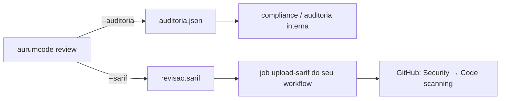
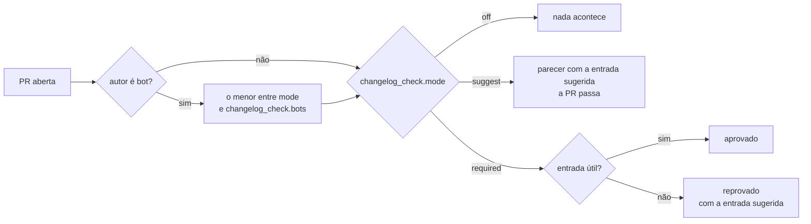

# Configuração

Sem arquivo: inglês, um parecer na conversa do PR (editado a cada rodada) e
sem comentários nas linhas. Para mudar, crie `.aurumcode/config.yml`:

```yaml
review:
  language: pt-BR
  publication: review
  inline_comments: true
```

`publication: review` usa a revisão formal do GitHub. `comments` publica o
parecer na conversa. `inline_comments` habilita comentários nas linhas, só para
os achados que bloqueiam o merge (os demais ficam no parecer), e, nos dois
modos, publica cada sugestão com código pronto como substituição aplicável
pelo GitHub (um clique) na linha alterada. Um achado da passagem de segurança
traz a correção sugerida da regra. As regras dessa passagem com forma de
código (SQL, XSS, injeção de comando) só olham arquivos de código: `.txt`,
`.log`, `.md` e afins não casam, porque ali o padrão é menção, não defeito;
só segredo em texto claro é procurado em qualquer arquivo.
O formato do parecer está em [Qualidade e limitações](review-quality.md#o-parecer).
O autor decide se aplica. AurumCode não altera o código automaticamente.

O idioma é enviado ao modelo. Os títulos do parecer têm tradução específica
para português e inglês; os demais idiomas aceitos usam títulos em inglês.
Tags aceitas: `pt-BR`, `pt`, `en-US`, `en`, `es-ES`, `fr-FR`,
`de-DE`, `it-IT`, `ja-JP`.

## Prompts, skills e docs

Escreva orientações em `.aurumcode/prompt.md`; o arquivo é encontrado
automaticamente. Para expandir:

```yaml
review:
  language: pt-BR
  context:
    skills:
      - .aurumcode/skills/backend.md
    docs:
      - docs/architecture.md
```

Uma skill é um Markdown com orientações de revisão, sem execução de scripts.
Liste apenas arquivos existentes. `context.prompt` permite substituir o
caminho do prompt adicional, mantendo a política embutida do produto.

### Fontes MCP de contexto (`review.context.mcp`)

```yaml
review:
  context:
    mcp:
      - name: adr                  # origem no prompt: mcp:adr/lookup
        command: ["adr-mcp-server", "--stdio"]
        tool: lookup               # a única ferramenta chamada
        arguments:                 # argumentos fixos (texto), redigidos
          scope: pagamentos
        send: [changed_paths]      # único payload dinâmico possível
        env: [ADR_TOKEN]           # além de PATH e HOME, nada mais do ambiente
        timeout_seconds: 5         # 0 = 10 s; nunca acima de 10 s
```

O Aurum inicia o servidor (MCP por stdio), chama só a ferramenta `tool` com
só `arguments` e, quando declarado, os caminhos alterados, tudo pela redação
AUR-009; nada do repositório é enviado. O texto devolvido entra no contexto
do repositório do prompt com a origem `mcp:<name>/<tool>`, como dado não
confiável: não aprova o PR, não liga nem desliga regra e não muda gate nem
permissão. Servidor ausente, lento, com resposta malformada ou acima de
64 KiB vira aviso de omissão no stderr e a revisão segue sem ele.

A fonte só existe em configuração confiável: a política central sempre; o
`.aurumcode/config.yml` local no `--base` fora de CI; no `--pr`, o config
lido na base da PR, nunca o da head (uma PR não adiciona a própria fonte).
Um item sem `name`, `command` ou `tool`, com nome repetido, `send` diferente
de `changed_paths` ou `timeout_seconds` fora de 0..10 é erro de
configuração.

**Risco: o servidor é um processo que o Aurum executa.** Por isso:

- `command[0]` precisa ser caminho absoluto ou nome simples resolvido pelo
  `PATH` (`adr-mcp-server`); caminho relativo (`./tools/mcp`) é recusado,
  porque executaria um arquivo do checkout revisado, que no `--pr` é a head
  da PR. Um caminho absoluto dentro do workspace tem o mesmo risco: aponte
  para um binário instalado fora do checkout.
- O servidor roda num diretório temporário vazio (nunca no checkout),
  apagado ao fim, e recebe só `PATH`, `HOME` e as variáveis de `env`; não
  declare em `env` um token que a fonte não precise.
- No `--base` sob CI (`CI` ou `GITHUB_ACTIONS` definidos), o checkout pode
  ser o de uma PR: as fontes do config local são ignoradas com aviso, a
  menos que o workflow defina `AURUMCODE_TRUST_LOCAL_MCP=true`. Fontes da
  política central valem sempre.

### Skills em diretório, por linguagem

Além da lista `context.skills`, o review lê `.aurumcode/skills/<nome>/SKILL.md`
sem precisar listar nada. O arquivo abre com um bloco de metadados:

```markdown
---
name: estilo-ts
version: 1
languages: [ts]
paths: ["src/**"]
---
Em TypeScript, prefira unknown a any.
```

A skill vale para o review quando **todos** os critérios declarados casam com
algum arquivo alterado: `languages` (nome da gramática do produto ou apelido do
catálogo, como `ts` ou `golang`; a linguagem do arquivo vem da gramática) e
`paths` (globs). Sem nenhum dos dois a skill fica desligada. Um apelido que o
catálogo não conhece é declarado no contexto enviado ao modelo
(`### Skill selection warnings`) e na seção de limitações do parecer; a
política pode acrescentar apelidos em `.aurumcode/grammar/aliases.yml`.

Cada seção `## ` de uma skill em diretório é uma regra citável pelo gate, com
id estável `<nome-do-diretório>#<slug-da-seção>` (ex.:
`.aurumcode/skills/tamanho/SKILL.md` com `## TAM-001 Função com no máximo 150
linhas` vira `tamanho#tam-001-funcao-com-no-maximo-150-linhas`), sem listar
nada em `context.skills`. Se o mesmo `SKILL.md` também estiver listado em
`context.skills`, o texto chega ao modelo uma única vez (pela lista) e o id é
o mesmo. A regra de uma skill do repositório tem sempre a origem do
repositório; a de uma skill da política, a da política.

A política central pode ter as suas skills em `<política>/.aurumcode/skills/`.
Se uma skill da política e uma do repositório declaram o mesmo seletor, a da
política vence e o repositório recebe um aviso. Um `SKILL.md` ilegível na
política é erro de carga; no repositório é declarado e o review continua sem
essas skills. Os arquivos `.aurumcode/instructions/*.md` com `applyTo`
continuam valendo.

O PR usa configuração e contexto da branch base; o idioma pode vir da versão
do PR. Isso significa que um novo prompt só passa a orientar reviews depois
de integrado à base. O uso local lê os arquivos do checkout.

Exemplo de prompt:

```text
Revise correção e compatibilidade dos contratos públicos.
Valores monetários são armazenados em centavos inteiros.
Use os testes e contratos disponíveis para sustentar cada achado.
Sugira código apenas quando a substituição for local e segura.
Indique contexto ausente sem presumir um defeito.
```

As contribuições são contexto para o modelo. Não alteram permissões,
redação de segredos nem opções do programa. A implementação atual aceita até
64 KiB por contribuição e informa erro se esse tamanho for excedido.

## Modelo e credenciais

Credenciais ficam nos secrets `LLM_API_KEY` e `LLM_BASE_URL` do repositório
hospedeiro. O exemplo passa a variável `LLM_MODEL` para o workflow reutilizável.
Nenhuma credencial deve estar em Markdown, YAML versionado ou na página.

Para usar um provedor conhecido (OpenAI, Azure OpenAI, Anthropic, Google
Gemini, Amazon Bedrock, LiteLLM, OpenRouter, OpenCode Zen, Ollama) sem montar
a URL à mão, defina `LLM_PROVIDER` com o nome do perfil; sem ela, nada muda.
O catálogo de perfis, as variáveis de cada provedor e as limitações estão em
[Provedores de LLM](provedores.md). O provedor e a chave vêm só do ambiente do
operador, nunca da configuração do repositório revisado.

O modelo é escolhido pelo serviço quando não há identificador explícito.
Não há limite de saída imposto por padrão pelo AurumCode; o serviço continua
sujeito à janela de contexto, ao timeout e às restrições do modelo.

## Opções avançadas

- `ignore`: lista de globs de caminhos a excluir antes da análise. Um caminho
  ignorado, e um arquivo de formato binário conhecido (catálogo
  `internal/grammar/catalog/binary_formats.yml`: imagens, PDF, fontes, mídia,
  `zip`), com a extensão do formato (qualquer caixa), a assinatura do formato
  no início do conteúdo (ex. PNG `89504E47…`) **e** conteúdo binário, fica
  fora da conta de cobertura: o parecer o lista como **ignorado**, pelo nome, e a
  revisão não fica parcial por causa dele (`partial_coverage` não dispara, nem
  com `gate.inconclusive: block`). Continua parcial o que a revisão quis ler e
  não conseguiu: arquivo gerado, grande demais, sem patch, cortado pelo
  limite de tokens, e todo conteúdo binário fora do catálogo — um script,
  código ou config com um byte NUL (`deploy.sh`, `app.js`, `ci.yml`), um
  arquivo sem extensão, um executável, uma extensão desconhecida ou um
  script renomeado para `.png` sem a assinatura PNG. Um byte
  forjado nunca esconde código da revisão.

  Recomendação para artefatos gerados: saída gravada (logs de tutorial,
  capturas, golden files, relatórios regravados por script) repete de
  propósito o que a fonte produz, inclusive exemplos de injeção e canários
  de segredo, e o passe de segurança acusaria cada um. Ponha esses caminhos
  em `ignore` e revise a fonte que os gera; o próprio AurumCode ignora
  `demo/tutoriais/*/out/**` e `demo/tutoriais/*/expected/**`. Ignorar não
  desliga regra: o código que gera a saída continua revisado.
- `rules`: overrides explícitos de regras reconhecidas, por identificador.
- `review.memory`: `off` (padrão, sem estado), `ephemeral` (em processo) ou
  `local` (persistido por repositório no diretório de cache). No review de PR,
  o arquivo fica em `$XDG_CACHE_HOME/aurumcode/memory/repo/OWNER/REPO/notes.json`
  (ou no cache padrão do sistema quando `XDG_CACHE_HOME` está ausente).
  Sem coordenadas do GitHub, a identidade usa um hash do remote origin ou do
  caminho absoluto do checkout. O antigo cache global não é importado nem apagado.
  Memória guarda observações de
  revisões anteriores para reduzir repetição; nunca altera regras, severidade
  ou veredito.
- Workflow reutilizável: `model`, `publication`, `inline_comments`, `security`.
  Ele publica um status de commit; só bloqueia merge se exigido pela branch.
- Action Docker direta: usa `Mpaape/AurumCode@v2.0.0` (a tag da release;
  `@main` recebe toda mudança sem aviso), exige
  `GITHUB_TOKEN`, `LLM_API_KEY`, `LLM_BASE_URL` no ambiente e evento de PR.
  Acrescenta inputs `check` e `fail-on`; não coleta CI automaticamente.
  Quem monta o próprio job (em vez do workflow reutilizável, que já faz isso)
  precisa chamar `actions/checkout` com
  `ref: ${{ github.event.pull_request.head.sha }}` antes da Action: o padrão
  do `actions/checkout` num evento `pull_request` é o merge ref sintético
  (`refs/pull/<n>/merge`), cujo commit não é o head revisado. Nesse caso o
  checkout local diverge do HEAD que a API reporta para o PR, e o contexto
  de codebase (AUR-515/AUR-536) é omitido por esse descompasso de HEAD; a
  revisão continua apenas com o diff remoto:

  ```yaml
  - uses: actions/checkout@v4
    with:
      ref: ${{ github.event.pull_request.head.sha }}
  - uses: Mpaape/AurumCode@v2.0.0
    env:
      GITHUB_TOKEN: ${{ github.token }}
      LLM_API_KEY: ${{ secrets.LLM_API_KEY }}
      LLM_BASE_URL: ${{ secrets.LLM_BASE_URL }}
  ```
- Localmente, `.aurumcode/instructions/*.md` pode usar front matter
  `applyTo` para escopo por caminho. O fluxo remoto usa os arquivos
  explicitamente listados em `review.context`.

Sem configuração, o review já inclui análise estática determinística, contexto
de codebase limitado e resumo; essas capacidades funcionam
com os padrões, sem nenhum arquivo. `aurumcode fix` converte as sugestões de
uma revisão em um diff unificado aplicável.

`inline_comments: true` na configuração é cumulativo com o input do workflow;
para desligá-lo, remova-o do arquivo ou defina false e não habilite o input.

## Política central

Um workflow obrigatório pode carregar uma política central: outro diretório
(checkout próprio) que CONTÉM `.aurumcode/config.yml` e os mesmos arquivos
Markdown (`prompt.md`, `skills/*.md`, docs) que o repositório do dev já usa —
não é o diretório `.aurumcode/` em si, é o diretório pai dele. Nenhum formato
novo.

```yaml
# <diretório da política>/.aurumcode/config.yml (outro repositório/checkout)
rules:
  security/hardcoded-secret:
    enabled: true
ignore:
  - "vendor/**"
review:
  context:
    skills:
      - skills/security.md
```

O workflow passa esse diretório ao AurumCode com `--politica <dir>` (alias
`--policy`); sem a flag, a variável de ambiente `AURUMCODE_POLICY` é usada;
sem nenhum dos dois, o comportamento é o de hoje, sem política. O CLI
recusa, fechado, um `<dir>` que resolva (depois de symlinks) para dentro da
árvore sob revisão (o diretório de trabalho do processo) ou para ela mesma:
a política tem que vir de fora do que está sendo revisado, nunca o repositório
revisado pode fornecer a própria política.

No workflow reutilizável (`.github/workflows/review.yml`), `policy_repository`
(`owner/repo`) é a única forma de declarar uma política: o próprio workflow
dá checkout read-only (sem persistir credenciais) em `.aurumcode-policy` e
usa esse diretório como `--politica`. Não existe um input `policy_path` nesse
workflow — num job `workflow_call`, os únicos diretórios alcançáveis são o
checkout da ferramenta e o checkout do PR sob revisão, então aceitar "um
caminho já presente" deixaria o próprio PR apontar para a própria política.
`policy_ref` escolhe o que o checkout busca; vazio usa o branch padrão do
repositório da política.

Política num repositório **privado ou interno**: o `github.token` de cada
repositório só lê o próprio repositório, então o checkout da política precisa
de um token. Crie um token fine-grained (ou de uma GitHub App) com
**Contents: read** apenas no repositório da política, guarde-o como secret da
organização `AURUMCODE_POLICY_TOKEN` e repasse-o ao workflow reutilizável
(`secrets: AURUMCODE_POLICY_TOKEN: ${{ secrets.AURUMCODE_POLICY_TOKEN }}` ou
`secrets: inherit`). Sem o secret, o checkout usa o `github.token`, que lê uma
política pública. O token só é usado no checkout da política, não é persistido
no git e nunca chega ao código revisado.

Exemplo de workflow obrigatório da organização, chamando o reutilizável com a
política embutida:

```yaml
jobs:
  review:
    uses: SuaOrg/AurumCode/.github/workflows/review.yml@<sha-fixa-do-aurumcode>
    with:
      policy_repository: SuaOrg/aurumcode-policy
      policy_ref: a1b2c3d4e5f6...  # SHA fixa, não um branch
    secrets:
      LLM_API_KEY: ${{ secrets.LLM_API_KEY }}
      LLM_BASE_URL: ${{ secrets.LLM_BASE_URL }}
```

`policy_ref` deve ser uma SHA fixa, pela mesma razão que o workflow já exige
uma SHA fixa do próprio AurumCode (o step "Verify tool version"): um branch
ou tag é mutável, então fixá-la é o que garante que toda PR da organização é
julgada pela MESMA política até alguém, deliberadamente, apontar para outra
SHA — sem isso, uma mudança na branch da política (um push aceitável ou não)
muda o gate de todo repositório que a usa, sem revisão própria desse PR.

Na Action Docker direta (`action.yml`), quem escreve os steps do job é quem
controla o que foi checado antes do container rodar, então `policy_path`
continua existindo lá como o único mecanismo. O container da Action só
enxerga dois diretórios que o job preenche: `/github/workspace`, que é a
própria árvore revisada (o entrypoint roda o CLI dali), e `/github/home`,
montado a partir de `$RUNNER_TEMP/_github_home`. Toda política em
`/github/workspace` — inclusive um `policy_path` relativo, que se resolve
dentro dele — é recusada pela contenção acima, fechado, antes de qualquer
chamada ao modelo. A política, portanto, vai para `$RUNNER_TEMP/_github_home`
num step anterior e `policy_path` recebe o caminho absoluto em `/github/home`:

```yaml
steps:
  - uses: actions/checkout@<sha-fixa>
    with:
      repository: SuaOrg/aurumcode-policy
      ref: a1b2c3d4e5f6...  # SHA fixa, não um branch
      path: aurumcode-policy-src
      persist-credentials: false
  - run: |
      mkdir -p "$RUNNER_TEMP/_github_home"
      mv aurumcode-policy-src "$RUNNER_TEMP/_github_home/aurumcode-policy"
  - uses: actions/checkout@<sha-fixa>
    with:
      ref: ${{ github.event.pull_request.head.sha }}
  - uses: SuaOrg/AurumCode@<sha-fixa-do-aurumcode>
    with:
      policy_path: /github/home/aurumcode-policy
    env:
      GITHUB_TOKEN: ${{ github.token }}
      LLM_API_KEY: ${{ secrets.LLM_API_KEY }}
      LLM_BASE_URL: ${{ secrets.LLM_BASE_URL }}
```

O `actions/checkout` só grava dentro do workspace, por isso a política é
checada lá e movida para fora antes do checkout do PR; o `mv` também evita
que o checkout do PR limpe o diretório. Um symlink fora da árvore que aponte
para dentro dela é recusado do mesmo jeito, porque a contenção compara os
caminhos já resolvidos.

Precedência: com política ativa, `rules` e `ignore` do repositório do dev são
ignorados por completo — vale só o que a política declara — e cada override
ignorado gera um aviso no terminal e no PR publicado, nomeando a regra ou o
padrão. `review.language` e `review.publication` vêm da política quando ela os
declara; o resto de `review` (contexto, memória, changelog, versão, perfis)
continua do repositório do dev. As skills e docs da política chegam ao
modelo primeiro; as do repositório do dev somam-se depois, sem substituir
nada. Uma política ausente ou inválida (config.yml faltando, YAML inválido,
skill/doc listada que não existe, ou um diretório dentro da própria árvore
revisada) falha o comando antes de qualquer chamada ao modelo.

## Gate: skills viram regra citável, e a política decide o que reprova (AUR-519)

Cada seção `## ` de cada skill Markdown — as da política e as do próprio
repositório — é lida a cada execução e vira uma regra citável, com id
`<nome-do-arquivo-da-skill>#<slug-da-seção>` (para um `SKILL.md` de
diretório, o nome do diretório no lugar do nome do arquivo; minúsculas, qualquer sequência
de caracteres não alfanuméricos some num único `-`, sem `-` nas pontas; ex.:
`security.md` com `## No Hardcoded Secrets` vira
`security#no-hardcoded-secrets`). Título = o texto do cabeçalho. Descrição =
o corpo da seção (limitado a 400 caracteres). Severidade do próprio achado é
`warning` por padrão; uma seção pode declarar a sua própria na primeira
linha do corpo, exatamente `severity: error` (ou `warning`/`info`) — qualquer
outra grafia é ignorada e o padrão vale. Acrescentar uma seção nova a uma
skill já configurada passa a ser citável na execução seguinte, sem mudança
de código (AC-007). Um achado que cita uma skill ou seção que não existe é
descartado e contado como não vinculado, exatamente como hoje um `rule_id`
desconhecido já é (o aviso de descarte do terminal/PR cobre os dois casos).

A política (nunca o repositório sozinho, a menos que ele opte) declara o que
reprova o check:

```yaml
# <diretório da política>/.aurumcode/config.yml
gate:
  fail_on: [critical, high]   # ou qualquer combinação de: critical, high,
                               # error, medium, warning, low, info
  inconclusive: block         # ou: warn (aceita também bloquear/alertar)
```

`gate.fail_on` aceita a mesma lista de severidades que `--fail-on` já aceita
(`high`/`error`, `medium`/`warning`, `low`/`info`), mais o alias `critical`
(mapeado no mesmo nível de `high`/`error` — este projeto não tem uma quarta
severidade). O limiar efetivo é o mais baixo entre as severidades listadas:
um achado do check na severidade do limiar ou acima dele reprova o check,
nomeando a skill e a seção que o sustentam (AC-001). Só contam achados cuja
regra é dinâmica E de origem aceita: sob política central, só as seções da
própria política (AC-005); sem política, só as do repositório, e somente
quando o repositório declarou seu próprio `gate` — sem isso, nada muda. O
limiar compara o MAIOR entre a severidade que o modelo deu ao achado e a
severidade que a própria seção da skill declarou (`severity:` no corpo):
a declaração do autor da skill é um piso que o texto do diff revisado não
pode rebaixar.

`gate.inconclusive` decide o que uma revisão inconclusiva faz ao check:
falha do provedor, cobertura parcial (AUR-476, com os arquivos nomeados) ou
resposta do modelo que não pôde ser interpretada como JSON (parse
degradado — hoje publicado como se a revisão tivesse funcionado), ou um
scanner habilitado (SAST, Dependency-Track, `analysis_data`) que não pôde
concluir. Com `block`, a revisão reprova o check sem nunca checar achados.
**Sem a chave, o padrão é `block` sempre que a configuração efetiva declara
`gate` ou habilita um scanner (AUR-575):** uma ferramenta que devia verificar
e não conseguiu nunca aprova por omissão. Só `warn` escrito faz a revisão
continuar visível como inconclusiva sem bloquear por si só — **e, mesmo
assim, um achado real que cruze `fail_on` ainda reprova o check**
(`exitFindings`): ser inconclusiva nunca é uma forma de escapar de um
achado que já cruzou o limiar. Em nenhum caso o parecer aparece como
aprovado. A conversão "inconclusivo vira falha pelo modo" mora num único
lugar do pipeline do gate e vale para toda fonte: um contribuidor que falha
e um SAST ausente terminam do mesmo jeito. Uma severidade que o normalizador
não reconhece num achado determinístico conta como `error`, nunca é
descartada.

**Chave desconhecida é erro de carga (AUR-575).** O `.aurumcode/config.yml` do
repositório é lido de forma estrita, como a política central: qualquer chave
que o esquema não conhece, em qualquer seção (por exemplo `gate.fial_on`),
falha a carga antes de qualquer chamada ao modelo, com a chave e a linha
nomeadas (`parsing .aurumcode/config.yml: yaml: unmarshal errors: line 2:
field fial_on not found in type config.GateConfig`). Sem isso, um erro de
digitação deixava o gate sem declaração e a revisão aprovava. As seções
`quality_gates.sast` e `quality_gates.scanners` também são validadas na carga:
`engine` que não é uma engine registrada no binário, a mesma engine declarada
duas vezes ou um `rule_packs` que parece flag (`--...`) são recusados citando a
chave.

**Achado determinístico conta em qualquer modo (AUR-569).** O modo de
`gate.inconclusive` governa a ausência do parecer do modelo, nunca a presença
de um achado determinístico (catálogo embutido, passe de segurança `--seguranca`,
SAST): com severidade em `fail_on` ou acima, ele reprova o check (exit 3) sob
`warn` e sob `block`, com ou sem provedor, e a linha do gate nomeia a regra e a
origem. Os achados do passe de segurança contam sob a fonte `analysis` de
`gate.sources`, mas levam a origem tipada `security`. Sem achado determinístico,
`warn` continua só avisando.

**Origem em toda linha de gate (AUR-567).** Cada linha que nomeia um achado
termina em `(severidade <s>, limiar <l>, origem <fonte>)`, onde `<fonte>` é o
mesmo valor que a auditoria (`origin`) e o SARIF (`properties.origin`) gravam:
`skills`, `analysis`, `sast`, `security` ou `dtrack`. No SAST a linha acrescenta
`secao policy|repo` (de onde veio a configuração), nunca no lugar da origem. A
linha usa a mesma mensagem do relatório: id e mensagem se juntam por ` - `, para
que o filtro de redação não leia `...secret: <palavra>` como um par chave/valor e
troque a primeira palavra da mensagem por `[REDACTED]`. Pelo mesmo motivo a linha escreve a citação
`(rule <id>: <título>)` do relatório como `(rule <id> - <título>)`: a linha do gate e o
relatório diferem só nesse separador, e a linha mostra o título inteiro (`Hardcoded Secrets`).

**Achado sobre o marcador de redação é descartado (AUR-598).** Antes de chegar
ao modelo, todo valor com forma de segredo vira `[REDACTED]`, inclusive quando
era só um identificador (`APIKey: key`). O modelo nunca vê o valor mascarado,
então um achado dele que cita o marcador na mensagem, evidência, impacto ou
correção é descartado, contado em `issues_rejected_by_redaction_marker` (e no
total de `issues_rejected_by_scope`) e nomeado no aviso de descarte. Achados de
scanners determinísticos (segredos, SAST, vet, passe de segurança) nunca passam
por esse filtro: eles leem o conteúdo bruto, e a detecção de segredo é do
scanner de segredos, obrigatório e com falha fechada.

**Review formal e gate (AUR-567).** Em `--pr`, quando `gate` está declarado, a
review formal segue o gate: `REQUEST_CHANGES` só se o gate reprova; achados
abaixo do limiar ou aprovação retida dão `COMMENT`; uma execução limpa dá
`APPROVE`. Assim a review e o status `aurumcode/policy-gate` não discordam (um
aviso abaixo do limiar não pede mudanças com os checks verdes). Sem `gate`
declarado vale a regra histórica (erro ou aviso pede mudanças). Com ou sem gate,
uma falha ao gravar `--auditoria`/`--sarif` retém a aprovação: a review formal
nunca é `APPROVE` antes de o processo sair com 1.

**Texto do parecer e gate (AUR-600).** Com `gate` declarado, o texto do
parecer segue a mesma regra: "bloqueante" significa exatamente o que o gate
reprova. O veredito do parecer (e o do relatório local `--base`) é "Alterações
solicitadas" só quando o gate reprova; com o gate passando e achados abaixo do
limiar ele é "Comentário", a frase de conclusão diz que o gate passou e que os
achados são observações não bloqueantes, e cada achado fora do que o gate
reprovou leva o rótulo "(não bloqueante)". A contagem de bloqueantes é a dos
achados distintos que o gate reprovou. Uma revisão inconclusiva continua
"Inconclusivo". Sem `gate` declarado, o texto histórico é mantido (erro ou
aviso é bloqueante).

Sob política central, `gate` do repositório é ignorado por completo — um
aviso nomeado explica o descarte, no mesmo lugar e do mesmo jeito que os
avisos de `rules`/`ignore` já existentes.

**Falha do provedor em `--pr` (AUR-537).** Até este card, uma falha de
transporte durante a chamada ao modelo em `--pr` — todos os provedores
configurados falharam, ou `--limite` recusou a chamada antes de qualquer
provedor ser alcançado — encerrava com código 1 antes mesmo de o gate ser
avaliado: nenhum status `aurumcode/policy-gate` era publicado e
`inconclusive: warn` não era honrado, mesmo com um gate declarado. Essa
falha específica agora é roteada pelo gate como o mesmo motivo inconclusivo
que `--base` já publica (`provider_failure`): com `block`, o status falha
nomeando o motivo e a saída usa o código de "revisão não concluída" (desde o
AUR-575 também o padrão quando `inconclusive` não está declarado); com
`warn` escrito, o status publica sucesso com o
alerta inconclusivo visível — nunca a palavra "aprovado" — e a saída é 0; em
ambos os casos a auditoria e o SARIF (quando pedidos) são escritos como
inconclusivos, e o corpo publicado da revisão diz que ela não foi executada.
**Sem nenhum `gate:` declarado, o comportamento é idêntico ao de antes deste
card, byte a byte: código 1, nenhum status, nenhuma auditoria/SARIF.** Uma
recusa de `--limite` antes da chamada (pré-chamada) segue a mesma regra: só
entra pelo gate como esse motivo inconclusivo quando um gate está declarado.

**Histórico (antes do AUR-575, quando a chave ausente valia `warn`): quem
tinha `gate:` declarado sem a chave `inconclusive`.** Hoje essas
configurações bloqueiam (`block` é o padrão); o texto abaixo descreve o
comportamento anterior. Esse comportamento de hoje muda para
essas configurações existentes assim que `--pr` passa a sofrer uma falha
do provedor: antes, a falha encerrava com código 1 e nenhum status era
publicado; agora, `aurumcode/policy-gate` publica sucesso com o alerta
inconclusivo visível (o mesmo que `warn` explícito produz), a saída é 0 e a
auditoria/SARIF (quando pedidos) registram a inconclusividade — ou seja,
uma política antiga que nunca declarou `inconclusive` e nunca viu esse
status passa a vê-lo, publicado como sucesso alertado. **O status legado
`aurumcode/review` (de `--check`, independente do gate) NÃO segue esse
abrandamento: ele publica falha nomeando `provider_failure` nos dois modos,
`block` e `warn`, e independente de `--exigir-qualidade`** — uma regra de
proteção de branch que já exige `aurumcode/review` continua bloqueando o
merge numa falha do provedor, exatamente como bloqueava (por ausência do
status) antes deste card; só `aurumcode/policy-gate` conhece `warn`.

O gate está ligado em `aurumcode review --base` e `--pr`: achados de
severidade no limiar ou acima (de origem aceita) reprovam o código de
saída (reaproveitando os mesmos códigos de `--fail-on`/`--check`), o
motivo de inconclusivo (falha do provedor, cobertura parcial, parse
degradado) entra no resumo/limitações publicados, e o veredito nunca
aparece como aprovado nesses casos. Em `--base`, um parecer sem achados mas com
qualquer fonte inconclusiva (SAST, Dependency-Track, `analysis_data`, cobertura
parcial, provedor) não termina em `No issues found.`: termina em `Sem achados
nas fontes concluídas; inconclusivo: <motivos>`, com os mesmos motivos do gate
(AUR-572). No `--pr`, o status `aurumcode/policy-gate`
é publicado junto do `aurumcode/review` que `--check` já publica, só
quando um gate foi declarado. O gate é idêntico com ou sem `--perfis`: cada
perfil selecionado aprende o mesmo catálogo dinâmico. A fusão dos perfis
preserva lado (`LEFT`/`RIGHT`), impacto, evidência, correção sugerida e
verificação de cada achado; um achado que dois perfis repetem sai uma vez,
atribuído como `[perfil a; também: b]`, e a evidência de cada perfil é mantida.
O terminal (`--base`) mostra os mesmos campos que o parecer do PR.

## SAST multilinguagem com Semgrep (AUR-548)

`quality_gates.sast` liga uma varredura SAST com [Semgrep](https://semgrep.dev/)
sobre a árvore inteira do repositório revisado, independente de `gate:` estar
declarado ou não. A varredura é da árvore inteira (uma regra pode precisar dos
arquivos vizinhos), mas só conta o que o intervalo revisado mudou: um achado
fica apenas se cai numa linha que o intervalo adicionou, pelo mesmo diff do
git que o `govet` usa:

```sh
git diff --relative --unified=0 <base>...<head>
```

Um achado
antigo, num arquivo que o PR não tocou, não reprova o PR. Sem intervalo
revisado (`--base` que não resolve), a varredura é inconclusiva, nunca a
árvore inteira:

```yaml
# .aurumcode/config.yml (ou o config.yml da política central)
quality_gates:
  sast:
    engine: semgrep             # engine registrada da categoria sast
    enabled: true
    fail_on_severity: ERROR     # critical|high/error, medium/warning, low/info; padrão ERROR
    rule_packs: [p/security-audit, p/owasp-top-ten]   # padrão do RFC quando ausente
```

Sem `enabled: true` (ou sem a seção inteira), nada muda: Semgrep nunca é
executado (AC-004). Cada resultado do relatório `semgrep scan --json` vira um
achado com `rule_id` igual a `semgrep:<check_id>`, severidade mapeada
(`ERROR`→`error`, `WARNING`→`warning`, `INFO`/outros→`info`), arquivo e linha
— produzido inteiramente por código, depois da chamada ao modelo: a resposta
do modelo nunca é consultada para decidir se um achado do Semgrep existe ou
qual severidade ele tem, então uma resposta que alega ter removido ou
rebaixado o achado não tem efeito nenhum sobre o gate (AC-005).

Um achado na severidade de `fail_on_severity` ou acima reprova o gate
(nomeando o `check_id` e a linha no parecer, na auditoria e no SARIF, AC-001);
abaixo do limiar, o achado é publicado mas não reprova (AC-002). Semgrep
ausente do `PATH`, com erro de execução, ou com saída que não é um relatório
Semgrep confiável (JSON inválido, sem a chave `results`, ou um erro do próprio
Semgrep que alcança a mudança) nunca é lido como
"zero achados, varredura limpa": é um achado inconclusivo próprio, que segue
`gate.inconclusive` (`block`, ou a chave ausente, reprova a revisão; só `warn`
escrito publica o alerta inconclusivo sem bloquear) — exatamente o mesmo
vocabulário de inconclusivo que o gate do AUR-519 já usa (AC-003).

Os erros do relatório do Semgrep seguem a mesma régua de escopo. Um erro
fatal (nível diferente de `warn`) ou sem arquivo sempre torna a varredura
inválida (`sast_invalid_output`). Um erro de parse recuperado (`warn`, ex.:
um script bash que o Semgrep não entende por inteiro) só torna a varredura
inválida quando alcança a mudança: arquivo tocado sem linhas indicadas, ou
trecho sobre uma linha adicionada. Num arquivo que o PR não tocou, ele não
esconde nada do que a revisão julga e é ignorado.

Sob política central, `quality_gates.sast` do repositório é sempre ignorado
por completo (com o mesmo aviso nomeado que `gate`/`rules`/`ignore` já usam):
um repositório não consegue desligar ou afrouxar um SAST que a política
ligou, mesmo declarando sua própria `enabled: false`.

### Scanners são engines registradas (AUR-577)

`quality_gates.sast` é o alias da entrada `semgrep` da lista genérica
`quality_gates.scanners`. As duas formas abaixo são equivalentes (declarar as
duas para a mesma engine é erro de carga):

```yaml
quality_gates:
  scanners:
    - engine: semgrep           # nome de uma engine registrada no binário
      enabled: true             # opcional; uma entrada listada roda, salvo enabled: false
      required: true            # sob política central: o repositório não remove nem afrouxa
      fail_on: ERROR            # critical|high/error, medium/warning, low/info; padrão ERROR
      options:
        rule_packs: [p/security-audit, p/owasp-top-ten]
```

- As engines são compiladas no binário (lista fechada em
  `internal/scanner/engines`); `engine` desconhecido é erro de carga, citando a
  chave e as engines registradas. Hoje são `semgrep` (categoria `sast`),
  `gitleaks` (categoria `secrets`) e `govet` (categoria `lint`).
- `options` é validado pela própria engine (para o `semgrep`, só
  `rule_packs`; o `gitleaks` e o `govet` não aceitam opção).
- **Política vence engine por engine.** Uma entrada da política com
  `required: true` (e toda `quality_gates.sast` da política, que é sempre
  obrigatória) faz a entrada do repositório para a mesma engine ser ignorada,
  inclusive `enabled: false`, com o aviso `quality_gates.scanners[<engine>] do
  config do repositório foi ignorado: a política central decide sozinha` (ou
  `quality_gates.sast ...`). Uma entrada da política sem `required` cede à do
  repositório, e isso também é um aviso nomeado (`quality_gates.scanners[<engine>]
  da política central não é obrigatória (required: false): vale a entrada do
  repositório`). Uma engine que só um lado declara vale como declarada.
- Origem: a linha do gate, a auditoria e o SARIF levam a origem tipada da
  engine, que é o nome dela; o `semgrep` mantém a origem `sast` (rótulo de
  antes), de modo que nenhuma saída existente mudou.
- Erro, binário ausente ou relatório incompleto de qualquer engine é
  inconclusivo (`<categoria ou engine>_unavailable`, `_execution_error`,
  `_invalid_output`, `_incomplete`), nunca "zero achados", e segue a regra
  única de `gate.inconclusive` (ausente = `block` com scanner habilitado).
- `gate.sources` e `gate.triage` aceitam `skills`, `analysis` e cada engine
  registrada pelo nome ou pela categoria: `sast` continua valendo e cobre toda
  engine da categoria `sast` (`semgrep` também é aceito).

Semgrep é um processo externo: a imagem do produto o traz pré-instalado, na
versão fixada em `.board/bootstrap/locks/scanners.yml`. Os pacotes de regras
do registro do Semgrep (`p/security-audit`, `p/owasp-top-ten` e qualquer
outro `p/...`) são baixados a cada execução e **exigem rede em CI** — um
runner totalmente isolado precisa apontar `rule_packs` para arquivos de regra
locais já presentes na imagem/checkout em vez de um nome `p/...` do registro.

### Segredos com gitleaks (engine `gitleaks`)

```yaml
quality_gates:
  scanners:
    - engine: gitleaks          # categoria secrets, origem gitleaks
      required: true            # na política: o repositório não desliga
      fail_on: ERROR            # gitleaks não tem severidade; todo vazamento é error
```

- **Varre o intervalo de commits revisado, não a árvore final.** Um segredo
  commitado num commit intermediário do PR e removido depois já vazou: está no
  histórico que o merge publica. A engine roda o gitleaks (flags do gitleaks,
  não do aurumcode), com o relatório num diretório temporário privado e a
  configuração base embutida do binário (`[extend] useDefault = true`), que
  passa à frente de `GITLEAKS_CONFIG`, `GITLEAKS_CONFIG_TOML` e de um
  `.gitleaks.toml` do repositório:

  ```sh
  gitleaks git --log-opts=<base>..<head> --report-format json \
    --report-path <dir-privado>/report.json --exit-code 0 \
    --no-banner --redact --config <base-embutida>
  # sob política central, acrescenta:
  gitleaks git ... --ignore-gitleaks-allow
  ```
- O intervalo precisa de dois ids de commit completos presentes num clone
  **não raso**; intervalo ausente, ponta que não é id de commit, commit
  ausente ou clone raso é `secrets_execution_error`, nunca uma varredura só da
  árvore. Medido na imagem fixada: o gitleaks, sozinho, responde a uma revisão
  desconhecida com relatório `[]` e exit 0 — por isso o intervalo é conferido
  antes, e qualquer linha de log `ERR`/`FTL` também torna a varredura
  inconclusiva.
- **O valor do segredo nunca sai do adaptador.** O relatório é decodificado
  numa lista fechada de campos (regra, descrição, arquivo, linha, commit);
  `Secret`, `Match`, `Line`, mensagem do commit, autor e e-mail não têm campo e
  são descartados na decodificação. O achado é `gitleaks:<regra>` em
  `arquivo:linha`, com a descrição da regra e o commit que o introduziu.
- **Sob política central** (`secao policy`): a flag do gitleaks que ignora
  `gitleaks:allow` (bloco acima), então um comentário `gitleaks:allow` não
  suprime o achado (sem política, suprime). O `.gitleaksignore` da raiz é lido
  pelo gitleaks qualquer que seja a flag (medido: a flag de caminho do ignore
  do gitleaks apontando para outro diretório não impede);
  por isso, sob política, a presença de `.gitleaksignore` na raiz é ela mesma
  um achado bloqueante `gitleaks:ignore-file-present`, que o dono da política
  precisa resolver.
- Versão: só `v8.30.1` (a de `.board/bootstrap/locks/scanners.yml`) é aceita;
  outra versão é `secrets_execution_error`, porque a base de regras embutida
  seria outra. Binário ausente é `secrets_unavailable`. A identidade da engine
  (versão + `secrets_rulebase_sha256`) vai no `Version` do resultado.
- O workflow reutilizável (`review.yml`) instala o binário a partir da imagem
  fixada por digest no lock (o pull por digest falha se os bytes divergirem),
  confere `gitleaks version` contra a versão do lock e faz checkout do PR com
  histórico completo (`fetch-depth: 0`).
- O review entrega à engine o intervalo revisado: no `--pr`, a base do pull
  request (`AURUMCODE_BASE_SHA`) e o `HEAD` do checkout já verificado como a
  cabeça que a API do pull request informa; no `--base`, a ref e o `HEAD`
  resolvidos para ids completos. No `--pr` o `GITHUB_SHA` nunca é a ponta do
  intervalo: num evento `pull_request` o GitHub o reserva ao merge commit
  sintético (`refs/pull/N/merge`), que o checkout da cabeça não contém
  (medido na PR #89: `cat-file` do merge commit falha num checkout
  `fetch-depth: 0` da cabeça, e o resultado era `secrets_execution_error`).
  Sem checkout verificado, a varredura fica bloqueada como antes.
- **Motivo diagnosticável.** Uma varredura inconclusiva mantém o token do
  motivo (`secrets_execution_error`, `sast_execution_error`, ...) e acrescenta
  o detalhe da engine, numa linha resumida (até 240 bytes) e redigida pelo
  mesmo filtro da revisão: a ponta do intervalo que falta (`base commit <id>
  not found in the checkout`), clone raso, ou a última linha de erro do
  comando. O detalhe vai na linha do gate (`inconclusivo
  (secrets_execution_error) [detalhe: ...]`), no `gate.reason` da auditoria e
  na limitação publicada no parecer; nunca muda a decisão. A identidade da engine entra no digest
  de evidência da chave do cache, então um parecer dado com outra versão ou
  outra base de regras nunca é reaproveitado.
- A imagem do produto (`Dockerfile`) copia o binário da imagem fixada por
  digest no lock e o build falha se `gitleaks version` não for a do lock.
  Tutorial: [Segredos com gitleaks](tutorials/segredos.md).

### Linter real com go vet (engine `govet`)

```yaml
quality_gates:
  scanners:
    - engine: govet             # categoria lint, origem govet
      fail_on: warning          # go vet reporta warning; com o padrão ERROR o achado só é publicado
```

- **Só roda quando declarada.** Sem a entrada, o review é o de sempre; nada é
  instalado. O `go` precisa já estar no `PATH` do processo do aurumcode: a
  imagem do produto traz o Go pinado (o mesmo do `go.mod` do projeto, copiado
  da imagem golang fixada por digest), e o workflow reutilizável baixa os
  módulos do repositório revisado antes da review (passo "Prefetch Go
  modules", `GOTOOLCHAIN=local`, sem segredos) para o cache que a review
  monta. `go` ausente é `lint_unavailable`; módulo fora do cache é
  `lint_execution_error`.
- Roda `go vet -json ./...` na raiz revisada, que precisa ter `go.mod` (sem
  ele é `lint_execution_error`: o go resolveria outro módulo, cujos caminhos o
  diff não mapeia; módulos aninhados ficam de fora) e lê o relatório JSON, nunca o texto como comando.
  Cada achado é `go-vet/<analisador>` (ex.: `go-vet/printf`) em
  `arquivo:linha`, severidade `warning`, origem `govet`.
- **Só linhas que o intervalo revisado adicionou.** A engine roda, a partir da
  raiz revisada, o diff do git (flags do git, não do aurumcode):

  ```sh
  git diff --relative --unified=0 <base>...<head>
  ```

  (caminhos relativos a ela, como os do go vet) e descarta todo achado fora das linhas
  adicionadas: um defeito antigo de um arquivo que o PR não tocou não reprova o
  PR. Intervalo ausente, ou caminho que o git cita entre aspas (tab, aspas,
  barra invertida), é `lint_execution_error`/`lint_invalid_output`, nunca uma
  varredura da árvore inteira nem um arquivo descartado em silêncio.
- **Falha nunca é verde nem parcial.** `go vet -json` sai 0 com diagnósticos e
  diferente de 0 quando algum pacote não carrega ou não compila (medido no
  go1.27.1); qualquer saída diferente de 0 é `lint_execution_error` sem nenhum
  achado, mesmo que outro pacote tenha diagnósticos. JSON inválido ou posição
  fora da raiz é `lint_invalid_output`.
- **Sem download nem compilador C:** `GOTOOLCHAIN=local`, `GOPROXY=off` e
  `CGO_ENABLED=0` são fixos (o PR controla as diretivas `#cgo`, então o vet
  nunca chama o compilador C); dependência fora do cache de módulos (ou de
  `vendor/`) é `lint_execution_error`.
- **Arquivo cgo não passa como limpo:** com `CGO_ENABLED=0` o go vet tira do
  pacote, sem aviso, todo arquivo com `import "C"`. Se um pacote que o
  intervalo tocou tem um arquivo assim, a varredura é `lint_execution_error`
  (inconclusiva, nunca limpa); arquivo cgo em pacote não tocado não muda
  nada.
- **Só o módulo da raiz:** `GOWORK=off` é fixo. Um `go.work` num diretório
  acima da raiz revisada não escolhe os módulos nem as substituições que o
  vet carrega.
  `GOFLAGS` do processo não é repassado (um `-toolexec` executaria outro
  programa).
- A identidade da engine (`go vet <GOVERSION>`) vai no `Version` do resultado.
- Tutorial: [SAST com Semgrep, Caso 5](tutorials/sast.md).

### Ambiente dos processos das engines

Toda engine (semgrep, gitleaks, govet) roda o binário externo com um ambiente
**explícito**, nunca o do processo do aurumcode: a chave do modelo
(`LLM_API_KEY`), o `GITHUB_TOKEN` e qualquer outro segredo do job não chegam
ao processo filho, que lê conteúdo controlado pelo autor do PR. O ambiente é:

- para todas: `PATH`, `HOME`, `TMPDIR`, `LANG`, `LC_ALL`, `SSL_CERT_FILE`,
  `SSL_CERT_DIR` (quando definidos);
- gitleaks e govet: das entradas `GIT_CONFIG_COUNT`/`GIT_CONFIG_KEY_n`/
  `GIT_CONFIG_VALUE_n`, só as de `safe.directory`, renumeradas (um
  `http.extraheader` com credencial é descartado);
- govet: `GOCACHE`, `GOPATH`, `GOMODCACHE`, `GOROOT`, e os fixos
  `GOTOOLCHAIN=local`, `GOPROXY=off`, `CGO_ENABLED=0`, `GOWORK=off`.

Variáveis de proxy (`HTTPS_PROXY` etc.) não são repassadas: um runner atrás de
proxy precisa de regras locais (veja os pacotes `p/...` acima). Limites de
cada execução: 120 s (`scanner.Timeout`), 5 s para fechar a saída depois do
cancelamento (`scanner.WaitDelay`) e 32 MiB por fluxo de saída
(`scanner.MaxOutputBytes`); passar de qualquer um deles é inconclusivo.

## Trilha de auditoria e SARIF (AUR-521)

Cada revisão pode deixar dois arquivos, além do parecer na PR:

- **Registro de auditoria** (`--auditoria`): um JSON por revisão que responde
  quem revisou, o quê, com qual política e qual foi a decisão. Serve para
  compliance: guarde-o junto das evidências da entrega.
- **SARIF** (`--sarif`): o formato padrão de resultados de análise. O GitHub
  mostra os achados dele na aba **Security → Code scanning**, como alertas
  ligados à linha do código.



### Quando usar

- Auditoria: quando alguém precisa provar depois por que uma PR passou ou
  reprovou (segurança, compliance, auditoria externa).
- SARIF: quando o time quer os achados na aba de segurança do GitHub, junto
  dos outros scanners.

### Como ligar

Na linha de comando, passe os caminhos:

```bash
aurumcode review --base main --auditoria auditoria.json --sarif revisao.sarif
```

No workflow reutilizável (`.github/workflows/review.yml`) os dois já são
escritos sempre e enviados como artefatos do job: `aurumcode-audit-<PR>` e
`aurumcode-sarif-<PR>`, mesmo quando o gate reprova.

### Exemplo de auditoria

```json
{
  "policy_digest": "9f2c…",
  "repo": "OWNER/REPO",
  "reviewed_sha": "3333333…",
  "model": "modelo-demo",
  "verdict": "changes_requested",
  "gate": {"decision": "fail"},
  "blocking_findings": [
    {"rule_id": "seguranca#sem-segredos-no-codigo", "path": "app.go", "line": 6, "severity": "error", "origin": "skills"}
  ],
  "exceptions_applied": [],
  "coverage": {"complete": true}
}
```

`gate.decision` é `pass`, `fail` ou `inconclusive`; `blocking_findings` lista
só o que reprovou; `exceptions_applied` lista as exceções aceitas; `coverage`
diz se algum arquivo ficou de fora.

### Exemplo de SARIF no Code scanning

O SARIF segue a versão 2.1.0: cada achado vira um `result` com regra, nível
(`error`, `warning`, `note`), arquivo e linha, e uma impressão digital estável
para o GitHub não duplicar o alerta a cada rodada. O workflow reutilizável não
envia o SARIF ao Code scanning sozinho (isso exige `security-events: write`,
que só o seu workflow pode conceder). Acrescente um segundo job:

```yaml
  upload-sarif:
    needs: review
    if: ${{ !cancelled() && github.event.pull_request.head.repo.full_name == github.repository }}
    runs-on: ubuntu-latest
    permissions:
      contents: read
      actions: read
      security-events: write
    steps:
      - uses: actions/download-artifact@3e5f45b2cfb9172054b4087a40e8e0b5a5461e7c # v8.0.1
        with:
          name: aurumcode-sarif-${{ github.event.pull_request.number }}
          path: .
      - uses: github/codeql-action/upload-sarif@2892aa5e19bbd11bc0cff5427e3b750a04d9e3c2 # v4.38.2
        with:
          sarif_file: aurumcode-review.sarif
          category: aurumcode-policy-gate
```

PR de fork não recebe essa permissão: a condição do `if` pula o upload e o
SARIF fica só como artefato. Este repositório usa esse job no próprio
`code-review.yml`: os achados do lote aparecem na aba Security dele.

### O que acontece se falhar

- Sem `--auditoria` e sem `--sarif`, nada é escrito e nada muda.
- Se um arquivo pedido não pode ser gravado (diretório inexistente, sem
  permissão), a revisão **nunca** termina como sucesso: a mensagem nomeia o
  caminho e o motivo (`audit_write_failed` ou `sarif_write_failed`) e o exit é
  1. Com `gate` declarado, a revisão fica inconclusiva e não aprova.
- Uma revisão inconclusiva ainda gera os dois: a auditoria com
  `gate.decision: fail` e o motivo; o SARIF com `executionSuccessful: false`.
- Segredos não vazam: os dois passam pelo mesmo filtro de redação do parecer.

Passo a passo executável: [tutorial de auditoria e SARIF](tutorials/auditoria-sarif.md).

## Exceções aprovadas: dono e validade (AUR-520)

`exceptions` é uma lista simples, no mesmo `config.yml` (do repositório ou da
política central), de exceções já aprovadas para um achado exato — falso
positivo ou risco aceito:

```yaml
exceptions:
  - repo: org/repo
    rule: seguranca.md#sql-injection   # secao da skill (dinamica) ou id de advisory
    path: legacy/report.py             # caminho exato, relativo ao repositório
    owner: time-seguranca
    reason: consulta fixa, sem entrada do usuario
    expires: 2026-12-31                # YYYY-MM-DD, sempre em UTC
```

Todos os seis campos são obrigatórios; falta de `owner`, `reason` ou
`expires`, ou uma `expires` que não seja exatamente `YYYY-MM-DD` (uma data
com fuso, hora, ou qualquer outro formato é recusada), invalida a política
inteira antes de qualquer chamada ao modelo (AC-005, falha fechado) — uma
exceção que um humano não assinou com essa precisão nunca é tratada como
ausente. `path` é sempre um caminho exato, nunca um glob: a exceção cobre
exatamente o achado que alguém revisou, nunca uma família de arquivos.

Uma exceção só se aplica quando `repo`, `rule` e `path` casam exatamente com
o achado (o `rule_id` e o arquivo publicados) E a data de hoje (UTC) é menor
ou igual a `expires`: o achado some do gate e aparece no resumo/limitações
como "aceito por exceção", com dono, motivo e validade (AC-001). Uma exceção
vencida para de valer sozinha — o achado volta a reprovar o check
normalmente, e a saída diz que a exceção venceu (AC-002). Uma exceção para
outro repositório, outra regra ou outro caminho simplesmente não casa
(AC-003). A identidade do repositório nunca vem do modelo ou do diff
revisado: no `--pr` é o `owner/repo` já autenticado pela própria chamada à
API; no `--base` vem do remoto `origin` do checkout local (os mesmos
mecanismos de leitura do AUR-515) — quando ela não pode ser confirmada,
nenhuma exceção com `repo` declarado casa (falha fechado), e a saída diz por
quê.

Sob uma política central, só as exceções DA POLÍTICA valem — exatamente como
`rules`/`ignore`/`gate` já funcionam: uma exceção declarada no config do
repositório é ignorada por completo, com um aviso nomeando a regra e o
caminho descartados (AC-004). O repositório sozinho não consegue criar uma
exceção para uma regra da política.

Para um advisory de dependência, `rule` é `cve/<id>` e `path` é o manifesto
ou lockfile (veja [Dependências do PR](#dependencias-do-pr-dependencies)).

## SBOM CycloneDX com Trivy (AUR-549)

`aurumcode sbom` gera um SBOM no formato OWASP CycloneDX com o Trivy:
`trivy fs --format cyclonedx --output <arquivo> <repositório>` para o
repositório, e, quando `--imagem`/`--image` é informado, também
`trivy image --format cyclonedx --output <arquivo-da-imagem> <imagem>`. O
arquivo gerado é validado (JSON, `bomFormat` = `CycloneDX`, `specVersion`
AO MENOS o configurado, com a MESMA major) antes de ser escrito no caminho
final — um SBOM inválido ou vazio nunca é aceito.

`spec_version` no config é um MÍNIMO ("1.6+"), nunca um valor exato: o
Trivy fixado por digest em `.board/bootstrap/locks/scanners.yml`
(`vuln_scanner_image`, hoje `0.73.0`) emite CycloneDX **1.7**, e não tem
flag para pedir uma versão de especificação mais antiga (Trivy CHANGELOG
da versão 0.71.0, PR #10715) — uma comparação exata com `"1.6"` reprovaria
TODO SBOM real que esse binário gera. `aurumcode sbom` aceita uma saída cuja
`specVersion` tenha a MESMA major do configurado e minor maior ou igual
(`internal/sbom.specVersionAtLeast`); uma major diferente (ex.: `"2.0"`
contra um configurado `"1.6"`) é recusada mesmo sendo numericamente maior —
"mais nova" não é o mesmo que "compatível". `spec_version` só aceita o
formato estrito `major.minor` (ex.: `"1.6"`); qualquer outro formato
(`"1"`, `"1.6.0"`, `"v1.6"`) já falha na carga da configuração
(`internal/config.SBOMGeneratorConfig.Validate`), antes de qualquer
chamada ao Trivy.

Downstream: o OWASP Dependency-Track só ingere documentos CycloneDX 1.7 a
partir da versão 5.1.0 do servidor (ou do backport 4.14.4) — quem consome
o SBOM gerado por este card (AUR-550) precisa de um servidor nessa faixa
de versão ou mais novo.

A configuração fica em `.aurumcode/config.yml` — o MESMO arquivo que
`review`/`rules`/`ignore`/`gate`/`exceptions` já usam, nunca um arquivo
separado:

```yaml
quality_gates:
  ssor_dtrack:
    enabled: true
    server_api_host: "https://dtrack.example.invalid"
    api_key_secret: DTRACK_API_KEY
    project_id_secret: DTRACK_PROJECT_ID
    thresholds: {max_critical: 0, max_high: 0, policy_violations: 0}
    timeout_seconds: 180
    poll_interval_seconds: 5
    sbom_generator:
      tool: trivy
      format: cyclonedx
      spec_version: "1.6"
      output_file: sbom_app_cyclonedx.json
```

`quality_gates` é a seção que três cards de adoção corporativa
compartilham (`internal/config.QualityGatesConfig`, `qualitygates.go`):
`sast` (AUR-548, Semgrep), `ssor_dtrack` (este card, `sbom_generator`, e o
AUR-550, Dependency-Track) e `supply_chain` (reservado). Cada subseção é um
ponteiro — ausente (`nil`) é diferente de presente-mas-vazio — exatamente
para que `ApplyCentralPolicy` saiba distinguir "a política nunca opinou
sobre isso" de "a política decidiu isso, mesmo sem detalhes".

Sem a seção `quality_gates.ssor_dtrack.sbom_generator` (nem no repositório
nem, quando há política central, na política), `aurumcode sbom` não faz
nada e sai com código 0 — nada muda no comportamento atual. `tool` só aceita
`trivy`; `format` só aceita `cyclonedx`; qualquer outro valor é erro de
configuração antes de qualquer chamada externa. `output_file` é relativo ao
repositório: um caminho absoluto, um `..`, OU um diretório simbólico (link)
que resolva para fora do repositório são todos recusados
(`internal/sbom.ResolveOutputPath` resolve o prefixo existente do caminho
através de `EvalSymlinks` antes de decidir). O SBOM da imagem (quando
`--imagem` é usado) é escrito ao lado do SBOM do repositório, com `-image`
inserido antes da extensão (`sbom_app_cyclonedx.json` →
`sbom_app_cyclonedx-image.json`).

Sob uma política central (`--politica`/`--policy`, ou `AURUMCODE_POLICY`),
cada subseção de `quality_gates` é governada INDEPENDENTEMENTE — diferente
de `gate`/`rules`/`ignore`/`exceptions` (que a política sempre decide por
completo, declarados ou não): uma política que só fala de `sast` não
desliga, por acidente, o `ssor_dtrack.sbom_generator` que o repositório
configurou por conta própria, porque a política nunca opinou sobre essa
chave. Só quando a própria política declara `ssor_dtrack` (mesmo que vazio)
é que ela vale sozinha, com a seção do repositório descartada e um aviso em
stderr.

Falha ou ausência do Trivy, ou uma saída que não valida, segue o
`gate.inconclusive` da MESMA política AUR-519 que já governa a revisão —
lido de `.aurumcode/config.yml` numa ÚNICA resolução efetiva
(`config.Load`/`LoadCentralPolicy`/`ApplyCentralPolicy`) que também decide
o `sbom_generator`. `gate.inconclusive: block` (ou nenhum gate declarado —
este é um comando novo, sem comportamento legado a preservar) falha
fechado; `warn` publica o motivo (`sbom_generation_failure`) em stderr e sai
0, nunca bloqueando.

### Trivy reprodutível (CI)

`aurumcode sbom` nunca embute um binário Trivy: resolve `trivy` via `PATH`,
ou via `--trivy-bin` apontando para outro executável (usado pelos testes
para apontar a um script falso). Em `.github/workflows/review.yml`, a
etapa "Generate SBOM (Trivy, AUR-549)" roda SEMPRE (nenhum grep de texto
decide isso — `aurumcode sbom` já sabe, com a mesma precedência
repositório/política, se há algo a gerar, e já sai 0 sem rodar o Trivy
quando não há; um grep aqui só arriscaria discordar dessa decisão): ela
extrai o binário `aurumcode` já compilado na imagem `aurumcode-review` (o
mesmo `docker build` que a revisão já usa — nenhum segundo build), gera um
wrapper que reproduz o `argv` do Trivy dentro de `docker run` contra a
imagem fixada por digest em `.board/bootstrap/locks/scanners.yml`
(`vuln_scanner_image`, nunca `latest`), e chama `aurumcode sbom --trivy-bin
<wrapper>` diretamente no executor (runner) — nunca de dentro de outro
container, para nunca precisar traduzir caminho de host através de um
socket do Docker montado.

O wrapper NUNCA monta o diretório de trabalho (`.aurumcode-target`) como
gravável dentro do container do Trivy: a saída (`--output`) do Trivy
dentro do container sempre aponta para um diretório descartável recém
criado em `$RUNNER_TEMP` (montado como leitura-e-escrita, fora da árvore
checada-out), e o próprio wrapper — rodando no runner, nunca dentro do
container — move o arquivo pronto para o caminho que `aurumcode sbom`
pediu, só depois que o container termina. A montagem da árvore escaneada
(`trivy fs`) continua só leitura, como sempre foi; nenhuma montagem
gravável do container toca o checkout da revisão.

A action standalone (`action.yml`, `using: docker`) NÃO roda `aurumcode
sbom`: seu próprio container não tem como saber o caminho, no HOST, por
trás do seu `/github/workspace` montado, o que é exigido para montar
volumes num `docker run` feito de dentro dela através do socket do Docker.
Ver o comentário em `action.yml` e docs/specs/AUR-549.md.

## Gate Dependency-Track: SBOM e métricas do projeto (AUR-550)

`quality_gates.ssor_dtrack` (os campos acima, fora de `sbom_generator`)
envia o SBOM já gerado pela seção acima a um servidor OWASP
Dependency-Track v5 configurado, acompanha o processamento e reprova o
gate quando as métricas do projeto passam dos limites. Nada aqui é
opcional por omissão: esta parte da seção só entra em vigor com
`enabled: true`.

- `server_api_host`: URL base da API, só da configuração (política central
  ou repositório) — nunca um literal no código. Precisa ser `https://`; o
  único caso aceito em `http://` é um endereço IP de loopback
  (`127.0.0.0/8` ou `::1`), e nunca o nome `localhost` — essa exceção existe
  só para um servidor de teste local (`httptest`), nunca para produção.
- `api_key_secret`/`project_id_secret`: não são a chave nem o id do projeto
  — são os NOMES das variáveis de ambiente de onde a chave e o id do
  projeto são lidos em tempo de execução (`DTRACK_API_KEY`/
  `DTRACK_PROJECT_ID` no exemplo acima são apenas exemplos de nome; qualquer
  nome funciona). A chave nunca é escrita neste repositório.
- `thresholds.max_critical`/`max_high`/`policy_violations`: comparados aos
  campos `critical`/`high`/`policyViolationsTotal` do `ProjectMetrics` do
  Dependency-Track v5 (`GET /api/v1/metrics/project/{project}/current`).
  Padrão de cada um: 0.
- `timeout_seconds` (padrão 180) / `poll_interval_seconds` (padrão 5):
  controlam o acompanhamento de `GET /api/v1/bom/token/{token}` até o
  servidor responder `processing: false` e, em seguida, a leitura das métricas
  (AUR-570): `processing: false` não significa que a avaliação de política e o
  recálculo terminaram. O cliente chama `GET /api/v1/metrics/project/{project}/refresh`
  quando a chave permite (um 403 é tolerado e registrado como
  `dtrack_refresh_unavailable`) e relê `.../current` a cada
  `poll_interval_seconds` até duas leituras consecutivas de `critical`, `high` e
  `policyViolationsTotal` coincidirem com prova de frescor: `lastOccurrence` das
  métricas posterior ao envio ou, se as métricas não mudaram, o
  `lastVulnerabilityAnalysis` do projeto (`GET /api/v1/project/{project}`,
  `VIEW_PORTFOLIO`) posterior ao envio. A espera usa outra janela de
  `timeout_seconds`, depois do acompanhamento do token. Sem assentar a tempo, o
  resultado é inconclusivo, motivo `dtrack_metrics_unsettled`: `gate.inconclusive:
  block` reprova e `warn` não aprova. Não há campo novo; o número de leituras
  (2) é fixo.

A versão mínima do servidor Dependency-Track para o CycloneDX 1.7 que o
Trivy fixado emite (5.1.0, ou 4.14.4 na linha 4.x) já está documentada na
seção do AUR-549 acima; um servidor mais antigo rejeita o upload com um
erro 4xx, que segue o mesmo caminho de qualquer outro erro HTTP abaixo.

Diretriz do RFC de origem: cada microsserviço tem seu próprio projeto no
Dependency-Track; nunca envie SBOMs de serviços diferentes para o mesmo
projeto sem unificá-los primeiro, porque o servidor sobrescreve o anterior.

Semântica do gate: uma métrica acima do limite reprova o gate e publica os
números (ex.: `ssor_dtrack: critical 3 > max_critical 0`) no parecer, na
auditoria (AUR-521) e no SARIF. Um timeout de processamento, um erro HTTP ou
um servidor inalcançável nunca reprovam nem aprovam por si só — seguem o
`gate.inconclusive` já configurado (`block`, ou omitido, fecha o gate; só
`warn` escrito avisa), com um motivo estável (`dtrack_timeout`, `dtrack_http_error`,
`dtrack_unreachable`, `dtrack_metrics_incomplete`, `dtrack_secret_missing`,
`dtrack_sbom_unavailable`). Uma resposta de métricas que não traz os três
campos é tratada como desconhecida, nunca como zero — um zero silencioso
seria exatamente a "resposta confiantemente errada" que este gate existe
para evitar.

Sob uma política central, cada subseção de `quality_gates` (incluindo
`ssor_dtrack`) é governada independentemente, como a seção do AUR-549
acima já explica: só quando a própria política declara `ssor_dtrack` é que
ela vale sozinha, com a seção do repositório descartada e um aviso
nomeado — o repositório não consegue desligar ou redirecionar um
`ssor_dtrack` que a política ligou.

A chave de API é registrada como segredo de valor exato no filtro de
redação no instante em que é lida, antes de qualquer escrita adicional
(stdout, stderr, parecer, auditoria, SARIF) — nunca aparece em nenhum desses
canais, mesmo quando o próprio servidor a devolve no corpo de um erro.

Não-objetivo desta seção: gerar o SBOM (AUR-549, seção acima) e administrar
projetos no servidor Dependency-Track.

### Secrets opcionais no workflow reutilizável (AUR-555)

No workflow reutilizável `review.yml`, a ordem dos passos é: SBOM (AUR-549) →
review (o gate `ssor_dtrack` do AUR-550 envia o SBOM ao Dependency-Track
**dentro** do review) → assinatura (AUR-551) → upload do bundle. O SBOM é
gerado antes do review no mesmo checkout que o review monta como diretório de
trabalho, então `sbom_generator.output_file` aponta para o mesmo arquivo nos
dois lados, sem flag extra. A assinatura só roda quando o passo de review
terminou com sucesso: um artefato reprovado não é assinado.

O workflow declara dois secrets, ambos `required: false`:
`DTRACK_API_KEY` e `DTRACK_PROJECT_ID` — os nomes padrão de
`api_key_secret`/`project_id_secret` acima. Só o passo de review os recebe no
`env` (nenhum outro passo vê esses valores). Repositórios sem
`quality_gates.ssor_dtrack` ligado não precisam passar nenhum secret novo. Com
`ssor_dtrack` ligado e um secret ausente, o gate fica inconclusivo
(`dtrack_secret_missing`) conforme `gate.inconclusive`, nunca aprovado.

O chamador pode herdar todos os secrets:

```yaml
jobs:
  review:
    uses: OWNER/AurumCode/.github/workflows/review.yml@<sha>
    secrets: inherit
```

ou passá-los explicitamente (inclusive com outros nomes de origem):

```yaml
    secrets:
      LLM_API_KEY: ${{ secrets.LLM_API_KEY }}
      LLM_BASE_URL: ${{ secrets.LLM_BASE_URL }}
      DTRACK_API_KEY: ${{ secrets.MY_DTRACK_KEY }}
      DTRACK_PROJECT_ID: ${{ secrets.MY_DTRACK_PROJECT }}
```

Se `api_key_secret`/`project_id_secret` usarem outros nomes de variável, o
workflow reutilizável não os repassa: ele só encaminha os dois nomes padrão
acima. Mantenha os nomes padrão neste fluxo.

## Assinatura com Sigstore/Cosign (AUR-551)

`aurumcode sign` assina o SBOM gerado (AUR-549) e/ou a imagem do artefato com
[Cosign](https://docs.sigstore.dev/cosign/overview/), chamando o binário
externo indicado por `--cosign-bin` (padrão: `cosign`, resolvido via `PATH`).
A configuração fica em `quality_gates.supply_chain`, o MESMO
`.aurumcode/config.yml` que `sast`/`ssor_dtrack` já usam:

```yaml
quality_gates:
  supply_chain:
    engine: cosign
    sign_sbom: true
    sign_artifacts: true
    artifacts: ["ghcr.io/org/app@sha256:<64 hex>"]
```

Sem a seção `quality_gates.supply_chain` (nem no repositório nem, quando há
política central, na política), `aurumcode sign` não faz nada e sai com
código 0 — nada muda no comportamento atual (AC-003). `engine` só aceita
`cosign`; qualquer outro valor, incluindo a string vazia numa seção
declarada, é erro de configuração antes de qualquer chamada ao Cosign. Cada
referência de imagem (em `artifacts`, ou em `--image` na linha de comando)
precisa vir fixada por digest (`@sha256:<64 hex>`); uma tag sozinha
(`:latest`, `:v1`, ou nenhuma tag) é recusada — fixar por digest é o que
garante que a imagem assinada é exatamente a que foi escaneada, nunca uma
substituída depois por um push posterior na mesma tag.

Flags do subcomando:

| Flag | Efeito |
|---|---|
| `--repo` | Raiz do repositório cuja configuração governa a assinatura (padrão: diretório atual) |
| `--politica`, `--policy` | Diretório de uma política central, mesma convenção de `sbom --politica` (padrão: `AURUMCODE_POLICY`) |
| `--cosign-bin` | Caminho do binário do Cosign (padrão: `cosign`, resolvido via `PATH`) |
| `--sbom` | Arquivo do SBOM a assinar; repita para mais de um. Sem a flag, usa `quality_gates.ssor_dtrack.sbom_generator.output_file` quando `sign_sbom` está ligado |
| `--image` | Referência de imagem fixada por digest a assinar; repita para mais de uma. Sem a flag, usa `quality_gates.supply_chain.artifacts` quando `sign_artifacts` está ligado |

Assinatura do SBOM usa `cosign sign-blob`, escrevendo um bundle Sigstore
(`<sbom>.sigstore.json`, com assinatura, certificado e prova do log de
transparência) ao lado do arquivo assinado. Assinatura de imagem usa
`cosign sign`. Nos dois casos, uma chave local (`--key`, usada só por
testes e pela prova real documentada em docs/specs/AUR-551.md) é opcional:
sem ela, o Cosign usa o fluxo keyless — identidade por OIDC do próprio
ambiente (no workflow reutilizável, o OIDC do GitHub Actions), sem nenhuma
chave gerenciada por este projeto.

**Qualquer falha de assinatura reprova o comando incondicionalmente**: ao
contrário de `aurumcode sbom` (cuja falha de geração segue
`gate.inconclusive`), este comando nunca tem um modo "warn" que a suavize —
o Outcome do card é explícito ("assinatura que falha não deixa o gate
aprovar o artefato como assinado"). A saída não-zero nomeia, na mensagem de
erro, exatamente qual arquivo ou referência de imagem ficou sem assinatura
(AC-002).

No workflow reutilizável (`.github/workflows/review.yml`), o Cosign é
instalado por [`sigstore/cosign-installer`](https://github.com/sigstore/cosign-installer)
fixado por SHA de commit (nunca uma tag ou `latest`), com `cosign-release`
apontando para uma versão fixa do próprio binário Cosign. A etapa
"Sign SBOM and image (Cosign, AUR-551)" roda sempre, depois da etapa do
SBOM (AUR-549) — como `aurumcode sign` já sabe, pela mesma precedência
repositório/política, se há algo a assinar, e já sai 0 sem chamar o Cosign
quando não há. A assinatura keyless por OIDC do GitHub Actions exige a
permissão `id-token: write` no job do CALLER: como `review.yml` é um
workflow reutilizável (`workflow_call`), ele nunca declara `permissions:` —
pelo mesmo motivo já documentado na seção da trilha de auditoria/SARIF
acima, um reusable workflow não pode conceder a si mesmo uma permissão que
o caller não já tem, então declarar `id-token: write` aqui quebraria o job
inteiro para todo caller que não concede essa permissão. Quem habilita
`quality_gates.supply_chain.sign_artifacts`/`sign_sbom` precisa conceder
`id-token: write` no próprio workflow que chama este (`permissions:
id-token: write` no job, ou no workflow); sem essa permissão, a assinatura
keyless falha alto e explicitamente (erro do próprio Cosign/Fulcio ao pedir
o token de identidade), nunca uma aprovação silenciosa.

A action Docker direta (`action.yml`) NÃO roda `aurumcode sign`, pelo mesmo
motivo documentado na seção do AUR-549 acima para `aurumcode sbom`: seu
próprio container não tem como montar volumes via o socket do Docker com
caminhos do HOST. Por isso a assinatura só está cablada para quem chama
`review.yml`, não para a action standalone.

O bundle do SBOM (`<sbom>.sigstore.json`, escrito pela etapa de assinatura
ao lado do SBOM) sai do runner como artefato do job
(`aurumcode-sbom-bundle-<PR>`, via `actions/upload-artifact` fixado por SHA,
`if-no-files-found: ignore` quando `sign_sbom` nunca foi ligado) — do
contrário, "a assinatura é verificável" não teria como se cumprir fora do
próprio job efêmero.

### Verificação por terceiros (keyless, sem chave do projeto)

Quem baixa o SBOM e o bundle (`aurumcode-sbom-bundle-<PR>`) verifica a
assinatura keyless feita pela identidade OIDC do GitHub Actions sem
precisar de nenhuma chave deste projeto — só o próprio Cosign e os dois
arquivos:

```sh
cosign verify-blob \
  --bundle sbom_app_cyclonedx.json.sigstore.json \
  --certificate-identity-regexp '^https://github\.com/.*$' \
  --certificate-oidc-issuer https://token.actions.githubusercontent.com \
  sbom_app_cyclonedx.json
```

`--certificate-identity-regexp` aceita aqui qualquer identidade de workflow
do GitHub Actions; quem quiser restringir a verificação ao próprio
repositório/organização estreita essa regex para o `owner/repo` exato (ex.:
`^https://github\.com/SuaOrg/SeuRepo/\.github/workflows/.+@refs/heads/.+$`).
`--certificate-oidc-issuer` é sempre o emissor do GitHub Actions — não muda
entre organizações. Nenhum nome de organização real entra neste exemplo.

Não-objetivo desta seção: gerenciar chaves fora do mecanismo do próprio
Cosign, e assinar artefatos de terceiros.

## Opções públicas

Esta é a superfície pública: o arquivo `.aurumcode/config.yml`, as flags do CLI
e as entradas do workflow. Variáveis usadas apenas pelos testes internos do
projeto não fazem parte desta referência e não devem ser configuradas pelo
consumidor.

### `.aurumcode/config.yml`

| Chave | Efeito | Padrão |
|---|---|---|
| `review.language` | Idioma enviado ao modelo e títulos do parecer | inglês |
| `review.publication` | `review` (revisão formal) ou `comments` (conversa) | `comments` |
| `review.inline_comments` | Comentários nas linhas alteradas, só para achados bloqueantes | `false` |
| `review.context.prompt` | Caminho do prompt adicional | `.aurumcode/prompt.md` |
| `review.context.skills` | Lista de Markdown de orientação | vazio |
| `review.context.docs` | Lista de documentos de contexto | vazio |
| `review.memory` | `off`, `ephemeral` ou `local` | `off` |
| `review.changelog` | Publica versão sugerida e entrada de changelog (só sugestão; o check obrigatório é `changelog_check`) | `off` |
| `review.version` | Versão-base `major.minor.patch` do changelog | `0.0.0` |
| `changelog_check.mode` | `required` faz a PR sem entrada útil no `CHANGELOG.md` reprovar no check `aurumcode changelog` | `off` |
| `changelog_check.bots` | Modo para PR aberta por bot (Dependabot, Renovate): `off`, `suggest` ou `required`; só rebaixa `mode`, nunca eleva | `suggest` |
| `review.profiles` | Analistas (perfis de revisor) executados na mesma revisão, local, MCP e PR: cada um faz a sua passada do modelo e o achado diz quem o encontrou; os do time ficam no arquivo `profiles.yml` da pasta `.aurumcode`, lido da branch base na PR | vazio |
| `review.presentation.collapse` | Severidades (`info`, `warning`, `error`) cujos achados não bloqueantes saem agrupados numa linha explicada do parecer, sem comentário próprio; achado bloqueante nunca é agrupado, e numa execução inconclusiva nada é agrupado | vazio (todo achado publicado um a um) |
| `batches.max_batches` | Teto de lotes de uma revisão que não cabe num prompt | `4` |
| `batches.max_prompt_tokens` | Teto da soma estimada dos prompts dos lotes | `480000` |
| `rules.<id>.enabled` | Liga/desliga uma regra reconhecida | embutido |
| `rules.<id>.severity` | Sobrescreve a severidade de uma regra | embutido |
| `ignore` | Globs de caminhos removidos antes da análise; vale também para o escopo dos scanners (achado ou erro de parse em caminho ignorado não conta) | vazio |
| `gate.fail_on` | Severidades (do vocabulário de `--fail-on`, mais `critical`) que reprovam o check | vazio (sem gate) |
| `gate.inconclusive` | `block` ou `warn` para uma revisão inconclusiva | `block` quando há `gate` ou scanner habilitado; senão sem efeito |
| `exceptions` | Exceções aprovadas (repo+rule+path, dono, motivo, validade) que tiram um achado exato do gate | vazio |
| `quality_gates.supply_chain.engine` | Motor de assinatura; só `cosign` é aceito | vazio (sem seção) |
| `quality_gates.supply_chain.sign_sbom` | Assina o SBOM com `aurumcode sign` | `false` |
| `quality_gates.supply_chain.sign_artifacts` | Assina a(s) imagem(ns) listada(s) com `aurumcode sign` | `false` |
| `quality_gates.supply_chain.artifacts` | Imagens (fixadas por `@sha256:`) assinadas quando `--image` não é informado | vazio |

### CLI `aurumcode sign`

| Flag | Efeito |
|---|---|
| `--repo` | Raiz do repositório cuja configuração governa a assinatura (padrão: diretório atual) |
| `--politica`, `--policy` | Diretório de uma política central (padrão: `AURUMCODE_POLICY`) |
| `--cosign-bin` | Caminho do binário do Cosign (padrão: `cosign`, resolvido via `PATH`) |
| `--sbom` | Arquivo do SBOM a assinar; repita para mais de um |
| `--image` | Referência de imagem fixada por digest a assinar; repita para mais de uma |

### CLI `aurumcode review`

| Flag | Efeito |
|---|---|
| `--base` | Diffa a referência contra `HEAD` (uso local) |
| `--fail-on` | Teto de severidade que faz o comando sair com código 3 |
| `--modelo` | Modelo que revisa (endpoint compatível com OpenAI ou fixture offline) |
| `--seguranca` | Soma o passe determinístico de segurança |
| `--pr`, `--repo`, `--publicar` | Revisa e publica em um pull request do GitHub |
| `--modo-publicacao` | `review` ou `comments` na publicação do PR |
| `--na-linha` | Inclui achados elegíveis comentados na linha exata |
| `--check` | Publica status de commit que bloqueia merge em achado grave |
| `--limite` | Teto em USD estimado antes de chamar o modelo |
| `--exigir-qualidade` | Falha se a revisão por modelo não aconteceu |
| `--changelog` | Força a seção de changelog |
| `--perfis`, `--profile` | Perfis de revisor selecionados para a revisão |
| `--politica`, `--policy` | Diretório que contém o `.aurumcode/config.yml` de uma política central, com precedência sobre `rules`/`ignore`/idioma/publicação do repositório (padrão: `AURUMCODE_POLICY`) |
| `--auditoria` | Caminho para escrever o registro de auditoria JSON desta execução (padrão: não escreve) |
| `--sarif` | Caminho para escrever o documento SARIF 2.1.0 desta execução (padrão: não escreve) |

### CLI `aurumcode fix`

| Flag | Efeito |
|---|---|
| `--file` | Arquivo JSON com sugestões ou resposta de revisão (padrão: stdin) |

### CLI `aurumcode mcp`

Servidor MCP local (stdio, só leitura) para agentes de código; cada pergunta
de gate é uma sessão `review --base <ref> --seguranca --exigir-qualidade`.
Política central por `AURUMCODE_POLICY`, provedor por `LLM_API_KEY` e
`LLM_BASE_URL`, como na CLI. Configuração de cada agente:
[Aurum no seu agente de código](agentes.md).

| Flag | Efeito |
|---|---|
| `--tempo` | Tempo máximo de cada chamada de ferramenta; estourado, a resposta é `inconclusive` (padrão: 10m) |
| `--limite` | Teto em USD de cada revisão, o mesmo de `review --limite` (padrão: sem teto) |

### Workflow reutilizável e Action

- Workflow reutilizável: `model`, `publication`, `inline_comments`, `security`,
  `policy_repository` (`owner/repo` de uma política central; o próprio
  workflow faz o checkout, sem persistir credenciais — não há `policy_path`
  nesse workflow, só o repositório da política pode fornecer uma),
  `policy_ref` (branch/tag/SHA da política, fixe em SHA; vazio usa o branch
  padrão). Nenhum definido mantém o comportamento sem política.
- Action Docker direta: `publication`, `inline-comments`, `security`, `check`,
  `fail-on`, `model`, `changelog`, `policy_path` (caminho absoluto em
  `/github/home`, preenchido por quem escreveu o job em
  `$RUNNER_TEMP/_github_home`, do diretório que contém o
  `.aurumcode/config.yml` de uma política central; um caminho em
  `/github/workspace` é recusado).

## gate.sources: quais achados contam para o gate

Quando a política central declara `gate`, todo achado que passou pelo gate de
evidência (arquivo e linha dentro do diff) e não tem exceção válida conta se a
severidade for igual ou acima de `fail_on`, qualquer que seja a origem:

| origem | o que é |
|---|---|
| `skills` | regras das seções de skill da política (citadas pelo modelo) |
| `analysis` | o catálogo determinístico embutido (`analysis/*`) |
| `sast` | achados do Semgrep (`semgrep:*`, `quality_gates.sast`) e de toda outra engine registrada da categoria `sast` |
| `secrets` | achados do gitleaks (`gitleaks:*`) e de toda outra engine registrada da categoria `secrets` |
| `lint` | achados do go vet (`go-vet/<analyzer>`, engine `govet`) e de toda outra engine registrada da categoria `lint` |
| `<engine>` | uma engine de scanner registrada, pelo nome (`semgrep`, `gitleaks`, `govet`); engine sem categoria responde só pelo nome |

```yaml
gate:
  fail_on: [error]
  sources: [skills, analysis, sast]   # opcional; padrão: todas as origens
```

`sources` é uma lista fechada (`skills`, `analysis` e as engines de scanner
registradas, por nome ou categoria); um valor desconhecido é erro ao carregar
a configuração. Ausente ou vazia significa todas as origens. A política central governa a lista: quando ela declara `gate`, o
`gate` do próprio repositório (inclusive `sources`) é ignorado. Os achados de
análise são recalculados a partir do diff pelo catálogo embutido, nunca
tirados da resposta do modelo. A origem aparece nas linhas de gate do review
(parecer e stderr), no registro de auditoria (`blocking_findings[].origin`,
também no motivo) e no resultado SARIF (`properties.origin`). Sem `gate`, nada
muda. Restringir `sources` deixando `sast` de fora também faz um gate
declarado parar de contar achados do Semgrep.

## O modelo pondera a evidência determinística: gate.triage

A passagem de segurança (`--seguranca`), o catálogo de análise embutido e o
SAST rodam **antes** do modelo. Cada achado chega ao prompt como um item de
evidência (`[E1] origem=analysis regra=... local=file:line severidade=... trecho: ...`),
redigido, sob o teto de evidência de `limits.yml`; um item deixado de fora
pelo teto é contado como "N omitidos" e continua contando no gate. O modelo
responde, além dos campos de sempre, `evidence_assessments`: por id de
evidência, um `status` (`confirmed`, `disputed`, `needs_context`), uma
`justification`, `correlates_with` (outros ids que apontam para o mesmo
código), uma `priority` e uma `suggestion`. O motor guarda só avaliações de
ids que ele ofereceu (qualquer outro é descartado com aviso no stderr), nunca
deixa o modelo escrever `origin` nem mudar uma severidade, e mostra os dois
lado a lado: no relatório do terminal
(`origem: analysis | avaliacao do modelo: disputed [E1] ...`), no registro de
auditoria (`evidence_assessments[]`: `origin` mais `assessment`) e no SARIF
(`properties.origin` mais `properties.assessment`).

O que a avaliação pode mudar no gate:

- **Sob política central: nada.** Evidência de origem da política conta
  independentemente do que o modelo diga. Um achado contestado vira uma
  **exceção proposta** no relatório e na auditoria (`proposed_exceptions`): o
  YAML de `exceptions` com a regra, o caminho e o motivo do modelo, e
  marcadores para o dono, a validade e (em `--base`) o repositório. Ela nunca
  é aplicada: só conta quando uma pessoa a copia para as `exceptions` da
  política.
- **Sem política central e com gate declarado** (`fail_on` ou
  `inconclusive`), o modelo decide por padrão: uma contestação **justificada**
  rebaixa a evidência de toda fonte sem chave em `triage` (padrão `model`). O
  repositório desliga uma fonte escrevendo `none`:

```yaml
gate:
  fail_on: [high]
  triage:
    analysis: model   # o padrão; achados de analysis e --seguranca contestados com justificativa deixam de contar
    sast: none        # desliga: a evidência de SAST conta sempre, diga o modelo o que disser
```

Uma contestação só rebaixa com `justification` não vazia: `disputed` sem
justificativa (vazia ou só espaços) vale como `needs_context` e o achado
continua contando, como `confirmed` e `needs_context`. Sem gate declarado,
nada é rebaixado nem anunciado (um scanner que retém a aprovação sozinho
continua retendo).

`gate.triage.analysis` também cobre os achados da passagem `--seguranca`
(origem `security`), exatamente como `gate.sources: analysis` os conta: o
vocabulário continua sendo o de `gate.sources`, e uma contestação é casada
por origem, regra, caminho e linha, então nunca rebaixa o achado de outra
fonte no mesmo lugar. A evidência que o teto do prompt deixou de fora
(declarada como "N omitidos") nunca foi lida pelo modelo: uma avaliação dela
é descartada com o mesmo aviso de um id nunca oferecido, e nunca rebaixa.

As chaves de `triage` são os nomes de `gate.sources` (`skills`, `analysis`,
`sast` ou o nome de uma engine registrada); os valores são `model` (o padrão
de chave ausente) ou `none`. Quando mais de uma chave casa com a mesma engine
(o nome e a categoria, por exemplo `semgrep: none` e `sast: model`), `none`
vence; e engines da mesma categoria compartilham a chave dela, então `none` em
qualquer uma mantém a categoria inteira contando. A evidência que o modelo avalia é a determinística (`analysis`, a
passagem `--seguranca` contada sob `analysis`, e `sast`); um achado de seção
de skill é a própria citação do modelo, então `skills: model` é aceito mas
hoje não tem o que rebaixar. Chave ou valor desconhecido é erro de
carregamento. Um rebaixamento nunca é silencioso: o stderr e as limitações do
review nomeiam cada achado rebaixado
(`gate.triage (analysis: model): app.go:6 ...`). Sob política central,
`triage` é ignorado, inclusive um `triage` que a própria política declare, e
uma seção de SAST de origem da política nunca é rebaixada: nada muda em
relação ao comportamento anterior ao padrão `model`.

A triagem falha fechada. Quando havia evidência de uma fonte triável, com gate
declarado e sem política central, mas o modelo não respondeu (sem provedor,
falha do provedor, resposta que não passou no parser, limite de deliberação),
nada é rebaixado e o stderr e as limitações do parecer dizem isso, no idioma
de `review.language`:

```text
aurumcode review: gate.triage: a triagem pelo modelo não ocorreu (quality_skipped); a evidência determinística contou integralmente e o bloqueio foi mantido
```

Entre parênteses vai o motivo (`quality_skipped`, `provider_failure`,
`model_parse_failure`, ...); quando o gate passa mesmo assim, a linha termina
em "contou integralmente", sem falar em bloqueio. Com todas as fontes da
evidência em `none`, sem gate declarado ou sob política central, nada é
anunciado: a triagem não teria ocorrido de qualquer forma.

Um review que ofereceu evidência não é servido do cache de modelo por arquivo
(o cache guarda achados, não avaliações), e a chave de reaproveitamento do
veredito inclui o digest da evidência oferecida: um veredito guardado antes
de a evidência existir nunca é reaproveitado.

## Deliberação: o modelo pede ferramentas dentro de limites

```yaml
deliberation:
  enabled: true                  # padrão: false (nada é oferecido)
  max_rounds: 3                  # chamadas ao modelo, a resposta final incluída
  max_cost_tokens: 60000         # tokens da deliberação além do prompt base
  per_tool_timeout_seconds: 120  # teto de cada execução de ferramenta
  max_read_bytes: 262144         # bytes que as ferramentas do repositório devolvem na revisão
  max_cache_bytes: 67108864      # bytes de arquivos que as ferramentas mantêm em memória
  secret_paths: []               # globs de segredo somados ao catálogo embutido
  dependency_reachability: false # AUR-531: explicar o uso da parte vulnerável
```

Com `enabled: true` e um provedor que chama ferramentas, a revisão oferece ao
modelo, num manifesto com custo e tamanho estimados de cada uma:

- `scanner_<engine>`: cada entrada habilitada de `quality_gates.scanners` com
  `required: false`. Ela **não** roda antes do modelo; roda só se o modelo
  pedir, pelo mesmo caminho da fase de evidência, e seus achados contam no
  gate com a origem do engine. Uma entrada `required: true` (e
  `quality_gates.sast`, sempre exigido) roda antes do modelo e nunca aparece
  como opcional.
- `codebase_context`: o contexto delimitado (símbolos, referências,
  dependentes e trechos numerados de cada uso e teste, com arquivo e linha)
  de um arquivo alterado no diff; nunca outro arquivo como alvo, e nunca
  arquivo de `ignore`, de segredo ou link simbólico nos trechos.
- `skill_section`: o texto completo de uma seção de skill configurada, pelo
  `rule_id` que o catálogo de regras já lista.
- Ferramentas do repositório, em qualquer linguagem: `read_file` (linhas
  numeradas de um arquivo, até 200 por chamada), `search_text` (texto
  literal, até 50 ocorrências com `arquivo:linha`), `find_symbol` (onde um
  símbolo é definido, pela gramática tree-sitter do arquivo, e onde é usado
  fora de comentário) e `changed_file_diff` (o diff revisado de outro arquivo
  alterado).

As ferramentas do repositório leem **só a revisão revisada**: o caminho tem
de existir na árvore do commit revisado (`HEAD` do checkout no `--base`, a
head verificada no `--pr`), e os bytes lidos do checkout têm de ter o mesmo
id de blob do commit; um arquivo editado depois do commit, não rastreado ou
de outro commit é recusado. Também são recusados caminho absoluto ou com
`..`, link simbólico (na árvore ou no disco, inclusive diretório que aponta
para fora do repositório), arquivo de `ignore` e arquivo de segredo (o
catálogo embutido `.env`, `*.pem`, `*.key`, `id_rsa*`, `.ssh/`, `.aws/`,
`kubeconfig`, `.docker/config.json`, `*service-account*.json`, entre
outros, mais `deliberation.secret_paths`, comparados sem diferenciar
maiúsculas de minúsculas). Todo resultado passa pela
redação AUR-009 antes de ir ao modelo. No `--pr` com checkout não verificado
elas não são oferecidas.

A decisão é do modelo e fica registrada (oferecidas, pedidas, não pedidas) no
stderr e no campo `deliberation` da auditoria (`--auditoria`), com cada
chamada, os argumentos redigidos, a duração e o resultado resumido. Os
argumentos de toda chamada são conferidos contra o schema da ferramenta antes
de executar; uma chamada inválida é recusada e o modelo é avisado.

`max_cost_tokens` mede o custo da deliberação, não o do prompt base: a
entrada da primeira rodada (o prompt base, como o provedor a conta) fica
registrada em `deliberation.base_tokens` da auditoria e continua sob o
orçamento do prompt; contam no teto a saída de cada rodada e o que a
entrada de cada rodada seguinte traz além do prompt base (as chamadas e os
resultados das ferramentas), somados em `deliberation.cost_tokens`. Uma PR
média cujo prompt base passa de 60000 tokens e que não pede ferramenta não
estoura o teto; três rodadas com resultados de ferramenta de até 8 KiB cada
cabem com folga no padrão.

A última rodada permitida não oferece ferramenta: o modelo recebe a instrução
de entregar o parecer com a evidência já reunida. Só quando ele ainda pede
ferramenta nessa rodada a deliberação estoura o limite.

Estourar `max_rounds`, `max_cost_tokens`, `per_tool_timeout_seconds`,
`max_read_bytes` ou `max_cache_bytes` (a revisão fica parcial: o resultado
que passaria do teto não é devolvido) torna a revisão inconclusiva com o motivo `deliberation_limit:<limite>`, ranqueado
com os demais motivos do gate: a saída é 1 (a revisão conta como não feita
nos dois caminhos), a auditoria (com o campo `deliberation` e seu `limit`) e o
SARIF são gravados, no `--pr` o status `aurumcode/policy-gate` sai em failure
sob `gate.inconclusive: block`, e nenhum texto do modelo é publicado (o
parecer é só "inconclusivo: limite de deliberação"). O custo de cada rodada é reservado
antes da chamada e confirmado depois, então `--limite` vale por rodada. Um
valor ausente usa o padrão acima; um valor negativo ou uma chave desconhecida
é erro de configuração.

Com `dependency_reachability: true` e a seção `dependencies` declarada,
cada advisory introduzido ou pré-existente da verificação de dependências
ganha uma explicação do modelo: ele procura no repositório, com as
ferramentas acima e em qualquer linguagem, o uso do pacote e das funções
citadas no advisory, e o parecer diz onde o uso aparece (arquivo e linha que
a revisão contém; local inventado é descartado) ou que não achou uso, numa
seção própria do parecer ("Alcance das dependências vulneráveis", no idioma
da revisão), fora das limitações. A explicação acompanha o achado e nunca o rebaixa, apaga nem muda severidade
ou veredito; rebaixar é papel de exceção da segurança. Até 5 explicações por
revisão; sem provedor com ferramentas ou checkout verificado, o parecer diz
que não há explicação.

Sem provedor capaz de chamar ferramentas, ou com perfis de revisão, nada é
oferecido e os scanners `required: false` rodam antes do modelo, como sem
`deliberation`. Sob política central, uma seção `deliberation` da política
decide sozinha (a do repositório é ignorada com aviso); uma política sem a
seção mantém a do repositório. Tutorial: [Deliberação com ferramentas](tutorials/deliberacao.md).

## Status do CI no parecer

No `--pr`, o contexto de CI que o workflow grava (`gh pr checks`, em
`AURUMCODE_CI_CONTEXT_FILE`) chega ao modelo só com os checks **concluídos**
de outros produtores. Checks ainda sem resultado (em andamento, na fila) e os
status `aurumcode/*` publicados numa rodada anterior saem do contexto; o
modelo recebe apenas a contagem do que foi omitido. Um arquivo que não é um
array JSON de checks não é repassado.

A seção "Status do CI" do parecer só lista fatos desta execução: um item do
modelo sobre check sem resultado, sobre status `aurumcode/*` ou sobre scanner
(`scanner_<engine>` ou nome de engine) que não rodou nesta revisão é
descartado antes da publicação, contado em `ci_status_discarded` e nomeado no
stderr. Check concluído com falha continua no contexto e no parecer.
Quando todos os itens foram descartados, a seção não some: ela diz em uma
linha que nada falhou nesta execução e quantos itens foram descartados.

Cada item que fica separa observação de inferência:

- **Check concluído do contexto.** O estado e o link publicados são os do
  contexto, nunca o `status` escrito pelo modelo, com o rótulo "verificado no
  contexto de CI". Check que passou não ganha causa nem correção. Check que
  falhou sem log lido diz "Causa: desconhecida", mostra a causa do modelo só
  como "Hipótese do modelo (não verificada)", não publica correção e orienta a
  abrir o log do check no link.
- **Trecho de log opcional.** Cada check do arquivo de contexto aceita um
  campo `excerpt` com um trecho já sanitizado do log (o `gh pr checks` não o
  produz e a revisão nunca baixa logs). Quando a `evidence` do modelo cita
  esse trecho (uma linha inteira dele, ou ao menos 20 caracteres que não são
  espaço; uma palavra solta como `error` não basta), o parecer publica "Observado no log do CI" e, em linhas
  separadas, "Causa inferida pelo modelo" e "Correção inferida pelo modelo".
- **Sem check correspondente.** Sem contexto de CI, ou com um nome que o
  contexto não conhece como check concluído, o item aparece como "estado não
  verificado (inferência do modelo)": o `status` do modelo nunca vira estado
  de CI aprovado ou reprovado.

## Verificação adversarial dos achados do modelo (`review.verification`)

Antes do gate, cada achado do **próprio modelo** passa por uma chamada de
verificação ao mesmo provedor, com prompt próprio; os que bloqueariam a
execução (acima de `--fail-on`, reprovando o gate declarado ou, sem gate,
`error` ou `warning`) vão primeiro, para que o teto de chamadas proteja o gate
antes das observações. O verificador recebe a janela em torno da linha citada e as
ocorrências dos símbolos que o achado nomeia, nos arquivos do mesmo diretório
que a gramática diz declará-los, tudo lido da revisão revisada (o mesmo
checkout que as ferramentas da deliberação leem). Ele responde em JSON:

```json
{"verdict": "confirmed|refuted|uncertain", "reason": "...", "quote": "trecho exato do código"}
```

Só `refuted` com uma citação que existe literalmente nos arquivos mostrados
(apenas espaços no fim das linhas são ignorados) tira o achado do parecer: um
bloqueante sai da entrada do gate, uma observação é descartada, e os dois
ficam nomeados nos detalhes do parecer ("Limitações da revisão"), no stderr e
na chave `verification` da auditoria (`--auditoria`), com motivo e citação.
Nunca somem sem registro. Confirmado, incerto, citação inexistente, resposta
inválida, erro do provedor, teto de chamadas ou revisão revisada ilegível: o
achado continua contando e o stderr diz por quê (sem a revisão revisada, o
aviso só aparece quando esta seção foi declarada). Achados dos scanners determinísticos (e a
avaliação do modelo sobre eles) nunca são enviados, e o verificador não cria
achado novo.

```yaml
review:
  verification:
    enabled: true   # padrão; false desliga e todo achado bloqueante do modelo conta
    max_calls: 8    # padrão; teto de chamadas por revisão, o excedente continua bloqueando
```

Cada chamada passa pelo mesmo orquestrador da revisão, então conta no
`--limite` de custo. `max_calls` negativo é recusado ao ler a configuração.
É uma escolha do repositório mesmo sob política central: desligar só faz mais
achados bloquearem.

## PR grande: diff local e revisão em lotes

Duas situações de um PR grande (renomeações, artefatos gerados, limpezas) que
antes paravam a revisão:

- **A API recusa o diff.** Acima do limite de linhas o GitHub responde `406`
  com o código `too_large` ao pedido do diff. No `--pr`, só essa recusa (outro
  `406` continua erro) faz a revisão calcular o diff localmente, do checkout:
  o mesmo intervalo `base...head` da API (desde a base de merge), com as mesmas
  janelas de contexto, pelo `git` da imagem (sem diff externo, `textconv` nem
  `fsmonitor` do repositório) ou, sem `git`, lido em Go do banco de objetos
  (base de merge única; histórico cruzado com duas bases é erro). O checkout precisa ser **verificado** antes: o
  repositório e o head do PR (`origin` e `HEAD` iguais aos do PR) e a árvore
  sem nada fora do commit. O head é o `HEAD` verificado; a base é
  `AURUMCODE_BASE_SHA` quando é um commit do checkout, senão o `base.sha` que
  a API informa. Checkout não verificado ou base ausente (clone raso): a
  revisão falha (saída 1) sem enviar nada ao modelo nem publicar. O
  workflow reutilizável já faz o checkout do head com histórico completo. Com
  a API respondendo o diff, nada muda: o diff local é só o caminho da recusa.
- **O diff passa do orçamento de um prompt.** Quando o prompt único deixaria
  um arquivo com patch fora, no todo ou em parte, a revisão é feita em
  **lotes**: os arquivos são agrupados por diretório (um diretório fica
  inteiro num lote quando cabe; senão completa o lote arquivo a arquivo), e
  cada lote é uma revisão completa com o mesmo template, catálogo de regras,
  skills, política e contexto, com a evidência determinística dos seus
  arquivos (os ids `E<n>` são os mesmos em todos os lotes). Os achados viram
  um parecer e um gate só. O stderr diz `reviewed in N batches by directory`
  e a auditoria (`--auditoria`) ganha o campo `batches` (arquivos e tamanho
  estimado de cada lote). Um arquivo sem patch (binário) não decide a divisão
  nem ocupa lote. Um lote que falha (provedor, resposta, limite de
  deliberação) faz a revisão inteira falhar, como o prompt único.

```yaml
batches:
  max_batches: 4           # padrão: 4 lotes
  max_prompt_tokens: 480000 # padrão: soma estimada dos prompts de todos os lotes
```

Os padrões vêm de `internal/prompt/templates/limits.yml` (`batch_max_count`,
`batch_max_prompt_tokens`). Ao atingir um dos tetos, os lotes seguintes não
são revisados: seus arquivos são listados no aviso de cobertura ("N file(s)
were left out of the review by the token budget", um por linha) e em
`coverage.omitted_files` da auditoria, a cobertura fica parcial e a aprovação
é retida (`partial_coverage`; reprova sob `gate.inconclusive: block`). Um
valor negativo é erro de configuração; zero usa o padrão. Sob política
central, uma seção `batches` da política decide sozinha (a do repositório é
ignorada com aviso). Os tetos de custo somam todos os lotes:
`max_prompt_tokens` é a soma estimada dos prompts, e `--limite` usa um só
rastreador de custo para a revisão inteira; só `deliberation.max_cost_tokens`
vale por lote. Um teto que não admite nenhum lote (um `max_prompt_tokens`
menor que um prompt) é uma revisão de modelo que não rodou: não revisada
(saída 1) sem gate e inconclusiva com gate, nunca aprovada. Tutorial: [Revisão, caso 5](tutorials/revisao.md).

## xBOM além do SBOM: Build BOM e CBOM (AUR-552)

<a id="xbom"></a>

`aurumcode xbom --type build|cbom --repo <dir> [--politica <dir>] [--out <arquivo>]`
gera um BOM CycloneDX 1.6 (`bomFormat: CycloneDX`, `specVersion` 1.6) para o
repositório. Sem `--out` o JSON vai para stdout. O arquivo só aparece depois
de validar (mesma validação do AUR-549, `specVersion` maior ou igual a
`quality_gates.ssor_dtrack.sbom_generator.spec_version` quando declarado,
senão 1.6): é escrito num temporário e renomeado, então uma falha de escrita
ou validação sai com código diferente de 0 e não deixa arquivo parcial.
Códigos de saída: `0` ok; `1` falha de geração, escrita ou validação; `2`
configuração inválida ou tipo apenas documentado (aibom, saasbom, netbom);
`64` `--type` desconhecido.

- `build`: ferramentas e Actions de terceiros da esteira: `uses:` de workflows
  GitHub Actions (com versão ou SHA) e `FROM` de Dockerfiles (com tag ou
  digest).
- `cbom`: algoritmos, modos, tamanhos de chave, hashes, protocolos TLS e
  certificados citados em código (Go, Python, JavaScript/TypeScript, Java,
  Kotlin, Scala) e em configuração (YAML, TOML, properties), com
  `cryptoProperties` do CycloneDX 1.6 e destaque para algoritmos
  pós-quânticos (`aurumcode:xbom:pqc`).

### Evidência: o que entra no BOM

Cada componente carrega `evidence.occurrences[]` com `location` (caminho
relativo ao repositório) e `line`. Antes de escrever, o gerador reabre cada
ocorrência e exige que a linha citada contenha o token de evidência do
componente. Componente sem nenhuma ocorrência verificada é descartado e
contado em `metadata.properties` `aurumcode:xbom:dropped_without_evidence`
(ocorrências individuais descartadas ficam em
`aurumcode:xbom:dropped_occurrences`). O modelo nunca adiciona um componente
sem ocorrência verificável.

### Catálogos: a coleta é dados, não código

O motor não conhece linguagem, ferramenta ou algoritmo. O que procurar vem de
um catálogo YAML por tipo, embutido no binário
(`internal/xbom/catalog/<tipo>.yml`) e sobrescrevível, por seção, em
`.aurumcode/xbom/<tipo>.yml`:

1. a política central (`--politica` ou `AURUMCODE_POLICY`) vence;
2. senão, o repositório;
3. senão, o catálogo embutido.

Como em `quality_gates`, a política decide sozinha: se ela traz o catálogo do
tipo, o do repositório é ignorado com um aviso. Um catálogo inválido é erro
(exit 2), nunca volta silenciosamente ao embutido, e um override que seja
link simbólico é recusado.

```yaml
version: 1
type: build                  # igual ao --type
file_sets:                   # conjuntos de globs reutilizáveis ("@nome")
  workflows: [".github/workflows/*.yml"]
exclude: [".git/**", "**/vendor/**"]
additional:                  # regra para componentes propostos pelo modelo (obrigatória)
  name_pattern: '^[^\s]*[/.:@][^\s]*$'   # o nome precisa casar (aqui: identificador qualificado)
  reject_tokens: [FROM, RUN, AS, uses]   # palavras estruturais, nunca nome de componente
entries:
  - id: github-actions-uses
    files: ["@workflows"]    # globs relativos (*, **, ?); sem ".."
    pattern: '^\s*-?\s*uses:\s*(?P<name>[\w./-]+)@(?P<version>[\w.-]+)'
    token: name              # grupo que precisa aparecer na linha citada
    component:
      type: application      # tipo de componente CycloneDX
      name: "{name}"
      version: "{version}"
      purl: "pkg:githubactions/{name}@{version}"
      properties: {"aurumcode:xbom:ecosystem": github-actions}
```

Templates: `{grupo}`; `{a?b}` usa o primeiro grupo não vazio; filtros
`{grupo|upper|lower|trim|nodash|dot}`; `{grupo:int}` como valor inteiro
(ex.: `size: "{size:int}"`). Para `cryptographic-asset`, `crypto:` é o
`cryptoProperties` (com `assetType` válido: `algorithm`, `certificate`,
`protocol` ou `related-crypto-material`); valores que renderizam vazios são
omitidos. Componentes que o modelo propõe (`additional`) só entram se o nome casar
`additional.name_pattern`, não estiver em `additional.reject_tokens`
(comparação sem diferenciar maiúsculas) e aparecer, em fronteira de token
(`AS` não casa dentro de `ASSERT`), na linha citada; o `token` enviado pelo
modelo é ignorado. Rejeitados por padrão/palavra contam em
`aurumcode:xbom:llm_rejected`; sem nome na linha, em
`dropped_without_evidence`. A validação recusa `additional.name_pattern`
ausente ou inválido, regex inválida, `token` que não é grupo do
padrão, placeholder para grupo inexistente, tipo CycloneDX desconhecido, ids
duplicados e chaves desconhecidas. Detalhes e exemplos completos em
`docs/specs/AUR-552.md`.

### Modelo (LLM)

Com um provedor configurado (`LLM_API_KEY` + `LLM_BASE_URL`, ou o modo offline por fixture dos testes), o modelo classifica e enriquece os
candidatos: descrição, propriedades `aurumcode:xbom:llm:*`, exclusão de falso
positivo (`keep: false`) e componentes adicionais que ele consiga citar com
arquivo, linha e token, todos sujeitos à mesma verificação de evidência. O
prompt é `internal/xbom/prompt/<tipo>.md`, sobrescrevível só pela política
central em `.aurumcode/xbom/<tipo>.md` (o repositório revisado não pode trocar
o prompt). Sem provedor, o BOM sai só com a evidência determinística e
`metadata.properties` registra `aurumcode:xbom:llm=absent`; se o provedor
falha, registra `failed` e a evidência determinística é mantida. As linhas
enviadas ao modelo passam pela redação de segredos do produto.

### Demais tipos: formato e envio (AIBOM, SaaSBOM, NetBOM)

Estes tipos são definidos, não gerados: `aurumcode xbom --type aibom|saasbom|netbom`
sai com código 2 e aponta para esta seção. O formato é CycloneDX 1.6 e o envio
é o mesmo do SBOM (AUR-550): `POST /api/v1/bom`, multipart com os campos
`project` (UUID do projeto no Dependency-Track v5) e `bom` (o arquivo), cabeçalho
`X-Api-Key`, host, chave e projeto vindos de configuração e secrets
(`quality_gates.ssor_dtrack`), nunca de literais. Um projeto por serviço **e
por tipo de BOM**: o servidor sobrescreve o BOM anterior do mesmo projeto.
Todo componente cita `evidence.occurrences[]` (arquivo e linha) como nos tipos
gerados.

<a id="xbom-aibom"></a>

#### AIBOM / MLBOM (`xbom-aibom`)

Modelos, datasets, pesos e guardrails. Componentes `machine-learning-model`
(com `modelCard`) e `data` (datasets); pesos como `file` com `hashes`.

```json
{
  "bomFormat": "CycloneDX", "specVersion": "1.6", "version": 1,
  "components": [{
    "type": "machine-learning-model", "bom-ref": "model-1", "name": "classificador-risco",
    "version": "3", "modelCard": {"modelParameters": {"task": "classification"}},
    "evidence": {"occurrences": [{"location": "serving/app.py", "line": 12}]}
  }]
}
```

<a id="xbom-saasbom"></a>

#### SaaSBOM / OBOM (`xbom-saasbom`)

Serviços de nuvem e APIs de terceiros, em `services[]` com `endpoints`,
`authenticated`, `x-trust-boundary` e `data` (classificação e fluxo).

```json
{
  "bomFormat": "CycloneDX", "specVersion": "1.6", "version": 1,
  "services": [{
    "bom-ref": "svc-pagamentos", "name": "gateway-pagamentos",
    "endpoints": ["https://api.exemplo.test/v1"], "authenticated": true,
    "x-trust-boundary": true,
    "data": [{"flow": "outbound", "classification": "PII"}],
    "evidence": {"occurrences": [{"location": "config/app.yml", "line": 8}]}
  }]
}
```

<a id="xbom-netbom"></a>

#### NetBOM (`xbom-netbom`)

Endpoints, portas, direção do tráfego e limites de confiança, também em
`services[]`: `endpoints` com a porta na URL, `data[].flow` (`inbound`,
`outbound`, `bi-directional`) e `x-trust-boundary`.

```json
{
  "bomFormat": "CycloneDX", "specVersion": "1.6", "version": 1,
  "services": [{
    "bom-ref": "net-api", "name": "api-interna",
    "endpoints": ["https://0.0.0.0:8443"], "x-trust-boundary": false,
    "data": [{"flow": "inbound", "classification": "internal"}],
    "evidence": {"occurrences": [{"location": "deploy/service.yml", "line": 21}]}
  }]
}
```

Envio de qualquer um deles (mesmo servidor, mesma chave, projeto próprio):

```bash
curl -sS -X POST "$DTRACK_API_HOST/api/v1/bom" \
  -H "X-Api-Key: $DTRACK_API_KEY" \
  -F "project=$DTRACK_PROJECT_ID_CBOM" -F "bom=@cbom.json"
```
## Artefato de dados de análise (`analysis_data`)

O que a análise usa e envelhece sem ser dependência Go (cópia da base pública
OSV por ecossistema e as versões dos scanners fixadas pelo projeto) é
reconstruído todo dia por `.github/workflows/analysis-data.yml`, testado e só
então publicado como GitHub Release imutável com tag
`analysis-data/<AAAAMMDDTHHMMSSZ>`. O release traz `manifest.json` (schema,
data de geração em UTC, fontes, sha256 de cada arquivo e do conjunto) e um
arquivo por ecossistema; a lista de ecossistemas vem da própria fonte OSV a
cada build, nunca do código. Teste falhando mantém o release anterior como o
mais novo. Não há atualização manual.

Em execução, o AurumCode usa o release mais novo, confere o digest de cada
arquivo e do conjunto e compara a data com a idade máxima:

```yaml
analysis_data:
  max_age_days: 7          # padrão 7; aceito de 1 a 365
  repository: owner/repo   # opcional; padrão: o repositório que publica o artefato
```

- O endereço da API do GitHub de onde o release é lido vem de
  `AURUMCODE_GITHUB_API_URL` (a mesma variável do cliente de PR; padrão
  `https://api.github.com`), por exemplo o de um GitHub Enterprise. Só
  `https://` é aceito, exceto `http://` para um IP de loopback literal (servidor
  de teste). Qualquer outro endereço é recusado antes de qualquer requisição,
  com erro que nomeia a variável (`analysis_data_invalid`; no cliente de PR, o
  `review` falha ao carregar).
- Artefato acima da idade máxima, digest divergente, sem rede e sem cópia em
  cache, ou manifesto inválido: o resultado é o `gate.inconclusive` da política
  com o motivo (`analysis_data_stale`, `analysis_data_digest_mismatch`,
  `analysis_data_unavailable`, `analysis_data_invalid`). Nunca aprovado.
- Dentro da idade, o digest do conjunto e a data de geração vão para a
  auditoria (`--auditoria`).
- Como `quality_gates`, a seção é governada de forma independente: se a
  política central declara `analysis_data`, ela decide sozinha e a declaração
  do repositório é ignorada com aviso; se a política não a menciona, vale a do
  repositório; sem nenhuma, valem os padrões.
- Em um review, só os arquivos de `kind: scanners` do release são baixados e
  verificados individualmente. A cópia OSV só é baixada e verificada por
  arquivo quando um consumidor a usar; a verificação de dependências
  (`dependencies`) consulta a API OSV ao vivo e não a usa. O manifesto
  inteiro, e portanto cada digest de arquivo, continua coberto pelo
  `set_digest`, que é conferido em todo review.
- `max_age_days` ausente usa 7; escrito explicitamente como 0, negativo ou
  acima de 365 é erro de carga (nunca "sem limite" nem o padrão em silêncio).
- Se a listagem de releases estiver indisponível, o AurumCode usa a cópia em
  cache mais nova, revalidada: o manifesto em cache é validado contra si mesmo
  (`set_digest` e digest de cada arquivo) e a idade é conferida como sempre.
  Isso não prova autenticidade perante o GitHub, apenas integridade e
  frescor da cópia. O uso fica explícito: `source: cache` na auditoria e uma
  linha no parecer (`remote` quando a listagem respondeu).
- Requisito de publicação: ative "Immutable releases" nas configurações do
  repositório publicador para que um release publicado não possa ser alterado.

## Dependências do PR (`dependencies`)

Com a seção `dependencies` declarada, toda revisão (`--base` e `--pr`) verifica
as dependências que a mudança altera. Sem a seção, nada muda.
Para o parecer explicar se o código usa a parte vulnerável de cada advisory,
ligue `deliberation.dependency_reachability` (seção Deliberação); a
explicação nunca muda o achado nem o veredito.

```yaml
dependencies:
  fail_on: [critical, high]        # severidades que reprovam o introduzido
  preexisting: warn                # ou block
  licenses_denied: [AGPL-3.0-only, SSPL-1.0]  # identificadores SPDX proibidos
  osv_url: https://api.osv.dev     # padrão; um espelho da API OSV (https)
  scanner: osv-scanner             # padrão; nome no PATH ou caminho absoluto
  max_source_age_hours: 24         # opcional: idade máxima da resposta da base
  deps_dev_url: https://api.deps.dev  # padrão; metadados vivos do registro
  suspicion_severity: high         # padrão; severidade da suspeita de typosquat
```

- **O modelo lê, o código confere.** O modelo recebe a lista de arquivos
  alterados e diz quais são manifestos ou lockfiles, em qualquer formato e
  ecossistema; depois lê o diff deles e nomeia cada pacote adicionado,
  atualizado ou removido, com ecossistema e versão. Não existe lista de
  ecossistemas, extensões ou pacotes no AurumCode.
- **Nada inventado passa.** Pacote cujo nome não aparece no diff do arquivo,
  ou versão que não aparece nas linhas alteradas do lado certo, é descartado e
  o descarte é declarado no parecer. Arquivo que não está no diff nunca é
  manifesto.
- **Conferência com o scanner.** O `osv-scanner` (na imagem do AurumCode)
  roda uma vez sobre o checkout revisado e sua extração confere a do modelo
  em todo arquivo alterado que ele reconhece: arquivo que o scanner reconhece
  e o modelo não apontou é lido do mesmo jeito e a omissão é declarada;
  versão nova que o scanner não lista é divergência declarada; pacote que o
  scanner extrai das linhas adicionadas e o modelo omitiu torna a revisão
  inconclusiva (`dependencies_extraction_gap`). Arquivo que o scanner não
  conhece fica só com a leitura do modelo. Scanner ausente ou com saída
  ilegível é inconclusivo (`dependencies_scanner_unavailable`,
  `dependencies_scanner_failed`).
- **Fontes e scanner.** `osv_url` e `deps_dev_url` precisam ser `https`
  (`http` só para `127.0.0.1`, `::1` ou `localhost`, um espelho local);
  `scanner` é um nome procurado no `PATH` ou um caminho absoluto, nunca um
  caminho relativo, que resolveria dentro do checkout que o PR controla. O
  `osv-scanner` precisa de rede para a API OSV durante a execução.
  Só as saídas 0 e 1 do scanner trazem relatório; 128 é "nenhum pacote";
  qualquer outra saída, tempo esgotado ou processo morto é
  `dependencies_scanner_failed`, mesmo com JSON na saída. Quando o scanner
  lista o pacote, valem a versão e o ecossistema dele na consulta à base
  (a divergência com o modelo é declarada; mais de uma versão candidata é
  inconclusiva).
- **Os dois lados na base OSV.** Cada versão anterior e nova é consultada na
  API OSV. Cada advisory sai com identificador (OSV/GHSA e aliases CVE),
  pacote, versão, severidade da fonte (a do banco de advisories; sem ela, a
  nota do vetor CVSS v3, pela escala da especificação; só vetor CVSS v4 fica
  `unknown`), versão corrigida quando existe e link,
  e é classificado como **introduzido pelo PR** (só na versão nova),
  **pré-existente** (nos dois lados) ou **corrigido pelo PR** (só na versão
  anterior; o parecer registra a correção). Cada lockfile de um monorepo é
  reportado separado. Registros do mesmo advisory em bancos diferentes
  (`GO-`, `GHSA-`, `PYSEC-` com o mesmo CVE) viram um achado só.
- **Faixa sem versão resolvida.** O modelo explica a faixa declarada e a base
  é consultada pelo pacote inteiro (todo advisory do pacote é candidato);
  dependência sem versão nem faixa legível segue o `gate.inconclusive`.
- **Falha fechada.** Base inalcançável (`dependencies_source_unreachable`),
  resposta mais velha que `max_source_age_hours` ou sem data
  (`dependencies_source_stale`), scanner ausente
  (`dependencies_scanner_unavailable`), modelo ausente ou com resposta fora do
  contrato (`dependencies_no_model`, `dependencies_model_failed`), checkout
  não verificado do PR (`dependencies_unverified_checkout`), dependência sem
  versão nem faixa legível (`dependencies_unresolved_version`), diff de
  manifestos acima de 256 KiB (`dependencies_manifests_omitted`) e uma fase
  anterior que encerrou a revisão antes da verificação
  (`dependencies_not_run`) tornam a revisão inconclusiva com o motivo; nunca
  são lidos como "sem vulnerabilidade". Com a seção declarada, o padrão de
  `gate.inconclusive` é `block`.
- **Quando esperar inconclusivo.** Por desenho, falha fechada pesa em PRs
  reais: uma atualização grande de lockfile (diff dos manifestos acima de
  256 KiB) é `dependencies_manifests_omitted`; o `osv-scanner` roda sobre o
  checkout inteiro em até 120 s, e um repositório muito grande pode passar
  disso (`dependencies_scanner_failed`); pacote que o deps.dev ainda não
  indexou (comum num typosquat recém-publicado) responde 404 e vira
  `dependencies_metadata_unreachable`. Em adoção, `gate.inconclusive: warn`
  deixa esses casos como aviso.
- **O gate.** `fail_on` lista severidades da fonte (`critical`, `high`,
  `medium`, `low`; `moderate` do GitHub é `medium`) e, como no `gate.fail_on`,
  o menor nível listado é o limiar: advisory introduzido com severidade igual
  ou acima dele reprova o check; abaixo, sai como alerta. Aqui `critical` fica
  acima de `high` (`fail_on: [critical]` não reprova um `high`). Severidade que
  a fonte não informa reprova sempre que `fail_on` existe. Pré-existente segue
  `preexisting`: `warn` (padrão) passa com alerta, `block` reprova (o que
  atinge o limiar, ou qualquer um quando `fail_on` está vazio). Sem `fail_on` (e sem
  `preexisting: block`), os achados são só informativos. A severidade é a da
  base no momento da execução: advisory reclassificado na fonte muda o
  resultado da execução seguinte sem mudar o yml; nada é guardado entre
  execuções.
- **Exceção por CVE.** A mesma lista `exceptions` (veja
  [Exceções aprovadas](#excecoes-aprovadas-dono-e-validade-aur-520)), com
  `rule: cve/<id>` (qualquer identificador do advisory: CVE, GHSA ou OSV) e
  `path:` o manifesto; vale com dono e validade como qualquer exceção, sai na
  linha do gate como aceita e vencida deixa de valer.

```yaml
exceptions:
  - repo: org/app
    rule: cve/CVE-2021-44906
    path: app/package-lock.json
    owner: time-seguranca
    reason: parser vulneravel nao e alcancado
    expires: "2026-12-31"
```

- **Pacote malicioso.** Pacote novo ou atualizado que a base OSV marca como
  malicioso (advisory `MAL-`) reprova o check sempre, independente de
  `fail_on`. Exceção para advisory `MAL-` é recusada e a recusa sai no
  parecer.
- **Typosquat.** Para cada pacote novo ou atualizado, o AurumCode busca os
  metadados vivos do registro no deps.dev (data da primeira publicação,
  quantidade de versões, repositório de origem, licenças, depreciação) e o
  modelo aponta suspeita de typosquat ou pacote malicioso citando os campos e
  valores em que se apoia. Suspeita cuja evidência não está nos metadados
  consultados é descartada e o descarte é declarado. A suspeita mantida conta
  com `suspicion_severity` contra `fail_on`, como qualquer achado, e aceita
  exceção com `rule: suspicion/<pacote>` e `path:` o manifesto. Nenhuma lista
  de pacotes nem regra de distância de nome existe no código. Pacote que o
  modelo não consegue situar num sistema do deps.dev, ou que só tem faixa, é
  declarado sem análise de typosquat e, com `fail_on` declarado, torna a
  revisão inconclusiva (`dependencies_unvetted_package`), a menos que o mesmo
  pacote tenha sido analisado pelo lockfile da mudança; registro
  inalcançável torna a revisão inconclusiva
  (`dependencies_metadata_unreachable`).
- **Licença proibida.** Com `licenses_denied`, a licença de cada pacote
  novo ou atualizado vem do deps.dev no momento da execução e é avaliada
  pela expressão SPDX, nunca por substring: `MIT OR AGPL-3.0-only` passa
  (basta um ramo permitido), `MIT AND AGPL-3.0-only` reprova, `WITH` vale
  pela licença que modifica, e `LGPL-3.0-only` não casa com
  `GPL-3.0-only`. Cada expressão registrada precisa permitir o pacote.
  Licença proibida reprova o check com pacote, versão e licença, em qualquer
  `fail_on`; exceção por pacote usa `rule: license/<pacote>` e `path:` o
  manifesto, com dono e validade. Licença sem identificador SPDX avaliável
  (`non-standard`, `LicenseRef-*`, `NOASSERTION`), pacote só com faixa ou
  registro inalcançável tornam a revisão inconclusiva
  (`dependencies_license_unknown`); a imagem não traz leitor do arquivo de
  licença, então a classificação do texto pelo modelo só entra quando um
  leitor é ligado. Sem `licenses_denied`, nenhuma licença é consultada.
- A seção é governada como `analysis_data`: a política central que a declara
  decide sozinha; o repositório só vale quando a política não a menciona.

## Varredura agendada de dependências (`aurumcode dependencies`)

CVE publicada depois do merge não passa por nenhum PR. O mesmo workflow
reutilizável (`.github/workflows/review.yml`) roda, quando o caller o chama
num `schedule:`, o job `dependencies` em vez do review: ele faz checkout da
branch padrão (a ref de um run agendado) e executa

```bash
aurumcode dependencies --repo . --sarif aurumcode-dependencies.sarif
```

- **O que lê.** Todo arquivo rastreado pelo git. O `osv-scanner` extrai os
  pacotes de cada arquivo que reconhece, de qualquer tamanho, e essa
  extração é usada como está (evidência determinística); o modelo aponta, na
  lista de arquivos, manifestos que o scanner não conhece e lê só esses,
  aterrado no conteúdo. Cada versão é consultada na API OSV atual (a mesma
  `dependencies.osv_url`, `max_source_age_hours` e política central da
  revisão de PR).
- **O que a varredura não aplica.** Ela não julga: `fail_on`,
  `preexisting`, `licenses_denied`, suspeita de typosquat e a lista
  `exceptions` valem só no gate do PR. O SARIF agendado traz todo advisory
  presente na branch, com a severidade da fonte como nível; aceitar um
  risco ali é dispensar o alerta no code scanning. Pacote que o scanner
  lista sem versão torna a varredura inconclusiva
  (`dependencies_unresolved_version`), nunca some do resultado. O
  `osv-scanner` precisa de rede para a API OSV.
- **SARIF com categoria própria.** O documento traz
  `automationDetails.id: aurumcode/dependencies-scheduled/` (mude com
  `--categoria`), distinta da do review de PR, e cada resultado
  (`cve/<id>` com o menor identificador do advisory, no manifesto; registros
  `GO-`/`GHSA-` do mesmo advisory são um alerta) tem impressão digital
  estável: advisory, manifesto, ecossistema e pacote, sem versão, linha,
  severidade nem data, para que subir para outra versão ainda vulnerável não
  feche e reabra o mesmo alerta.
  Por isso o mesmo alerta continua aberto entre execuções, e quando a
  dependência é corrigida ou o advisory é retirado o resultado some do
  próximo upload e o code scanning fecha o alerta sozinho. Nenhum estado
  próprio é guardado: o estado é o do code scanning.
- **Inconclusivo não apaga alerta.** Base inalcançável, scanner ausente,
  modelo indisponível ou lista de arquivos rastreados acima do limite do
  modelo (256 KiB de caminhos, por volta de 6 mil arquivos): o
  comando sai com 1, diz o motivo e **não grava SARIF**; o passo de upload do
  workflow só roda depois de uma varredura conclusiva (`if: success()`),
  então nenhum documento vazio fecha os alertas abertos. Código 2 é erro de
  uso ou de configuração.
- **O caller.** Acrescenta `schedule:` ao seu `on:` e, como no SARIF do PR,
  um segundo job com `security-events: write` que baixa o artefato
  `aurumcode-dependencies-sarif` e faz o upload, **sem** `category:` (o
  documento já traz a sua):

```yaml
on:
  pull_request:
  schedule:
    - cron: "17 5 * * *"

jobs:
  review:
    uses: Mpaape/AurumCode/.github/workflows/review.yml@<sha>
    secrets: inherit

  upload-dependencies-sarif:
    needs: review
    if: ${{ github.event_name == 'schedule' }}
    runs-on: ubuntu-latest
    permissions:
      contents: read
      actions: read
      security-events: write
    steps:
      - uses: actions/download-artifact@3e5f45b2cfb9172054b4087a40e8e0b5a5461e7c # v8.0.1
        with:
          name: aurumcode-dependencies-sarif
          path: .
      - uses: github/codeql-action/upload-sarif@2892aa5e19bbd11bc0cff5427e3b750a04d9e3c2 # v4.38.2
        with:
          sarif_file: aurumcode-dependencies.sarif
```

  Com o job `review` falhando (varredura inconclusiva), `needs` impede o
  upload. A action standalone (`action.yml`) é só de PR e não roda a
  varredura agendada.

## Quais arquivos saem da revisão como documentação

O `review` agrupa cada arquivo pela gramática que o runtime tree-sitter detecta
e pela categoria dessa gramática em `internal/analyzer/language_catalog.yml`
(dado, não código). Só a categoria `documentation` tira um arquivo da revisão de
código, e ela lista **apenas gramáticas de detecção forte**: aquelas que o
runtime escolhe por uma extensão que significa aquela linguagem de marcação e
mais nada (`.md` para Markdown, `.rst` para reStructuredText, `.org` para Org).

Uma gramática escolhida só por extensão genérica é de detecção fraca e fica
fora de `documentation`. O caso conhecido é `vimdoc`, que o runtime atribui a
qualquer `.txt`: um `.txt` pode guardar uma lista de tokens tanto quanto um
texto de ajuda. Esses arquivos (e qualquer gramática que o catálogo não
liste) têm categoria `other` e vão ao modelo como texto, na seção
`Code Changes`, contados em "Code files in this diff". A regra falha fechada: uma gramática nova
que o runtime ganhe em uma atualização é revisada até alguém, deliberadamente,
a declarar como documentação forte no catálogo. Não há lista de extensões em
Go.

## Changelog obrigatório (AUR-509)

O AurumCode confere se a pull request acrescenta uma linha útil ao
`CHANGELOG.md`. Você escolhe o quanto isso pesa com `changelog_check.mode`:

| Modo | O que acontece numa PR sem entrada útil | Quando usar |
| --- | --- | --- |
| `off` (padrão) | Nada. | O time não mantém changelog. |
| `suggest` | O parecer traz a entrada sugerida, pronta para colar. A PR não reprova. | Quer criar o hábito sem travar ninguém. |
| `required` | O check reprova e traz a mesma sugestão. | O changelog é parte da entrega. |



### Como ligar

```yaml
changelog_check:
  mode: suggest           # off | suggest | required (aceita sugerir, obrigatorio, desligado)
  bots: suggest           # padrão; modo para PR de bot, só rebaixa o mode
  file: CHANGELOG.md      # padrão
  section: Unreleased     # padrão
```

Os limites também são configuráveis (padrões entre parênteses):
`max_entry_lines` (12), `max_line_length` (240), `max_release_lines` (120),
`min_words` (3) e `agent_log_markers` (somam-se aos padrões). Um modo
desconhecido é recusado ao ler a configuração, com a lista dos três.

### PR de bot (`changelog_check.bots`)

Uma PR do Dependabot que só sobe a versão de uma action não tem o que dizer
a quem usa o produto. Por isso, quando o autor da PR é bot, vale o **menor**
entre `mode` e `bots` (`off` < `suggest` < `required`): `bots` só rebaixa,
nunca eleva. Com o padrão (`suggest`) e `mode: required`, a PR de bot passa
com uma linha que diz por quê e com a entrada sugerida:

```text
changelog: autor é bot (dependabot[bot]); changelog_check.bots: suggest — a PR não é reprovada
changelog: sem entrada útil (entrada_ausente): a PR não altera CHANGELOG.md; modo suggest, não reprova
```

`bots: off` pula o check para bots (`changelog: não exigido: autor é bot
(...)`); `bots: required` reprova o bot como uma pessoa. Bot é quem o evento
da PR marca como bot: `user.type` igual a `Bot` ou login terminado em `[bot]`
(`bot-lover` é uma pessoa). O autor vem do evento, nunca do conteúdo da PR;
sem ele, o autor é uma pessoa e vale o `mode`. O job continua sem `if:`.

Toda conta do tipo `Bot` recebe esse tratamento, não só o Dependabot: uma PR
aberta por um workflow (`github-actions[bot]`) ou por um agente de código
que abre PR com conta de app também é bot. Se no seu repositório essas PRs
mudam o produto, declare `bots: required`. Um commit que alguém com acesso de
escrita acrescenta na branch de uma PR do Dependabot continua sob o autor da
PR, que é o bot.

### Exemplo

Numa PR que muda o código e não toca no `CHANGELOG.md`, com `mode: suggest`:

```text
$ aurumcode changelog --base main
changelog: sem entrada útil (entrada_ausente): a PR não altera CHANGELOG.md; modo suggest, não reprova
changelog: entrada sugerida (fonte: modelo); cole na seção Unreleased de CHANGELOG.md:
## Unreleased
- O relatório aceita filtro por período (início e fim).
```

Com `mode: required`, a primeira linha vira `changelog: reprovado
(entrada_ausente)` e o exit é 1. A sugestão vem do modelo configurado ou, sem
ele, dos assuntos dos commits (sem merges, `fixup!` nem log de agente), e é
redigida antes de sair. O AurumCode nunca escreve no `CHANGELOG.md` da PR:
colar é do humano.

### Onde aparece

- `aurumcode changelog --base <sha>` imprime o veredito e a sugestão. Flags:
  `--base` (obrigatória), `--head` (padrão `HEAD`), `--repo` (padrão `.`),
  `--politica` (padrão `AURUMCODE_POLICY`) e `--autor`/`--tipo-autor` (login
  e `user.type` do autor da PR; ausentes, o autor é uma pessoa).
- `aurumcode review --pr` põe a sugestão no parecer quando a PR não toca no
  arquivo do changelog (em `suggest` e em `required`), no modo que vale para
  o autor da PR.
- No GitHub, `.github/workflows/changelog.yml` (reutilizável) roda o check,
  repassa o autor do evento (`PR_AUTHOR_LOGIN`, `PR_AUTHOR_TYPE`) e
  escreve a sugestão no resumo do job. Para travar o merge, use `required` e
  exija o contexto `Changelog obrigatório` na proteção da `main`.

### O que acontece se falhar

- Exit 0: entrada válida, modo `off` ou modo `suggest`. Exit 1: entrada
  reprovada em `required` (`entrada_ausente`, `apenas_espacos`,
  `sem_informacao_nova`, `entrada_longa`, `log_de_agente`) ou `indeterminado`
  (diff ilegível, `config.yml` da base inválido). Exit 2: uso errado.
- O modo vem da **base** da PR: uma PR que troca o modo só muda o check depois
  do merge.
- Com política central, a seção `changelog_check` da política decide sozinha,
  `bots` incluído; a do repositório é ignorada com aviso.

Guia de escrita, com exemplos de `Unreleased` e de release:
[Changelog](changelog.md). Passo a passo executável:
[tutorial de changelog](tutorials/changelog.md).

## Realimentação da política (AUR-532)

`aurumcode realimentacao` transforma o uso real do gate em uma pull request no
repositório da política central. Não há banco próprio: os sinais já estão no
GitHub, e o estado (quais sinais já foram propostos) fica no próprio
repositório da política, em `realimentacao/sinais.json`.

| Sinal | De onde vem |
| --- | --- |
| `falso_positivo` | Alerta de code scanning dispensado com o motivo *false positive* (repo, SHA, skill e seção da regra `skill#secao`, arquivo e linha). *Won't fix* e *used in tests* não são sinal. |
| `verdadeiro_positivo` | Achado bloqueante de uma auditoria (`aurumcode-audit-<pr>`, AUR-521) que some na auditoria seguinte da mesma PR, com a linha do achado reescrita pelo diff entre as duas. |
| `defeito_escapado` | Comentário `/aurum perdeu [<sha>] <descrição>` de OWNER, MEMBER ou COLLABORATOR em PR ou issue. Sem SHA, vale o head da PR; numa issue sem SHA o comando é recusado. Gera um caso candidato em `realimentacao/candidatos/`. |

O modelo agrupa os sinais novos em propostas para as skills que a política
declara em `review.context.skills`; proposta que não cita sinal, cita sinal
desconhecido ou mira skill não declarada é descartada e listada na PR. Todo
texto passa pela redação antes do modelo e da PR. Nada é aplicado à
política: a PR (branch `aurum/realimentacao`) é única enquanto aberta e a
segurança decide o merge. Rodar de novo sem sinal novo não abre nem altera
nada.

| Flag | Efeito |
| --- | --- |
| `--org` | Organização cujos repositórios são lidos. |
| `--repos` | Repositórios `owner/nome` separados por vírgula (além de `--org`). |
| `--repo-politica` | Repositório `owner/nome` da política que recebe a PR. |
| `--desde` | Instante RFC 3339; comentários anteriores não são lidos. |
| `--publicar` | Grava a branch e abre ou atualiza a PR (sem ela, só imprime o plano). |
| `--medicao-antes`, `--medicao-depois` | Relatórios do corpus do AUR-523 (`multilang-report.json`). |
| `--medir` | Só compara os dois relatórios; exit 1 em regressão ou relatório ausente. |

- Tokens: `AURUMCODE_SIGNALS_TOKEN` lê a organização (alertas, artefatos,
  comentários); `GITHUB_TOKEN` grava só no repositório da política. Sem o
  primeiro, `GITHUB_TOKEN` lê também. A escrita usa a API de conteúdo; nenhuma
  identidade git é configurada.
- Quem abre a PR: com o segredo opcional `POLICY_TOKEN` do workflow (GitHub
  App ou token fine-grained com escrita de conteúdo e PRs no repositório da
  política), a PR é dessa identidade e a medição roda no evento
  `pull_request`. Sem ele, a PR é do `github.token`: a org precisa ligar
  *Settings → Actions → General → Allow GitHub Actions to create and approve
  pull requests*, e uma PR aberta pelo `github.token` não dispara workflows de
  `pull_request`; por isso o job dispara a medição por `workflow_dispatch`
  (entrada `measurement_workflow`, o arquivo do repositório da política que
  chama `realimentacao-medicao.yml` com `pr_number`).
- Modelo: o mesmo da revisão (`LLM_API_KEY`/`LLM_BASE_URL`, com
  `LLM_PROVIDER` quando houver perfil). Sem modelo, há sinal novo e nenhuma proposta:
  o comando falha, sem abrir PR.
- Workflows reutilizáveis: `.github/workflows/realimentacao.yml` (agendado no
  repositório da política) e `.github/workflows/realimentacao-medicao.yml`
  (nas PRs da realimentação: roda o corpus na base e na PR, comenta a tabela
  antes/depois e falha quando "aprovado com defeito" sobe, o recall cai ou um
  lado não pôde ser medido). A medição espera o corpus no layout do AUR-523
  em `corpus/cases` do repositório da política.
- O que a medição mede: o corpus do AUR-523 roda com o provedor falso,
  derivado dos rótulos dos casos (`tests/benchmark/aur523.go`). Ela mostra o
  efeito da política nas regras citáveis e no gate (seções, severidades,
  `fail_on`), não a qualidade de um modelo real; a tabela e o corpo da PR
  dizem isso.
