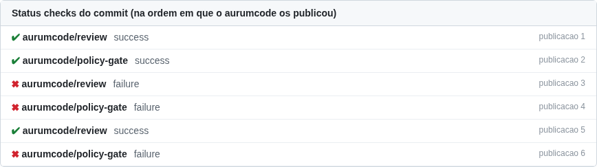
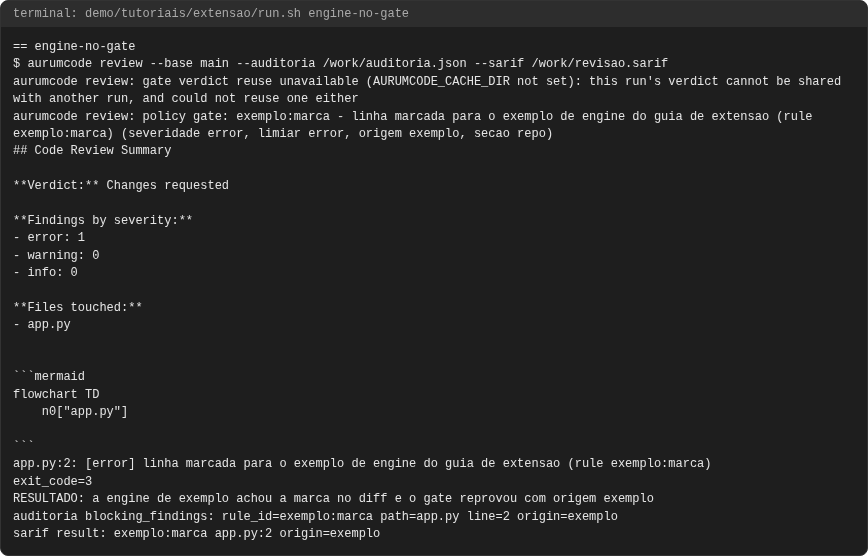

# AurumCode

AurumCode é um gate de compliance para a organização: cada pull request passa
por uma revisão automática que cita as regras da própria organização, por
uma política central que o repositório do dev não consegue afrouxar, por um
gate que decide o que reprova e por controles de cadeia de suprimentos (SAST,
SBOM, inventário e assinatura), em repositórios de qualquer linguagem. É
gratuito e de código aberto (MIT).

Use a busca (topo da página) para encontrar qualquer opção, comando ou
mensagem. Para começar do zero, leia [Primeiro review e uso local](getting-started.md).
Cada capacidade abaixo aponta para a referência de configuração e para o
tutorial correspondente.

## Revisão

Revisão de pull request por modelo, com análise determinística que funciona
sem credencial, resumo do review e correções sugeridas (`aurumcode review` e
`aurumcode fix`). Referência:
[Prompts, skills e docs](configuration.md#prompts-skills-e-docs),
[Modelo e credenciais](configuration.md#modelo-e-credenciais),
[Opções avançadas](configuration.md#opcoes-avancadas) e
[Opções públicas](configuration.md#opcoes-publicas),
[Deliberação: o modelo pede ferramentas](configuration.md#deliberacao-o-modelo-pede-ferramentas-dentro-de-limites),
[Status do CI no parecer](configuration.md#status-do-ci-no-parecer),
[PR grande: diff local e revisão em lotes](configuration.md#pr-grande-diff-local-e-revisao-em-lotes) e
[Arquivos que saem da revisão como documentação](configuration.md#quais-arquivos-saem-da-revisao-como-documentacao). Veja também
[Qualidade e limitações](review-quality.md) e [Cache de review](review-cache.md).

Tutorial: [Revisão de código](tutorials/revisao.md) e [Deliberação com ferramentas](tutorials/deliberacao.md).

## No seu agente de código

Para quem programa com agente de IA: `aurumcode mcp` é um servidor MCP local
(stdio, só leitura) que o Claude Code, o Codex ou o Cursor consultam antes do
commit, com o mesmo gate do CI (`aurum_gate`, `aurum_review`, `aurum_rules`,
`aurum_explain`); a skill `aurum-review` ensina o agente a perguntar e corrigir,
e um hook de pre-commit opcional faz o mesmo sem agente. Configuração:
[Aurum no seu agente de código](agentes.md).

Tutorial: [Aurum no seu agente](tutorials/agente.md).

## Skills e política

Skills de convenção escritas em Markdown pelos times e uma política central,
mantida num repositório da organização, que `rules` e `gate` do repositório
do dev não conseguem afrouxar. Referência:
[Política central](configuration.md#politica-central) e
[Realimentação da política](configuration.md#realimentacao-da-politica-aur-532),
que transforma falsos positivos, achados corrigidos e defeitos escapados numa
PR de propostas para a política.

Tutorial: [Skills de convenção](tutorials/skills.md), [Política central](tutorials/politica-central.md) e [Realimentação da política](tutorials/realimentacao.md).

## Gate

O gate transforma skills em regras citáveis, decide por severidade o que
reprova, trata resultado inconclusivo como não aprovado, aceita exceções com
dono e validade e registra uma trilha de auditoria com saída SARIF.
Referência:
[Gate e regras citáveis](configuration.md#gate-skills-viram-regra-citavel-e-a-politica-decide-o-que-reprova-aur-519),
[gate.sources](configuration.md#gatesources-which-findings-count-toward-the-gate),
[O modelo pondera a evidência determinística (gate.triage)](configuration.md#the-model-weighs-the-deterministic-evidence-gatetriage),
[Exceções aprovadas](configuration.md#excecoes-aprovadas-dono-e-validade-aur-520) e
[Trilha de auditoria e SARIF](configuration.md#trilha-de-auditoria-e-sarif-aur-521).
O [Guia corporativo](gate-corporativo.md) reúne tudo num conjunto que funciona junto.

Tutorial: [O gate de política](tutorials/gate.md), [Exceções aprovadas](tutorials/excecoes.md), [Auditoria e SARIF](tutorials/auditoria-sarif.md) e [Reaproveitamento](tutorials/reaproveitamento.md).

## Cadeia de suprimentos

SAST com Semgrep, SBOM CycloneDX com Trivy, inventário no Dependency-Track,
assinatura com Cosign, xBOM (Build BOM e CBOM) e o artefato de dados de
análise. Referência:
[SAST com Semgrep](configuration.md#sast-multilinguagem-com-semgrep-aur-548),
[SBOM com Trivy](configuration.md#sbom-cyclonedx-com-trivy-aur-549),
[Gate Dependency-Track](configuration.md#gate-dependency-track-sbom-e-metricas-do-projeto-aur-550),
[Assinatura com Cosign](configuration.md#assinatura-com-sigstorecosign-aur-551),
[xBOM](configuration.md#xbom-alem-do-sbom-build-bom-e-cbom-aur-552) e
[Artefato de dados de análise](configuration.md#artefato-de-dados-de-analise-analysis_data).

Tutorial: [SAST com Semgrep](tutorials/sast.md), [Segredos com gitleaks](tutorials/segredos.md),
[SBOM e Dependency-Track](tutorials/sbom-dependency-track.md),
[Assinatura com Cosign](tutorials/assinatura.md),
[xBOM](tutorials/xbom.md) e
[Dados de análise](tutorials/dados-de-analise.md).

## Qualquer linguagem

A análise não depende da linguagem: regras do Semgrep, SBOM e inventário
valem para repositórios poliglotas. Referência:
[SAST multilinguagem](configuration.md#sast-multilinguagem-com-semgrep-aur-548).

Tutorial: [Qualquer linguagem](tutorials/qualquer-linguagem.md).

## Changelog

Cada pull request acrescenta uma entrada curta e voltada a quem usa o produto
em `## Unreleased`; o check `aurumcode changelog` reprova a PR sem ela, lendo o
modo do commit base. A sugestão de entrada do review continua separada e só
consultiva. Referência:
[Changelog obrigatório](configuration.md#changelog-obrigatorio-aur-509) e o
guia [Changelog obrigatório](changelog.md).

Tutorial: [Changelog obrigatório](tutorials/changelog.md).

## Benchmark e operação

Corpus de recall e protocolo de comparação ([Benchmark](benchmark.md)) e o
ambiente de desenvolvimento e QA em container ([Desenvolvimento e QA](qa.md)).

Tutorial: [Benchmark de recall](tutorials/benchmark.md) e [Operação](tutorials/operacao.md).

## Estendendo o Aurum

Os pontos de extensão do produto, com o contrato exato de cada um: engine de
scanner (`scanner.Scanner`, registro fechado, origem tipada), ferramenta de
deliberação (`deliberation.Tool`, limites e transcript), skill (`SKILL.md`,
catálogo em camadas) e fonte de contexto (`ContextProvider`, o lugar do MCP),
e o que não é ponto de extensão. Referência: [Estendendo o Aurum](extensao.md)
e [Arquitetura](architecture.md).

Tutorial: [Estendendo o Aurum na prática](tutorials/extensao.md).

## Como fica

O que o usuário vê, capturado a partir das execuções gravadas dos tutoriais
(cada tutorial tem a sua seção "Como fica"; as capturas são geradas por
scripts/docs/capturas.sh e conferidas pelo manifesto
assets/capturas/capturas.json).

Comentário da revisão no PR (tutorial [revisão](tutorials/revisao.md)):

Status checks publicados pelo gate (tutorial [gate](tutorials/gate.md)):

Terminal do gate com a engine de exemplo (tutorial [extensão](tutorials/extensao.md)):

Tutorial: cada tutorial do [índice de tutoriais](tutorials/README.md) termina
na sua seção "Como fica", com as capturas de todos os casos.

## Especificações

O arquivo histórico da reconstrução está na seção [Specs](specs/README.md).
Não o use como manual de instalação nem como lista de funcionalidades entregues.
