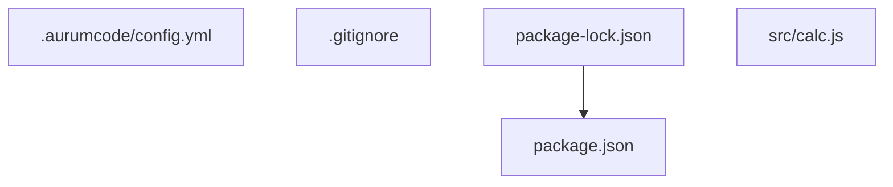

# AUR-554 — Guia e demonstração do gate corporativo

## Status

Entregue: `docs/gate-corporativo.md` (guia), `demo/gate-corporativo/` (demonstração
executável em containers), `tests/acceptance/AUR-554.sh` (aceite selado, sem rede)
e este registro. O aceite selado confere o guia contra a demonstração e compara o
`out/` versionado com `expected/`; a execução completa roda fora do sandbox
(containers e imagens públicas fixadas) e seu log está abaixo.

## Execução real

- Data: 2026-10-02, `run.sh all` (build, up, fail, fix, pass, verify, down), cerca de 67 s com as
  imagens já baixadas, a partir de um estado limpo (nenhum container, rede ou volume da demonstração).
- Comando: `demo/gate-corporativo/run.sh all`, depois `demo/gate-corporativo/run.sh --check` (saída `CHECK OK`).
- Imagens (todas por digest, `demo/gate-corporativo/images.lock`):

```text
# Toda imagem usada pela demonstracao, fixada por digest (nunca por tag).
# trivy e semgrep copiam .board/bootstrap/locks/scanners.yml (vuln_scanner_image,
# sast_scanner_image). O Semgrep roda dentro da imagem do produto (Dockerfile),
# na versao identica de scanners.yml; a fase build confere a versao.
dtrack_apiserver=docker.io/dependencytrack/apiserver@sha256:764dee822521e43d50ad7d0ca5bc35f48968b6b098ef97945e2ecac8c55d52e5
postgres=docker.io/library/postgres@sha256:b0f9560a2de083e2cc7382e75f808c7381a32852a7ec49117deedb300e552b24
trivy=docker.io/aquasec/trivy@sha256:7cced7cae583819fc7806d4cbc0dbbc7cad18b99f7d3e235192e6da8c091045c
semgrep=docker.io/semgrep/semgrep@sha256:65dcd4408adda7c183a6b4550cb1e9b19f7f627a6fbb7e0559bd466bedc44d7b
cosign=ghcr.io/sigstore/cosign/cosign@sha256:9e5c2f2edc34351160407ca3416c61855bdf9403c3c5936e0f0be7fc261611b8
```

- Versões: Dependency-Track 5.1.1 (apiserver), PostgreSQL 17 (alpine), Trivy 0.73.0,
  Semgrep 1.172.0 (na imagem do produto, igual a `.board/bootstrap/locks/scanners.yml`),
  Cosign v3.1.3. A imagem do produto é construída do `Dockerfile` do repositório.
- Trivy e Cosign são binários estáticos extraídos das imagens fixadas (`docker create` +
  `docker cp`) e chamados por wrappers shell (`wrappers/trivy-wrap.sh`, `wrappers/cosign-wrap.sh`)
  passados em `--trivy-bin`/`--cosign-bin`, dentro do container do produto. O Cosign usa um
  par de chaves efêmero gerado na fase `pass` (sem log de transparência, sem rede) e o `verify`
  roda com `--network none`.

## Decisões

- **Determinismo do inventário.** Um Dependency-Track recém-criado não tem espelhos de
  vulnerabilidade, então a fase `up` cria pela API uma política de violação
  (`demo-componente-proibido`, condição de coordenadas sobre `lodash` 4.17.15, estado `FAIL`).
  O limiar `policy_violations: 0` reprova; em produção `critical`/`high` vêm dos espelhos do servidor.
- **Métricas assíncronas no v5.** O gate espera o token de processamento do BOM
  (`processing: false`) e só então lê as métricas: no v5 o fluxo de processamento inclui avaliação
  de política e atualização de métricas, e todas as execuções reais (várias, durante o desenvolvimento e a gravada) leram métricas
  consistentes com o BOM enviado, sem espera extra.
  A chave do time (BOM_UPLOAD, VIEW_PORTFOLIO, VIEW_POLICY_VIOLATION) não tem permissão de
  refresh de métricas (HTTP 403 observado), por isso `run.sh` não o chama; ele apenas relê as
  métricas e as violações pela API para nomear a política e o componente no log.
- **Sem provedor de modelo.** `AURUMCODE_LLM_FIXTURE` aponta para `{"issues":[]}` e `--seguranca`
  liga o passe determinístico. Sem fixture, o review ficaria `quality_skipped` (inconclusivo) e
  `gate.inconclusive: block` reprovaria o `pass`.
- **Aprovação exige o inventário "aprovado".** Com `inconclusive: warn`, um servidor ou segredo
  ausente sairia com código 0; o aceite exige a linha `ssor_dtrack: aprovado (...)` no `pass`.
- **Rede.** O container do produto usa `--network host` porque o gate só aceita `https://` ou
  `http://` com IP de loopback, e o servidor publica a porta em `127.0.0.1:8081`.

## Achados para quem integra

- `.github/workflows/review.yml` gera o SBOM e assina **depois** do passo de revisão e não repassa
  `DTRACK_API_KEY`/`DTRACK_PROJECT_ID` ao container: o gate do Dependency-Track não fecha de ponta a
  ponta dentro do workflow reutilizável (já listado em "Known gaps" de AUR-550). O guia documenta isso;
  a demonstração segue a ordem correta (`sbom`, `review`, `sign`).
- `aurumcode sign` não tem `--key`: a chave efêmera da demonstração entra pelo wrapper do Cosign.

## Log completo da execução real

### out/build.log

```text
== build: imagem do produto, imagens fixadas, binarios do Trivy e do Cosign
imagem do produto: construida a partir do Dockerfile
semgrep 1.172.0: igual a scanners.yml
imagem fixada por digest: dtrack_apiserver ok
imagem fixada por digest: postgres ok
imagem fixada por digest: trivy ok
imagem fixada por digest: semgrep ok
imagem fixada por digest: cosign ok
trivy e cosign extraidos das imagens fixadas
repo-exemplo pronto: branch feature com o defeito de SAST e a dependencia plantada
```

### out/up.log

```text
== up: Dependency-Track v5 + PostgreSQL
servidor: Dependency-Track 5.1.1
admin: senha inicial trocada e login ok
time aurum-demo com permissoes BOM_UPLOAD, VIEW_PORTFOLIO, VIEW_POLICY_VIOLATION e chave de API criada
projeto servico-exemplo criado
politica demo-componente-proibido: reprova lodash 4.17.15 (coordenadas)
DTRACK_API_KEY e DTRACK_PROJECT_ID gravados em arquivo local ignorado pelo git
```

### out/fail.log

```text
== fail: gate com o defeito de SAST e a dependencia plantada
sbom: sbom_app_cyclonedx.json
sbom: CycloneDX 1.7, componentes: lodash@4.17.15
aurumcode review: security pass applied 4 of 8 security rules (security/command-injection, security/hardcoded-secret, security/sql-injection, security/xss); see internal/review/rules/security.yml for the full catalog
aurumcode review: gate verdict reuse unavailable (AURUMCODE_CACHE_DIR not set): this run's verdict cannot be shared with another run, and could not reuse one either
aurumcode review: policy gate: semgrep:github.policy.regras.demo-sem-eval: eval() executa texto como codigo; use um parser ou uma tabela de operacoes (rule semgrep:github.policy.regras.demo-sem-eval) (severidade error, limiar error, origem policy)
aurumcode review: policy gate: ssor_dtrack: policy_violations 1 > policy_violations 0
## Code Review Summary

**Verdict:** Changes requested

**Findings by severity:**
- error: 1
- warning: 0
- info: 0

**Files touched:**
- src/calc.js



src/calc.js:5: [error] eval() executa texto como codigo; use um parser ou uma tabela de operacoes (rule semgrep:github.policy.regras.demo-sem-eval)

Security findings (standards/security-review):
No security findings.
aurumcode review: exit_code=3
dependency-track metricas: critical=0 high=0 policyViolationsTotal=1
dependency-track violacao: politica=demo-componente-proibido componente=lodash versao=4.17.15 estado=FAIL
RESULTADO: gate reprovou, como esperado
```

### out/fix.log

```text
== fix: remove o eval e atualiza a dependencia
correcao aplicada: src/calc.js sem eval; lodash 4.17.15 -> 4.17.21
commit: fix: sem eval, lodash 4.17.21
commit: feature: calculadora
```

### out/pass.log

```text
== pass: gate aprova, SBOM enviado e assinado
sbom: sbom_app_cyclonedx.json
sbom: CycloneDX 1.7, componentes: lodash@4.17.21
aurumcode review: security pass applied 4 of 8 security rules (security/command-injection, security/hardcoded-secret, security/sql-injection, security/xss); see internal/review/rules/security.yml for the full catalog
aurumcode review: gate verdict reuse unavailable (AURUMCODE_CACHE_DIR not set): this run's verdict cannot be shared with another run, and could not reuse one either
aurumcode review: policy gate: ssor_dtrack: aprovado (critical=0, high=0, policy_violations=0)
## Code Review Summary

**Verdict:** Approve

**Findings by severity:**
- error: 0
- warning: 0
- info: 0

**Files touched:**
- None


No issues found.

Security findings (standards/security-review):
No security findings.
aurumcode review: exit_code=0
dependency-track metricas: critical=0 high=0 policyViolationsTotal=0
dependency-track violacoes: nenhuma
RESULTADO: gate aprovou
cosign: Private key written to cosign.key
cosign: Public key written to cosign.pub
sign: sbom /github/workspace/sbom_app_cyclonedx.json -> /github/workspace/sbom_app_cyclonedx.json.sigstore.json
assinatura: sbom_app_cyclonedx.json.sigstore.json gravado
```

### out/verify.log

```text
== verify: cosign verify-blob com a chave efemera
WARNING: Skipping tlog verification is an insecure practice that lacks transparency and auditability verification for the blob.
Verified OK
verify-blob: assinatura aceita
adulterado: SBOM modificado e rejeitado
```

### out/down.log

```text
== down: remove containers, rede e volumes da demonstracao
recursos restantes da demonstracao: 0
```

## Prova da mutação real

Mutação: numa cópia da demonstração, o defeito plantado de SAST foi removido de
`repo-exemplo/src/calc.js` (`return eval(expressao);` virou `return Number(expressao);`), mantendo a
dependência plantada e **sem** a correção esperada de `fix`. Rodaram `build`, `up` e `fail` reais; o
`fail` saiu assim (trechos):

```text
**Verdict:** Comment
No issues found.
aurumcode review: exit_code=3
dependency-track violacao: politica=demo-componente-proibido componente=lodash versao=4.17.15 estado=FAIL
RESULTADO: gate reprovou, como esperado
```

O SAST não nomeia mais a regra e o veredito virou "No issues found" para o código; `run.sh --check` sobre
essa saída (com os demais logs da execução registrada) respondeu:

```text
DIVERGENCIA fase=fail: trecho esperado ausente: policy gate: semgrep:github.policy.regras.demo-sem-eval: eval() executa texto como codigo
```

com saída 1. O aceite selado reproduz a mutação sobre o log registrado (`MUT-001`: remove o achado de
SAST e, separadamente, a violação do Dependency-Track de `out/fail.log` e exige que `--check` caia).

## Fora do escopo desta entrega

- Assinatura keyless (OIDC do GitHub Actions): só a chave efêmera foi exercitada na demonstração;
  o fluxo keyless segue documentado em `docs/configuration.md`.
- Assinatura de imagem de artefato (`sign_artifacts`): desligada na demonstração.
- Integração do gate do Dependency-Track em `review.yml` (ver "Achados").
