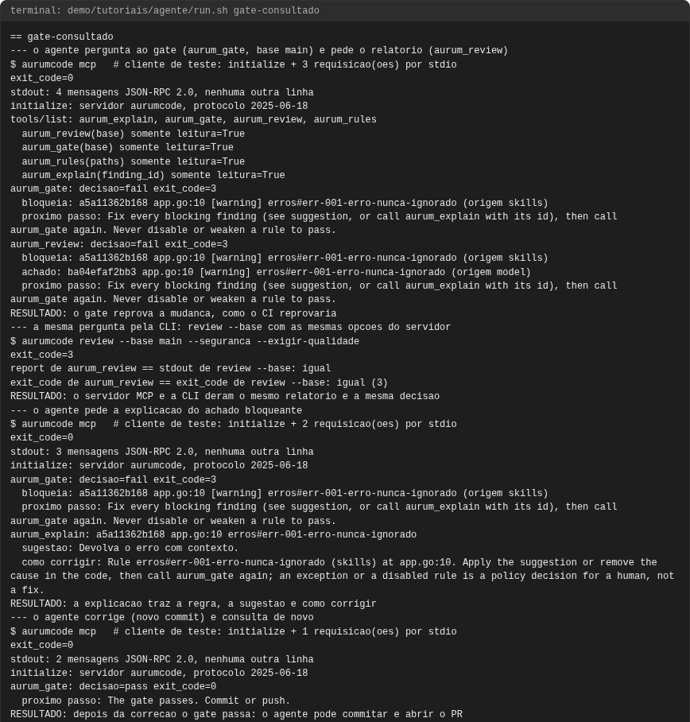
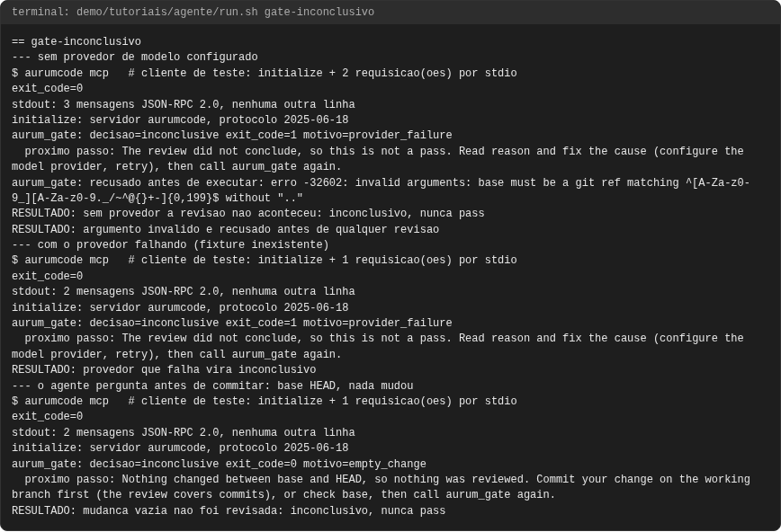
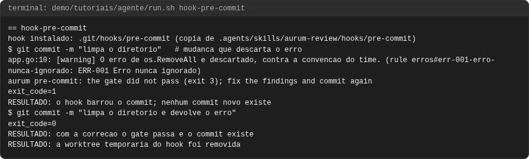
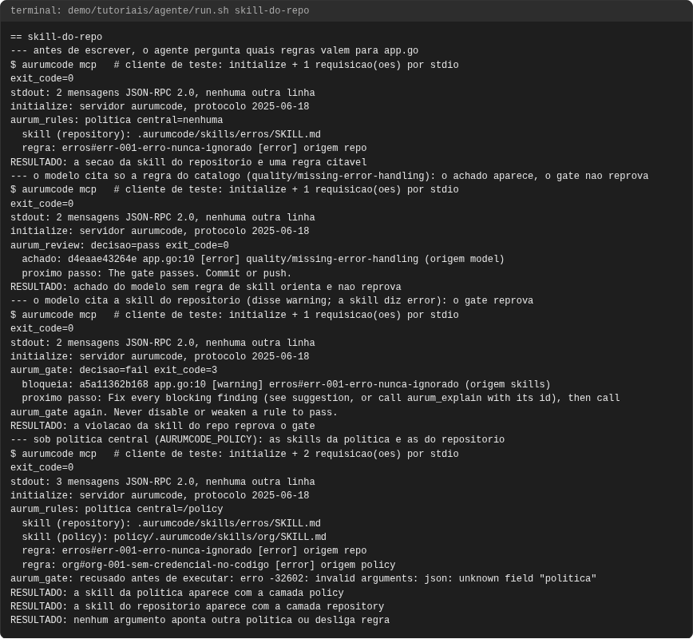

# Tutorial: Aurum no seu agente de código

## Objetivo

Levar o gate para antes do commit de quem programa com um agente de IA. O
agente (aqui, um cliente MCP de teste em stdio) consulta `aurumcode mcp`,
lê o achado, corrige e consulta de novo; o resultado é o mesmo de
`aurumcode review --base`. Três usos e uma falha, todos executados: o agente
consulta o gate e corrige; a skill do repositório decide (e a política
central aparece em `aurum_rules`); o hook de pre-commit faz o mesmo sem
agente; e, como falha, o gate sem provedor é inconclusivo, nunca `pass`.

A configuração de cada agente (Claude Code, Codex, Cursor) está em
[Aurum no seu agente de código](../agentes.md).

Os blocos de configuração **são os arquivos de `demo/tutoriais/agente/`**,
byte a byte, e as saídas vêm de uma execução real registrada em
`demo/tutoriais/agente/out/` (`run.sh --check` e
`tests/acceptance/AUR-592.sh` conferem).

## Pré-requisitos

- `git`, `docker`, `bash` e `python3`, e a imagem do produto, como em
  [revisao.md](revisao.md).
- Nenhuma credencial: o modelo é um JSON determinístico
  (`AURUMCODE_LLM_FIXTURE`).
- O cliente de teste (`demo/tutoriais/agente/cliente-mcp.py`) só lê as
  respostas: confere que toda linha do stdout do servidor é uma mensagem
  JSON-RPC 2.0 e imprime um resumo. As linhas desse resumo e as linhas
  `RESULTADO:` são do script, não do produto.

```bash
bash demo/tutoriais/agente/run.sh all      # executa os quatro casos e grava out/
bash demo/tutoriais/agente/run.sh --check  # compara out/ com expected/, sem docker
```

## Conceitos em um minuto

- `aurumcode mcp` é um servidor MCP local por stdio. Cada pergunta de gate é
  uma sessão `review --base <ref> --seguranca --exigir-qualidade`: a mesma
  sessão da CLI e do CI, só que respondida em JSON.
- O agente escolhe apenas a ref (`base`) ou os caminhos (`paths`). Política
  central, skills, severidades e limites são do servidor; um argumento a mais
  é recusado antes de executar.
- `decision` é `pass` só quando a revisão concluiu e o gate deixou passar.
  `inconclusive` nunca é `pass`.

## Caso 1: o agente consulta o gate e corrige

O repositório do caso declara um gate e uma skill de convenção de erros:

<!-- arquivo: demo/tutoriais/agente/repo-exemplo/base/.aurumcode/config.yml -->
```yaml
gate:
  fail_on: [error]
  inconclusive: block
```

<!-- arquivo: demo/tutoriais/agente/repo-exemplo/base/.aurumcode/skills/erros/SKILL.md -->
```markdown
---
name: erros
version: 1
paths: ["**/*.go"]
---
Convencao de erros do time. Cada `## ` abaixo e uma regra citavel.

## ERR-001 Erro nunca ignorado
severity: error
Todo erro retornado e tratado ou devolvido com contexto; nunca descartado.
```

A mudança da branch descarta o erro de `os.RemoveAll`. O agente lista as
ferramentas, pergunta ao gate e pede o relatório:

<!-- saida: gate-consultado -->
```text
tools/list: aurum_explain, aurum_gate, aurum_review, aurum_rules
  aurum_review(base) somente leitura=True
  aurum_gate(base) somente leitura=True
  aurum_rules(paths) somente leitura=True
  aurum_explain(finding_id) somente leitura=True
aurum_gate: decisao=fail exit_code=3
  bloqueia: a5a11362b168 app.go:10 [warning] erros#err-001-erro-nunca-ignorado (origem skills)
```

A mesma pergunta pela CLI dá o mesmo relatório, byte a byte, e o mesmo
código de saída:

<!-- saida: gate-consultado -->
```text
$ aurumcode review --base main --seguranca --exigir-qualidade
exit_code=3
report de aurum_review == stdout de review --base: igual
exit_code de aurum_review == exit_code de review --base: igual (3)
```

O agente pede a explicação do achado que bloqueia, corrige (um commit que
devolve o erro) e pergunta de novo:

<!-- saida: gate-consultado -->
```text
aurum_explain: a5a11362b168 app.go:10 erros#err-001-erro-nunca-ignorado
  sugestao: Devolva o erro com contexto.
```

<!-- saida: gate-consultado -->
```text
aurum_gate: decisao=pass exit_code=0
  proximo passo: The gate passes. Commit or push.
RESULTADO: depois da correcao o gate passa: o agente pode commitar e abrir o PR
```

O que observar: o servidor não tem gate próprio. A decisão é o código de
saída da sessão (`3`, violação) e os achados que bloqueiam vêm do resultado
do gate da sessão, os mesmos da auditoria de `review --base`.

## Caso 2: a skill do repositório decide

Antes de escrever, o agente pergunta quais regras valem para `app.go`. Um
achado do modelo que só cita o catálogo embutido orienta, mas não reprova; o
mesmo defeito citado pela skill do repositório reprova, com a severidade da
skill (`error`), não a que o modelo disse (`warning`):

<!-- saida: skill-do-repo -->
```text
aurum_rules: politica central=nenhuma
  skill (repository): .aurumcode/skills/erros/SKILL.md
  regra: erros#err-001-erro-nunca-ignorado [error] origem repo
```

<!-- saida: skill-do-repo -->
```text
aurum_review: decisao=pass exit_code=0
  achado: d4eaae43264e app.go:10 [error] quality/missing-error-handling (origem model)
```

<!-- saida: skill-do-repo -->
```text
aurum_gate: decisao=fail exit_code=3
  bloqueia: a5a11362b168 app.go:10 [warning] erros#err-001-erro-nunca-ignorado (origem skills)
```

Sob política central (`AURUMCODE_POLICY`, definida por quem configura o
agente), `aurum_rules` mostra as skills das duas camadas, e o agente não
consegue apontar outra política:

<!-- arquivo: demo/tutoriais/agente/politica/.aurumcode/skills/org/SKILL.md -->
```markdown
---
name: org
version: 1
paths: ["**"]
---
Regras da organizacao. Cada `## ` abaixo e uma regra citavel.

## ORG-001 Sem credencial no codigo
severity: error
Credencial vem do ambiente ou do cofre, nunca de literal no repositorio.
```

<!-- saida: skill-do-repo -->
```text
aurum_rules: politica central=/policy
  skill (repository): .aurumcode/skills/erros/SKILL.md
  skill (policy): policy/.aurumcode/skills/org/SKILL.md
  regra: erros#err-001-erro-nunca-ignorado [error] origem repo
  regra: org#org-001-sem-credencial-no-codigo [error] origem policy
aurum_gate: recusado antes de executar: erro -32602: invalid arguments: json: unknown field "politica"
```

## Caso 3: o hook de pre-commit, sem agente

`.agents/skills/aurum-review/hooks/pre-commit` revisa o que está no índice
antes do commit existir, numa worktree temporária, e barra o commit se o
gate não passar:

<!-- saida: hook-pre-commit -->
```text
$ git commit -m "limpa o diretorio"   # mudanca que descarta o erro
app.go:10: [warning] O erro de os.RemoveAll e descartado, contra a convencao do time. (rule erros#err-001-erro-nunca-ignorado: ERR-001 Erro nunca ignorado)
aurum pre-commit: the gate did not pass (exit 3); fix the findings and commit again
exit_code=1
RESULTADO: o hook barrou o commit; nenhum commit novo existe
```

<!-- saida: hook-pre-commit -->
```text
$ git commit -m "limpa o diretorio e devolve o erro"
exit_code=0
RESULTADO: com a correcao o gate passa e o commit existe
RESULTADO: a worktree temporaria do hook foi removida
```

## Falha: sem provedor, o gate é inconclusivo

Sem provedor de modelo, ou com o provedor falhando, a revisão não aconteceu:
a resposta é `inconclusive`, nunca `pass`. Um argumento que não casa com o
schema é recusado antes de qualquer revisão:

<!-- saida: gate-inconclusivo -->
```text
aurum_gate: decisao=inconclusive exit_code=1 motivo=provider_failure
  proximo passo: The review did not conclude, so this is not a pass. Read reason and fix the cause (configure the model provider, retry), then call aurum_gate again.
```

<!-- saida: gate-inconclusivo -->
```text
RESULTADO: sem provedor a revisao nao aconteceu: inconclusivo, nunca pass
RESULTADO: argumento invalido e recusado antes de qualquer revisao
```

Se o agente pergunta antes de commitar (`base` igual a `HEAD`), nada foi
revisado, e isso também não é `pass`:

<!-- saida: gate-inconclusivo -->
```text
aurum_gate: decisao=inconclusive exit_code=0 motivo=empty_change
  proximo passo: Nothing changed between base and HEAD, so nothing was reviewed. Commit your change on the working branch first (the review covers commits), or check base, then call aurum_gate again.
RESULTADO: mudanca vazia nao foi revisada: inconclusivo, nunca pass
```

O que observar: o agente que segue a skill `aurum-review` não trata
`inconclusive` como sucesso; ele lê `reason`, corrige a causa ou avisa a
pessoa.

<!-- capturas:inicio (gerado por scripts/docs/capturas.sh; nao editar a mao) -->
## Como fica

Capturas geradas por scripts/docs/capturas.sh a partir das saidas gravadas em demo/tutoriais/agente/out/: o terminal de cada caso e, quando o caso publica, o comentario do PR e os status checks. O manifesto docs/assets/capturas/capturas.json registra o digest de cada insumo.

### gate-consultado



### gate-inconclusivo



### hook-pre-commit



### skill-do-repo



<!-- capturas:fim -->
