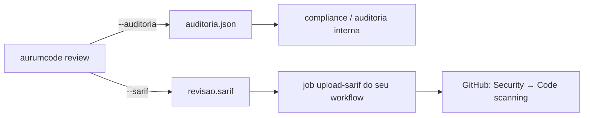
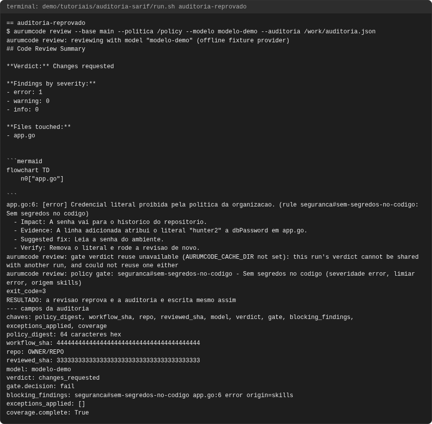
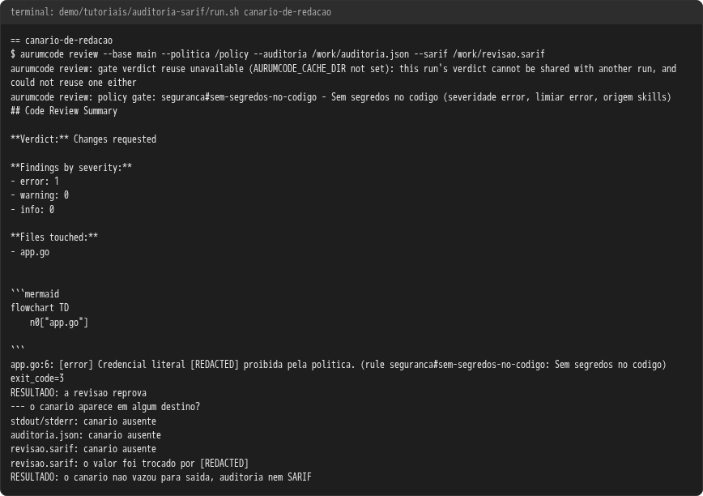
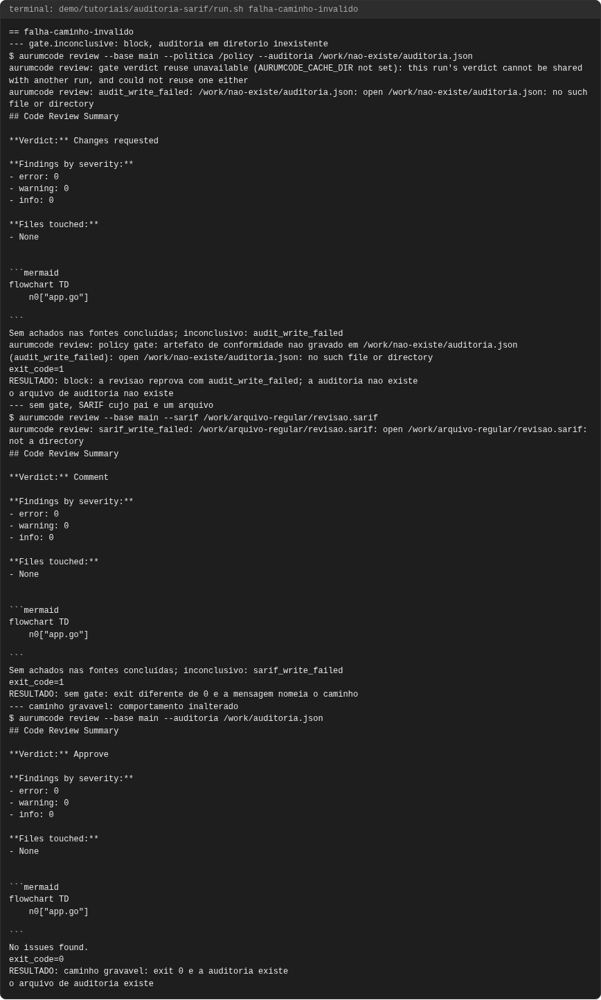
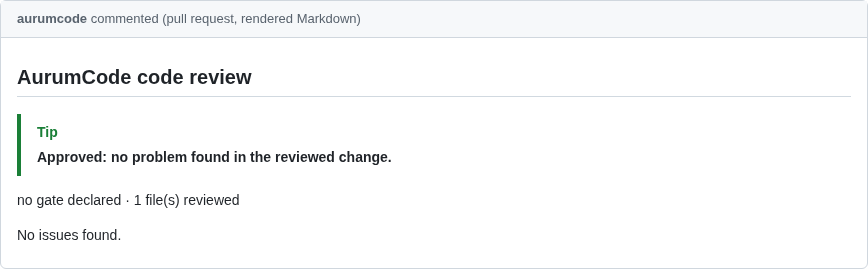
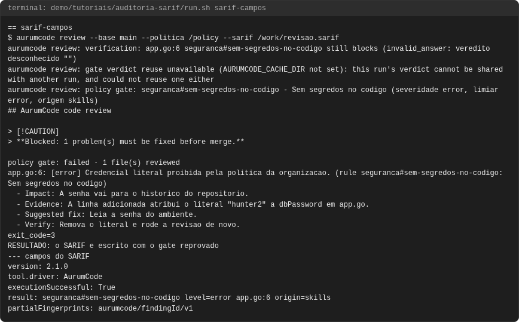
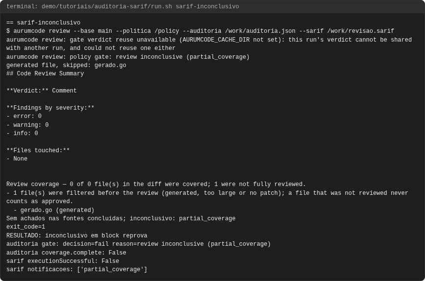
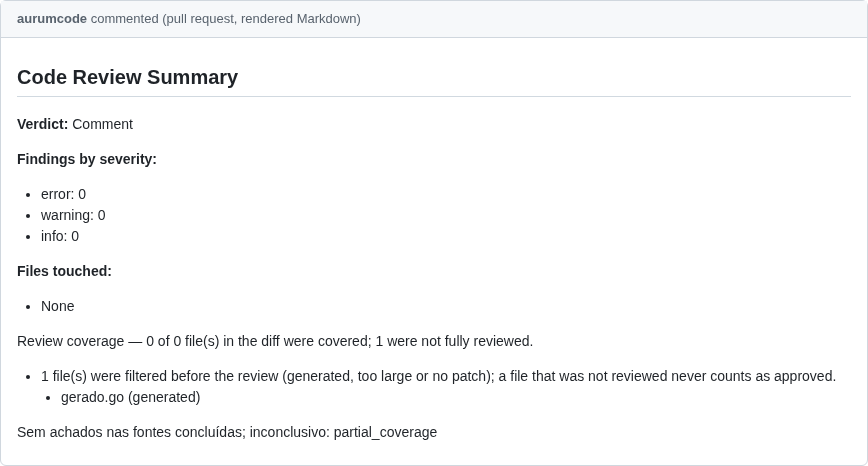
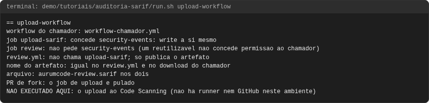

# Tutorial: auditoria e SARIF

## Objetivo

Ver os dois arquivos que uma revisão pode deixar para quem audita:

- **Registro de auditoria** (`--auditoria`): um JSON por revisão com quem
  revisou, o quê, com qual política e qual foi a decisão. É a evidência de
  compliance.
- **SARIF** (`--sarif`): o formato padrão de resultados de análise, que o
  GitHub mostra na aba **Security → Code scanning**.



Um trecho da auditoria do caso 1:

```json
{"verdict": "changes_requested", "gate": {"decision": "fail"}, "coverage": {"complete": true}}
```

Seis casos: cinco executados e uma conferência de workflow. Referência curta:
[auditoria e SARIF na configuração](../configuration.md#trilha-de-auditoria-e-sarif-aur-521).

## Pré-requisitos

- `git`, `docker`, `bash`, `python3` e a imagem do produto, como em
  [revisao.md](revisao.md); sem rede, modelo falso.
- Ler [gate.md](gate.md) e [excecoes.md](excecoes.md): a auditoria registra a
  decisão do gate e as exceções.

```bash
bash demo/tutoriais/auditoria-sarif/run.sh all
bash demo/tutoriais/auditoria-sarif/run.sh --check
```

## Onde ficam

Nada é escrito sem a flag. Localmente, o arquivo vai para o caminho que você
passar. No workflow reutilizável, os dois são escritos sempre e enviados como
artefatos do job (`aurumcode-audit-<PR>` e `aurumcode-sarif-<PR>`), mesmo
quando o gate reprova.

## Caso 1: a auditoria de uma revisão que reprova

```bash
aurumcode review --base main --politica /caminho/da/politica --modelo modelo-demo --auditoria auditoria.json
```

<!-- saida: auditoria-reprovado -->
```text
exit_code=3
RESULTADO: a revisao reprova e a auditoria e escrita mesmo assim
chaves: policy_digest, workflow_sha, repo, reviewed_sha, model, verdict, gate, blocking_findings, exceptions_applied, coverage
policy_digest: 64 caracteres hex
workflow_sha: 4444444444444444444444444444444444444444
repo: OWNER/REPO
reviewed_sha: 3333333333333333333333333333333333333333
model: modelo-demo
verdict: changes_requested
gate.decision: fail
blocking_findings: seguranca#sem-segredos-no-codigo app.go:6 error origin=skills
exceptions_applied: []
coverage.complete: True
```

O que observar: `gate.decision` diz o resultado; `blocking_findings` lista só o
que reprovou, com a origem (`skills`, `analysis`, `sast`); `exceptions_applied`
lista as exceções aceitas; `coverage` diz se algum arquivo ficou de fora. Os
SHAs e o repositório vêm das variáveis do GitHub Actions (a demo os fixa).

## Caso 2: o SARIF

```bash
aurumcode review --base main --politica /caminho/da/politica --sarif revisao.sarif
```

<!-- saida: sarif-campos -->
```text
exit_code=3
RESULTADO: o SARIF e escrito com o gate reprovado
version: 2.1.0
tool.driver: AurumCode
executionSuccessful: True
result: seguranca#sem-segredos-no-codigo level=error app.go:6 origin=skills
partialFingerprints: aurumcode/findingId/v1
```

O que observar: cada achado vira um `result` com regra, nível, arquivo e linha;
`partialFingerprints` é a impressão digital estável que evita alerta duplicado
no Code scanning.

## Caso 3: uma revisão inconclusiva também gera os dois

<!-- saida: sarif-inconclusivo -->
```text
exit_code=1
RESULTADO: inconclusivo em block reprova
auditoria gate: decision=fail reason=review inconclusive (partial_coverage)
auditoria coverage.complete: False
sarif executionSuccessful: False
sarif notificacoes: ['partial_coverage']
```

O que observar: uma revisão que não terminou nunca vira "aprovado": a auditoria
diz `fail` com o motivo e o SARIF diz `executionSuccessful: false`.

## Caso 4: canário de redação

O modelo falso devolve um achado cuja mensagem contém o valor
`CANARIO-LOCAL-7f3a91c2`, e a variável `AURUM_SECRET_CANARY` o registra como
segredo:

<!-- saida: canario-de-redacao -->
```text
app.go:6: [error] Credencial literal [REDACTED] proibida pela politica. (rule seguranca#sem-segredos-no-codigo: Sem segredos no codigo)
exit_code=3
RESULTADO: a revisao reprova
stdout/stderr: canario ausente
auditoria.json: canario ausente
revisao.sarif: canario ausente
revisao.sarif: o valor foi trocado por [REDACTED]
RESULTADO: o canario nao vazou para saida, auditoria nem SARIF
```

O que observar: o segredo vira `[REDACTED]` e não aparece em lugar nenhum.

## Caso 5: upload para o Code Scanning pelo job do chamador

O workflow reutilizável não envia o SARIF ao Code scanning: isso pede
`security-events: write`, que só o seu workflow pode conceder. Acrescente um
segundo job:

<!-- arquivo: demo/tutoriais/auditoria-sarif/workflow-chamador.yml -->
```yaml
# Workflow do chamador: revisao pelo reutilizavel e upload do SARIF para o Code Scanning.
# OWNER e os SHAs sao placeholders: troque pelos seus.
name: Revisao com SARIF
on:
  pull_request:

permissions:
  contents: read
  pull-requests: write
  statuses: write
  checks: read

jobs:
  review:
    uses: OWNER/AurumCode/.github/workflows/review.yml@0000000000000000000000000000000000000000
    with:
      security: true
    secrets:
      LLM_API_KEY: ${{ secrets.LLM_API_KEY }}
      LLM_BASE_URL: ${{ secrets.LLM_BASE_URL }}

  upload-sarif:
    needs: review
    if: ${{ !cancelled() && github.event.pull_request.head.repo.full_name == github.repository }}
    runs-on: ubuntu-latest
    permissions:
      contents: read
      actions: read
      security-events: write
    steps:
      - uses: actions/download-artifact@3e5f45b2cfb9172054b4087a40e8e0b5a5461e7c
        with:
          name: aurumcode-sarif-${{ github.event.pull_request.number }}
          path: .
      - uses: github/codeql-action/upload-sarif@2892aa5e19bbd11bc0cff5427e3b750a04d9e3c2
        with:
          sarif_file: aurumcode-review.sarif
          category: aurumcode-policy-gate
```

<!-- saida: upload-workflow -->
```text
workflow do chamador: workflow-chamador.yml
job upload-sarif: concede security-events: write a si mesmo
job review: nao pede security-events (um reutilizavel nao concede permissao ao chamador)
review.yml: nao chama upload-sarif; so publica o artefato
nome do artefato: igual no review.yml e no download do chamador
arquivo: aurumcode-review.sarif nos dois
PR de fork: o job de upload e pulado
NAO EXECUTADO AQUI: o upload ao Code Scanning (nao ha runner nem GitHub neste ambiente)
```

O que observar: o upload em si **não** roda aqui (não há GitHub); a fase confere
que o nome do artefato e o arquivo batem com o `review.yml` real e que PR de
fork pula o upload.

## Quando falha

Se o arquivo pedido não pode ser gravado, a revisão **nunca** termina como
sucesso. O caso tenta um diretório que não existe, depois um caminho cujo pai é
um arquivo, e por fim um caminho válido:

<!-- saida: falha-caminho-invalido -->
```text
aurumcode review: audit_write_failed: /work/nao-existe/auditoria.json: open /work/nao-existe/auditoria.json: no such file or directory
aurumcode review: policy gate: artefato de conformidade nao gravado em /work/nao-existe/auditoria.json (audit_write_failed): open /work/nao-existe/auditoria.json: no such file or directory
**Verdict:** Comment
exit_code=1
RESULTADO: block: a revisao reprova com audit_write_failed; a auditoria nao existe
o arquivo de auditoria nao existe
aurumcode review: sarif_write_failed: /work/arquivo-regular/revisao.sarif: open /work/arquivo-regular/revisao.sarif: not a directory
RESULTADO: sem gate: exit diferente de 0 e a mensagem nomeia o caminho
RESULTADO: caminho gravavel: exit 0 e a auditoria existe
o arquivo de auditoria existe
```

O que observar: a mensagem nomeia o caminho e o motivo (`audit_write_failed` ou
`sarif_write_failed`) e o exit é 1. Com `gate` declarado, o veredito fica
`Comment`, nunca `Approve`. Com o caminho válido, tudo volta ao normal.

## Problemas comuns

- **Auditoria vazia de exceções:** `exceptions_applied` só é preenchido com
  `gate.fail_on` declarado.
- **`origin` ausente num `result`:** só os achados contados pelo gate têm origem.
- **Upload falha com 403 em PR de fork:** o token do fork não tem
  `security-events: write`; o job de upload é pulado nesses PRs e o SARIF fica só
  como artefato.
- **Nome de artefato diferente:** o download do chamador precisa usar
  `aurumcode-sarif-<número do PR>`.

<!-- capturas:inicio (gerado por scripts/docs/capturas.sh; nao editar a mao) -->
## Como fica

Capturas geradas por scripts/docs/capturas.sh a partir das saídas gravadas em demo/tutoriais/auditoria-sarif/out/: o terminal de cada caso e, quando o caso publica, o comentario do PR e os status checks. O manifesto docs/assets/capturas/capturas.json registra o digest de cada insumo.

### auditoria-reprovado




### canario-de-redacao




### falha-caminho-invalido





### sarif-campos




### sarif-inconclusivo





### upload-workflow



<!-- capturas:fim -->
