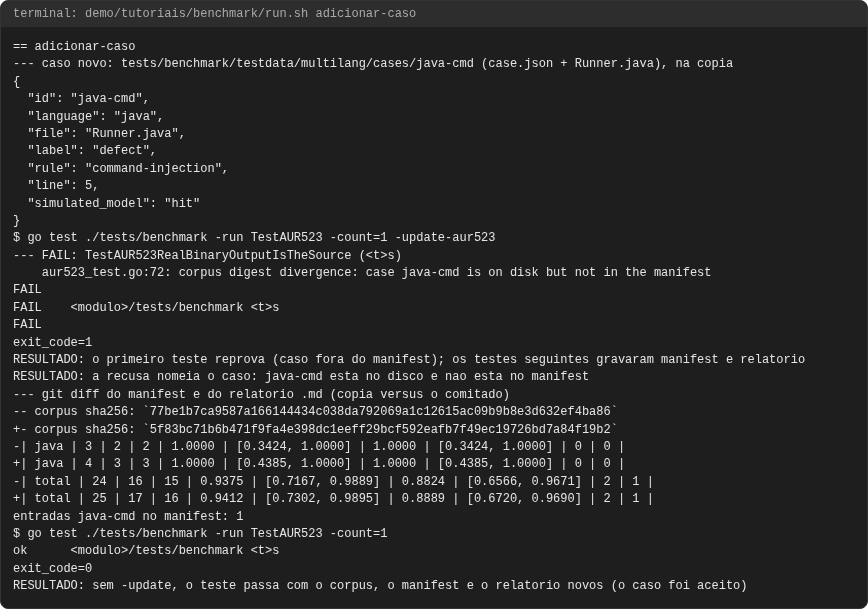
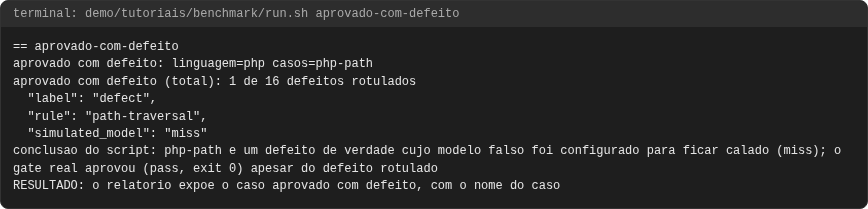
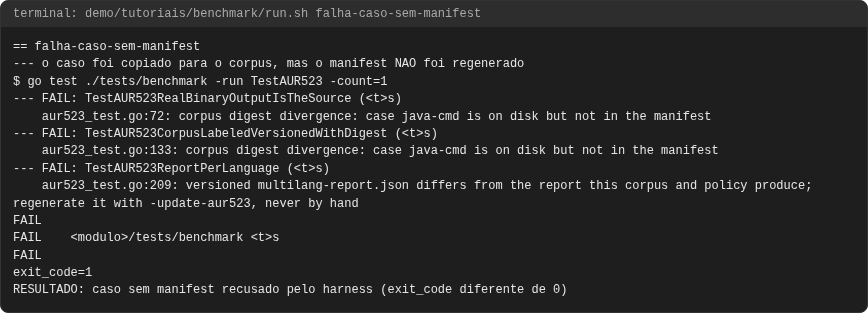
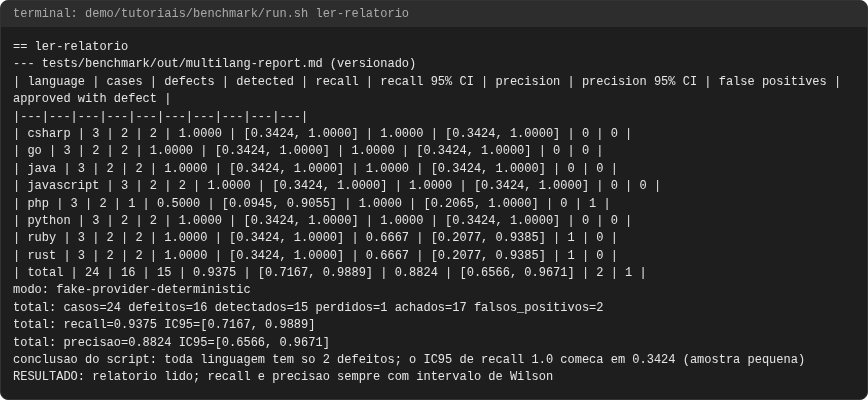
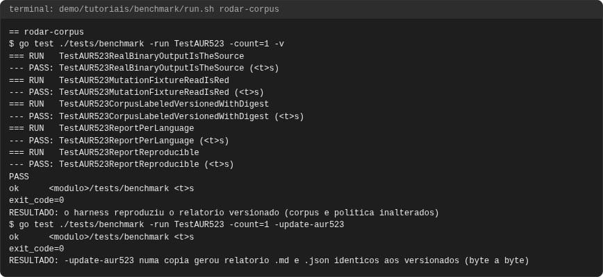

# Tutorial: o benchmark de recall do AurumCode

## Objetivo

Ao final você terá rodado o corpus de recall multilinguagem contra o gate real,
lido o relatório (recall, precisão, intervalo de confiança, "aprovado com
defeito"), adicionado um caso novo como se faz num PR e visto o harness recusar
um caso sem manifest. Também saberá o que a rodada com modelo real significa e
por que ela **não** foi executada aqui.

Cada comando e saída vêm de uma execução real, em `demo/tutoriais/benchmark/out/`,
conferida por `run.sh --check`. Linhas `RESULTADO:`, `conclusao do script:`, `modo:`
e `total:` são **do script de demonstração**, que lê o relatório JSON gerado
pelo harness.

**O que este benchmark mede.** O harness compila o binário real e executa
`aurumcode review` sobre cada caso, mas o "modelo" é um provedor falso
determinístico: cada caso declara em `case.json` se o modelo simulado acerta
(`hit`), cala (`miss`/`silent`) ou acusa algo que não existe (`false_alarm`).
Portanto os números medem o **encanamento** (binário, política, gate, SARIF,
auditoria, métricas), nunca a qualidade de um modelo.

## Pré-requisitos

- `git`, `docker`, `bash` e `python3` no host. **Go não roda no host**: o harness
  roda no container compartilhado `.board/bin/go-shared` (veja o tutorial de
  [operação](operacao.md)).
- O container no ar: `./.board/bin/go-shared up` (idempotente).
- Rode a partir de um worktree do repositório (o container monta o repositório
  e os worktrees de `/tmp/claude-1000/office-wt`).

```bash
bash demo/tutoriais/benchmark/run.sh all      # cinco casos, grava out/ (cerca de 2 min)
bash demo/tutoriais/benchmark/run.sh --check  # out/ contra expected/, sem docker
```

Os casos que alteram o corpus trabalham numa **cópia** em
`demo/tutoriais/benchmark/.estado/` (`git archive HEAD`); o repositório real
nunca muda. O container roda como root, então a demonstração devolve a posse
dos arquivos da cópia ao seu usuário (`chown`) ao final.

## Caso 1: rodar o corpus de recall com o provedor falso

```bash
./.board/bin/go-shared exec -w "$PWD" go test ./tests/benchmark -run TestAUR523 -count=1 -v
```

(o `-w "$PWD"` é o diretório do worktree). Os cinco testes do `TestAUR523`
reconstroem o relatório e o comparam com o versionado:

<!-- saida: rodar-corpus -->
```text
=== RUN   TestAUR523RealBinaryOutputIsTheSource
--- PASS: TestAUR523RealBinaryOutputIsTheSource (<t>s)
--- PASS: TestAUR523ReportReproducible (<t>s)
PASS
exit_code=0
RESULTADO: o harness reproduziu o relatorio versionado (corpus e politica inalterados)
```

Para **gerar** o relatório em vez de só compará-lo, use `-update-aur523`. A
demonstração faz isso numa cópia e compara byte a byte:

<!-- saida: rodar-corpus -->
```text
$ go test ./tests/benchmark -run TestAUR523 -count=1 -update-aur523
RESULTADO: -update-aur523 numa copia gerou relatorio .md e .json identicos aos versionados (byte a byte)
```

O que observar: tempos de `go test` variam e a demonstração os troca por
`<t>s` e o caminho do módulo por `<modulo>`, só no registro. O relatório gerado
é o versionado em `tests/benchmark/out/multilang-report.md` e `.json` (sem
data, caminho nem duração: mesmo corpus e política, mesmo relatório, byte a
byte).

A política central que o corpus usa (cada seção `##` é uma regra que o modelo
simulado cita):

<!-- arquivo: tests/benchmark/testdata/multilang/policy/.aurumcode/skills/seguranca.md -->
```markdown
# Security policy (benchmark)

## SQL Injection
severity: error
Never build a SQL statement by concatenating or formatting untrusted input; use bound parameters.

## Command Injection
severity: error
Never pass untrusted input to a shell or to a process launcher as a single command string.

## Weak Hash
severity: error
Never use MD5 or SHA-1 for passwords or integrity of secrets; use a password hashing function.

## Path Traversal
severity: error
Never join untrusted input into a filesystem path without confining it to a base directory.
```

## Caso 2: ler o relatório

<!-- saida: ler-relatorio -->
```text
| language | cases | defects | detected | recall | recall 95% CI | precision | precision 95% CI | false positives | approved with defect |
| csharp | 3 | 2 | 2 | 1.0000 | [0.3424, 1.0000] | 1.0000 | [0.3424, 1.0000] | 0 | 0 |
| php | 3 | 2 | 1 | 0.5000 | [0.0945, 0.9055] | 1.0000 | [0.2065, 1.0000] | 0 | 1 |
| ruby | 3 | 2 | 2 | 1.0000 | [0.3424, 1.0000] | 0.6667 | [0.2077, 0.9385] | 1 | 0 |
| total | 24 | 16 | 15 | 0.9375 | [0.7167, 0.9889] | 0.8824 | [0.6566, 0.9671] | 2 | 1 |
modo: fake-provider-deterministic
total: casos=24 defeitos=16 detectados=15 perdidos=1 achados=17 falsos_positivos=2
total: recall=0.9375 IC95=[0.7167, 0.9889]
total: precisao=0.8824 IC95=[0.6566, 0.9671]
conclusao do script: toda linguagem tem so 2 defeitos; o IC95 de recall 1.0 comeca em 0.3424 (amostra pequena)
RESULTADO: relatorio lido; recall e precisao sempre com intervalo de Wilson
```

Como ler:

- **recall** = defeitos detectados / defeitos rotulados; **precisão** = achados
  corretos / achados. Achados da mesma classe de regra e linha vindos da skill
  de política e da análise embutida contam como um só.
- **IC 95%** é o intervalo de Wilson. Com 2 defeitos por linguagem, "recall
  1.0" tem limite inferior 0.3424: ele **não** prova que a linguagem está
  coberta. Só o total (16 defeitos) tem intervalo estreito o bastante para
  comparar rodadas.
- **falsos positivos** (ruby, rust) vêm de casos limpos cujo modelo simulado
  é `false_alarm`; existem para exercitar o contador.
- **aprovado com defeito** conta defeitos rotulados que o gate deixou passar
  (decisão `pass`, exit 0): é o pior erro de um gate, por isso tem coluna
  própria (caso 3).

## Caso 3: "aprovado com defeito"

<!-- saida: aprovado-com-defeito -->
```text
aprovado com defeito: linguagem=php casos=php-path
aprovado com defeito (total): 1 de 16 defeitos rotulados
  "rule": "path-traversal",
  "simulated_model": "miss"
conclusao do script: php-path e um defeito de verdade cujo modelo falso foi configurado para ficar calado (miss); o gate real aprovou (pass, exit 0) apesar do defeito rotulado
RESULTADO: o relatorio expoe o caso aprovado com defeito, com o nome do caso
```

O que observar: o relatório **nomeia** o caso. Aqui a causa é o modelo
simulado em `miss`: o gate real, sem achado, aprova. Em outros casos `miss` o
relatório mostra o defeito detectado mesmo assim (por exemplo `java-sqli` é
`miss` e a linha de Java tem recall 1.0), porque a análise embutida do produto
o achou; o `php-path` não tem essa segunda rede.

## Caso 4: adicionar um caso por PR

O passo a passo, numa cópia (`demo/tutoriais/benchmark/caso-novo/`):

1. Crie `tests/benchmark/testdata/multilang/cases/<id>/` com `case.json` e o
   arquivo-fonte (pequeno, sintético; o id é o nome do diretório):

<!-- arquivo: demo/tutoriais/benchmark/caso-novo/case.json -->
```json
{
  "id": "java-cmd",
  "language": "java",
  "file": "Runner.java",
  "label": "defect",
  "rule": "command-injection",
  "line": 5,
  "simulated_model": "hit"
}
```

<!-- arquivo: demo/tutoriais/benchmark/caso-novo/Runner.java -->
```java
import java.io.IOException;

public class Runner {
    Process run(String host) throws IOException {
        return Runtime.getRuntime().exec("ping -c 1 " + host);
    }
}
```

2. Regenere manifest e relatório pelo harness, nunca à mão:

```bash
./.board/bin/go-shared exec -w "$PWD" go test ./tests/benchmark -run TestAUR523 -count=1 -update-aur523
```

<!-- saida: adicionar-caso -->
```text
$ go test ./tests/benchmark -run TestAUR523 -count=1 -update-aur523
--- FAIL: TestAUR523RealBinaryOutputIsTheSource (<t>s)
exit_code=1
RESULTADO: o primeiro teste reprova (caso fora do manifest); os testes seguintes gravaram manifest e relatorio
RESULTADO: a recusa nomeia o caso: java-cmd esta no disco e nao esta no manifest
```

**Achado: este comando sai com exit 1 na primeira vez que se acrescenta um
caso**, embora faça o trabalho. O primeiro teste (`...RealBinaryOutputIsTheSource`)
confere o manifest antes de o teste que o regrava rodar; os testes seguintes
regravam `manifest.json` e o relatório na mesma execução. O `docs/benchmark.md`
descreve `-update-aur523` sem esta ressalva.

3. Rode de novo **sem** `-update-aur523` e confira o diff:

<!-- saida: adicionar-caso -->
```text
-- corpus sha256: `77be1b7ca9587a166144434c038da792069a1c12615ac09b9b8e3d632ef4ba86`
+- corpus sha256: `5f83bc71b6b471f9fa4e398dc1eeff29bcf592eafb7f49ec19726bd7a84f19b2`
-| java | 3 | 2 | 2 | 1.0000 | [0.3424, 1.0000] | 1.0000 | [0.3424, 1.0000] | 0 | 0 |
+| java | 4 | 3 | 3 | 1.0000 | [0.4385, 1.0000] | 1.0000 | [0.4385, 1.0000] | 0 | 0 |
+| total | 25 | 17 | 16 | 0.9412 | [0.7302, 0.9895] | 0.8889 | [0.6720, 0.9690] | 2 | 1 |
entradas java-cmd no manifest: 1
exit_code=0
RESULTADO: sem -update, o teste passa com o corpus, o manifest e o relatorio novos (o caso foi aceito)
```

4. Commite o caso, o `manifest.json` e o relatório gerado. O teste falha se o
   relatório não for exatamente o que o corpus e a política produzem.

O que observar: acrescentar 1 defeito em Java move o intervalo de Java de
[0.3424, 1.0] para [0.4385, 1.0]: mais amostra, intervalo mais estreito. O
`corpus sha256` do cabeçalho muda junto com o corpus.

## Quando falha: caso sem manifest é recusado

Copiar o caso para o corpus **sem** regenerar o manifest:

<!-- saida: falha-caso-sem-manifest -->
```text
$ go test ./tests/benchmark -run TestAUR523 -count=1
--- FAIL: TestAUR523RealBinaryOutputIsTheSource (<t>s)
--- FAIL: TestAUR523CorpusLabeledVersionedWithDigest (<t>s)
exit_code=1
RESULTADO: caso sem manifest recusado pelo harness (exit_code diferente de 0)
```

O que observar: o harness recalcula o sha256 de cada caso e **recusa** caso
acrescentado, alterado ou removido sem manifest correspondente (também
`...ReportPerLanguage` reprova). A mensagem exata ("case java-cmd is on disk
but not in the manifest") aparece no caso 4.

## A rodada com modelo real

**Não foi executada nesta entrega.** É decisão e gasto do dono e não faz parte
do relatório versionado nem do CI. O que ela significaria: trocar o provedor
falso por um modelo real (`LLM_API_KEY`, `LLM_BASE_URL`) sobre PRs rotulados e
registrar falsos positivos, defeitos perdidos e repetição de cobranças. Só
essa rodada permitiria afirmar recall ou precisão **de um modelo**; os números
deste tutorial não permitem. Qualquer conclusão dela deve respeitar o
intervalo de Wilson e o tamanho da amostra (veja `docs/benchmark.md`, "Limitações").

## Problemas comuns

- **`go-shared: aurum-go is not up`.** Rode `./.board/bin/go-shared up`; sem
  container, o exit é 69. Go nunca roda no host.
- **"O relatório diverge do versionado."** Corpus ou política mudaram sem
  regenerar. Rode com `-update-aur523` (o exit 1 da primeira vez é esperado,
  caso 4) e depois sem a flag.
- **Arquivos com dono root na cópia.** O container é root; use
  `go-shared exec chown -R "$(id -u):$(id -g)" <dir>` (a demonstração faz isso).
- **"Recall 1.0 numa linguagem, está coberto?"** Não: veja o intervalo.
- **Não demonstrado aqui:** rodada com modelo real e o ciclo completo de PR
  (commit e revisão do caso novo).

<!-- capturas:inicio (gerado por scripts/docs/capturas.sh; nao editar a mao) -->
## Como fica

Capturas geradas por scripts/docs/capturas.sh a partir das saídas gravadas em demo/tutoriais/benchmark/out/: o terminal de cada caso e, quando o caso publica, o comentario do PR e os status checks. O manifesto docs/assets/capturas/capturas.json registra o digest de cada insumo.

### adicionar-caso



### aprovado-com-defeito



### falha-caso-sem-manifest



### ler-relatorio



### rodar-corpus



<!-- capturas:fim -->
