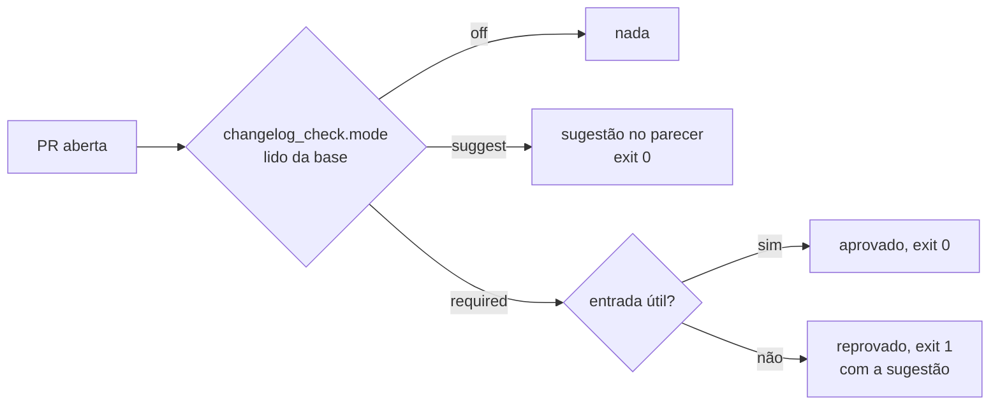
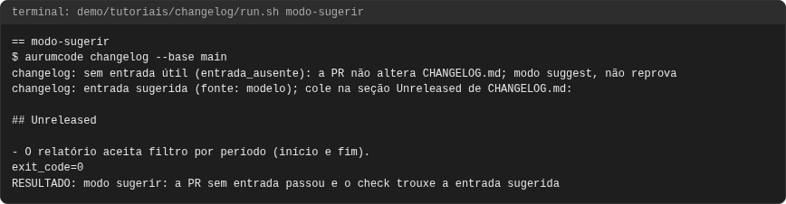
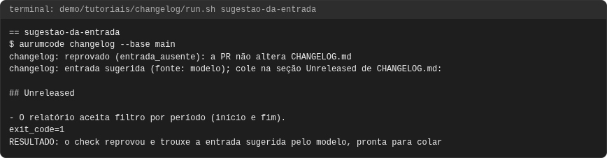

# Tutorial: changelog

## Objetivo

Ver, com comandos reais, o que o `aurumcode changelog` faz em cada modo:
`required` aprova a PR com entrada útil e reprova a PR sem ela, sempre
trazendo a entrada sugerida; `suggest` só sugere e nunca reprova; `off` não
faz nada. São oito casos, todos sem rede e com um modelo falso.



Referência curta dos modos:
[configuração do changelog](../configuration.md#changelog-obrigatorio-aur-509).
Como escrever uma boa entrada: [guia de changelog](../changelog.md).

## Pré-requisitos

- `git`, `docker`, `bash` e `python3`; nada roda no seu host além deles.
- A imagem do produto, construída do `Dockerfile` da raiz.
- Rede **não** é necessária: o modelo é falso e responde de um arquivo.

```bash
bash demo/tutoriais/changelog/run.sh all      # oito casos; grava out/
bash demo/tutoriais/changelog/run.sh --check  # compara out/ com expected/
```

## A configuração

O repositório de exemplo exige a entrada (todos os casos menos o 7):

<!-- arquivo: demo/tutoriais/changelog/repo-exemplo/base/.aurumcode/config.yml -->
```yaml
changelog_check:
  mode: required
```

O `CHANGELOG.md` da base:

<!-- arquivo: demo/tutoriais/changelog/repo-exemplo/base/CHANGELOG.md -->
```markdown
# Changelog

## Unreleased

- O relatório mostra o total de pedidos por cliente.

## 1.0.0 - 2026-09-01

- Primeira versão do serviço de pedidos.
```

O caso 7 usa uma base igual, com `mode: sugerir` (sinônimo de `suggest`).

## Caso 1: entrada válida

A PR muda `app.py` e acrescenta uma linha em `Unreleased`:

<!-- arquivo: demo/tutoriais/changelog/repo-exemplo/entrada/CHANGELOG.md -->
```markdown
# Changelog

## Unreleased

- O relatório aceita filtro por período (início e fim).
- O relatório mostra o total de pedidos por cliente.

## 1.0.0 - 2026-09-01

- Primeira versão do serviço de pedidos.
```

```bash
aurumcode changelog --base main
```

<!-- saida: entrada-valida -->
```text
$ aurumcode changelog --base main
changelog: aprovado (entrada_valida): 1 linha(s) nova(s) em Unreleased, 0 em notas de versão
exit_code=0
RESULTADO: a PR acrescentou uma entrada util em Unreleased e o check aprovou
```

O que observar: uma linha nova, escrita para quem usa o serviço, basta.

## Caso 2: consolidar uma release

A linha sai de `Unreleased` para a seção da versão e ganha um resumo:

<!-- arquivo: demo/tutoriais/changelog/repo-exemplo/release/CHANGELOG.md -->
```markdown
# Changelog

## Unreleased

## 1.1.0 - 2026-10-07

Destaques: o relatório de pedidos agora soma por cliente.

- O relatório mostra o total de pedidos por cliente.

## 1.0.0 - 2026-09-01

- Primeira versão do serviço de pedidos.
```

<!-- saida: consolidar-release -->
```text
$ aurumcode changelog --base main
changelog: aprovado (entrada_valida): 0 linha(s) nova(s) em Unreleased, 1 em notas de versão
exit_code=0
RESULTADO: a consolidacao da release com resumo novo foi aprovada
```

O que observar: a linha só movida não conta; o resumo novo conta.

## Caso 3: a sugestão de release do review é outra coisa

`aurumcode review --changelog` propõe uma versão a partir dos commits. Isso
não substitui a entrada no arquivo:

```bash
aurumcode review --base main --changelog
aurumcode changelog --base main
```

<!-- saida: sugestao-separada -->
```text
$ aurumcode review --base main --changelog
Suggested release
exit_code=0
RESULTADO: o review publicou a sugestao de changelog sem decidir o merge
$ aurumcode changelog --base main
changelog: reprovado (entrada_ausente): a PR não altera CHANGELOG.md
exit_code=1
RESULTADO: a sugestao nao substitui a entrada: o check obrigatorio reprovou
```

O que observar: o review sugere; quem decide em `required` é o check.

## Caso 4: a PR tenta desligar o modo

<!-- arquivo: demo/tutoriais/changelog/repo-exemplo/desliga/.aurumcode/config.yml -->
```yaml
changelog_check:
  mode: off
```

<!-- saida: pr-desliga-o-modo -->
```text
$ aurumcode changelog --base main
changelog: reprovado (entrada_ausente): a PR não altera CHANGELOG.md
exit_code=1
RESULTADO: o modo foi lido da base; a PR que o desliga continua sujeita ao check
```

O que observar: o modo vem da base. Mudar o modo na PR só vale depois do merge.

## Caso 5: log de agente não é entrada

<!-- arquivo: demo/tutoriais/changelog/repo-exemplo/log-de-agente/CHANGELOG.md -->
```markdown
# Changelog

## Unreleased

- Filtro por período: AUR-123/AC-001/pass, go test verde, 2 arquivos alterados.
- O relatório mostra o total de pedidos por cliente.

## 1.0.0 - 2026-09-01

- Primeira versão do serviço de pedidos.
```

<!-- saida: log-de-agente -->
```text
$ aurumcode changelog --base main
changelog: reprovado (log_de_agente): linha 5 parece log de agente ou de ferramenta ("/pass")
exit_code=1
RESULTADO: a linha com log de agente foi recusada
```

O que observar: saída de ferramenta (`/pass`, `go test verde`) é recusada.

## Quando falha: PR sem entrada

A PR muda o código e não toca no `CHANGELOG.md`:

<!-- saida: falha-entrada-ausente -->
```text
$ aurumcode changelog --base main
changelog: reprovado (entrada_ausente): a PR não altera CHANGELOG.md
exit_code=1
RESULTADO: sem entrada no CHANGELOG.md o check reprova
```

## Caso 6: a entrada sugerida, pronta para colar

A mesma PR, agora com um modelo configurado. Ele recebe só os caminhos
alterados e os assuntos dos commits e responde neste formato:

<!-- arquivo: demo/tutoriais/changelog/fixture-sugestao.json -->
```json
{"entry": ["O relatório aceita filtro por período (início e fim)."]}
```

<!-- saida: sugestao-da-entrada -->
```text
$ aurumcode changelog --base main
changelog: reprovado (entrada_ausente): a PR não altera CHANGELOG.md
changelog: entrada sugerida (fonte: modelo); cole na seção Unreleased de CHANGELOG.md:
## Unreleased
- O relatório aceita filtro por período (início e fim).
exit_code=1
RESULTADO: o check reprovou e trouxe a entrada sugerida pelo modelo, pronta para colar
```

O que observar: continua reprovando, mas o bloco já vem pronto para colar.
Sem modelo, a sugestão sai dos assuntos dos commits.

## Caso 7: só sugerir, sem reprovar

Com `mode: sugerir` na base, a mesma PR sem entrada **passa** e recebe a
sugestão. Na PR do GitHub, o mesmo bloco aparece no parecer do AurumCode.

<!-- saida: modo-sugerir -->
```text
$ aurumcode changelog --base main
changelog: sem entrada útil (entrada_ausente): a PR não altera CHANGELOG.md; modo suggest, não reprova
changelog: entrada sugerida (fonte: modelo); cole na seção Unreleased de CHANGELOG.md:
## Unreleased
- O relatório aceita filtro por período (início e fim).
exit_code=0
RESULTADO: modo sugerir: a PR sem entrada passou e o check trouxe a entrada sugerida
```

O que observar: exit 0. Use este modo para criar o hábito sem travar ninguém.

## Problemas comuns

- `indeterminado: não foi possível obter o diff`: a base não está no clone;
  no CI use `fetch-depth: 0` (o workflow reutilizável já usa).
- `sem_informacao_nova` numa release: escreva um resumo curto na seção da
  versão.
- `entrada_longa`: resuma; o limite é `max_entry_lines` e `max_line_length`.
- `changelog: não exigido`: a base está em `off` (ou sem a seção).

<!-- capturas:inicio (gerado por scripts/docs/capturas.sh; nao editar a mao) -->
## Como fica

Capturas geradas por scripts/docs/capturas.sh a partir das saídas gravadas em demo/tutoriais/changelog/out/: o terminal de cada caso e, quando o caso publica, o comentario do PR e os status checks. O manifesto docs/assets/capturas/capturas.json registra o digest de cada insumo.

### consolidar-release


### entrada-valida


### falha-entrada-ausente


### log-de-agente


### modo-sugerir



### pr-desliga-o-modo


### sugestao-da-entrada



### sugestao-separada


<!-- capturas:fim -->
