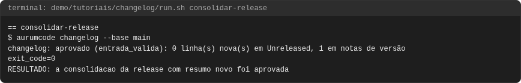
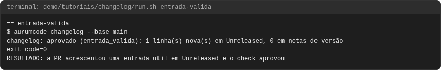
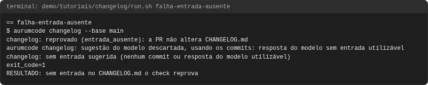
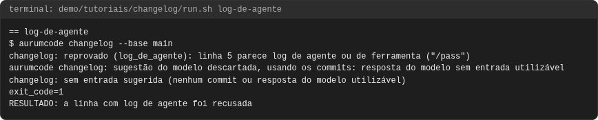
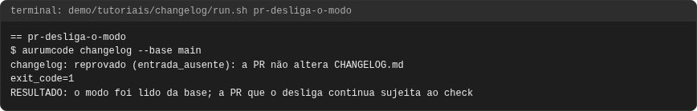
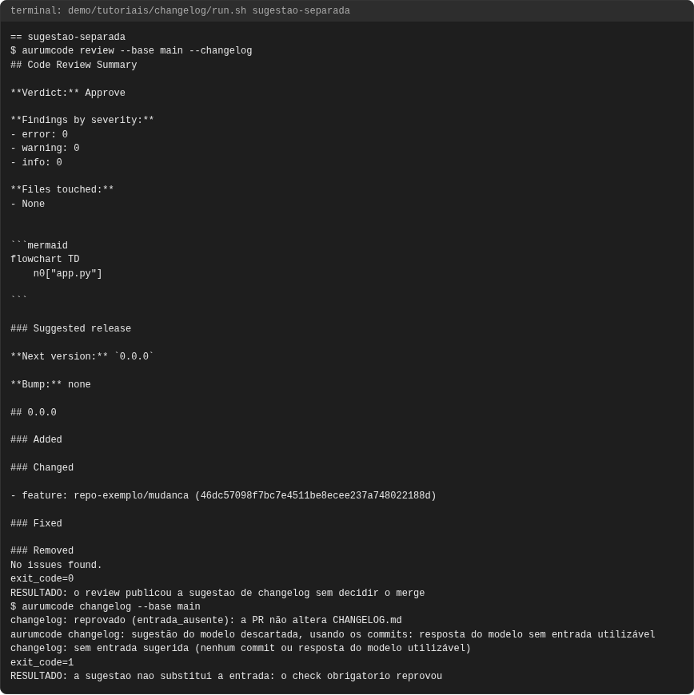
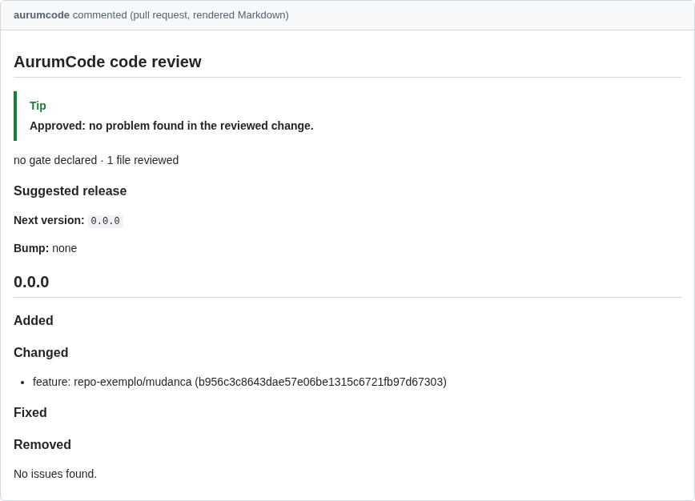

# Tutorial: changelog obrigatório

## Objetivo

Ao final você terá visto o check `aurumcode changelog` aprovar e reprovar
pull requests pelo `CHANGELOG.md`: a entrada útil em `Unreleased` passa; a
consolidação de uma release com resumo passa; a sugestão do review continua
separada e não decide o merge; a PR que tenta desligar o modo no próprio
`config.yml` continua sujeita a ele; log de agente colado no changelog é
recusado; a PR sem entrada reprova; e, ao reprovar, o check traz a entrada
sugerida, pronta para colar.

O veredito é determinístico: compara o arquivo da base (`main`) com o da PR
(`feature`); o modelo só escreve a sugestão, nunca aprova nem reprova. A referência completa está em
[Changelog obrigatório](../configuration.md#changelog-obrigatorio-aur-509) e o
guia de escrita em [Changelog obrigatório](../changelog.md).

Cada comando e cada saída vêm de uma execução real, registrada em
`demo/tutoriais/changelog/out/` e conferida por `run.sh --check`. Os blocos de
configuração **são os arquivos de `demo/tutoriais/changelog/`**, byte a byte.

## Pré-requisitos

- `git`, `docker`, `bash` e `python3`. Nada mais roda no seu host.
- A imagem do produto, construída do `Dockerfile` da raiz.
- Rede **não** é necessária: a demonstração roda com `--network none` e com o
  provedor de modelo falso (`AURUMCODE_LLM_FIXTURE`), que serve a sugestão do
  review (caso 3) e a entrada sugerida (caso 6).

```bash
bash demo/tutoriais/changelog/run.sh all      # sete casos; grava out/
bash demo/tutoriais/changelog/run.sh --check  # compara out/ com expected/, sem docker
```

## A configuração

O repositório exige a entrada:

<!-- arquivo: demo/tutoriais/changelog/repo-exemplo/base/.aurumcode/config.yml -->
```yaml
changelog_check:
  mode: required
```

O `CHANGELOG.md` da base já tem a seção `Unreleased`:

<!-- arquivo: demo/tutoriais/changelog/repo-exemplo/base/CHANGELOG.md -->
```markdown
# Changelog

## Unreleased

- O relatório mostra o total de pedidos por cliente.

## 1.0.0 - 2026-09-01

- Primeira versão do serviço de pedidos.
```

No GitHub, o mesmo comando roda pelo workflow reutilizável
`.github/workflows/changelog.yml`, e o contexto **Changelog obrigatório** vira
required check da `main` (veja a [referência](../configuration.md#changelog-obrigatorio-aur-509)).

## Caso 1: entrada válida

A PR muda `app.py` e acrescenta uma linha em `Unreleased`, escrita para quem
usa o serviço:

<!-- arquivo: demo/tutoriais/changelog/repo-exemplo/entrada/CHANGELOG.md -->
```markdown
# Changelog

## Unreleased

- O relatório aceita filtro por período (início e fim).
- O relatório mostra o total de pedidos por cliente.

## 1.0.0 - 2026-09-01

- Primeira versão do serviço de pedidos.
```

```bash
aurumcode changelog --base main
```

<!-- saida: entrada-valida -->
```text
$ aurumcode changelog --base main
changelog: aprovado (entrada_valida): 1 linha(s) nova(s) em Unreleased, 0 em notas de versão
exit_code=0
RESULTADO: a PR acrescentou uma entrada util em Unreleased e o check aprovou
```

## Caso 2: consolidar uma release

Na PR de release, a linha de `Unreleased` passa para a seção da versão e ganha
um resumo. A linha só movida não conta como informação nova; o resumo conta:

<!-- arquivo: demo/tutoriais/changelog/repo-exemplo/release/CHANGELOG.md -->
```markdown
# Changelog

## Unreleased

## 1.1.0 - 2026-10-07

Destaques: o relatório de pedidos agora soma por cliente.

- O relatório mostra o total de pedidos por cliente.

## 1.0.0 - 2026-09-01

- Primeira versão do serviço de pedidos.
```

<!-- saida: consolidar-release -->
```text
$ aurumcode changelog --base main
changelog: aprovado (entrada_valida): 0 linha(s) nova(s) em Unreleased, 1 em notas de versão
exit_code=0
RESULTADO: a consolidacao da release com resumo novo foi aprovada
```

## Caso 3: a sugestão do review fica separada

`aurumcode review --changelog` (ou `review.changelog: on`) propõe uma versão e
um texto a partir dos commits revisados. É só sugestão: o check obrigatório
continua exigindo a entrada no arquivo.

```bash
aurumcode review --base main --changelog
aurumcode changelog --base main
```

<!-- saida: sugestao-separada -->
```text
$ aurumcode review --base main --changelog
Suggested release
exit_code=0
RESULTADO: o review publicou a sugestao de changelog sem decidir o merge
$ aurumcode changelog --base main
changelog: reprovado (entrada_ausente): a PR não altera CHANGELOG.md
exit_code=1
RESULTADO: a sugestao nao substitui a entrada: o check obrigatorio reprovou
```

## Caso 4: a PR tenta desligar o modo

A PR troca o modo para `off` no próprio `config.yml` e não escreve entrada:

<!-- arquivo: demo/tutoriais/changelog/repo-exemplo/desliga/.aurumcode/config.yml -->
```yaml
changelog_check:
  mode: off
```

O modo é lido do `config.yml` da base, então a mudança só valeria depois do
merge:

<!-- saida: pr-desliga-o-modo -->
```text
$ aurumcode changelog --base main
changelog: reprovado (entrada_ausente): a PR não altera CHANGELOG.md
exit_code=1
RESULTADO: o modo foi lido da base; a PR que o desliga continua sujeita ao check
```

## Caso 5: log de agente não é entrada

<!-- arquivo: demo/tutoriais/changelog/repo-exemplo/log-de-agente/CHANGELOG.md -->
```markdown
# Changelog

## Unreleased

- Filtro por período: AUR-123/AC-001/pass, go test verde, 2 arquivos alterados.
- O relatório mostra o total de pedidos por cliente.

## 1.0.0 - 2026-09-01

- Primeira versão do serviço de pedidos.
```

<!-- saida: log-de-agente -->
```text
$ aurumcode changelog --base main
changelog: reprovado (log_de_agente): linha 5 parece log de agente ou de ferramenta ("/pass")
exit_code=1
RESULTADO: a linha com log de agente foi recusada
```

## Quando falha: PR sem entrada

A PR muda o código e não toca no `CHANGELOG.md`:

<!-- saida: falha-entrada-ausente -->
```text
$ aurumcode changelog --base main
changelog: reprovado (entrada_ausente): a PR não altera CHANGELOG.md
exit_code=1
RESULTADO: sem entrada no CHANGELOG.md o check reprova
```

## Caso 6: a entrada sugerida, pronta para colar

A mesma PR sem entrada continua reprovada, mas o check imprime a entrada
sugerida pelo modelo configurado. O modelo recebe só os caminhos alterados e
os assuntos dos commits e responde neste formato (aqui, o modelo falso):

<!-- arquivo: demo/tutoriais/changelog/fixture-sugestao.json -->
```json
{"entry": ["O relatório aceita filtro por período (início e fim)."]}
```

<!-- saida: sugestao-da-entrada -->
```text
$ aurumcode changelog --base main
changelog: reprovado (entrada_ausente): a PR não altera CHANGELOG.md
changelog: entrada sugerida (fonte: modelo); cole na seção Unreleased de CHANGELOG.md:
## Unreleased
- O relatório aceita filtro por período (início e fim).
exit_code=1
RESULTADO: o check reprovou e trouxe a entrada sugerida pelo modelo, pronta para colar
```

Sem modelo, a sugestão vem dos assuntos dos commits (fonte `commits`), sem
merges, `fixup!` nem linhas de log de agente. No GitHub, o mesmo bloco vai
para o resumo do job e, quando o review roda na PR, para o parecer do
AurumCode. O texto é redigido antes de sair; colar continua sendo do humano.

## Problemas comuns

- `indeterminado: não foi possível obter o diff`: a base não está no clone.
  No CI, faça checkout com `fetch-depth: 0` (o workflow reutilizável já faz).
- `sem_informacao_nova` numa PR de release: só mover linhas não conta; escreva
  um resumo curto na seção da versão.
- `entrada_longa`: a entrada passou de `max_entry_lines` linhas ou uma linha
  passou de `max_line_length` caracteres; resuma para quem usa o produto.
- `changelog: não exigido`: o `config.yml` da base não declara
  `changelog_check.mode: required`; ligar o modo numa PR vale a partir do merge.

## O que conferir

- Nenhum caso chama o modelo para decidir: o provedor falso só serve a
  sugestão do caso 3 e a entrada sugerida do caso 6.
- O texto da entrada não aparece na saída do check: ele é contado, nunca
  repetido nem obedecido.

<!-- capturas:inicio (gerado por scripts/docs/capturas.sh; nao editar a mao) -->
## Como fica

Capturas geradas por scripts/docs/capturas.sh a partir das saídas gravadas em demo/tutoriais/changelog/out/: o terminal de cada caso e, quando o caso publica, o comentario do PR e os status checks. O manifesto docs/assets/capturas/capturas.json registra o digest de cada insumo.

### consolidar-release



### entrada-valida



### falha-entrada-ausente



### log-de-agente



### pr-desliga-o-modo



### sugestao-separada





<!-- capturas:fim -->
