# Tutorial: dados de análise (`analysis_data`)

## Objetivo

O que a análise usa e envelhece (cópia da base pública OSV e as versões dos
scanners fixadas pelo projeto) é publicado todo dia como um *release* do
GitHub. A revisão só confia nesse artefato se ele existir, estiver dentro da
idade máxima e tiver todos os digests íntegros; senão o resultado é
**inconclusivo**, nunca aprovado. Ao final você terá visto, com o binário real
do produto:

1. que `analysis_data` **não declarado** não faz requisição nenhuma, e que
   declarado consulta, verifica e registra digest e data na auditoria;
2. um artefato **vencido** (`analysis_data_stale`) com `gate.inconclusive:
   block` e com `warn`;
3. o **cache**: com a listagem fora do ar, a cópia verificada é usada e
   declarada como tal;
4. o **workflow agendado** que publica (conferência estática do arquivo);
5. quando falha: artefato **adulterado** (`analysis_data_digest_mismatch`) e
   fonte **indisponível** (`analysis_data_unavailable`).

Cada saída abaixo vem de uma execução real, registrada em
`demo/tutoriais/dados-de-analise/out/` e conferida por `run.sh --check`. Os
blocos de configuração **são os arquivos de `demo/tutoriais/dados-de-analise/`**,
byte a byte (`tests/acceptance/AUR-563.sh` compara).

### Como a demonstração prova isso sem GitHub

O `review` consulta o endereço da API do GitHub que vem da variável
`AURUMCODE_GITHUB_API_URL` (padrão `https://api.github.com`; só `https://`, ou
`http://` para um IP de loopback literal, como em teste). É a mesma variável
do cliente de PR. Para provar cada desfecho com o binário real, cada caso roda
**um container** da imagem do produto, sem rede (`--network none`), em que:

- `AURUMCODE_GITHUB_API_URL=http://127.0.0.1:8080` aponta para o servidor
  local do próprio container: sem DNS, sem CA, sem TLS de demonstração;
- `servidor-local.py` (Python, só biblioteca padrão) atende como a API de
  *releases*, na porta 8080, servindo a lista, o `manifest.json` e o
  `scanners.yml`, no modo pedido pelo caso;
- ao final, `dentro.sh` lista as requisições que o servidor recebeu: é a prova de
  "zero rede" ou de qual caminho a revisão percorreu. O caso "sem rede" não
  define a variável: o padrão não tem rota no container.

Isso prova o comportamento do cliente do produto contra o **formato** do
GitHub que o código espera (o mesmo que o teste em Go
`cmd/aurumcode/aur533_test.go` usa). Não é o GitHub de verdade.

## Pré-requisitos

- `git`, `docker`, `bash` e `python3` no host. Nada mais.
- A imagem do produto, construída do `Dockerfile` da raiz:

```bash
docker build -t aurumcode:local /caminho/para/AurumCode
```

- O provedor de modelo é um arquivo determinístico (nenhuma credencial):

<!-- arquivo: demo/tutoriais/dados-de-analise/fixture-llm.json -->
```json
{"issues":[]}
```

### Rodar a demonstração

```bash
bash demo/tutoriais/dados-de-analise/run.sh all      # executa os seis casos e grava out/
bash demo/tutoriais/dados-de-analise/run.sh --check  # compara out/ com expected/, sem docker
```

Cada caso cria um repositório descartável em
`demo/tutoriais/dados-de-analise/.estado/` (ignorado pelo git): `main` com
`app.go` e a branch `feature` com uma mudança trivial e a configuração do
caso. Em uso real a configuração mora em `.aurumcode/config.yml` do seu
repositório (ou na política central, que decide sozinha se declarar a seção).

Os arquivos de configuração dos casos:

<!-- arquivo: demo/tutoriais/dados-de-analise/config/sem-declarar/.aurumcode/config.yml -->
```yaml
gate:
  inconclusive: block
```

<!-- arquivo: demo/tutoriais/dados-de-analise/config/bloqueia/.aurumcode/config.yml -->
```yaml
analysis_data:
  repository: owner/dados-de-analise
  max_age_days: 7
gate:
  inconclusive: block
```

<!-- arquivo: demo/tutoriais/dados-de-analise/config/avisa/.aurumcode/config.yml -->
```yaml
analysis_data:
  repository: owner/dados-de-analise
  max_age_days: 7
gate:
  inconclusive: warn
```

`repository` é opcional (o padrão é o repositório que publica o artefato do
AurumCode); `max_age_days` aceita de 1 a 365 (padrão 7). `gate.inconclusive`
decide o que um resultado inconclusivo faz: `block` reprova, `warn` só
impede a aprovação.

## Caso 1: declarado ou não

Dois repositórios iguais, um sem `analysis_data` e outro com. O servidor local está no
ar nos dois, mas só o segundo o consulta. `--auditoria` grava o registro de
auditoria da execução.

```bash
aurumcode review --base main --auditoria audit.json
```

<!-- saida: declarado-ou-nao -->
```text
--- A. nao declarado (o servidor local esta no ar, mas ninguem o consulta)
$ aurumcode review --base main --auditoria audit.json
> **Approved: no problem found in the reviewed change.**
--- requisicoes recebidas pelo servidor local (modo valido): 0
exit_code=0
RESULTADO: sem analysis_data declarado o review nao fez nenhuma requisicao e nao imprimiu linha analysis_data
linhas citando analysis_data na saida do review: 0
auditoria: sem campo analysis_data
$ aurumcode review --base main --auditoria audit.json
> **Approved: no problem found in the reviewed change.**
--- requisicoes recebidas pelo servidor local (modo valido): 3
    GET /repos/owner/dados-de-analise/releases -> 200
    GET /dl/manifest.json -> 200
    GET /dl/scanners.yml -> 200
exit_code=0
RESULTADO: artefato valido: o review aprovou e registrou digest e data na auditoria
auditoria analysis_data.source: remote
auditoria analysis_data.tag: analysis-data/<timestamp>
auditoria analysis_data.generated_at: <timestamp>
auditoria analysis_data.digest: sha256:339a66c28f655d6e784598fee6b2259858279bbd2a33b01f33a1d8ee162b19c1
```

O que observar:

- **A (não declarado):** 0 requisições, nenhuma linha citando `analysis_data`
  e nenhum campo `analysis_data` na auditoria: a seção ausente muda nada.
- **B (declarado):** três requisições (listagem, manifesto, `scanners.yml`),
  veredito `Approve` e, na auditoria, `source`, `tag`, `generated_at` e o
  `digest` do conjunto. Só os arquivos `kind: scanners` são baixados num
  review; o digest do conjunto cobre os demais (a cópia OSV não é baixada).
- As datas e o digest do bloco B variam por execução (a data do artefato é
  "agora menos um dia"); o `--check` confere só as partes estáveis.
- As linhas `RESULTADO:` são conclusões do script (exit esperado e, no caso A,
  contagem de requisições zero), não saída do produto.

## Caso 2: artefato vencido

O servidor local serve um artefato gerado há 30 dias; o limite é `max_age_days: 7`.
Repare que a idade é conferida **antes** de baixar o `scanners.yml`: só duas
requisições.

```bash
aurumcode review --base main
```

<!-- saida: vencido -->
```text
--- gate.inconclusive: block
aurumcode review: policy gate: analysis_data: revisão inconclusiva (analysis_data_stale): artifact analysis-data/<timestamp> generated <timestamp> is <duracao> days old, above max_age_days=7
> **Inconclusive: this review does not approve the change.**
--- requisicoes recebidas pelo servidor local (modo vencido): 2
    GET /repos/owner/dados-de-analise/releases -> 200
    GET /dl/manifest.json -> 200
exit_code=1
RESULTADO: artefato vencido com block: o review falha (analysis_data_stale)
--- gate.inconclusive: warn
aurumcode review: policy gate: analysis_data: revisão inconclusiva (analysis_data_stale): artifact analysis-data/<timestamp> generated <timestamp> is <duracao> days old, above max_age_days=7
> **Inconclusive: this review does not approve the change.**
--- requisicoes recebidas pelo servidor local (modo vencido): 2
    GET /repos/owner/dados-de-analise/releases -> 200
    GET /dl/manifest.json -> 200
exit_code=0
RESULTADO: artefato vencido com warn: exit 0, mas a linha inconclusiva continua no parecer
```

O que observar:

- `analysis_data_stale` com a idade (30.0 dias) e o limite. Com `block` o
  review sai 1; com `warn` sai 0, mas o veredito é `Comment`, **nunca**
  `Approve`: o parecer segue sem a aprovação.
- Para aceitar dados mais velhos, a organização muda `max_age_days` (até 365);
  o repositório não afrouxa um limite que a política central declarou (isso é
  o caso 5 de [política central](politica-central.md)).

## Caso 3: cache

A primeira execução baixa e guarda a cópia em `HOME/.cache/aurumcode/analysis-data`
(a demonstração monta um diretório do host nesse lugar para que ele sobreviva
entre as execuções). Na segunda, a listagem de *releases* responde 503: a
cópia em cache é **revalidada** (manifesto contra si mesmo, digest de cada
arquivo, idade) e usada, e o uso fica explícito. Na terceira, sem nenhum cache
e com a listagem fora do ar, o resultado é inconclusivo.

```bash
aurumcode review --base main --auditoria audit.json
```

<!-- saida: cache -->
```text
--- 1. servidor no ar: baixa, verifica e guarda no cache
aurumcode review: gate verdict reuse unavailable (AURUMCODE_CACHE_DIR not set): this run's verdict cannot be shared with another run, and could not reuse one either
--- requisicoes recebidas pelo servidor local (modo valido): 3
    GET /repos/owner/dados-de-analise/releases -> 200
    GET /dl/manifest.json -> 200
    GET /dl/scanners.yml -> 200
exit_code=0
RESULTADO: primeira execucao: artefato remoto verificado e guardado no cache
auditoria analysis_data.source: remote
--- 2. a listagem de releases cai (HTTP 503); a copia em cache, ainda dentro da idade, e usada
aurumcode review: gate verdict reuse unavailable (AURUMCODE_CACHE_DIR not set): this run's verdict cannot be shared with another run, and could not reuse one either
aurumcode review: policy gate: analysis_data: usando cópia em cache (analysis-data/<timestamp>): a listagem de releases estava indisponível; idade e digests verificados
--- requisicoes recebidas pelo servidor local (modo indisponivel): 1
    GET /repos/owner/dados-de-analise/releases -> 503
exit_code=0
RESULTADO: listagem fora do ar com copia valida em cache: usa o cache e o declara
auditoria analysis_data.source: cache
--- 3. sem cache nenhum e a listagem fora do ar: inconclusivo
aurumcode review: gate verdict reuse unavailable (AURUMCODE_CACHE_DIR not set): this run's verdict cannot be shared with another run, and could not reuse one either
aurumcode review: policy gate: analysis_data: revisão inconclusiva (analysis_data_unavailable): GET http://127.0.0.1:8080/repos/owner/dados-de-analise/releases?[REDACTED] HTTP 503
--- requisicoes recebidas pelo servidor local (modo indisponivel): 1
    GET /repos/owner/dados-de-analise/releases -> 503
exit_code=1
RESULTADO: sem copia em cache e sem listagem: analysis_data_unavailable
```

O que observar:

- A segunda execução faz **uma** requisição (a listagem, 503) e passa: a linha
  do parecer diz `usando cópia em cache` e a auditoria registra `source: cache`
  (na primeira era `remote`). Não é falha, mas também não é silencioso.
- A cópia em cache prova integridade e frescor, **não** autenticidade perante
  o GitHub (a documentação diz o mesmo).
- Sem cache e sem listagem: `analysis_data_unavailable`, exit 1 com `block`.
- Não demonstrado aqui: o cache num runner de CI. Um runner efêmero começa sem
  cache, então lá o 503 do terceiro passo é o caminho comum, a menos que o
  diretório de cache seja persistido pelo seu pipeline.

## Caso 4: o workflow agendado que publica

O artefato nasce de `.github/workflows/analysis-data.yml`, que roda todo dia,
reconstrói e **testa** o artefato e só então publica um *release* de tag
`analysis-data/<AAAAMMDDTHHMMSSZ>`. Este caso **não executa** o workflow (ele
só existe no GitHub Actions): confere, linha a linha, que o arquivo tem o que
este texto afirma. O arquivo abaixo é uma cópia do original; o caso falha se
os dois divergirem.

<!-- arquivo: demo/tutoriais/dados-de-analise/workflow-publicador.yml -->
```yaml
name: Analysis data artifact

# AUR-533: everything the analysis uses that ages and is not a Go dependency
# (the public OSV database, the pinned scanner versions) is rebuilt on a
# schedule, tested, and only then published as an immutable GitHub Release
# tagged analysis-data/<UTC timestamp>. A failing build or test leaves the
# previous release as the newest one. The runtime refuses data older than
# analysis_data.max_age_days (default 7).

on:
  schedule:
    - cron: '17 3 * * *'
  workflow_dispatch:

concurrency:
  group: analysis-data
  cancel-in-progress: false

permissions:
  contents: read

jobs:
  build:
    name: Build and test the artifact
    runs-on: ubuntu-latest
    timeout-minutes: 120
    steps:
      - name: Checkout repository
        uses: actions/checkout@11bd71901bbe5b1630ceea73d27597364c9af683 # v4.2.2
        with:
          persist-credentials: false

      - name: Build and test with the project toolchain
        run: >-
          docker run --rm
          -v "${GITHUB_WORKSPACE}:/src"
          -w /src
          golang:1.27.1-alpine3.24@sha256:8a5910f31396cd4d89662f56c68b3ae31d374308270a1c3bd96672ee5ed43414
          sh -c 'apk add --no-cache bash >/dev/null && bash scripts/artifacts/build.sh dist'

      - name: Upload the tested artifact for the publish job
        uses: actions/upload-artifact@ea165f8d65b6e75b540449e92b4886f43607fa02 # v4.6.2
        with:
          name: analysis-data
          path: |
            dist
            dist.tests-passed
          if-no-files-found: error
          retention-days: 1

  publish:
    name: Publish the tested artifact
    needs: build
    runs-on: ubuntu-latest
    timeout-minutes: 60
    permissions:
      contents: write
    steps:
      - name: Checkout repository
        uses: actions/checkout@11bd71901bbe5b1630ceea73d27597364c9af683 # v4.2.2
        with:
          persist-credentials: false

      - name: Download the tested artifact
        uses: actions/download-artifact@d3f86a106a0bac45b974a628896c90dbdf5c8093 # v4.3.0
        with:
          name: analysis-data

      - name: Publish immutable release
        env:
          GH_TOKEN: ${{ github.token }}
          GH_REPO: ${{ github.repository }}
        run: bash scripts/artifacts/publish.sh dist
```

<!-- saida: workflow-agendado -->
```text
NAO EXECUTADO: o workflow roda so no GitHub Actions; aqui so a conferencia estatica do arquivo.
workflow-publicador.yml: identico a .github/workflows/analysis-data.yml
gatilho: schedule diario (cron 17 3 * * *)
gatilho: workflow_dispatch (disparo manual)
publish depende de build: teste falhando nao publica
so o job publish recebe contents: write
publish.sh: so aceita tag analysis-data/*
publish.sh: cria como rascunho e so depois publica (nunca fica visivel pela metade)
publish.sh: tag existente nunca e tocada
RESULTADO: o workflow tem o agendamento, o teste antes de publicar e a publicacao em duas etapas que o texto descreve (conferencia estatica; a imutabilidade do release depende de 'Immutable releases' no repositorio e NAO foi demonstrada)
```

O que observar:

- `schedule` diário e `workflow_dispatch`; o job `publish` depende de `build`
  (teste falhando mantém o release anterior como o mais novo) e só ele tem
  `contents: write`.
- `scripts/artifacts/publish.sh` cria o release como rascunho e só depois o
  publica, e nunca toca numa tag existente.
- **Não demonstrado:** que o release seja *imutável*. Isso depende de ativar
  "Immutable releases" nas configurações do repositório publicador; o script
  não consegue verificar isso.

## Quando falha

### Artefato adulterado

Dois modos: o `scanners.yml` servido não bate com o digest do manifesto, ou o
`set_digest` do manifesto não bate com a lista de arquivos.

<!-- saida: adulterado -->
```text
--- A. scanners.yml servido diferente do digest do manifesto
aurumcode review: policy gate: analysis_data: revisão inconclusiva (analysis_data_digest_mismatch): scanners.yml: expected sha256:fd430ae5426ecd17bf13c1eeb8921762667931bf0b22e388118766633420c393 (29 bytes), got sha256:2b58c9cd04047f8c9951f562d7926a8e13b01775ce2469bdecbec1be8b801fba (28 bytes): digest mismatch
--- requisicoes recebidas pelo servidor local (modo adulterado-arquivo): 3
    GET /repos/owner/dados-de-analise/releases -> 200
    GET /dl/manifest.json -> 200
    GET /dl/scanners.yml -> 200
exit_code=1
RESULTADO: arquivo adulterado: analysis_data_digest_mismatch reprova
--- B. set_digest do manifesto nao confere com a lista de arquivos
aurumcode review: policy gate: analysis_data: revisão inconclusiva (analysis_data_digest_mismatch): manifest: set_digest "sha256:0000000000000000000000000000000000000000000000000000000000000000" does not match its files (sha256:339a66c28f655d6e784598fee6b2259858279bbd2a33b01f33a1d8ee162b19c1): digest mismatch
--- requisicoes recebidas pelo servidor local (modo adulterado-manifesto): 2
    GET /repos/owner/dados-de-analise/releases -> 200
    GET /dl/manifest.json -> 200
exit_code=1
RESULTADO: manifesto adulterado: analysis_data_digest_mismatch reprova
```

O que observar: nos dois modos, `analysis_data_digest_mismatch` e exit 1. No
modo do arquivo, o conteúdo foi baixado e rejeitado (três requisições); no do
manifesto, a revisão parou antes de baixar o arquivo (duas).

### Fonte indisponível

A listagem responde 503 sem cache; depois, sem rede nenhuma (sem servidor local, o
container não tem rota); e o mesmo com `gate.inconclusive: warn`.

<!-- saida: indisponivel -->
```text
--- A. a listagem responde HTTP 503 e nao ha cache
aurumcode review: gate verdict reuse unavailable (AURUMCODE_CACHE_DIR not set): this run's verdict cannot be shared with another run, and could not reuse one either
aurumcode review: policy gate: analysis_data: revisão inconclusiva (analysis_data_unavailable): GET http://127.0.0.1:8080/repos/owner/dados-de-analise/releases?[REDACTED] HTTP 503
--- requisicoes recebidas pelo servidor local (modo indisponivel): 1
    GET /repos/owner/dados-de-analise/releases -> 503
exit_code=1
RESULTADO: listagem 503 sem cache: analysis_data_unavailable reprova
--- B. sem rede nenhuma (container sem rota, nada escuta)
aurumcode review: gate verdict reuse unavailable (AURUMCODE_CACHE_DIR not set): this run's verdict cannot be shared with another run, and could not reuse one either
aurumcode review: policy gate: analysis_data: revisão inconclusiva (analysis_data_unavailable): <detalhe de rede omitido do registro>
exit_code=1
RESULTADO: sem rede e sem cache: analysis_data_unavailable reprova
--- C. o mesmo com gate.inconclusive: warn
aurumcode review: gate verdict reuse unavailable (AURUMCODE_CACHE_DIR not set): this run's verdict cannot be shared with another run, and could not reuse one either
aurumcode review: policy gate: analysis_data: revisão inconclusiva (analysis_data_unavailable): <detalhe de rede omitido do registro>
exit_code=0
RESULTADO: sem rede com warn: exit 0, mas nunca aprovado silenciosamente
```

O que observar:

- `analysis_data_unavailable` com `block` sai 1; com `warn`, sai 0 e a linha
  inconclusiva continua no parecer.
- O detalhe do erro de rede (B e C) varia por ambiente e é trocado por
  `<detalhe de rede omitido do registro>` pelo filtro `TUT_SED` do `run.sh`,
  declarado ali. No caso do 503 o detalhe é mostrado e vem com `?[REDACTED]`
  no lugar da consulta `per_page=100`: o filtro de segredos do produto mascara
  a parte depois do `?` da URL (cosmético; ver "Achados").
- Quarto desfecho do código, `analysis_data_invalid` (manifesto ilegível ou
  com esquema desconhecido, `max_age_days` inválido), **não** tem caso
  executado aqui.

## Problemas comuns

- **`analysis_data_unavailable` em CI sem rede para o GitHub:** o `review`
  consulta o endereço público da API do GitHub e não há opção para trocá-lo.
  Em runner isolado, libere esse destino ou aceite o resultado inconclusivo.
- **`analysis_data_stale` logo depois de um feriado:** o publicador falhou ou
  não rodou; veja o histórico do workflow. Subir `max_age_days` só esconde o
  atraso.
- **Esperar que `warn` aprove:** `warn` não reprova, mas o veredito vira
  `Comment`; só um artefato íntegro e dentro da idade deixa passar a
  aprovação.
- **Repositório privado:** o token vem de `GITHUB_TOKEN`; sem ele só
  repositórios públicos são lidos (não demonstrado aqui).
- **O repositório quer outro limite:** sob política central que declara
  `analysis_data`, a seção do repositório é ignorada com aviso.

## Achados sobre o produto

- O endereço da API do GitHub do `analysis_data` vem de
  `AURUMCODE_GITHUB_API_URL` (AUR-571). O tutorial media, antes, que o endereço
  era fixo no binário e precisava de um servidor HTTPS falso com certificado próprio.
- O filtro de segredos mascara a consulta da URL de listagem
  (`releases?[REDACTED]`) nas mensagens de erro.
- A cópia em cache usada com a listagem fora do ar não é prova de
  autenticidade, só de integridade e frescor.

<!-- capturas:inicio (gerado por scripts/docs/capturas.sh; nao editar a mao) -->
## Como fica

Capturas geradas por scripts/docs/capturas.sh a partir das saídas gravadas em demo/tutoriais/dados-de-analise/out/: o terminal de cada caso e, quando o caso publica, o comentario do PR e os status checks. O manifesto docs/assets/capturas/capturas.json registra o digest de cada insumo.

### adulterado

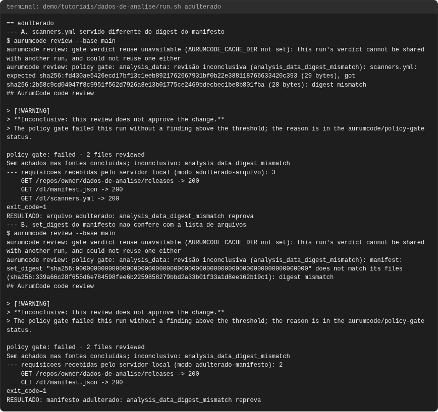

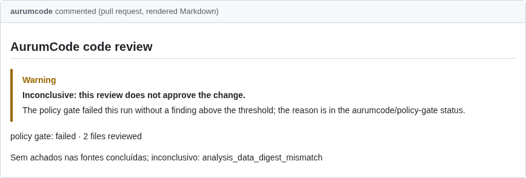

### cache

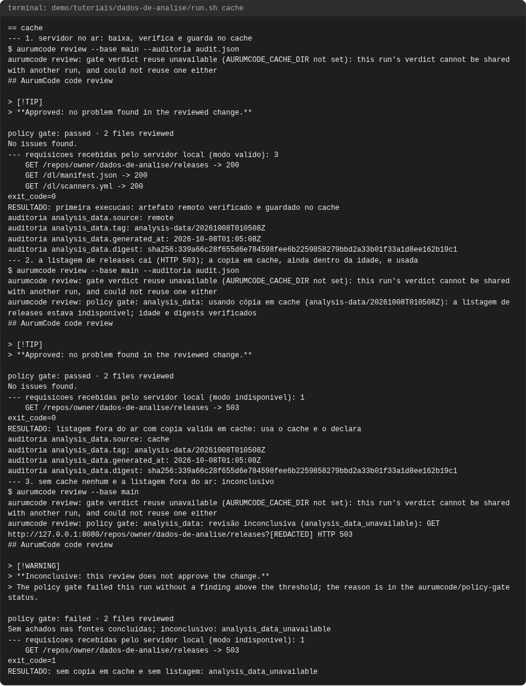

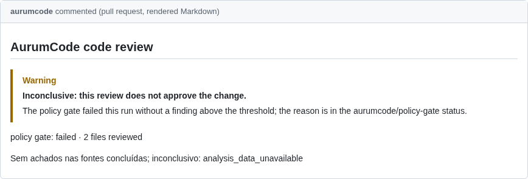

### declarado-ou-nao

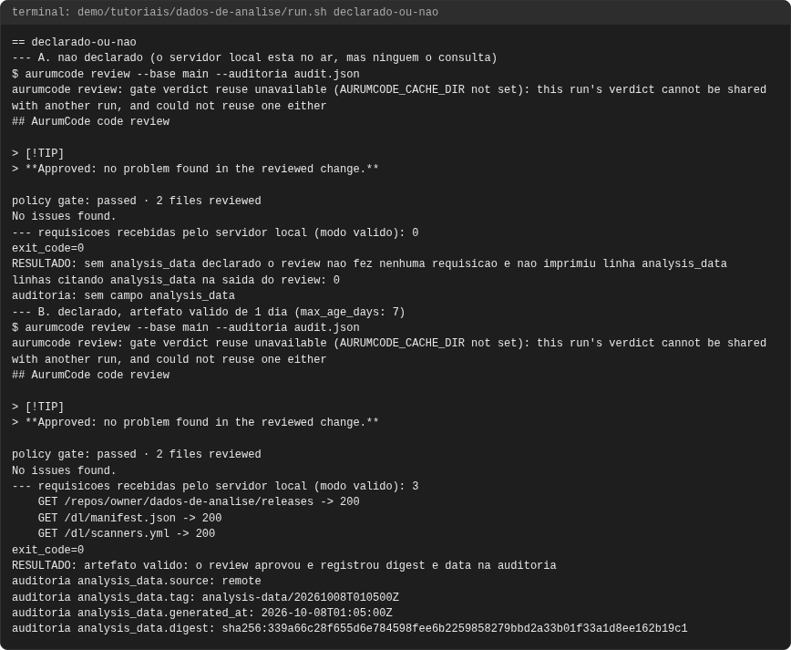

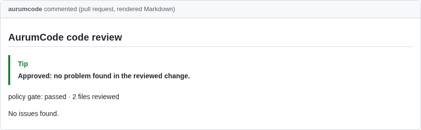

### indisponivel

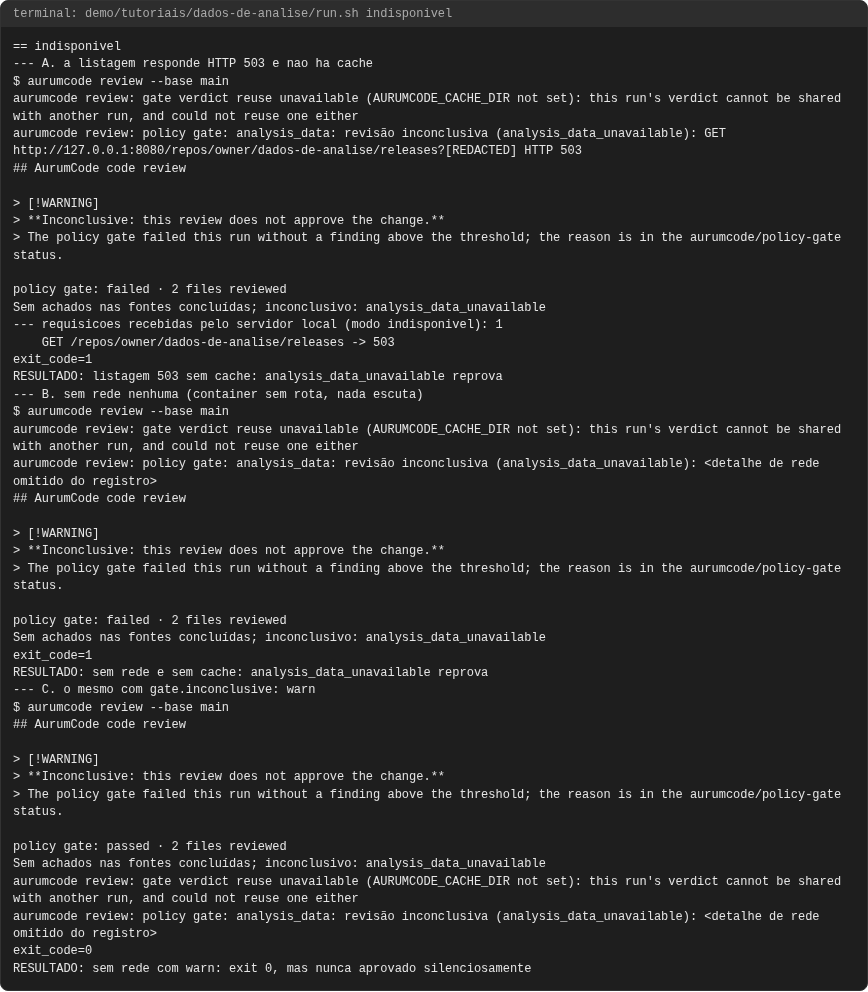

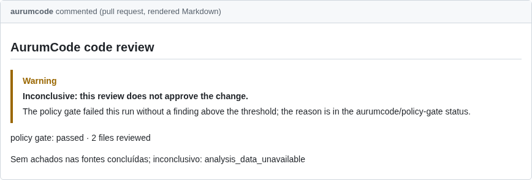

### vencido

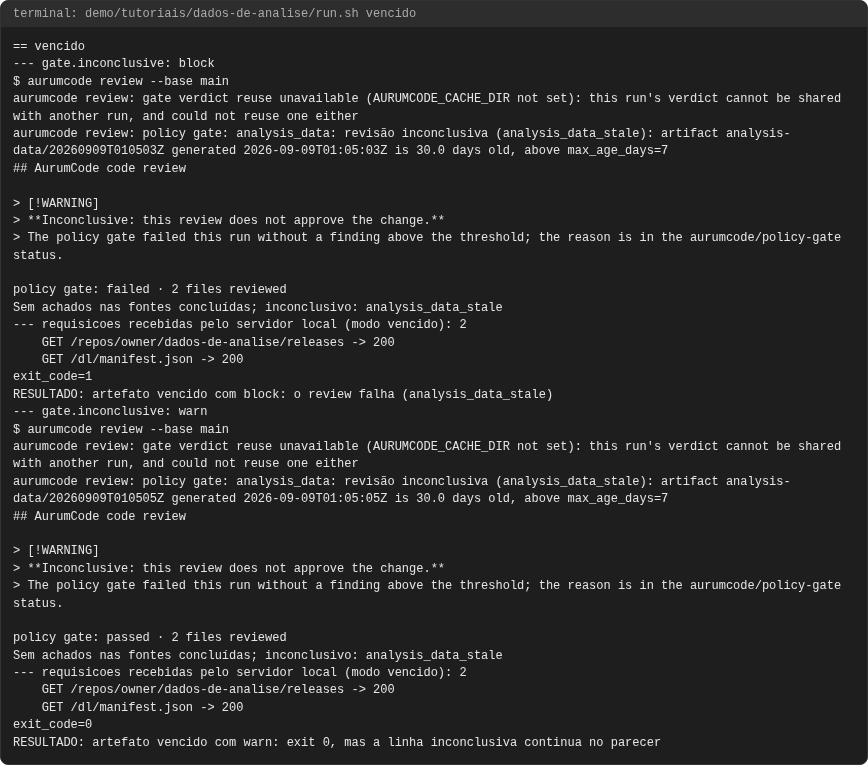

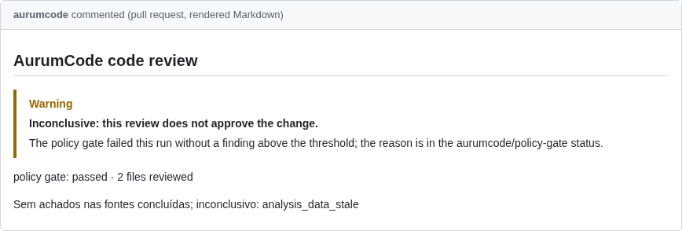

### workflow-agendado

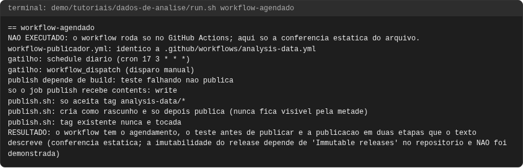

<!-- capturas:fim -->
