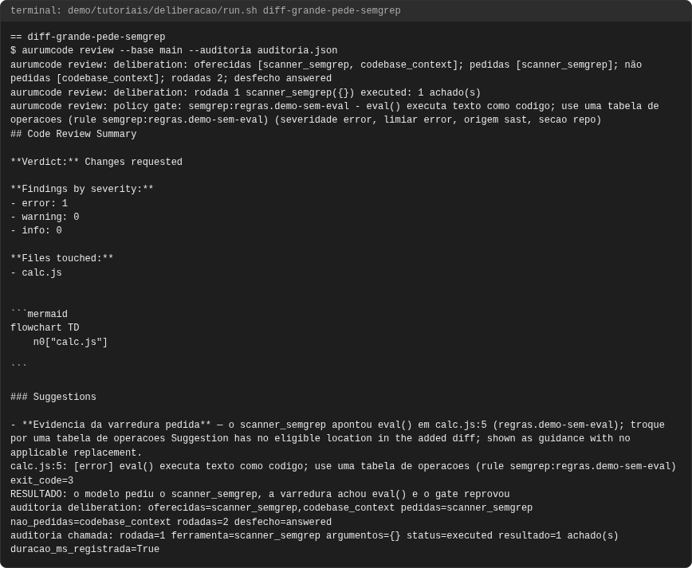
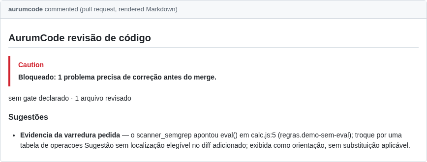
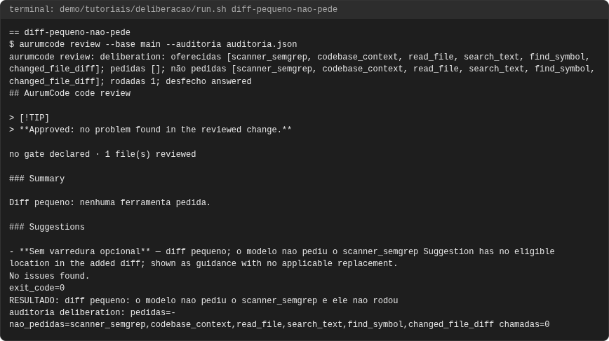
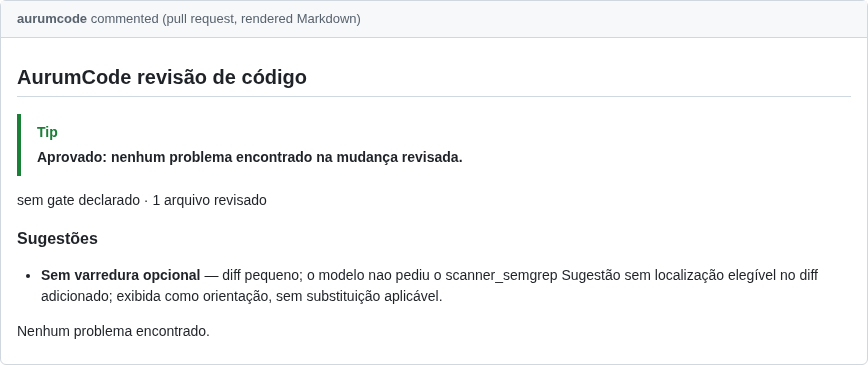
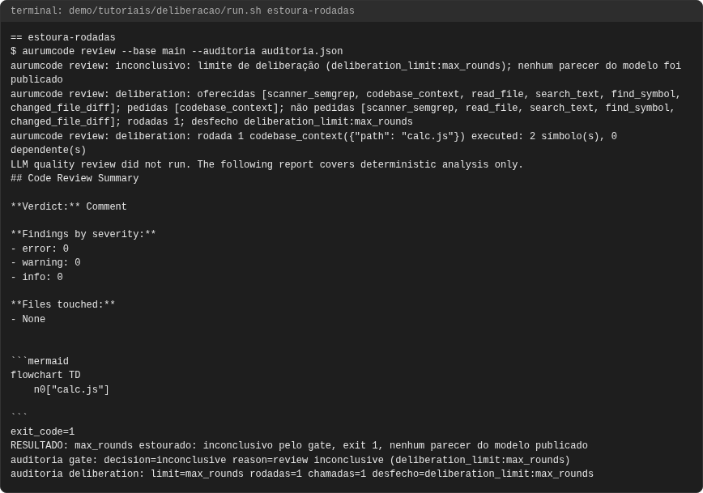
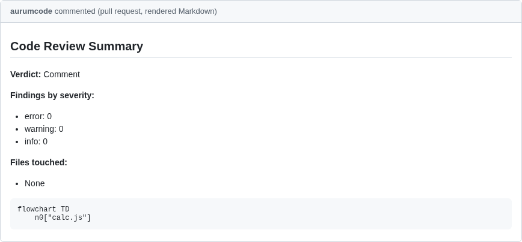
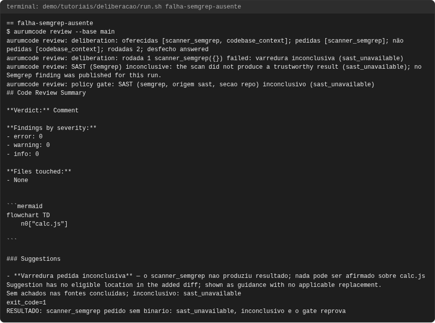
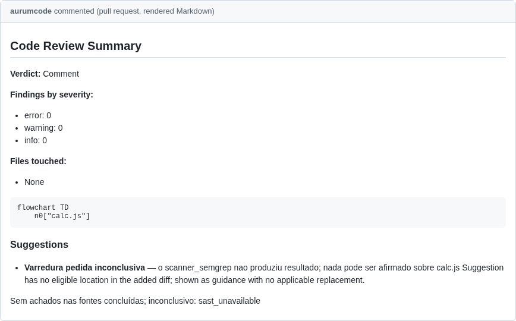

# Tutorial: deliberação com ferramentas

## Objetivo

Ao final você terá visto o modelo **decidir** quais recursos usar numa
revisão: com `deliberation.enabled`, os scanners que a configuração não exige
(`required: false`) deixam de rodar antes do modelo e passam a ser
**ferramentas** que ele pode pedir, ao lado do contexto do código de um
arquivo alterado, das seções de skill e das ferramentas que leem a revisão
revisada (`read_file`, `search_text`, `find_symbol`, `changed_file_diff`). O modelo vê no prompt o manifesto das
ferramentas, com custo e tamanho estimados, e decide. Quatro casos: o modelo
pede o Semgrep num diff grande, não pede num diff pequeno, estoura o limite de
rodadas (a revisão fica inconclusiva pelo gate e nenhum texto do modelo é publicado) e pede um scanner
cujo binário não existe (inconclusivo pela regra única dos scanners).

O ponto central: **a decisão é do modelo, o teto é da configuração**. Estourar
qualquer limite (`max_rounds`, `max_cost_tokens`, `per_tool_timeout_seconds`,
`max_read_bytes`)
nunca vira um parecer parcial; e um achado que o scanner pedido devolve conta
no gate com a origem do scanner, nunca só no texto do modelo.

Cada comando e cada saída vêm de uma execução real, registrada em
`demo/tutoriais/deliberacao/out/` e conferida por `run.sh --check`. Os blocos
de configuração **são os arquivos de `demo/tutoriais/deliberacao/`**, byte a
byte.

## Pré-requisitos

- `git`, `docker`, `bash` e `python3`. Nada mais roda no seu host.
- A imagem do produto, construída do `Dockerfile` da raiz (ela já traz o
  Semgrep na versão fixada):

```bash
docker build -t aurumcode:local /caminho/para/AurumCode
```

- Rede **não** é necessária: a demonstração roda com `--network none` e com o
  provedor de modelo falso (`AURUMCODE_LLM_FIXTURE`). O provedor falso só
  aceita ferramentas quando a fixture declara `tool_calls`; ele decide como um
  modelo decidiria pelo que o prompt mostra (aqui: pede o `scanner_semgrep`
  quando o resumo da mudança passa de 30 linhas alteradas).

```bash
bash demo/tutoriais/deliberacao/run.sh all      # quatro casos; grava out/
bash demo/tutoriais/deliberacao/run.sh --check  # compara out/ com expected/, sem docker
```

## A configuração

`deliberation` liga a deliberação e fixa os limites. O Semgrep está declarado
com `required: false`: com a deliberação ligada ele vira a ferramenta
`scanner_semgrep` em vez de rodar antes do modelo. Um scanner `required: true`
(ou exigido pela política central) continua rodando antes do modelo e nunca
aparece como opcional.

<!-- arquivo: demo/tutoriais/deliberacao/repo-exemplo/base/.aurumcode/config.yml -->
```yaml
deliberation:
  enabled: true
  max_rounds: 3
  max_cost_tokens: 60000
  per_tool_timeout_seconds: 120
quality_gates:
  scanners:
    - engine: semgrep
      required: false
      options:
        rule_packs: ["regras/sast.yml"]
```

O modelo falso do tutorial:

<!-- arquivo: demo/tutoriais/deliberacao/fixture-llm.json -->
```json
{"aurumcode_fixture": {
  "tool_calls": [
    {"lines_above": 30, "tool": "scanner_semgrep"}
  ],
  "cases": [
    {"prompt_contains": "semgrep: 1 achado",
     "response": {"verdict": "comment", "strengths": [], "issues": [], "ci_analysis": [], "test_plan": [], "limitations": [],
                  "summary": "A varredura pedida confirmou eval() em calc.js.",
                  "suggestions": [{"title": "Evidencia da varredura pedida", "description": "o scanner_semgrep apontou eval() em calc.js:5 (regras.demo-sem-eval); troque por uma tabela de operacoes"}]}},
    {"prompt_contains": "falha da ferramenta: varredura inconclusiva",
     "response": {"verdict": "comment", "strengths": [], "issues": [], "ci_analysis": [], "test_plan": [], "limitations": [],
                  "summary": "A varredura pedida nao concluiu.",
                  "suggestions": [{"title": "Varredura pedida inconclusiva", "description": "o scanner_semgrep nao produziu resultado; nada pode ser afirmado sobre calc.js"}]}},
    {"prompt_contains": "semgrep: 0 achado",
     "response": {"verdict": "approve", "strengths": [], "issues": [], "suggestions": [], "ci_analysis": [], "test_plan": [], "limitations": [], "summary": "A varredura pedida nao achou nada."}}
  ],
  "default": {"verdict": "approve", "strengths": [], "issues": [], "ci_analysis": [], "test_plan": [], "limitations": [],
              "summary": "Diff pequeno: nenhuma ferramenta pedida.",
              "suggestions": [{"title": "Sem varredura opcional", "description": "diff pequeno; o modelo nao pediu o scanner_semgrep"}]}
}}
```

## Caso 1: diff grande, o modelo pede o Semgrep

A mudança acrescenta mais de 40 linhas a `calc.js`, entre elas um `eval()`. O
prompt traz o resumo da mudança e o manifesto das ferramentas; o modelo pede o
`scanner_semgrep`, o engine roda a varredura pelo mesmo caminho da fase de
evidência, devolve o resultado como mensagem de ferramenta e o parecer final
cita a evidência. O achado conta no gate com origem `sast`, e a auditoria
registra a deliberação: o que foi oferecido, pedido e não pedido, cada chamada
com argumentos redigidos, duração e resultado resumido.

```bash
aurumcode review --base main --auditoria auditoria.json
```

<!-- saida: diff-grande-pede-semgrep -->
```text
$ aurumcode review --base main --auditoria auditoria.json
aurumcode review: deliberation: oferecidas [scanner_semgrep, codebase_context, read_file, search_text, find_symbol, changed_file_diff]; pedidas [scanner_semgrep]; não pedidas [codebase_context, read_file, search_text, find_symbol, changed_file_diff]; rodadas 2; desfecho answered
aurumcode review: deliberation: rodada 1 scanner_semgrep({}) executed: 1 achado(s)
(severidade error, limiar error, origem sast, secao repo)
- **Evidencia da varredura pedida** — o scanner_semgrep apontou eval() em calc.js:5 (regras.demo-sem-eval)
calc.js:5: [error] eval() executa texto como codigo; use uma tabela de operacoes (rule semgrep:regras.demo-sem-eval)
exit_code=3
RESULTADO: o modelo pediu o scanner_semgrep, a varredura achou eval() e o gate reprovou
auditoria deliberation: oferecidas=scanner_semgrep,codebase_context,read_file,search_text,find_symbol,changed_file_diff pedidas=scanner_semgrep nao_pedidas=codebase_context,read_file,search_text,find_symbol,changed_file_diff rodadas=2 desfecho=answered
auditoria chamada: rodada=1 ferramenta=scanner_semgrep argumentos={} status=executed resultado=1 achado(s) duracao_ms_registrada=True
```

## Caso 2: diff pequeno, o modelo não pede

Três linhas alteradas: o modelo não pede o scanner, o Semgrep não roda e a
auditoria registra a decisão (`pedidas` vazio, `scanner_semgrep` em
`não pedidas`). Uma varredura opcional que o modelo não pediu não conta no
gate; quem precisa dela sempre deve declará-la `required: true`.

<!-- saida: diff-pequeno-nao-pede -->
```text
$ aurumcode review --base main --auditoria auditoria.json
aurumcode review: deliberation: oferecidas [scanner_semgrep, codebase_context, read_file, search_text, find_symbol, changed_file_diff]; pedidas []; não pedidas [scanner_semgrep, codebase_context, read_file, search_text, find_symbol, changed_file_diff]; rodadas 1; desfecho answered
No issues found.
exit_code=0
RESULTADO: diff pequeno: o modelo nao pediu o scanner_semgrep e ele nao rodou
auditoria deliberation: pedidas=- nao_pedidas=scanner_semgrep,codebase_context,read_file,search_text,find_symbol,changed_file_diff chamadas=0
```

## Caso 3: estouro de rodadas

Uma rodada é uma chamada ao modelo. A última rodada permitida não oferece
ferramenta e pede o parecer com o que já foi reunido; o limite só estoura se
o modelo ainda pedir ferramenta. Com `max_rounds: 1` (não há rodada final
separada) e um modelo que só pede ferramenta, a rodada termina sem resposta
final: a revisão é
inconclusiva pelo gate (motivo `deliberation_limit:max_rounds`, na mesma
regra dos outros motivos inconclusivos), sai com 1, a auditoria e o SARIF são
gravados (a auditoria com o transcript e o limite) e **nenhum texto do
modelo é publicado**, nem o que ele escreveu ao lado das chamadas. O
custo de cada rodada é reservado antes da chamada e confirmado depois, então
`--limite` também é checado a cada rodada.

<!-- arquivo: demo/tutoriais/deliberacao/fixture-rodadas.json -->
```json
{"aurumcode_fixture": {
  "tool_calls": [
    {"tool": "codebase_context", "arguments": {"path": "calc.js"}, "every_round": true}
  ],
  "default": {"verdict": "approve", "strengths": [], "issues": [], "suggestions": [], "ci_analysis": [], "test_plan": [], "limitations": [], "summary": "parecer que nunca deve ser publicado"}
}}
```

<!-- saida: estoura-rodadas -->
```text
$ aurumcode review --base main --auditoria auditoria.json
aurumcode review: inconclusivo: limite de deliberação (deliberation_limit:max_rounds); nenhum parecer do modelo foi publicado
aurumcode review: deliberation: rodada 1 codebase_context({"path": "calc.js"}) executed: 2 símbolo(s), 0 dependente(s)
exit_code=1
RESULTADO: max_rounds estourado: inconclusivo pelo gate, exit 1, nenhum parecer do modelo publicado
auditoria gate: decision=inconclusive reason=review inconclusive (deliberation_limit:max_rounds)
auditoria deliberation: limit=max_rounds rodadas=1 chamadas=1 desfecho=deliberation_limit:max_rounds
```

## Caso de falha: o scanner pedido não existe

O modelo pede o `scanner_semgrep`, mas o binário não está no `PATH`. A
ferramenta segue a regra única dos scanners: `sast_unavailable`, a varredura é
inconclusiva (nunca "zero achados") e, com o `gate.inconclusive` padrão
(`block`), o gate reprova.

<!-- saida: falha-semgrep-ausente -->
```text
$ aurumcode review --base main
aurumcode review: deliberation: rodada 1 scanner_semgrep({}) failed: varredura inconclusiva (sast_unavailable)
aurumcode review: policy gate: SAST (semgrep, origem sast, secao repo) inconclusivo (sast_unavailable)
- **Varredura pedida inconclusiva** — o scanner_semgrep nao produziu resultado; nada pode ser afirmado sobre calc.js
Sem achados nas fontes concluídas; inconclusivo: sast_unavailable
exit_code=1
RESULTADO: scanner_semgrep pedido sem binario: sast_unavailable, inconclusivo e o gate reprova
```

## O que validar

- Toda chamada de ferramenta tem os argumentos conferidos contra o schema da
  ferramenta antes de executar; um argumento inválido é recusado, registrado
  e explicado ao modelo, e a ferramenta não roda.
- Nenhuma ferramenta escreve nem acessa rede além do que o produto já faz; o
  `codebase_context` só responde por arquivos do diff, e as ferramentas do
  repositório só leem a revisão revisada (nunca link simbólico, arquivo de
  `ignore` ou de segredo).
- Sem provedor capaz de chamar ferramentas (ou com perfis de revisão), nada é
  oferecido e os scanners opcionais rodam antes do modelo, como sempre.
- A referência dos limites está em
  [Configuração](../configuration.md#deliberacao-o-modelo-pede-ferramentas-dentro-de-limites).

<!-- capturas:inicio (gerado por scripts/docs/capturas.sh; nao editar a mao) -->
## Como fica

Capturas geradas por scripts/docs/capturas.sh a partir das saídas gravadas em demo/tutoriais/deliberacao/out/: o terminal de cada caso e, quando o caso publica, o comentario do PR e os status checks. O manifesto docs/assets/capturas/capturas.json registra o digest de cada insumo.

### diff-grande-pede-semgrep





### diff-pequeno-nao-pede





### estoura-rodadas





### falha-semgrep-ausente





<!-- capturas:fim -->
