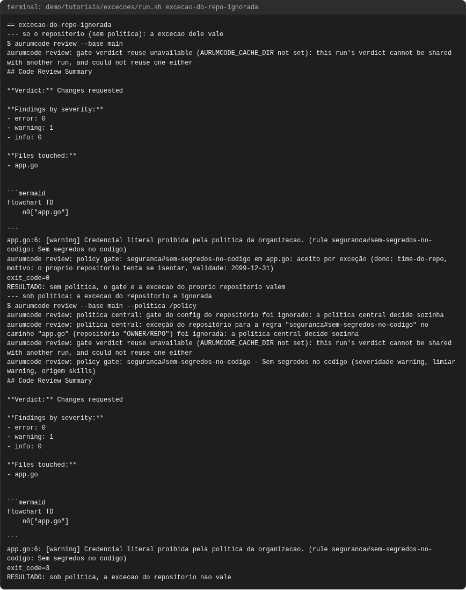
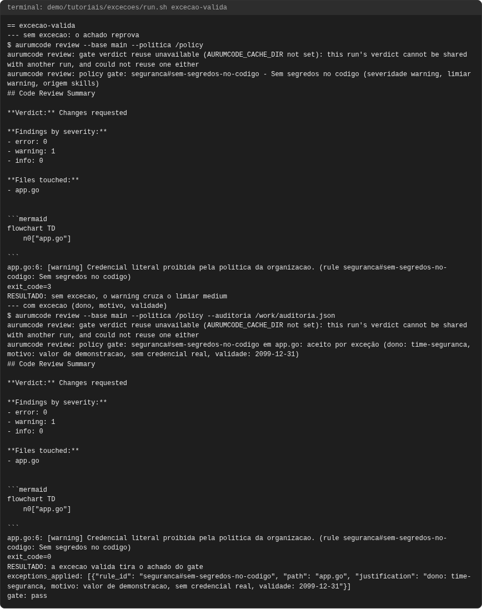
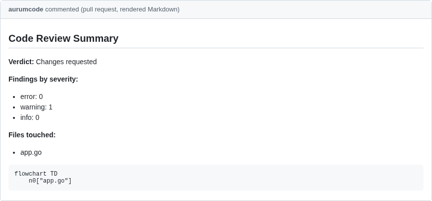
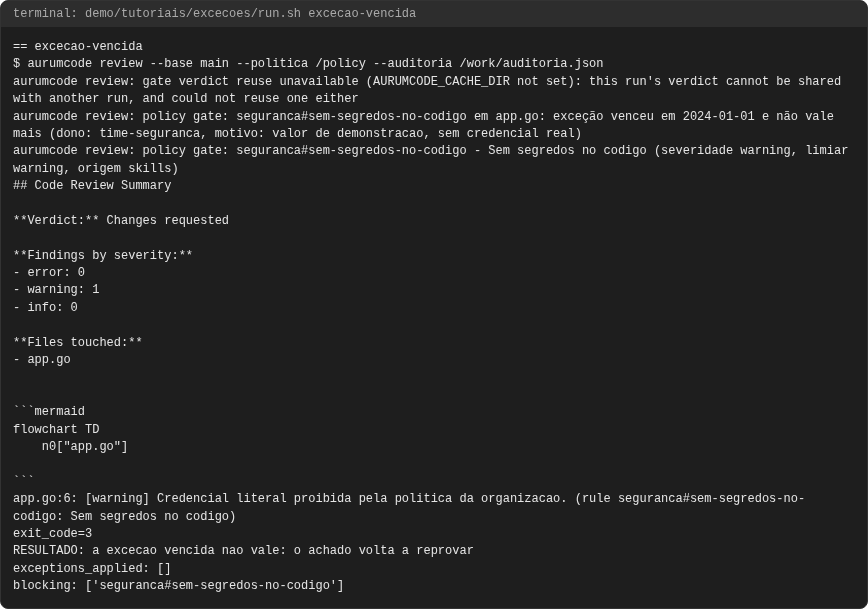
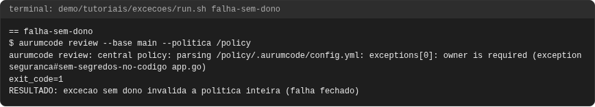
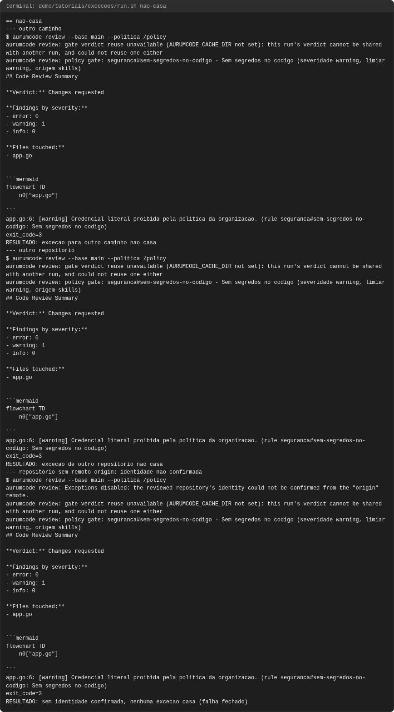

# Tutorial: exceções aprovadas, com dono e validade

## Objetivo

Mostrar como aceitar um achado exato (falso positivo ou risco assumido) sem
desligar o gate: a exceção tem **dono**, **motivo** e **validade**, vence sozinha,
só vale para o achado que casa exatamente, e sob política central só valem as
exceções da política. Cinco fases, todas executadas.

Os blocos de configuração **são os arquivos de `demo/tutoriais/excecoes/`** e as
saídas vêm de `demo/tutoriais/excecoes/out/`. Referência:
[configuration.md, Exceções](../configuration.md#excecoes-aprovadas-dono-e-validade-aur-520).

## Pré-requisitos

- `git`, `docker`, `bash`, `python3` e a imagem do produto, como em
  [revisao.md](revisao.md); sem rede e com o modelo falso.
- Ler [gate.md](gate.md): a exceção tira um achado do gate, não da revisão.
- A identidade do repositório vem do remoto `origin`; a demo usa
  `https://git.example.com/OWNER/REPO.git`. As validades são datas fixas (2099 e
  2024), então o resultado não depende do dia em que você roda.

```bash
bash demo/tutoriais/excecoes/run.sh all
bash demo/tutoriais/excecoes/run.sh --check
```

## Caso 1: exceção válida

A política declara a exceção com os seis campos obrigatórios:

<!-- arquivo: demo/tutoriais/excecoes/politica-valida/.aurumcode/config.yml -->
```yaml
gate:
  fail_on: [medium]
exceptions:
  - repo: OWNER/REPO
    rule: seguranca#sem-segredos-no-codigo
    path: app.go
    owner: time-seguranca
    reason: valor de demonstracao, sem credencial real
    expires: 2099-12-31
review:
  context:
    skills:
      - skills/seguranca.md
```

`path` é um caminho **exato** (nunca um glob), e `expires` é `AAAA-MM-DD` em UTC.

```bash
aurumcode review --base main --politica /caminho/da/politica --auditoria auditoria.json
```

<!-- saida: excecao-valida -->
```text
--- sem excecao: o achado reprova
aurumcode review: policy gate: seguranca#sem-segredos-no-codigo - Sem segredos no codigo (severidade warning, limiar warning, origem skills)
exit_code=3
RESULTADO: sem excecao, o warning cruza o limiar medium
--- com excecao (dono, motivo, validade)
aurumcode review: policy gate: seguranca#sem-segredos-no-codigo em app.go: aceito por exceção (dono: time-seguranca, motivo: valor de demonstracao, sem credencial real, validade: 2099-12-31)
exit_code=0
RESULTADO: a excecao valida tira o achado do gate
exceptions_applied: [{"rule_id": "seguranca#sem-segredos-no-codigo", "path": "app.go", "justification": "dono: time-seguranca, motivo: valor de demonstracao, sem credencial real, validade: 2099-12-31"}]
gate: pass
```

O que observar: sem a exceção o `warning` reprova (exit 3); com ela, a linha
`aceito por exceção` traz dono, motivo e validade, o gate passa (exit 0) e a
**auditoria** registra a exceção em `exceptions_applied` com a mesma
justificativa. A exceção só aparece na auditoria quando `gate.fail_on` está
declarado.

## Caso 2: exceção vencida

A mesma exceção com `expires: 2024-01-01` (política `politica-vencida`):

<!-- saida: excecao-vencida -->
```text
aurumcode review: policy gate: seguranca#sem-segredos-no-codigo em app.go: exceção venceu em 2024-01-01 e não vale mais (dono: time-seguranca, motivo: valor de demonstracao, sem credencial real)
aurumcode review: policy gate: seguranca#sem-segredos-no-codigo - Sem segredos no codigo (severidade warning, limiar warning, origem skills)
exit_code=3
RESULTADO: a excecao vencida nao vale: o achado volta a reprovar
exceptions_applied: []
blocking: ['seguranca#sem-segredos-no-codigo']
```

O que observar: a exceção vencida **para de valer sozinha**; a saída diz
`exceção venceu em ...`, o achado volta a reprovar (exit 3) e a auditoria não
lista exceção aplicada.

## Caso 3: a exceção cobre só o achado exato

Três variações, todas sem efeito: outro caminho (`outro.go`), outro repositório
(`OWNER/OUTRO`) e um checkout sem remoto `origin`, cuja identidade não se
confirma:

<!-- saida: nao-casa -->
```text
--- outro caminho
aurumcode review: policy gate: seguranca#sem-segredos-no-codigo - Sem segredos no codigo (severidade warning, limiar warning, origem skills)
exit_code=3
RESULTADO: excecao para outro caminho nao casa
--- outro repositorio
RESULTADO: excecao de outro repositorio nao casa
--- repositorio sem remoto origin: identidade nao confirmada
aurumcode review: Exceptions disabled: the reviewed repository's identity could not be confirmed from the "origin" remote.
RESULTADO: sem identidade confirmada, nenhuma excecao casa (falha fechado)
```

O que observar: nos três o achado reprova (exit 3). Sem identidade confirmada
nenhuma exceção com `repo` declarado casa, e a saída diz por quê: a identidade
nunca vem do modelo nem do diff.

## Caso 4: a exceção do repositório é ignorada sob política

O repositório declara a sua própria exceção:

<!-- arquivo: demo/tutoriais/excecoes/repo-exemplo/base-com-excecao/.aurumcode/config.yml -->
```yaml
gate:
  fail_on: [medium]
exceptions:
  - repo: OWNER/REPO
    rule: seguranca#sem-segredos-no-codigo
    path: app.go
    owner: time-do-repo
    reason: o proprio repositorio tenta se isentar
    expires: 2099-12-31
review:
  context:
    skills:
      - .aurumcode/skills/seguranca.md
```

<!-- saida: excecao-do-repo-ignorada -->
```text
--- so o repositorio (sem politica): a excecao dele vale
aurumcode review: policy gate: seguranca#sem-segredos-no-codigo em app.go: aceito por exceção (dono: time-do-repo, motivo: o proprio repositorio tenta se isentar, validade: 2099-12-31)
exit_code=0
RESULTADO: sem politica, o gate e a excecao do proprio repositorio valem
--- sob politica: a excecao do repositorio e ignorada
aurumcode review: politica central: gate do config do repositório foi ignorado: a política central decide sozinha
aurumcode review: politica central: exceção do repositório para a regra "seguranca#sem-segredos-no-codigo" no caminho "app.go" (repositório "OWNER/REPO") foi ignorada: a política central decide sozinha
aurumcode review: policy gate: seguranca#sem-segredos-no-codigo - Sem segredos no codigo (severidade warning, limiar warning, origem skills)
exit_code=3
RESULTADO: sob politica, a excecao do repositorio nao vale
```

O que observar: sem política, o repositório se autoisenta (exit 0); sob
`--politica`, o aviso nomeia a regra e o caminho descartados e o achado reprova
(exit 3). O repositório não consegue criar exceção para uma regra da política.

## Quando falha

Exceção sem `owner` (também sem `reason`, sem `expires` ou com `expires` em outro
formato) invalida a política inteira:

<!-- saida: falha-sem-dono -->
```text
aurumcode review: central policy: parsing /policy/.aurumcode/config.yml: exceptions[0]: owner is required (exception seguranca#sem-segredos-no-codigo app.go)
exit_code=1
RESULTADO: excecao sem dono invalida a politica inteira (falha fechado)
```

O que observar: exit 1, antes de qualquer chamada ao modelo, com o campo faltante
nomeado. Uma exceção que um humano não assinou nunca é tratada como ausente.

## Problemas comuns

- **A exceção não casa:** `repo`, `rule` e `path` precisam ser exatamente os do
  achado (`rule` é o `rule_id` publicado, como `seguranca#sem-segredos-no-codigo`).
- **Vence sem aviso prévio:** a validade é UTC; renove a data (mantenha a entrada
  vencida no histórico do repositório da política).
- **Exceção no repositório sob política:** é ignorada (caso 4); peça a exceção no
  repositório da política.
- **Não aparece na auditoria:** `exceptions_applied` só é preenchido com
  `gate.fail_on` declarado; veja [auditoria-sarif.md](auditoria-sarif.md).

<!-- capturas:inicio (gerado por scripts/docs/capturas.sh; nao editar a mao) -->
## Como fica

Capturas geradas por scripts/docs/capturas.sh a partir das saidas gravadas em demo/tutoriais/excecoes/out/: o terminal de cada caso e, quando o caso publica, o comentario do PR e os status checks. O manifesto docs/assets/capturas/capturas.json registra o digest de cada insumo.

### excecao-do-repo-ignorada




### excecao-valida





### excecao-vencida




### falha-sem-dono



### nao-casa




<!-- capturas:fim -->
