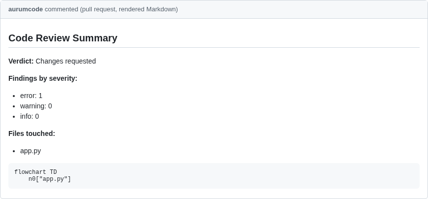
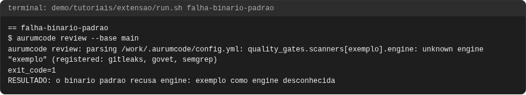
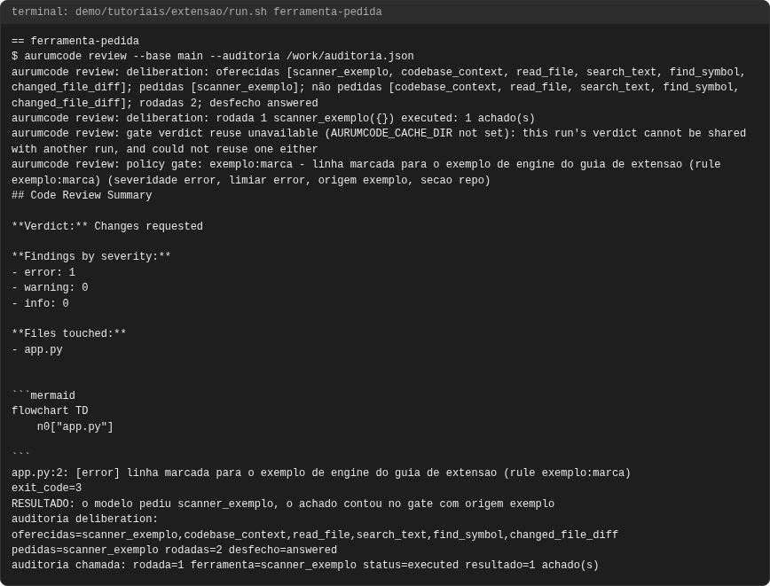
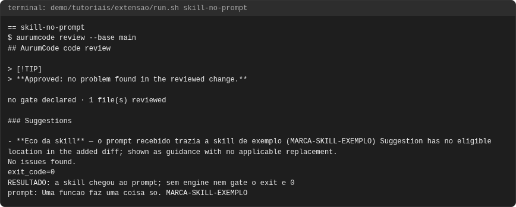
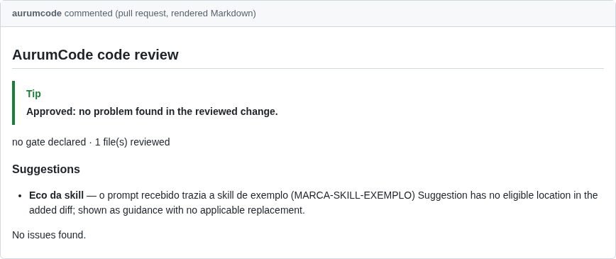

# Tutorial: estendendo o Aurum na prática

## Objetivo

Ao final você terá visto, rodando, três dos pontos de extensão do
[guia de extensão](../extensao.md): uma **engine de scanner** de exemplo
compilada no produto por tag de build, cujo achado reprova o gate e chega à
auditoria e ao SARIF com `origem exemplo`; uma **skill** de exemplo entrando
no prompt que o modelo recebe; e uma **ferramenta de deliberação** pedida pelo
modelo, com a chamada registrada no transcript da auditoria. A falha mostra o
outro lado: o binário padrão não contém a engine de exemplo e recusa
`engine: exemplo` ao ler a configuração.

Cada comando e cada saída vêm de uma execução real, registrada em
`demo/tutoriais/extensao/out/` e conferida por `run.sh --check`. Os blocos de
configuração **são os arquivos de `demo/tutoriais/extensao/`**, byte a byte.

## Pré-requisitos

- `git`, `docker`, `bash` e `python3`. Nada mais roda no seu host.
- Duas imagens do produto, construídas do `Dockerfile` da raiz: a padrão e a
  de exemplo, com a engine compilada pela tag `aurum_exemplo` (o `Dockerfile`
  passa `GO_TAGS` ao `go build -tags`):

```bash
docker build -t aurumcode:local /caminho/para/AurumCode
docker build --build-arg GO_TAGS=aurum_exemplo -t aurumcode:exemplo /caminho/para/AurumCode
```

- Rede **não** é necessária: a demonstração roda com `--network none` e com o
  provedor de modelo falso (`AURUMCODE_LLM_FIXTURE`).

```bash
bash demo/tutoriais/extensao/run.sh all      # quatro casos; grava out/
bash demo/tutoriais/extensao/run.sh --check  # compara out/ com expected/, sem docker
```

O `run.sh` declara `TUT_BUILD_ARGS="GO_TAGS=aurum_exemplo"`: a imagem do
tutorial ganha o sufixo dos build args na tag, e `out/.imagem` registra
`build_args=GO_TAGS=aurum_exemplo`, então ela nunca se confunde com a imagem
padrão dos outros tutoriais.

## A engine de exemplo

A engine (`internal/scanner/engines/exemplo`) reporta cada linha da árvore
revisada que contém a marca `EXEMPLO-ACHADO`, sem binário externo. O
repositório liga a engine como qualquer outra, no `.aurumcode/config.yml`
(o `run.sh` copia `config-engine.yml` para lá no repositório descartável;
o arquivo fica fora de `.aurumcode/` no tutorial porque só vale no binário
com a tag, e o repositório descartável é apagado ao fim do caso):

<!-- arquivo: demo/tutoriais/extensao/config-engine.yml -->
```yaml
quality_gates:
  scanners:
    - engine: exemplo
gate:
  fail_on: [error]
```

O pull request acrescenta a marca:

<!-- arquivo: demo/tutoriais/extensao/repo-exemplo/marca/app.py -->
```python
def soma(a, b):
    # EXEMPLO-ACHADO: marca que a engine de exemplo reporta
    return a + b
```

## Caso 1: o achado da engine no gate, na auditoria e no SARIF

```bash
bash demo/tutoriais/extensao/run.sh engine-no-gate
```

<!-- saida: engine-no-gate -->
```text
$ aurumcode review --base main --auditoria /work/auditoria.json --sarif /work/revisao.sarif
aurumcode review: policy gate: exemplo:marca - linha marcada para o exemplo de engine do guia de extensao (rule exemplo:marca) (severidade error, limiar error, origem exemplo, secao repo)
app.py:2: [error] linha marcada para o exemplo de engine do guia de extensao (rule exemplo:marca)
exit_code=3
RESULTADO: a engine de exemplo achou a marca no diff e o gate reprovou com origem exemplo
auditoria blocking_findings: rule_id=exemplo:marca path=app.py line=2 origin=exemplo
sarif result: exemplo:marca app.py:2 origin=exemplo
```

A linha do gate diz `origem exemplo`; a auditoria (`blocking_findings`) e o
SARIF (`properties.origin`) carregam a mesma origem tipada, que vem do
registro da engine e nunca do modelo.

## Caso 2: a skill de exemplo no prompt

A skill é Markdown, listada em `review.context.skills`:

<!-- arquivo: demo/tutoriais/extensao/repo-exemplo/base-skill/.aurumcode/config.yml -->
```yaml
review:
  context:
    skills:
      - .aurumcode/skills/exemplo.md
```

<!-- arquivo: demo/tutoriais/extensao/repo-exemplo/base-skill/.aurumcode/skills/exemplo.md -->
```markdown
# Skill de exemplo

## Funcoes pequenas
severity: warning
Uma funcao faz uma coisa so. MARCA-SKILL-EXEMPLO
```

O modelo falso ecoa o que viu: quando o prompt contém `MARCA-SKILL-EXEMPLO`
ele devolve a sugestão "Eco da skill" dizendo isso. O caso também captura o
prompt (`AURUMCODE_PROMPT_CAPTURE`) e mostra a linha da skill:

```bash
bash demo/tutoriais/extensao/run.sh skill-no-prompt
```

<!-- saida: skill-no-prompt -->
```text
$ aurumcode review --base main
- **Eco da skill** — o prompt recebido trazia a skill de exemplo (MARCA-SKILL-EXEMPLO)
exit_code=0
RESULTADO: a skill chegou ao prompt; sem engine nem gate o exit e 0
prompt: Uma funcao faz uma coisa so. MARCA-SKILL-EXEMPLO
```

## Caso 3: a ferramenta pedida pelo modelo

Com a deliberação ligada, a entrada `required: false` não roda antes do
modelo: vira a ferramenta `scanner_exemplo`, oferecida no manifesto do
prompt. O `run.sh` copia `config-ferramenta.yml` para o
`.aurumcode/config.yml` do repositório descartável.

<!-- arquivo: demo/tutoriais/extensao/config-ferramenta.yml -->
```yaml
deliberation:
  enabled: true
  max_rounds: 3
  max_cost_tokens: 60000
  per_tool_timeout_seconds: 60
quality_gates:
  scanners:
    - engine: exemplo
      required: false
gate:
  fail_on: [error]
```

O modelo falso pede a ferramenta (`tool_calls`) e responde depois de ver o
resultado:

<!-- arquivo: demo/tutoriais/extensao/fixture-ferramenta.json -->
```json
{"aurumcode_fixture": {
  "tool_calls": [
    {"tool": "scanner_exemplo"}
  ],
  "cases": [
    {"prompt_contains": "exemplo: 1 achado",
     "response": {"issues": [], "summary": "A ferramenta pedida devolveu 1 achado da engine de exemplo."}}
  ],
  "default": {"issues": [], "summary": "A ferramenta de exemplo nao foi pedida."}
}}
```

```bash
bash demo/tutoriais/extensao/run.sh ferramenta-pedida
```

<!-- saida: ferramenta-pedida -->
```text
$ aurumcode review --base main --auditoria /work/auditoria.json
aurumcode review: deliberation: oferecidas [scanner_exemplo, codebase_context]; pedidas [scanner_exemplo]; não pedidas [codebase_context]; rodadas 2; desfecho answered
aurumcode review: deliberation: rodada 1 scanner_exemplo({}) executed: 1 achado(s)
(severidade error, limiar error, origem exemplo, secao repo)
exit_code=3
RESULTADO: o modelo pediu scanner_exemplo, o achado contou no gate com origem exemplo
auditoria deliberation: oferecidas=scanner_exemplo,codebase_context pedidas=scanner_exemplo rodadas=2 desfecho=answered
auditoria chamada: rodada=1 ferramenta=scanner_exemplo status=executed resultado=1 achado(s)
```

A chamada fica no transcript (`deliberation` da auditoria) e o achado conta
no gate com origem `exemplo`, qualquer que seja a resposta do modelo.

## Quando falha

O binário padrão (imagem sem build args) não contém a engine de exemplo. A
mesma configuração do caso 1 é recusada ao ler `.aurumcode/config.yml`,
antes de qualquer revisão: o registro de engines é fechado, e uma engine que
o binário não tem nunca é carregada em tempo de execução.

```bash
bash demo/tutoriais/extensao/run.sh falha-binario-padrao
```

<!-- saida: falha-binario-padrao -->
```text
$ aurumcode review --base main
aurumcode review: parsing /work/.aurumcode/config.yml: quality_gates.scanners[exemplo].engine: unknown engine "exemplo" (registered: gitleaks, govet, semgrep)
exit_code=1
RESULTADO: o binario padrao recusa engine: exemplo como engine desconhecida
```

## Próximos passos

- O contrato de cada ponto de extensão: [Estendendo o Aurum](../extensao.md).
- A deliberação com o Semgrep: [Deliberação com ferramentas](deliberacao.md).
- Skills em camadas e política central: [Skills de convenção](skills.md).

<!-- capturas:inicio (gerado por scripts/docs/capturas.sh; nao editar a mao) -->
## Como fica

Capturas geradas por scripts/docs/capturas.sh a partir das saídas gravadas em demo/tutoriais/extensao/out/: o terminal de cada caso e, quando o caso publica, o comentario do PR e os status checks. O manifesto docs/assets/capturas/capturas.json registra o digest de cada insumo.

### engine-no-gate




### falha-binario-padrao



### ferramenta-pedida




### skill-no-prompt





<!-- capturas:fim -->
