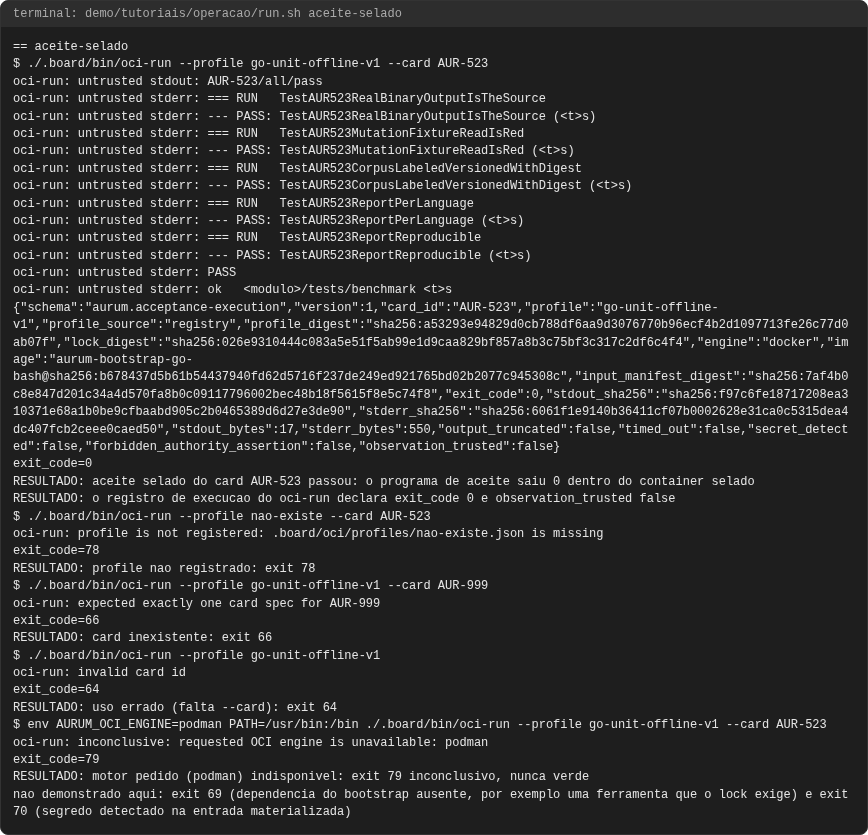
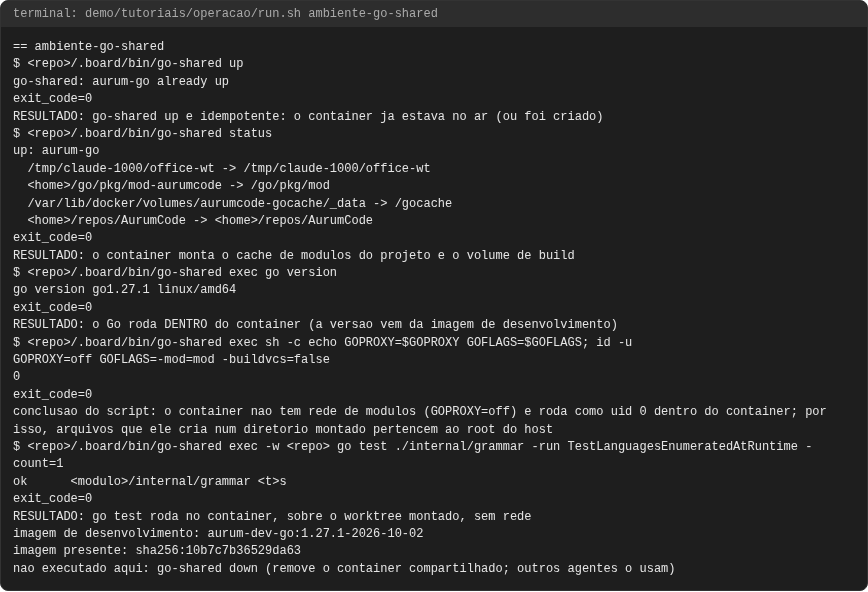
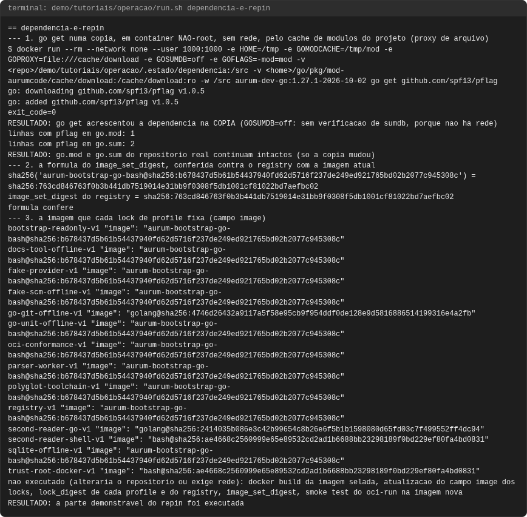
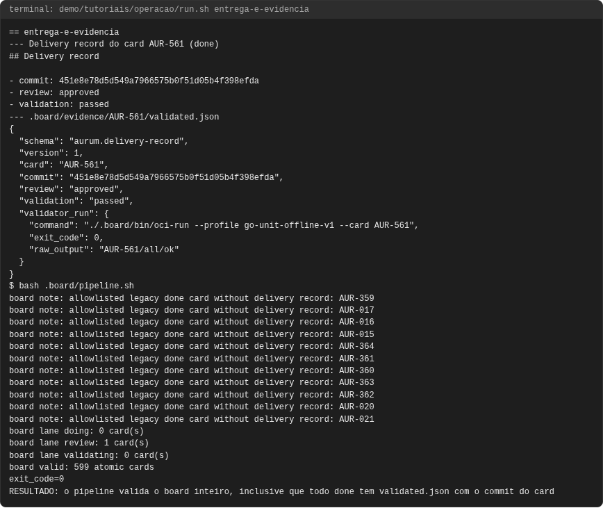
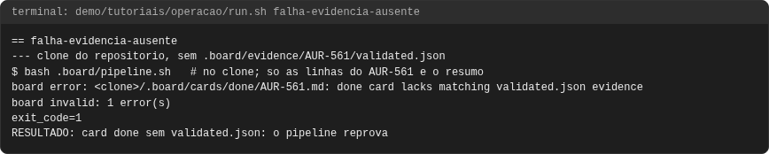
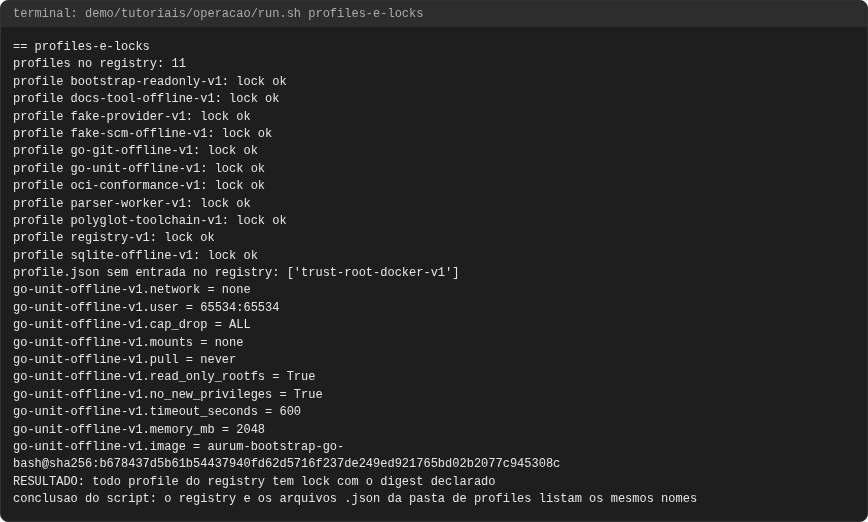
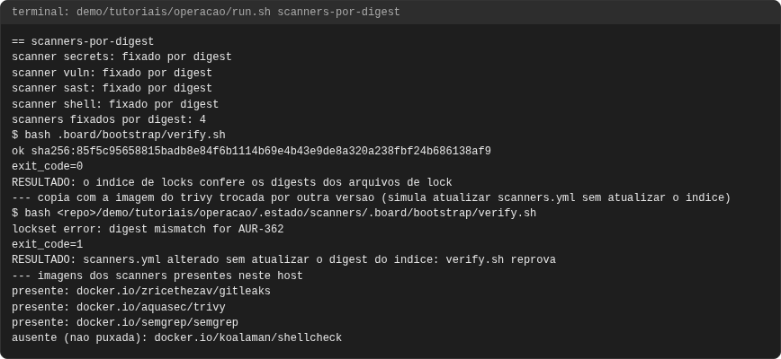

# Tutorial: operar o AurumCode, o ambiente de desenvolvimento e o aceite selado

## Objetivo

Ao final você terá usado o ambiente de desenvolvimento em container, rodado um
aceite selado com `oci-run` e lido seus exit codes, conferido profiles e locks,
visto como uma dependência Go é acrescentada e a imagem selada é repinada (a
parte que cabe em container sem alterar o repositório), conferido os scanners
fixados por digest e entendido como o board registra entrega e evidência.

Cada comando e saída vêm de uma execução real, em `demo/tutoriais/operacao/out/`,
conferida por `run.sh --check`. Linhas `RESULTADO:`, `conclusao do script:`,
`nao executado` e `nao demonstrado` são **do script**: ele declara a condição
que testou e o que ficou de fora. O que alteraria o repositório (rebuild da imagem
selada, reescrita dos locks) **não é executado**; está marcado como tal.

## Pré-requisitos

- `git`, `docker`, `bash` e `python3`. **Go nunca roda no host**: nem `go build`,
  nem `go test`. Só o container.
- As imagens locais do projeto: a de desenvolvimento
  (`aurum-dev-go:1.27.1-2026-10-02`, de `.board/oci/images/go-dev-1.27/Dockerfile`) e a
  selada (`aurum-bootstrap-go-bash`, de `.board/oci/images/go-bash-1.27/`). A
  imagem do produto vem do `Dockerfile` da raiz.
- O cache de módulos do projeto em `~/go/pkg/mod-aurumcode` (preenchido por um
  container não-root **com** rede; o container de trabalho o monta só leitura).

```bash
bash demo/tutoriais/operacao/run.sh all      # sete casos, grava out/ (cerca de 3 min)
bash demo/tutoriais/operacao/run.sh --check  # out/ contra expected/, sem docker
```

Os scripts do board usados neste fluxo, todos em `.board/bin/`:

| Script | Papel neste tutorial |
|---|---|
| `go-shared` | container Go compartilhado: `up`, `exec`, `status`, `down` (caso 1) |
| `go-sealed` | Go num container descartável, selado (sem rede, fonte só leitura, `exit 69` sem motor); alternativa isolada ao `go-shared` |
| `go-live` | único lugar onde a rede é ligada, para provar uma capacidade com modelo local real; nunca para build ou teste |
| `oci-run` | executa o aceite de um card no profile selado (caso 2) |
| `check-delivery-evidence.py` | valida os campos estruturais do registro de entrega (caso 6) |
| `second-reader` | segundo leitor do rito antigo (congelado); não faz parte do fluxo atual |
| `office-clean` | limpeza de worktrees/containers de sessões de agentes; não usado aqui |
| `office-watch` | relata worktrees de agentes parados; não usado aqui |

`go-sealed`, `go-live`, `second-reader`, `office-clean` e `office-watch` não são
exercitados pela demonstração: estão listados porque existem em `.board/bin/` e o
aceite do card os confere contra a pasta.

## Caso 1: o ambiente de desenvolvimento em container

```bash
./.board/bin/go-shared up
./.board/bin/go-shared status
./.board/bin/go-shared exec go version
./.board/bin/go-shared exec -w "$PWD" go test ./internal/grammar -run TestLanguagesEnumeratedAtRuntime -count=1
```

<!-- saida: ambiente-go-shared -->
```text
go-shared: aurum-go already up
  <home>/go/pkg/mod-aurumcode -> /go/pkg/mod
  /var/lib/docker/volumes/aurumcode-gocache/_data -> /gocache
go version go1.27.1 linux/amd64
GOPROXY=off GOFLAGS=-mod=mod -buildvcs=false
RESULTADO: go test roda no container, sobre o worktree montado, sem rede
imagem de desenvolvimento: aurum-dev-go:1.27.1-2026-10-02
nao executado aqui: go-shared down (remove o container compartilhado; outros agentes o usam)
```

O que observar: **um** container (`aurum-go`) serve a todas as sessões; `up` é
idempotente. O cache de módulos do projeto (`~/go/pkg/mod-aurumcode`) entra em
`/go/pkg/mod` (só leitura) e o volume `aurumcode-gocache` guarda o cache de
build, por isso nada compila duas vezes. `GOPROXY=off`: o container não baixa
módulo. O container roda como **root** (a demonstração imprime `id -u` = 0),
portanto arquivos que ele cria em diretório montado pertencem ao root do host;
use `go-shared exec chown` (tutorial de benchmark). `down` remove o container e
mantém o volume; não foi executado porque o container é compartilhado.

## Caso 2: aceite selado com `oci-run` e seus exit codes

O aceite de um card roda **sem rede, sem root e sem montagem do host**, num
container criado a partir de um profile. O profile e o lock do `go-unit-offline-v1`:

<!-- arquivo: .board/oci/profiles/go-unit-offline-v1.json -->
```json
{
"schema": "aurum.container-profile",
"version": 1,
"profile": "go-unit-offline-v1",
"lock": ".board/locks/oci/go-unit-offline-v1.lock.json",
"lock_digest": "sha256:026e9310444c083a5e51f5ab99e1d9caa829bf857a8b3c75bf3c317c2df6c4f4",
"network": "none",
"user": "65534:65534",
"cap_drop": "ALL",
"cap_add": "none",
"mounts": "none",
"devices": "none",
"pull": "never",
"tmpfs": "rw,nosuid,nodev",
"read_only_rootfs": true,
"no_new_privileges": true,
"privileged": false,
"timeout_seconds": 600,
"memory_mb": 2048,
"cpu_millis": 2000,
"pids_limit": 512,
"tmpfs_mb": 512,
"stdout_limit_bytes": 65536,
"stderr_limit_bytes": 65536,
"max_input_files": 10000,
"max_input_bytes": 67108864
}
```

O lock correspondente (`.board/locks/oci/go-unit-offline-v1.lock.json`; fica fora dos `read_paths` do card, então o aceite selado não o confere byte a byte):

```json
{
"schema": "aurum.oci-image-lock",
"version": 1,
"profile": "go-unit-offline-v1",
"image": "aurum-bootstrap-go-bash@sha256:b678437d5b61b54437940fd62d5716f237de249ed921765bd02b2077c945308c"
}
```

```bash
./.board/bin/oci-run --profile go-unit-offline-v1 --card AUR-523
```

(com o diretório atual no worktree: `oci-run` materializa só os `paths` e
`read_paths` do card). A saída traz o log do aceite e, no fim, um registro JSON
(`aurum.acceptance-execution`) com `exit_code` e `observation_trusted: false`.
Os exit codes do próprio `oci-run`, todos provocados abaixo, exceto 69 e 70:

<!-- saida: aceite-selado -->
```text
$ ./.board/bin/oci-run --profile go-unit-offline-v1 --card AUR-523
oci-run: untrusted stdout: AUR-523/all/pass
RESULTADO: aceite selado do card AUR-523 passou: o programa de aceite saiu 0 dentro do container selado
oci-run: profile is not registered: .board/oci/profiles/nao-existe.json is missing
exit_code=78
oci-run: expected exactly one card spec for AUR-999
exit_code=66
oci-run: invalid card id
exit_code=64
oci-run: inconclusive: requested OCI engine is unavailable: podman
exit_code=79
nao demonstrado aqui: exit 69 (dependencia do bootstrap ausente, por exemplo uma ferramenta que o lock exige) e exit 70 (segredo detectado na entrada materializada)
```

| exit | significa |
|---|---|
| 0 | o programa de aceite do card saiu 0: **evidência** |
| 1 (ou o exit do aceite) | o aceite chegou ao comportamento e reprovou: RED |
| 64 | uso errado (argumento, nome de profile, motor inválido) |
| 66 | card sem especificação única, ou aceite ausente/fora da lista |
| 69 | dependência de infraestrutura ausente (ferramenta, imagem do bootstrap): bloqueio, nunca verde |
| 70 | segredo ou credencial detectado na entrada materializada |
| 78 | profile não registrado ou sem lock |
| 79 | inconclusivo: motor de container ou imagem fixada indisponível |

O que observar: 69 e 79 são **inconclusivos**, nunca "verde": falha de motor,
imagem ou dependência nunca vale como aprovação nem como reprovação (a
convenção de `tests/acceptance/EXIT_CODE_CONVENTION.md`). O aceite do AUR-523
demorou cerca de 80 s aqui; o limite do profile é 600 s. O exit 69 foi
provocado numa execução manual (retirando `awk` do `PATH`), mas **não** está
neste registro; por isso consta como não demonstrado.

## Caso 3: profiles e locks

O registro `.board/oci/profiles/registry.v1.json` lista cada profile com o
digest do seu lock; o `oci-run` só aceita o que o registro conhece. Os onze
profiles registrados e o que cada um é (derivado do nome e dos campos dos
próprios arquivos de profile; todos com `network: none`):

| Profile | Uso |
|---|---|
| `bootstrap-readonly-v1` | bootstrap só leitura, sem Go (120 s, 256 MB) |
| `go-unit-offline-v1` | testes Go unitários offline (600 s, 2048 MB): o profile deste card |
| `go-git-offline-v1` | testes Go que usam git offline (120 s) |
| `fake-provider-v1` | aceite com provedor de modelo falso |
| `fake-scm-offline-v1` | aceite com SCM falso, offline |
| `parser-worker-v1` | worker de parsers |
| `sqlite-offline-v1` | aceite com SQLite, offline |
| `docs-tool-offline-v1` | ferramenta de documentação offline |
| `oci-conformance-v1` | conformidade do próprio runner OCI |
| `polyglot-toolchain-v1` | toolchain poliglota |
| `registry-v1` | chave do registro sem arquivo `.json` de profile na pasta; seu lock (`registry-v1.lock.json`) é o que o `bootstrap-readonly-v1` aponta |

<!-- saida: profiles-e-locks -->
```text
profiles no registry: 11
profile bootstrap-readonly-v1: lock ok
profile go-unit-offline-v1: lock ok
profile registry-v1: lock ok
profile.json sem entrada no registry: ['trust-root-docker-v1']
go-unit-offline-v1.network = none
go-unit-offline-v1.user = 65534:65534
go-unit-offline-v1.read_only_rootfs = True
go-unit-offline-v1.image = aurum-bootstrap-go-bash@sha256:b678437d5b61b54437940fd62d5716f237de249ed921765bd02b2077c945308c
RESULTADO: todo profile do registry tem lock com o digest declarado
```

O profile que está fora do registro:

<!-- arquivo: .board/oci/profiles/trust-root-docker-v1.json -->
```json
{
"schema": "aurum.container-profile",
"version": 1,
"profile": "trust-root-docker-v1",
"lock": ".board/locks/oci/trust-root-docker-v1.lock.json",
"lock_digest": "sha256:f7390477e98b1e37858314d945b6edbb81503f7bf4103aec2a9125932fbd717b",
"network": "none",
"user": "65532:65532",
"cap_drop": "ALL",
"cap_add": "none",
"mounts": "none",
"devices": "none",
"pull": "never",
"tmpfs": "rw,noexec,nosuid,nodev",
"read_only_rootfs": true,
"no_new_privileges": true,
"privileged": false,
"timeout_seconds": 15,
"memory_mb": 128,
"cpu_millis": 500,
"pids_limit": 64,
"tmpfs_mb": 8,
"stdout_limit_bytes": 65536,
"stderr_limit_bytes": 65536,
"max_input_files": 64,
"max_input_bytes": 4194304
}
```

O que observar: **achado** — existe `.board/oci/profiles/trust-root-docker-v1.json`
(profile do `AUR-233`, usuário `65532:65532`, 15 s) **sem** entrada no
`registry.v1.json`; ele não pode ser pedido ao `oci-run` pelo caminho do
registro (o próprio `oci-run` só serve `bootstrap-readonly-v1` do código, e
só enquanto o registro não existe em disco). Também não há `release-build-v1`
(listado em `.board/profile-owners.tsv`) no registro.

## Caso 4: adicionar uma dependência Go e repinar a imagem selada

O procedimento completo (AUR-534, usado no AUR-522 para o `gotreesitter`):

1. Preencher o cache de módulos do projeto por um container **não-root com
   rede**, com o sumdb montado à parte (`$HOME/go/pkg/mod-aurumcode`,
   `sumdb-aurumcode`), e rodar `go get <módulo>@<versão>`. Não rodar
   `go mod tidy` se ele falha num import legado preexistente.
2. Reconstruir a imagem selada a partir do `Dockerfile` versionado e do
   `go.mod`/`go.sum` novos, em contexto limpo; anotar o digest da imagem.
3. Repinar: o campo `image` de cada lock em `.board/locks/oci/`, o
   `lock_digest` de cada profile e de cada entrada de `registry.v1.json`, e o
   `image_set_digest` (= sha256 de `aurum-bootstrap-go-bash@sha256:<digest>`).
4. Smoke test da imagem nova pelo `oci-run` (`command -v bash`, `go version`).

O que cabe em container sem tocar o repositório, **executado**: o passo 1 numa
cópia (não-root, sem rede, o cache do projeto como proxy de arquivo) e a conferência
da fórmula do passo 3 contra o registro atual:

```bash
docker run --rm --network none --user "$(id -u):$(id -g)" -e HOME=/tmp -e GOMODCACHE=/tmp/mod \
  -e GOPROXY=file:///cache/download -e GOSUMDB=off -e GOFLAGS=-mod=mod \
  -v "$COPIA:/src" -v "$HOME/go/pkg/mod-aurumcode/cache/download:/cache/download:ro" \
  -w /src aurum-dev-go:1.27.1-2026-10-02 go get github.com/spf13/pflag
```

<!-- saida: dependencia-e-repin -->
```text
go: added github.com/spf13/pflag v1.0.5
linhas com pflag em go.mod: 1
linhas com pflag em go.sum: 2
RESULTADO: go.mod e go.sum do repositorio real continuam intactos (so a copia mudou)
formula confere
go-git-offline-v1 "image": "golang@sha256:4746d26432a9117a5f58e95cb9f954ddf0de128e9d5816886514199316e4a2fb"
trust-root-docker-v1 "image": "bash@sha256:ae4668c2560999e65e89532cd2ad1b6688bb23298189f0bd229ef80fa4bd0831"
nao executado (alteraria o repositorio ou exige rede): docker build da imagem selada, atualizacao do campo image dos locks, lock_digest de cada profile e do registry, image_set_digest, smoke test do oci-run na imagem nova
```

O que observar: com `GOSUMDB=off` **não há verificação do sumdb** (não há rede
para consultá-lo); no procedimento real o sumdb montado valida os hashes. A
fórmula do `image_set_digest` confere com o registro atual. **Achado:** nem todo
lock usa a imagem selada: `go-git-offline-v1` usa uma imagem `golang@sha256:...`,
e `second-reader-*` e `trust-root-docker-v1` usam outras; um repin da imagem
selada não os toca. **Não executado:** o `docker build`, a reescrita dos locks e
o smoke test (passos 2 a 4): alterariam o repositório ou exigem rede.

## Caso 5: atualizar scanners fixados por digest

`.board/bootstrap/locks/scanners.yml` fixa quatro scanners (gitleaks, trivy,
semgrep, shellcheck), cada um com versão e imagem `@sha256:...`:

<!-- arquivo: .board/bootstrap/locks/scanners.yml -->
```yaml
schema: bootstrap-lock-v1
card: AUR-362

secrets_scanner_name: gitleaks
secrets_scanner_role: secrets
secrets_scanner_version: v8.30.1
secrets_scanner_image: docker.io/zricethezav/gitleaks@sha256:c00b6bd0aeb3071cbcb79009cb16a60dd9e0a7c60e2be9ab65d25e6bc8abbb7f
secrets_rulebase_id: gitleaks-default-config-v8.30.1
secrets_rulebase_sha256: sha256:e163e53b9e7e8a8511e77271e2b323ed057759542a6d988258afe3a1fa329caf
secrets_finding_format_flag: --report-format
secrets_finding_format_default: none
secrets_finding_format_values: json,csv,junit,sarif,template
secrets_offline_mode: fully-offline
secrets_egress: denied

vuln_scanner_name: trivy
vuln_scanner_role: vulnerabilities
vuln_scanner_version: 0.73.0
vuln_scanner_image: docker.io/aquasec/trivy@sha256:7cced7cae583819fc7806d4cbc0dbbc7cad18b99f7d3e235192e6da8c091045c
vuln_rulebase_id: trivy-db-schema-2
vuln_rulebase_image: ghcr.io/aquasecurity/trivy-db@sha256:cce7b2ad966d6fe3789d65879579b8b24fce9d31052ed3ff73b1c5224f049142
vuln_finding_format_flag: --format
vuln_finding_format_default: table
vuln_finding_format_values: table,json,template,sarif,cyclonedx,spdx,spdx-json,github,cosign-vuln
vuln_offline_mode: pre-cached-db-required
vuln_offline_flag: --offline-scan
vuln_egress: denied

sast_scanner_name: semgrep
sast_scanner_role: sast
sast_scanner_version: 1.172.0
sast_scanner_image: docker.io/semgrep/semgrep@sha256:65dcd4408adda7c183a6b4550cb1e9b19f7f627a6fbb7e0559bd466bedc44d7b
sast_rulebase_id: semgrep-rules-pinned-commit
sast_rulebase_ref: 311ca4e9ba59d700624539bf658e3d29b134ee77
sast_finding_format_flag: --json
sast_finding_format_default: text
sast_finding_format_values: json,sarif,text,junit-xml,emacs,vim,gitlab-sast,gitlab-secrets
sast_offline_mode: local-config-required
sast_offline_flag: --config
sast_egress: denied

shell_scanner_name: shellcheck
shell_scanner_role: shell
shell_scanner_version: v0.11.0
shell_scanner_image: docker.io/koalaman/shellcheck@sha256:61862eba1fcf09a484ebcc6feea46f1782532571a34ed51fedf90dd25f925a8d
shell_rulebase_id: shellcheck-builtin-checks-v0.11.0
shell_rulebase_digest: sha256:61862eba1fcf09a484ebcc6feea46f1782532571a34ed51fedf90dd25f925a8d
shell_finding_format_flag: --format
shell_finding_format_default: tty
shell_finding_format_values: checkstyle,diff,gcc,json,json1,quiet,tty
shell_offline_mode: fully-offline
shell_egress: denied
```

Quem confere o conjunto de locks contra o índice é `.board/bootstrap/verify.sh`:

<!-- saida: scanners-por-digest -->
```text
scanner secrets: fixado por digest
scanner vuln: fixado por digest
scanner sast: fixado por digest
scanner shell: fixado por digest
scanners fixados por digest: 4
RESULTADO: o indice de locks confere os digests dos arquivos de lock
lockset error: digest mismatch for AUR-362
RESULTADO: scanners.yml alterado sem atualizar o digest do indice: verify.sh reprova
presente: docker.io/aquasec/trivy
ausente (nao puxada): docker.io/koalaman/shellcheck
```

Para atualizar um scanner: escolha a nova versão, resolva o digest da imagem
**antes** (de uma fonte confiável), troque `*_scanner_version` e
`*_scanner_image` em `scanners.yml`, atualize o digest do arquivo no índice
(`.board/bootstrap/locks.yml`) e rode `verify.sh` até `ok`. A demonstração prova
o lado seguro: editar `scanners.yml` sem atualizar o índice **reprova**
(`digest mismatch for AUR-362`, o card dono dos scanners).

O que observar: duas das quatro imagens (`gitleaks`, `shellcheck`) **não estão
puxadas** neste host: o aceite offline não precisa delas, e esta demonstração
**não** executou nenhum scanner. **Não demonstrado:** a atualização completa (novo
digest real, índice regravado) e a execução de um scanner.

## Caso 6: como o board registra entrega e evidência

Um card `done` carrega um `## Delivery record` com o commit e, para
`validation: tested|skeptical`, um `.board/evidence/AUR-NNN/validated.json`. O
`bash .board/pipeline.sh` confere o board inteiro e recusa `done` sem a
evidência correspondente (o `check-delivery-evidence.py` valida os campos
estruturais do registro):

`.board/evidence/AUR-561/validated.json` (fora dos `read_paths`; cópia sem conferência byte a byte no aceite selado):

```json
{
  "schema": "aurum.delivery-record",
  "version": 1,
  "card": "AUR-561",
  "commit": "dde2eb5a4958b4ded40d239f0196653f15f29d9a",
  "review": "approved",
  "validation": "passed",
  "validator_run": {
    "command": "./.board/bin/oci-run --profile go-unit-offline-v1 --card AUR-561",
    "exit_code": 0,
    "raw_output": "AUR-561/all/ok"
  }
}
```

<!-- saida: entrega-e-evidencia -->
```text
- commit: dde2eb5a4958b4ded40d239f0196653f15f29d9a
- review: approved
- validation: passed
  "validation": "passed",
board valid: <N> atomic cards
RESULTADO: o pipeline valida o board inteiro, inclusive que todo done tem validated.json com o commit do card
```

O fluxo: o builder comita no card; **um** revisor examina o commit imutável; o
coordenador integra esse commit, grava `validated.json` e o Delivery record
(`commit`, `review: approved`, `validation: passed`) e só então move para
`done`. O `pipeline.sh` também precisa passar antes de integrar em `main`.

O que observar: o número de cartões (`566`) é o do instante da execução e muda
a cada card novo. **Não demonstrado:** a integração em si (merge, movimento do
card), que cabe ao coordenador.

## Quando falha: card `done` sem evidência é recusado

Num clone do repositório, remove-se `validated.json` do AUR-561 e comita-se:

<!-- saida: falha-evidencia-ausente -->
```text
board error: <clone>/.board/cards/done/AUR-561.md: done card lacks matching validated.json evidence
board invalid: 1 error(s)
exit_code=1
RESULTADO: card done sem validated.json: o pipeline reprova
```

O que observar: exit 1 com a mensagem nomeando o card; `done` não se sustenta
por afirmação, só por evidência.

## Problemas comuns

- **`go-shared: aurum-go is not up` (exit 69).** Rode `./.board/bin/go-shared up`.
  Se faltar a imagem, construa-a de `.board/oci/images/go-dev-1.27/Dockerfile`.
- **`oci-run` exit 79.** Motor ou imagem fixada ausente: reconstrua a imagem
  (caso 4) ou corrija o motor; nunca trate 79 como verde.
- **`oci-run` exit 78.** Profile fora do registro (caso 3).
- **Arquivos com dono root.** O `go-shared` roda como root; corrija com
  `go-shared exec chown -R "$(id -u):$(id -g)" <dir>`.
- **`go mod tidy` falha.** Há um import legado preexistente; use `go get` e
  confira o diff do `go.mod`/`go.sum`.
- **`pipeline.sh` com "not represented in Git".** Rode-o num checkout git, não numa cópia sem `.git`.
- **Não demonstrado aqui:** `go-shared down`, o rebuild da imagem selada, a
  atualização real de scanners e a integração em `main`.

<!-- capturas:inicio (gerado por scripts/docs/capturas.sh; nao editar a mao) -->
## Como fica

Capturas geradas por scripts/docs/capturas.sh a partir das saídas gravadas em demo/tutoriais/operacao/out/: o terminal de cada caso e, quando o caso publica, o comentario do PR e os status checks. O manifesto docs/assets/capturas/capturas.json registra o digest de cada insumo.

### aceite-selado



### ambiente-go-shared



### dependencia-e-repin



### entrega-e-evidencia



### falha-evidencia-ausente



### profiles-e-locks



### scanners-por-digest



<!-- capturas:fim -->
