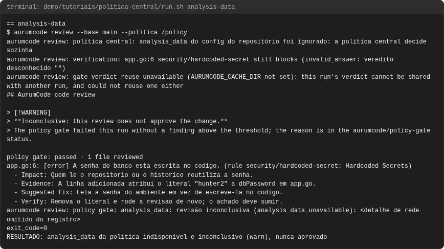
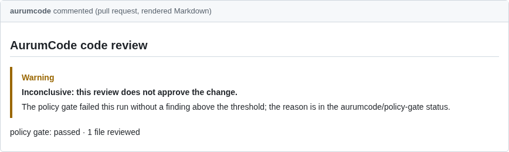
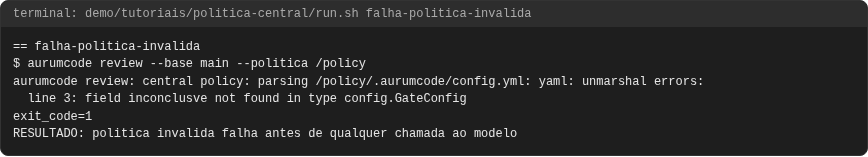
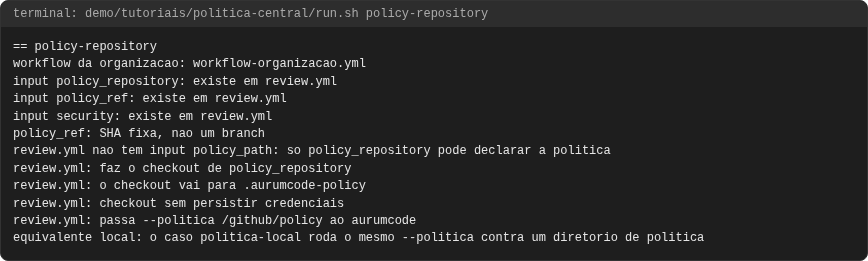
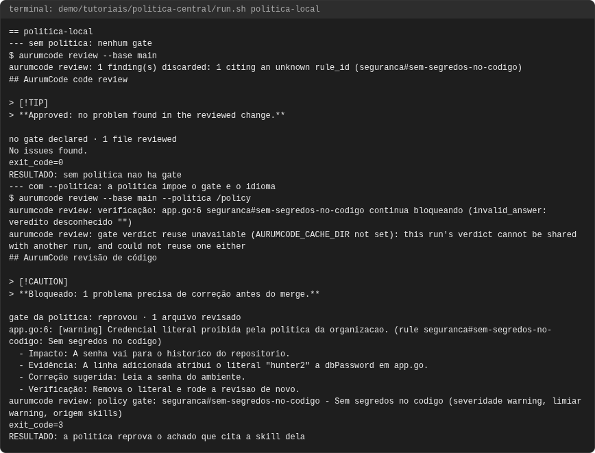
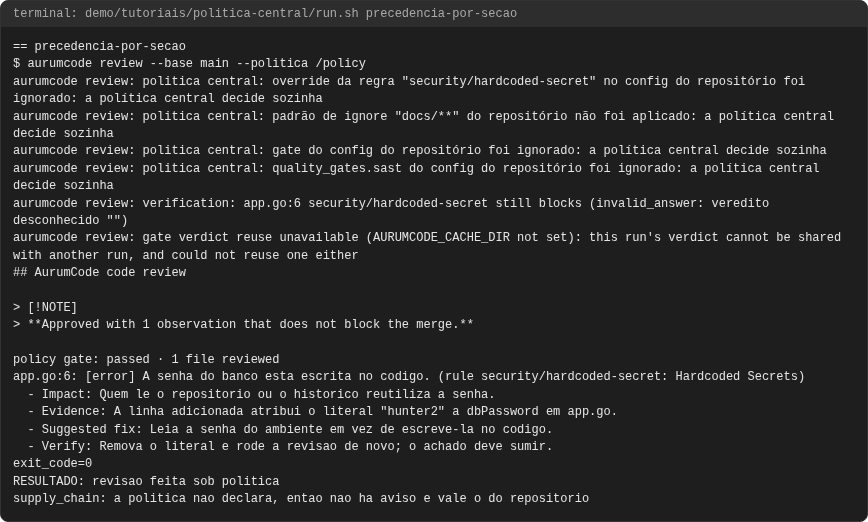
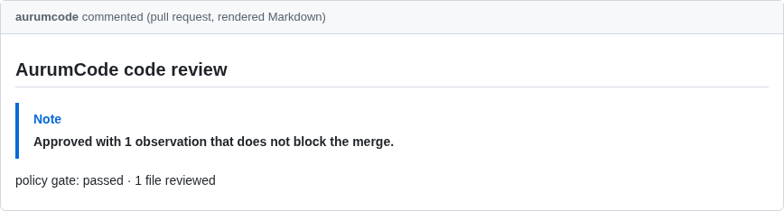
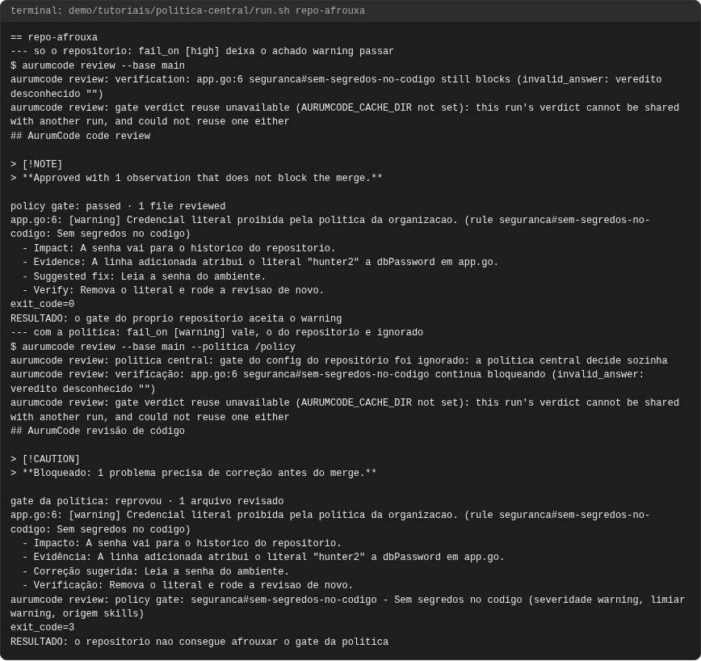

# Tutorial: política central

## Objetivo

Mostrar como uma organização impõe revisão e gate a **todos** os repositórios
a partir de um só lugar, sem que um repositório consiga afrouxar. Cinco usos,
todos executados: o repositório de política com `--politica`, o
`policy_repository` no workflow, a precedência seção a seção (a política
governa só o que declara), o `analysis_data`, e um repositório que tenta
afrouxar o `fail_on` e não consegue.

Os blocos de configuração **são os arquivos de
`demo/tutoriais/politica-central/`**, byte a byte, e as saídas vêm de uma
execução real registrada em `demo/tutoriais/politica-central/out/`
(`run.sh --check` e `tests/acceptance/AUR-561.sh` conferem).

## Pré-requisitos

- `git`, `docker`, `bash` e a imagem do produto, como em
  [revisao.md](revisao.md). Nenhuma credencial: o modelo é um
  JSON determinístico (`AURUMCODE_LLM_FIXTURE`) e os containers rodam sem rede.
  Para repetir um caso à mão, use o atalho de [revisao.md](revisao.md)
  com `TUTORIAL_DIR=/caminho/para/AurumCode/demo/tutoriais/politica-central`
  (montado em `/fixtures`), acrescente ao atalho a pasta da política
  (`-v "/caminho/da/politica:/policy:ro"`) e exporte
  `AURUMCODE_LLM_FIXTURE=/fixtures/fixture-politica.json`.
- Ler [skills.md](skills.md): as seções das skills da política são as regras
  que o gate cobra.

```bash
bash demo/tutoriais/politica-central/run.sh all      # executa os seis casos e grava out/
bash demo/tutoriais/politica-central/run.sh --check  # compara out/ com expected/, sem docker
```

## O que é uma política central

Um diretório (tipicamente o checkout de um repositório da organização, como
`ORG/aurumcode-policy`) que **contém** `.aurumcode/config.yml` e os Markdown
que ele lista. Não é o `.aurumcode/` em si, é o diretório pai. Ele precisa ficar
**fora** da árvore revisada: o programa recusa uma política que resolva para
dentro do repositório sob revisão.

## Caso 1: o repositório de política e `--politica`

Esta é a política do tutorial: um gate que reprova a partir de `warning`, que
bloqueia o que for inconclusivo, o idioma e uma skill:

<!-- arquivo: demo/tutoriais/politica-central/politica/.aurumcode/config.yml -->
```yaml
gate:
  fail_on: [warning]
  inconclusive: block
review:
  language: pt-BR
  context:
    skills:
      - skills/seguranca.md
```

<!-- arquivo: demo/tutoriais/politica-central/politica/skills/seguranca.md -->
```markdown
# Seguranca da organizacao

## Sem segredos no codigo
Nenhum segredo literal e aceito em nenhum repositorio da organizacao.
```

O repositório do time **não tem configuração nenhuma**. Rodando a mesma
mudança sem e com a política (`--politica`, alias `--policy`; sem a flag, a
variável `AURUMCODE_POLICY`):

```bash
aurumcode review --base main
aurumcode review --base main --politica /caminho/da/politica
```

<!-- saida: politica-local -->
```text
aurumcode review: 1 finding(s) discarded: 1 citing an unknown rule_id (seguranca#sem-segredos-no-codigo)
exit_code=0
RESULTADO: sem politica nao ha gate
$ aurumcode review --base main --politica /policy
> **Approved: no problem found in the reviewed change.**
app.go:6: [warning] Credencial literal proibida pela politica da organizacao. (rule seguranca#sem-segredos-no-codigo: Sem segredos no codigo)
aurumcode review: policy gate: seguranca#sem-segredos-no-codigo - Sem segredos no codigo (severidade warning, limiar warning, origem skills)
exit_code=3
RESULTADO: a politica reprova o achado que cita a skill dela
```

O que observar: sem a política o id `seguranca#...` nem existe (o achado é
descartado e contado) e nada reprova; com ela, a skill da política entra, o
parecer vem em português (idioma da política) e o gate nomeia a skill e a seção
que sustentam o bloqueio, com saída 3. (No script o diretório de política é
montado em `/policy`, fora do repositório em `/work`.)

## Caso 2: `policy_repository` no workflow

No GitHub não se passa um caminho: o workflow reutilizável recebe o repositório
da política e faz ele mesmo o checkout, somente leitura e sem persistir
credenciais, em `.aurumcode-policy`, e chama o programa com `--politica`. Fixe
o `policy_ref` em **SHA**, para que toda PR da organização seja julgada pela
mesma política até alguém apontar deliberadamente para outra:

<!-- arquivo: demo/tutoriais/politica-central/workflow-organizacao.yml -->
```yaml
# Workflow obrigatorio da organizacao, com a politica central embutida.
# ORG, o SHA do AurumCode e o SHA da politica sao placeholders: troque pelos seus.
name: Revisao obrigatoria AurumCode
on:
  pull_request:

permissions:
  contents: read
  pull-requests: write
  statuses: write
  checks: read

jobs:
  review:
    uses: ORG/AurumCode/.github/workflows/review.yml@0000000000000000000000000000000000000000
    with:
      policy_repository: ORG/aurumcode-policy
      policy_ref: 1111111111111111111111111111111111111111
      security: true
    secrets:
      LLM_API_KEY: ${{ secrets.LLM_API_KEY }}
      LLM_BASE_URL: ${{ secrets.LLM_BASE_URL }}
```

Não existe um input `policy_path` no reutilizável: num job `workflow_call` os
únicos diretórios alcançáveis são o checkout da ferramenta e o do PR, então
aceitar "um caminho que já existe" deixaria o próprio PR apontar para a sua
política. (A Action Docker direta, `action.yml`, tem `policy_path`, porque ali
quem escreve os steps controla o que foi checado; a política vai para
`$RUNNER_TEMP/_github_home` e `policy_path` aponta para `/github/home/<dir>`,
já que tudo em `/github/workspace` é a árvore revisada e é recusado.)

O que observar, e o que isto prova: não há runner do GitHub nesta demonstração: a fase
`policy-repository` não executa a revisão de PR. Ela confere, contra o
`review.yml` real do repositório, que cada input do arquivo acima existe, que o
reutilizável faz o checkout em `.aurumcode-policy` sem persistir credenciais e
passa `--politica`, e que `policy_path` não existe lá. O comportamento da
política em si é o do caso 1, que usa a mesma flag.

Estas linhas são conclusão do script (não é saída do produto): cada uma é
impressa quando o `grep` do `run.sh` encontra o trecho correspondente em
`review.yml` ou em `workflow-organizacao.yml` (para `policy_path`, quando
ele **não** existe como input).

<!-- saida: policy-repository -->
```text
input policy_repository: existe em review.yml
input policy_ref: existe em review.yml
policy_ref: SHA fixa, nao um branch
review.yml nao tem input policy_path: so policy_repository pode declarar a politica
review.yml: faz o checkout de policy_repository
review.yml: o checkout vai para .aurumcode-policy
review.yml: checkout sem persistir credenciais
review.yml: passa --politica /github/policy ao aurumcode
```

## Caso 3: precedência por seção

A política governa **só o que declara**. Esta política declara `gate` e
`quality_gates.sast`:

<!-- arquivo: demo/tutoriais/politica-central/politica-precedencia/.aurumcode/config.yml -->
```yaml
gate:
  fail_on: [warning]
  inconclusive: block
quality_gates:
  sast:
    engine: semgrep
    enabled: false
```

O repositório tenta decidir tudo por conta própria:

<!-- arquivo: demo/tutoriais/politica-central/repo-exemplo/base-precedencia/.aurumcode/config.yml -->
```yaml
gate:
  fail_on: [high]
  inconclusive: warn
quality_gates:
  sast:
    engine: semgrep
    enabled: true
  supply_chain:
    engine: cosign
    sign_sbom: false
rules:
  security/hardcoded-secret:
    enabled: false
ignore:
  - "docs/**"
```

<!-- saida: precedencia-por-secao -->
```text
aurumcode review: politica central: override da regra "security/hardcoded-secret" no config do repositório foi ignorado: a política central decide sozinha
aurumcode review: politica central: padrão de ignore "docs/**" do repositório não foi aplicado: a política central decide sozinha
aurumcode review: politica central: gate do config do repositório foi ignorado: a política central decide sozinha
aurumcode review: politica central: quality_gates.sast do config do repositório foi ignorado: a política central decide sozinha
supply_chain: a politica nao declara, entao nao ha aviso e vale o do repositorio
```

A última linha é conclusão do script (não é saída do produto): é impressa
quando a palavra `supply_chain` **não** aparece na saída do comando. Que "vale o
do repositório" vem da referência de configuração; aqui só a ausência do aviso
foi demonstrada.

O que observar, seção por seção:

| Seção | A política declara? | Resultado |
|---|---|---|
| `rules`, `ignore`, `exceptions` | sob política central, sempre governa | o do repositório é ignorado, com aviso que nomeia a regra ou o padrão |
| `gate` | sim | o do repositório é ignorado, com aviso |
| `quality_gates.sast` | sim | o do repositório é ignorado, com aviso |
| `quality_gates.supply_chain` | **não** | sem aviso: vale o do repositório |
| `review.language`, `review.publication` | só se declara | vêm da política quando declarados |

Cada seção de `quality_gates` é governada de forma independente: o aviso
existe para **o que foi descartado**, e a ausência dele em `supply_chain` é a
prova de que nada foi descartado ali. Os mesmos avisos vão para o terminal e
para o parecer publicado no PR.

## Caso 4: `analysis_data`

`analysis_data` segue a mesma regra de `quality_gates`. Aqui a política o
declara e o repositório também:

<!-- arquivo: demo/tutoriais/politica-central/politica-analysis-data/.aurumcode/config.yml -->
```yaml
gate:
  fail_on: [warning]
  inconclusive: warn
analysis_data:
  max_age_days: 30
```

<!-- saida: analysis-data -->
```text
aurumcode review: politica central: analysis_data do config do repositório foi ignorado: a política central decide sozinha
aurumcode review: policy gate: analysis_data: revisão inconclusiva (analysis_data_unavailable)
exit_code=0
```

O que observar: o `analysis_data` do repositório foi ignorado com aviso. E,
como a demonstração roda sem rede, o artefato de dados não pôde ser obtido:
o resultado é **inconclusivo** (`analysis_data_unavailable`), nunca aprovado.
Com `inconclusive: warn` a saída é 0, com o alerta visível; com `block`, como
na política do caso 1, ele reprovaria. O texto de rede do erro varia por
ambiente e é omitido do registro (o filtro está em `run.sh`).

## Caso 5: o repositório tenta afrouxar o `fail_on` e não consegue

O repositório do time declara um gate mais frouxo e uma skill com a mesma seção
da política:

<!-- arquivo: demo/tutoriais/politica-central/repo-exemplo/base-afrouxa/.aurumcode/config.yml -->
```yaml
review:
  context:
    skills:
      - .aurumcode/skills/seguranca.md
gate:
  fail_on: [high]
  inconclusive: warn
```

O achado é um `warning` que cita `seguranca#sem-segredos-no-codigo`. Primeiro só
com o repositório, depois com a política:

<!-- saida: repo-afrouxa -->
```text
exit_code=0
RESULTADO: o gate do proprio repositorio aceita o warning
aurumcode review: politica central: gate do config do repositório foi ignorado: a política central decide sozinha
aurumcode review: policy gate: seguranca#sem-segredos-no-codigo - Sem segredos no codigo (severidade warning, limiar warning, origem skills)
exit_code=3
RESULTADO: o repositorio nao consegue afrouxar o gate da politica
```

(`RESULTADO:` é conclusão do script, não saída do produto: vale quando o
`exit_code` é o esperado, 0 e 3.)

O que observar: sozinho, o repositório se deixa passar (`fail_on: [high]`
ignora um `warning`). Sob política, o `gate` dele é descartado com aviso e vale
`fail_on: [warning]`: saída 3. Para destravar, quem tem de mudar é a política,
por um PR no repositório dela.

## Quando falha: política inválida

Uma política com chave desconhecida (aqui um erro de digitação,
`inconclusve`) não é ignorada nem aplicada pela metade:

<!-- arquivo: demo/tutoriais/politica-central/politica-invalida/.aurumcode/config.yml -->
```yaml
gate:
  fail_on: [warning]
  inconclusve: block
```

<!-- saida: falha-politica-invalida -->
```text
aurumcode review: central policy: parsing /policy/.aurumcode/config.yml: yaml: unmarshal errors:
line 3: field inconclusve not found in type config.GateConfig
exit_code=1
RESULTADO: politica invalida falha antes de qualquer chamada ao modelo
```

É erro de carga: saída 1, antes de qualquer chamada ao modelo, e o erro nomeia
o arquivo, a linha e a chave. O mesmo vale para YAML inválido, `config.yml`
ausente, skill listada que não existe (veja [skills.md](skills.md)) ou um
diretório de política dentro da árvore revisada. Uma política quebrada
**bloqueia** em vez de liberar em silêncio.

## Problemas comuns

- **"a política central decide sozinha"** num aviso: não é erro. Quer dizer que
  o repositório declarou algo que a política já governa; o do repositório foi
  descartado. Para mudar o comportamento, mude a política.
- **A política não surtiu efeito**: confira que `--politica` aponta para o
  diretório que *contém* `.aurumcode/`, e não para `.aurumcode/`.
- **Política recusada por estar dentro do repositório**: o diretório de política
  tem de estar fora da árvore revisada (no workflow, `policy_repository` cuida
  disso).
- **O gate não pega meu achado**: só contam achados cuja regra é de skill da
  política, do catálogo determinístico (`analysis/*`) ou do SAST, que passaram
  pelo gate de evidência; veja `gate.sources` em
  [configuration.md](../configuration.md).
- **`policy_ref` com branch**: use SHA; um branch muda o gate de todos os
  repositórios sem revisão própria.
- **Inconclusivo**: `gate.inconclusive: block` reprova, `warn` só alerta; em
  nenhum dos dois o parecer aparece como aprovado.

<!-- capturas:inicio (gerado por scripts/docs/capturas.sh; nao editar a mao) -->
## Como fica

Capturas geradas por scripts/docs/capturas.sh a partir das saídas gravadas em demo/tutoriais/politica-central/out/: o terminal de cada caso e, quando o caso publica, o comentario do PR e os status checks. O manifesto docs/assets/capturas/capturas.json registra o digest de cada insumo.

### analysis-data





### falha-politica-invalida



### policy-repository



### politica-local




### precedencia-por-secao





### repo-afrouxa




<!-- capturas:fim -->
