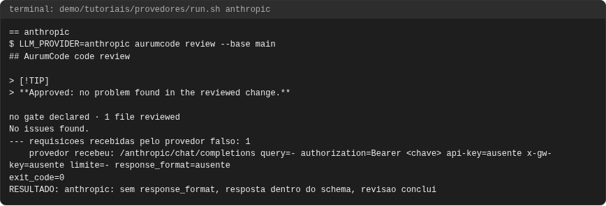
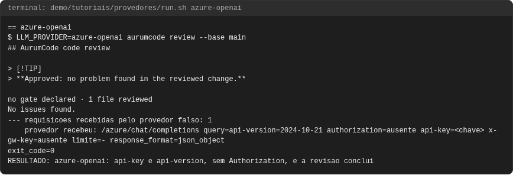
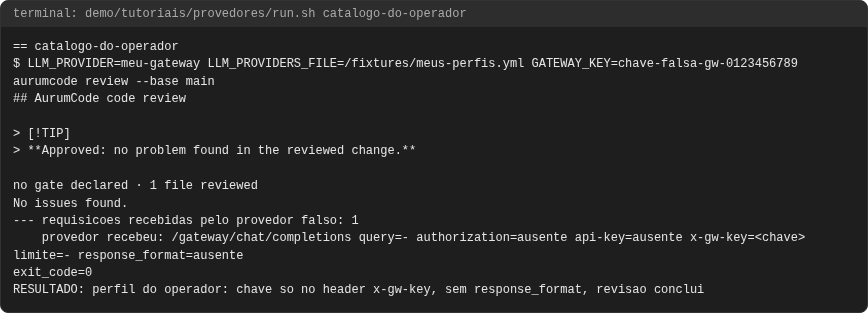
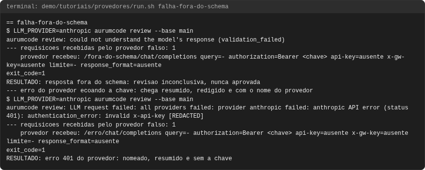
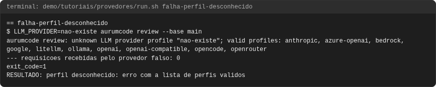
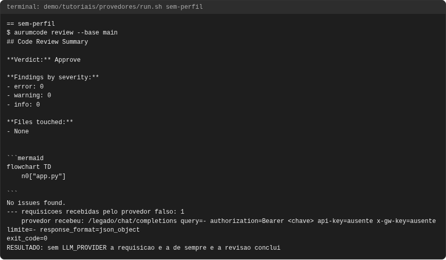
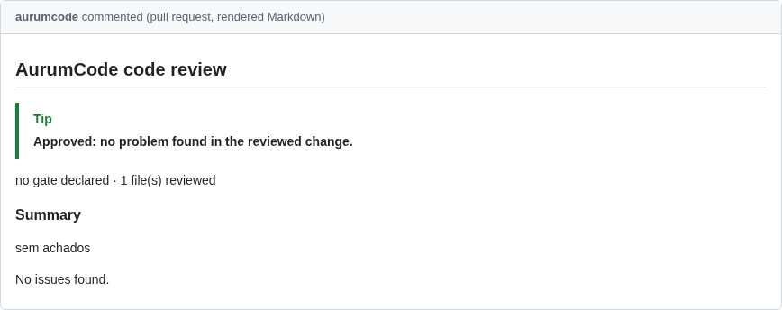

# Tutorial: provedores de LLM por configuração

## Objetivo

Mostrar, com o binário real, que o provedor de LLM é escolhido por
configuração (`LLM_PROVIDER`) e que cada perfil do catálogo fala o dialeto do
seu provedor: onde a chave viaja, o caminho, a query e o `response_format`.
Seis usos e quatro falhas, todos executados: sem `LLM_PROVIDER` a requisição é
a de sempre; Azure OpenAI; Anthropic; um perfil do operador; um provedor
reserva que assume quando o principal cai; duas reservas tentadas em ordem; e,
como falhas, uma resposta fora do schema (inconclusiva, nunca aprovada, junto
de um erro do provedor que ecoa a chave), um perfil desconhecido, todos os
provedores fora do ar e uma reserva configurada pela metade.

A configuração copiável de cada provedor está em
[Provedores de LLM](../provedores.md).

Os blocos de configuração **são os arquivos de `demo/tutoriais/provedores/`**,
byte a byte, e as saídas vêm de uma execução real registrada em
`demo/tutoriais/provedores/out/` (`run.sh --check` confere).

## Pré-requisitos

- `git`, `docker`, `bash` e `python3`, e a imagem do produto, como em
  [revisao.md](revisao.md).
- Nenhuma credencial real e nenhuma rede: o provedor é um servidor falso
  (`demo/tutoriais/provedores/provedor-falso.py`) que roda **dentro** do
  container do produto, em `127.0.0.1:8080`, com a rede do container em
  `none`. Ele registra o que recebeu (sem a chave) e responde uma revisão
  fixa. As linhas `provedor recebeu:` e `RESULTADO:` são do script, não do
  produto.

```bash
bash demo/tutoriais/provedores/run.sh all      # executa os dez casos e grava out/
bash demo/tutoriais/provedores/run.sh --check  # compara out/ com expected/, sem docker
```

## Conceitos em um minuto

- O Aurum fala Chat Completions compatível com OpenAI. Um perfil do catálogo
  (`internal/llm/provider/profiles/profiles.yml`) diz só o que muda no fio.
- `LLM_PROVIDER` escolhe o perfil; `LLM_BASE_URL` sobrescreve a URL dele
  (aqui, o servidor falso). Sem `LLM_PROVIDER`, nada muda.
- Toda resposta é conferida contra o contrato da revisão: sem a lista de
  achados, a revisão é inconclusiva.
- Reservas (`LLM_FALLBACK_<n>_*`) são provedores completos, tentados em
  ordem só quando o anterior falha. A rota `fora-do-ar` do provedor falso
  responde 503, como um provedor indisponível.

## Caso 1: sem LLM_PROVIDER, a requisição de sempre

<!-- saida: sem-perfil -->
```text
$ aurumcode review --base main
No issues found.
--- requisicoes recebidas pelo provedor falso: 1
    provedor recebeu: /legado/chat/completions query=- authorization=Bearer <chave> api-key=ausente x-gw-key=ausente limite=- response_format=json_object
exit_code=0
RESULTADO: sem LLM_PROVIDER a requisicao e a de sempre e a revisao conclui
```

O que observar: Bearer e `response_format` `json_object`, como antes do
catálogo.

## Caso 2: Azure OpenAI

<!-- saida: azure-openai -->
```text
$ LLM_PROVIDER=azure-openai aurumcode review --base main
No issues found.
--- requisicoes recebidas pelo provedor falso: 1
    provedor recebeu: /azure/chat/completions query=api-version=2024-10-21 authorization=ausente api-key=<chave> x-gw-key=ausente limite=- response_format=json_object
exit_code=0
RESULTADO: azure-openai: api-key e api-version, sem Authorization, e a revisao conclui
```

O que observar: a chave vai só no header `api-key` (nunca `Authorization`) e
`api-version` vai na query. A revisão não envia limite de resposta; quando um
chamador envia, o perfil usa `max_completion_tokens` e nunca `max_tokens`
(testes de contrato do card AUR-596).

## Caso 3: Anthropic, sem saída estruturada

<!-- saida: anthropic -->
```text
$ LLM_PROVIDER=anthropic aurumcode review --base main
No issues found.
--- requisicoes recebidas pelo provedor falso: 1
    provedor recebeu: /anthropic/chat/completions query=- authorization=Bearer <chave> api-key=ausente x-gw-key=ausente limite=- response_format=ausente
exit_code=0
RESULTADO: anthropic: sem response_format, resposta dentro do schema, revisao conclui
```

O que observar: a camada compatível com OpenAI da Anthropic ignora
`response_format`, então o perfil não o envia; a resposta é conferida contra o
schema pelo próprio Aurum.

## Caso 4: um perfil do operador

Um provedor fora do catálogo entra por `LLM_PROVIDERS_FILE`, sem mudar código:

<!-- arquivo: demo/tutoriais/provedores/meus-perfis.yml -->
```yaml
# Catalogo do operador: acrescenta um perfil (ou substitui um do catalogo
# embutido pelo mesmo nome). Apontado por LLM_PROVIDERS_FILE.
profiles:
  meu-gateway:
    description: gateway OpenAI-compativel que autentica por header proprio
    base_url: http://localhost:9000/v1
    key_env: [GATEWAY_KEY]
    auth: header
    auth_header: x-gw-key
    path: /chat/completions
    token_field: max_completion_tokens
    structured_output: none
```

<!-- saida: catalogo-do-operador -->
```text
$ LLM_PROVIDER=meu-gateway LLM_PROVIDERS_FILE=/fixtures/meus-perfis.yml GATEWAY_KEY=chave-falsa-gw-0123456789 aurumcode review --base main
No issues found.
--- requisicoes recebidas pelo provedor falso: 1
    provedor recebeu: /gateway/chat/completions query=- authorization=ausente api-key=ausente x-gw-key=<chave> limite=- response_format=ausente
exit_code=0
RESULTADO: perfil do operador: chave so no header x-gw-key, sem response_format, revisao conclui
```

## Caso 5: o principal cai e a reserva assume

O principal responde 503. A reserva 1 tem a própria URL e a própria chave
(`LLM_FALLBACK_1_BASE_URL`, `LLM_FALLBACK_1_API_KEY`) e responde a mesma
revisão:

<!-- saida: reserva-assume -->
```text
@@reserva-assume@@
```

O que observar: a linha `trying fallback` diz qual provedor caiu, por quê e
quem assume; o provedor falso recebeu duas requisições, a segunda na rota da
reserva; a revisão conclui com exit 0.

## Caso 6: duas reservas, em ordem

O principal e a reserva 1 caem; a reserva 2, de outro perfil (`anthropic`),
responde:

<!-- saida: duas-reservas -->
```text
@@duas-reservas@@
```

O que observar: duas trocas anunciadas, na ordem dos slots; a reserva 2 fala
o dialeto do seu perfil (sem `response_format`).

## Falha 1: resposta fora do schema e erro do provedor

O provedor (perfil `anthropic`, sem saída estruturada) responde um JSON sem a
lista de achados. Depois, responde 401 ecoando a chave recebida:

<!-- saida: falha-fora-do-schema -->
```text
$ LLM_PROVIDER=anthropic aurumcode review --base main
aurumcode review: could not understand the model's response (validation_failed)
--- requisicoes recebidas pelo provedor falso: 1
    provedor recebeu: /fora-do-schema/chat/completions query=- authorization=Bearer <chave> api-key=ausente x-gw-key=ausente limite=- response_format=ausente
exit_code=1
RESULTADO: resposta fora do schema: revisao inconclusiva, nunca aprovada
--- erro do provedor ecoando a chave: chega resumido, redigido e com o nome do provedor
$ LLM_PROVIDER=anthropic aurumcode review --base main
aurumcode review: LLM request failed: all providers failed: provider anthropic failed: anthropic API error (status 401): authentication_error: invalid x-api-key [REDACTED]
--- requisicoes recebidas pelo provedor falso: 1
    provedor recebeu: /erro/chat/completions query=- authorization=Bearer <chave> api-key=ausente x-gw-key=ausente limite=- response_format=ausente
exit_code=1
RESULTADO: erro 401 do provedor: nomeado, resumido e sem a chave
```

O que observar: a resposta fora do schema nunca vira "nenhum achado"; o erro
chega resumido à mensagem do provedor, com o nome do perfil e a chave
redigida.

## Falha 2: perfil desconhecido

<!-- saida: falha-perfil-desconhecido -->
```text
$ LLM_PROVIDER=nao-existe aurumcode review --base main
aurumcode review: unknown LLM provider profile "nao-existe"; valid profiles: anthropic, azure-openai, bedrock, google, litellm, ollama, openai, openai-compatible, opencode, openrouter
--- requisicoes recebidas pelo provedor falso: 0
exit_code=1
RESULTADO: perfil desconhecido: erro com a lista de perfis validos
```

O que observar: o erro lista os perfis válidos e nenhuma requisição sai.

## Falha 3: todos os provedores caem

<!-- saida: falha-todas-caem -->
```text
@@falha-todas-caem@@
```

O que observar: a revisão falha (exit 1), nunca aprovada, e o erro nomeia o
motivo de cada provedor tentado.

## Falha 4: reserva configurada pela metade

A reserva 1 tem URL mas não tem chave:

<!-- saida: falha-reserva-sem-chave -->
```text
@@falha-reserva-sem-chave@@
```

O que observar: o erro sai antes de qualquer requisição e pede a variável do
próprio slot; a chave do principal nunca é enviada à reserva.

<!-- capturas:inicio (gerado por scripts/docs/capturas.sh; nao editar a mao) -->
## Como fica

Capturas geradas por scripts/docs/capturas.sh a partir das saídas gravadas em demo/tutoriais/provedores/out/: o terminal de cada caso e, quando o caso publica, o comentario do PR e os status checks. O manifesto docs/assets/capturas/capturas.json registra o digest de cada insumo.

### anthropic




### azure-openai




### catalogo-do-operador




### falha-fora-do-schema



### falha-perfil-desconhecido



### sem-perfil





<!-- capturas:fim -->
