# Tutorial: revisão de código com o AurumCode

## Objetivo

Ao final você terá rodado, na sua máquina, cinco usos da revisão: a primeira
revisão local, a revisão sem provedor de modelo, a revisão com provedor, a
aplicação de uma sugestão com `fix` e a ligação do mesmo fluxo a pull requests
pelo workflow reutilizável. Também verá o que acontece quando um arquivo não
pode ser revisado.

Cada comando e cada saída abaixo vêm de uma execução real, registrada em
`demo/tutoriais/revisao/out/` e conferida por `run.sh --check`. Os blocos de
configuração **são os arquivos de `demo/tutoriais/revisao/`**, byte a byte
(`tests/acceptance/AUR-561.sh AC-004` compara).

## Pré-requisitos

- `git`, `docker`, `bash` e `python3` (o GitHub falso local do caso 5).
- A imagem do produto, construída do `Dockerfile` da raiz do repositório:

```bash
docker build -t aurumcode:local /caminho/para/AurumCode
```

- Um atalho para chamar o programa dentro do repositório que você revisa. Os
  exemplos abaixo escrevem `aurumcode ...`. Defina, uma vez, a variável que
  aponta para a pasta deste tutorial e o atalho:

```bash
export TUTORIAL_DIR=/caminho/para/AurumCode/demo/tutoriais/revisao
alias aurumcode='docker run --rm --user "$(id -u):$(id -g)" -e HOME=/tmp -v "$PWD:/work" -w /work -e LLM_API_KEY -e LLM_BASE_URL -e LLM_MODEL -e AURUMCODE_LLM_FIXTURE -v "$TUTORIAL_DIR:/fixtures:ro" --entrypoint /app/aurumcode aurumcode:local'
```

Em uso real, `LLM_API_KEY` e `LLM_BASE_URL` apontam para o seu serviço
compatível com OpenAI. **Neste tutorial nenhuma credencial é usada**: o
provedor é um arquivo JSON determinístico (`AURUMCODE_LLM_FIXTURE`), então o
resultado é sempre o mesmo e nada sai da sua máquina.

Para repetir um caso à mão:

1. Entre num repositório git com a mudança a revisar (a `main` e uma branch com
   a alteração).
2. Aponte o provedor falso para o arquivo do tutorial, que o atalho monta em
   `/fixtures`: `export AURUMCODE_LLM_FIXTURE=/fixtures/fixture-llm.json`.
3. Para o caso sem provedor, `unset AURUMCODE_LLM_FIXTURE`.
4. Rode o comando do caso. O `--user` do atalho evita arquivos com dono root no
   seu diretório.

### Rodar a demonstração

```bash
bash demo/tutoriais/revisao/run.sh all      # executa os oito casos e grava out/
bash demo/tutoriais/revisao/run.sh --check  # compara out/ com expected/, sem docker
```

Cada caso cria um repositório descartável em `demo/tutoriais/revisao/.estado/`
(ignorado pelo git), com a branch `main` e uma branch `feature` com a mudança
a revisar. O programa roda na imagem do produto, sem rede.

## Caso 1: primeira revisão local

A mudança troca uma mensagem. O repositório de exemplo tem `app.go` em `main` e
a branch `feature` com a mensagem alterada. Com o provedor (aqui, o JSON
`fixture-vazia.json`, que não encontra problemas):

```bash
aurumcode review --base main
```

`--base` compara a referência com o `HEAD`; mudanças não comitadas ficam de
fora.

<!-- saida: primeira-revisao -->
```text
> **Aprovado: nenhum problema encontrado na mudança revisada.**
Nenhum problema encontrado.
exit_code=0
```

O que observar: o parecer traz resumo, contagem por severidade e os arquivos
tocados; sem achados o veredito é `Approve` e o código de saída é 0. O código
de saída é o contrato com o CI: 0 é sucesso, 3 é "achado na severidade de
`--fail-on` ou acima", 1 é "a revisão não aconteceu ou falhou".

## Caso 2: sem provedor, só a análise determinística

Agora a mudança escreve uma senha no código e **nenhum provedor está
configurado** (sem `LLM_API_KEY`/`LLM_BASE_URL` e sem fixture):

<!-- arquivo: demo/tutoriais/revisao/repo-exemplo/segredo/app.go -->
```go
package main

import "fmt"

func main() {
	dbPassword := "hunter2"
	fmt.Println("conectando com", dbPassword)
}
```

```bash
aurumcode review --base main --seguranca --fail-on error
```

<!-- saida: sem-provedor -->
```text
aurumcode review: nenhum provedor de modelo configurado: revisão por modelo não executada; rodando só a análise determinística
A revisão por modelo não rodou. O relatório abaixo cobre só a análise determinística.
> **Inconclusivo: esta revisão não aprova a mudança.**
app.go:6: [error] Segredo ou credencial escrito no código [standards/security-review SCR-003] (rule security/hardcoded-secret: Hardcoded Secrets)
aurumcode review: 1 achado com severidade error ou maior (--fail-on error)
exit_code=3
```

O que observar: o programa **declara** que a revisão por modelo não rodou, e o
veredito é `Comment`, nunca `Approve`. `--seguranca` soma o passe
determinístico (regras do catálogo embutido), que ainda acha o segredo, e
`--fail-on error` o transforma em saída 3. Para um CI que não pode confundir
"só determinístico" com "revisado", acrescente `--exigir-qualidade`:

```bash
aurumcode review --base main --seguranca --exigir-qualidade
```

<!-- saida: sem-provedor -->
```text
aurumcode review: --exigir-qualidade: a revisão por modelo não rodou, então esta execução não é uma revisão completa
exit_code=1
RESULTADO: com --exigir-qualidade, sem provedor o comando falha
```

Sem o modelo a saída é 1 e a mensagem diz que a revisão por modelo não rodou.
(A linha `RESULTADO:` é conclusão do script, não saída do produto: vale quando o
`exit_code` é o esperado, 1 aqui.)

## Caso 3: com provedor, achados que citam a regra

Com um provedor, o modelo devolve achados. O provedor deste tutorial é este
arquivo, que é a forma exata aceita pelo motor:

<!-- arquivo: demo/tutoriais/revisao/fixture-llm.json -->
```json
{
  "issues": [
    {
      "file": "app.go",
      "line": 6,
      "severity": "error",
      "rule_id": "security/hardcoded-secret",
      "message": "A senha do banco esta escrita no codigo.",
      "impact": "Quem le o repositorio ou o historico reutiliza a senha.",
      "evidence": "A linha adicionada atribui o literal \"hunter2\" a dbPassword em app.go.",
      "suggestion": "Leia a senha do ambiente em vez de escreve-la no codigo.",
      "verification": "Remova o literal e rode a revisao de novo; o achado deve sumir."
    }
  ],
  "summary": "A mudanca escreve uma senha no codigo de app.go."
}
```

```bash
aurumcode review --base main --fail-on error
```

<!-- saida: com-provedor -->
```text
> **Bloqueado: 1 problema precisa de correção antes do merge.**
app.go:6: [error] A senha do banco esta escrita no codigo. (rule security/hardcoded-secret: Hardcoded Secrets)
aurumcode review: 1 achado com severidade error ou maior (--fail-on error)
exit_code=3
```

O que observar: cada achado nomeia a **regra** que o sustenta
(`rule security/hardcoded-secret`). Um achado sem `rule_id`, com regra
desconhecida, sem evidência concreta ou fora das linhas alteradas é
descartado e o programa avisa quantos descartou; o parecer nunca mostra um
achado que o motor não conseguiu ancorar.

## Caso 4: `fix` aplica uma sugestão

`aurumcode fix` lê as sugestões (um array, ou a resposta completa de uma
revisão) e imprime um patch unificado. **Nada é escrito no repositório**:
você confere e aplica.

<!-- arquivo: demo/tutoriais/revisao/fix/sugestoes.json -->
```json
[
  {
    "title": "Ler a senha do ambiente",
    "description": "Evita o segredo escrito no codigo",
    "kind": "code",
    "file": "app.go",
    "line": 6,
    "current_code": "\tdbPassword := \"hunter2\"",
    "proposed_code": "\tdbPassword := os.Getenv(\"DB_PASSWORD\")"
  }
]
```

```bash
aurumcode fix --file sugestoes.json > fix.patch
git apply --check fix.patch
git apply fix.patch
```

<!-- saida: fix -->
```text
@@ -3,6 +3,6 @@
-	dbPassword := "hunter2"
+	dbPassword := os.Getenv("DB_PASSWORD")
git apply --check: o patch aplica
```

O que observar: o patch é um diff unificado padrão, com três linhas de
contexto do próprio arquivo ao redor da troca (`@@ -3,6 +3,6 @@`), por isso o
`git apply` e o `patch -p1` aceitam sem nenhuma flag. O patch troca só a linha
sugerida: acrescentar `import "os"` continua sendo seu. O `current_code` é
conferido contra o arquivo antes de o patch ser considerado aplicável.

**O que acontece quando a sugestão está velha.** Rodar o mesmo `fix` depois de
a linha já ter sido trocada:

<!-- saida: fix -->
```text
aurumcode fix: app.go:6: working tree does not match the suggestion's current_code
exit_code=1
RESULTADO: sugestao velha recusada, sem patch
```

Saída 1, o arquivo e a linha são nomeados no erro e nenhum patch é impresso.

## Caso 5: revisão de pull request pelo workflow reutilizável

No GitHub a revisão roda em cada PR pelo workflow reutilizável
`.github/workflows/review.yml`. O repositório que recebe os reviews só
precisa deste arquivo em `.github/workflows/aurumcode.yml` (`OWNER` e o SHA
são placeholders: troque pelos seus e fixe um SHA revisado):

<!-- arquivo: demo/tutoriais/revisao/workflow-chamador.yml -->
```yaml
# .github/workflows/aurumcode.yml do repositorio que recebe os reviews.
# OWNER e o SHA sao placeholders: troque pelos seus.
name: AurumCode
on:
  pull_request:
    types: [opened, synchronize, reopened]

permissions:
  contents: read
  pull-requests: write
  statuses: write
  checks: read

jobs:
  review:
    uses: OWNER/AurumCode/.github/workflows/review.yml@0000000000000000000000000000000000000000
    with:
      model: ${{ vars.LLM_MODEL }}
      security: true
    secrets:
      LLM_API_KEY: ${{ secrets.LLM_API_KEY }}
      LLM_BASE_URL: ${{ secrets.LLM_BASE_URL }}
```

Os secrets `LLM_API_KEY` e `LLM_BASE_URL` ficam nas configurações do repositório.
O workflow reutilizável constrói a imagem do produto, faz o checkout do head
do PR e roda `aurumcode review --pr N --repo OWNER/REPO --publicar --check
--exigir-qualidade` (mais `--seguranca` e `--politica`, quando configurados); o
parecer é publicado no PR e o job falha se a revisão for inconclusiva.

O que observar, e o que esta demonstração prova: não há runner do GitHub
aqui, então a fase `pr-workflow` não executa o workflow. Ela verifica que o
arquivo acima é coerente com o reutilizável do repositório (e, logo abaixo,
roda uma revisão de PR grande contra um GitHub falso local): cada entrada de `with:` e cada secret existem em
`review.yml` e as permissões do chamador cobrem as que ele declara. Os casos
1 a 3 e 5 usam o mesmo motor que o job executa.

Estas linhas são conclusão do script (não é saída do produto): cada uma é
impressa quando o `grep` do `run.sh` encontra, em `review.yml` e no workflow do
chamador, o trecho correspondente (input em `workflow_call.inputs`, secret em
`workflow_call.secrets`, permissão declarada nos dois).

<!-- saida: pr-workflow -->
```text
gatilho: pull_request
uses: workflow reutilizavel fixado em SHA
input model: existe em review.yml
input security: existe em review.yml
secret LLM_API_KEY: existe em review.yml
secret LLM_BASE_URL: existe em review.yml
permissao pull-requests: write: o chamador concede o que o reutilizavel declara
```

O que observar: um workflow `workflow_call` não concede permissão que o
chamador não tem; por isso o bloco `permissions:` do chamador é obrigatório.

### PR grande: o GitHub recusa o diff e a revisão vai em lotes

Um PR acima do limite de linhas do GitHub recebe `406 too_large` no pedido do
diff. A mesma fase sobe um GitHub falso em `127.0.0.1` que responde assim e
informa o head e a base reais de um repositório com três diretórios de
arquivos grandes (gerados pelo `run.sh`), e roda
`aurumcode review --pr 7 --repo OWNER/REPO --publicar --politica /policy` no
checkout do head (com `origin` apontando para `OWNER/REPO`). A política é só
o gate:

<!-- arquivo: demo/tutoriais/revisao/politica-lotes/.aurumcode/config.yml -->
```yaml
gate:
  fail_on: [error]
  inconclusive: block
review:
  language: pt-BR
```

<!-- saida: pr-workflow -->
```text
aurumcode review: o diff não coube em um só prompt; revisado em 3 lotes por diretório (arquivos por lote: 2, 2, 2)
parecer publicado na PR #7 como aprovação (sem comentários na linha).
exit_code=0
```

O que observar: a primeira linha do stderr diz que a API recusou o diff e que
o mesmo intervalo `main...feature` foi lido do checkout verificado (com os
dois commits e o número de arquivos). O diff passa do orçamento de um prompt,
então a revisão é feita em três lotes, um por diretório, com um só parecer e
um só gate. Com `batches.max_batches: 1` na política, o teto é atingido: os
arquivos fora são listados na cobertura publicada e a aprovação é retida.

<!-- saida: pr-workflow -->
```text
aurumcode review: policy gate: revisão inconclusiva — parte do diff ficou fora da revisão [partial_coverage]
parecer publicado na PR #7 como pedido de alteração (sem comentários na linha).
exit_code=1
- 4 arquivos ficaram fora da revisão pelo limite de tokens.
  - banco/catalogo.go
  - banco/tabela.go
  - web/catalogo.go
  - web/tabela.go
```

Um arquivo não versionado no checkout (`rascunho.txt`) basta para que ele não
seja o head do PR: nada é revisado nem publicado.

<!-- saida: pr-workflow -->
```text
aurumcode review: fetching pull request diff: the API refused the pull request diff as too large; the diff could not be computed from the checkout either: the local checkout is not verified as the pull request head (dirty)
exit_code=1
```

## Caso 6: o modelo pondera a evidência

Com `--seguranca`, o passe de segurança e o catálogo embutido rodam **antes**
do modelo, e os dois achados da mesma linha chegam ao prompt como evidências
`[E1]` (origem `analysis`) e `[E2]` (origem `security`). O modelo contesta uma,
confirma a outra e aponta que as duas falam do mesmo trecho. A fixture só
responde com essas avaliações quando o prompt traz a seção de evidência:

<!-- arquivo: demo/tutoriais/revisao/fixture-pondera.json -->
```json
{
  "aurumcode_fixture": {
    "cases": [
      {
        "prompt_contains": "[E2] origem=security regra=security/hardcoded-secret",
        "response": {
          "verdict": "comment",
          "strengths": [],
          "issues": [],
          "suggestions": [],
          "ci_analysis": [],
          "test_plan": [],
          "limitations": [],
          "summary": "O modelo avaliou as duas evidencias deterministicas.",
          "evidence_assessments": [
            {
              "evidence_id": "E1",
              "status": "disputed",
              "justification": "O catalogo embutido marcou o literal, mas ele e o valor de exemplo da demonstracao, nao uma credencial real.",
              "correlates_with": [
                "E2"
              ],
              "priority": "low",
              "suggestion": "Mover o exemplo para um arquivo de teste."
            },
            {
              "evidence_id": "E2",
              "status": "confirmed",
              "justification": "A linha atribui uma senha literal a dbPassword e a imprime no terminal.",
              "correlates_with": [
                "E1"
              ],
              "priority": "high",
              "suggestion": "Ler a senha do ambiente."
            }
          ]
        }
      }
    ],
    "default": {
      "verdict": "approve",
      "strengths": [],
      "issues": [],
      "suggestions": [],
      "ci_analysis": [],
      "test_plan": [],
      "limitations": [],
      "summary": "Nenhuma evidencia deterministica recebida."
    }
  }
}
```

<!-- saida: modelo-pondera -->
```text
$ aurumcode review --base main --seguranca
app.go:6: [error] Segredo ou credencial atribuído direto no código (rule analysis/hardcoded-secret)
  origem: analysis | avaliacao do modelo: disputed [E1] prioridade low - O catalogo embutido marcou o literal, mas ele e o valor de exemplo da demonstracao, nao uma credencial real.
  correlacao: E2
  origem: security | avaliacao do modelo: confirmed [E2] prioridade high - A linha atribui uma senha literal a dbPassword e a imprime no terminal.
  sugestao: Ler a senha do ambiente.
exit_code=0
RESULTADO: o relatorio mostra a origem ao lado da avaliacao do modelo (contestado e confirmado), sem gate nada muda de contagem
```

O que observar: cada achado mostra o que o engine mediu (`origem`) ao lado do
que o modelo concluiu. Sem política e sem `gate.triage`, só o parecer muda:
o achado contestado continua no relatório e nada é rebaixado; sem `gate`
declarado também não há exceção a propor. Com um gate, veja o caso 10 do
tutorial `gate`.

## Caso 7: o achado do modelo é verificado contra o código

O modelo afirma que `Validar` é chamado sem guarda de nil, mas o método começa
com `if l == nil { return nil }`. Antes do gate, todo achado do modelo que
bloquearia a execução vai a uma chamada de verificação com o código real (a
janela citada e as ocorrências dos símbolos que o achado nomeia). O
verificador só tira o achado do gate com uma citação literal do arquivo:

```bash
aurumcode review --base main --fail-on error --auditoria auditoria.json
```

A fixture `fixture-refutado.json` responde à revisão com o achado e, ao prompt
de verificação, com `refuted` e as linhas exatas do método. A segunda execução
usa `fixture-refutado-parafraseado.json`, cuja citação (`if l == nil { return
nil }`, numa linha só) não existe no arquivo.

<!-- saida: achado-refutado -->
```text
$ aurumcode review --base main --fail-on error --auditoria auditoria.json
aurumcode review: limites.go:23 quality/missing-error-handling refutado pela verificação: deixou de bloquear e segue como comentário não bloqueante (motivo: Validar comeca com a guarda de nil: com l nil, retorna nil sem acessar campo.; citação: func (l *Limites) Validar() error { if l == nil { return nil })
> **Aprovado: nenhum problema encontrado na mudança revisada.**
exit_code=0
RESULTADO: refutado com citacao literal: o achado deixa de bloquear e fica marcado
--- a auditoria guarda o achado refutado, com o motivo e a citacao
limites.go 23 quality/missing-error-handling refuted rebaixado
--- citacao parafraseada: nao existe no arquivo, o achado continua bloqueando
$ aurumcode review --base main --fail-on error
aurumcode review: verificação: limites.go:23 quality/missing-error-handling continua bloqueando: a citação do verificador não está no código — Validar tem guarda de nil. [quote_not_found]
> **Bloqueado: 1 problema precisa de correção antes do merge.**
limites.go:23: [error] Validar chamado sem guarda de nil: com a secao ausente, l e nil e a chamada entra em panico. (rule quality/missing-error-handling: Missing Error Handling)
aurumcode review: 1 achado com severidade error ou maior (--fail-on error)
exit_code=3
RESULTADO: citacao inexistente: a refutacao e descartada e o achado reprova
```

O que observar: refutado com citação literal, o achado deixa de contar
(`exit_code=0`), mas não some: vira o comentário não bloqueante "Refuted by
verification" no parecer, uma linha no stderr e a entrada `verification` da
auditoria, com motivo e citação. Com a citação parafraseada, a refutação é
descartada (`quote_not_found`) e o achado continua reprovando. Confirmado,
incerto, resposta inválida, erro do provedor e o teto `max_calls` também
mantêm o bloqueio. Configuração em `review.verification`
([Configuração](../configuration.md#verificacao-adversarial-dos-achados-do-modelo-reviewverification)).

## Quando falha: arquivo não revisado nunca conta como aprovado

E se a mudança é só um arquivo gerado (`gerado.go`, que diz no topo
`Code generated ... DO NOT EDIT.`)? O motor não o revisa: quem se revisa é a
fonte que o gera. Sem gate declarado:

```bash
aurumcode review --base main
```

<!-- saida: falha-nao-revisado -->
```text
arquivo gerado, não revisado: gerado.go
> **Inconclusivo: esta revisão não aprova a mudança.**
arquivo não revisado nunca conta como aprovado.
  - gerado.go (generated)
RESULTADO: sem gate, exit 0 mas o veredito nao e Approve
```

(`RESULTADO:` é conclusão do script, não saída do produto: vale quando o
`exit_code` é o esperado.)

O veredito é `Comment`, o arquivo é nomeado como não revisado, e o parecer
diz a regra: *um arquivo não revisado nunca conta como aprovado*. A saída
continua 0 porque nenhum gate foi pedido. Para que a cobertura parcial
**reprove** o check, declare o gate no repositório (ou, melhor, numa
[política central](politica-central.md)):

<!-- arquivo: demo/tutoriais/revisao/repo-exemplo/gate-estrito/.aurumcode/config.yml -->
```yaml
review:
  language: pt-BR
gate:
  fail_on: [high]
  inconclusive: block
```

<!-- saida: falha-nao-revisado -->
```text
aurumcode review: policy gate: revisão inconclusiva — parte do diff ficou fora da revisão [partial_coverage]
exit_code=1
RESULTADO: com gate.inconclusive: block, cobertura parcial reprova
```

Com `inconclusive: block` a revisão parcial reprova (saída 1) e o motivo
`partial_coverage` aparece. Pela referência de configuração, com `warn` ela
continua visível como inconclusiva sem bloquear (não demonstrado aqui). O
veredito `Comment` sem `Approve` foi demonstrado nos dois casos acima.

Um binário é diferente: nada nele se revisa lendo. O mesmo gate em `block`,
com uma mudança que só traz `logo.png`, conclui: o motor tira o binário da
conta de cobertura e o lista como **ignorado**, pelo nome (o mesmo vale para
um caminho em `ignore`).

<!-- saida: falha-nao-revisado -->
```text
arquivo binário, não revisado: logo.png
> **Inconclusivo: esta revisão não aprova a mudança.**
- 1 arquivo ignorado (regra `ignore` do repositório ou binário): não foi revisado e não entra na cobertura. Ignorado não significa aprovado.
  - logo.png (binary)
RESULTADO: o binario e declarado ignorado, a revisao nao fica parcial e o gate em block nao reprova
```

## Problemas comuns

- **`nenhum provedor de modelo configurado`** (em inglês, `no LLM provider
  configured`): faltam `LLM_API_KEY` e `LLM_BASE_URL` (ou o
  fixture). Sem provedor, só a análise determinística roda, e isso é dito na
  saída; use `--exigir-qualidade` para tornar isso uma falha.
- **`Nenhum problema encontrado.` não é garantia**: leia a seção de cobertura e
  as linhas `arquivo binário, não revisado`; arquivos filtrados não foram revisados.
- **Achado "descartado pelo gate de escopo e evidência"**: o modelo citou uma
  linha que não está no diff, ou sem evidência concreta. Isso é proposital.
- **`git apply` recusa o patch do `fix`**: o arquivo mudou depois da revisão
  (a sugestão está velha); o `fix` já recusa isso e nomeia arquivo e linha.
- **`--base` não vê minha mudança**: ele compara com o commit `HEAD`; faça
  commit antes.
- **Erro 403 ao publicar no PR**: confira `pull-requests: write` no workflow
  chamador (não demonstrado aqui: não há publicação em PR nesta demonstração).

Próximos passos: [skills de convenção](skills.md) e
[política central](politica-central.md).

<!-- capturas:inicio (gerado por scripts/docs/capturas.sh; nao editar a mao) -->
## Como fica

Capturas geradas por scripts/docs/capturas.sh a partir das saídas gravadas em demo/tutoriais/revisao/out/: o terminal de cada caso e, quando o caso publica, o comentario do PR e os status checks. O manifesto docs/assets/capturas/capturas.json registra o digest de cada insumo.

### achado-refutado

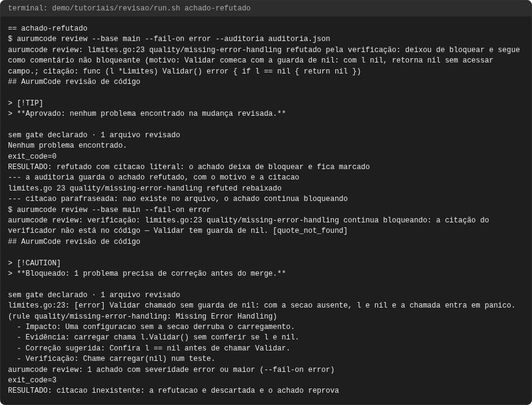

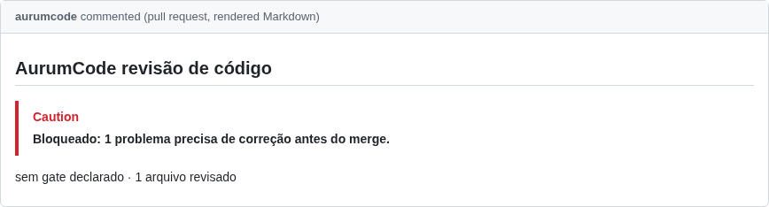

### com-provedor

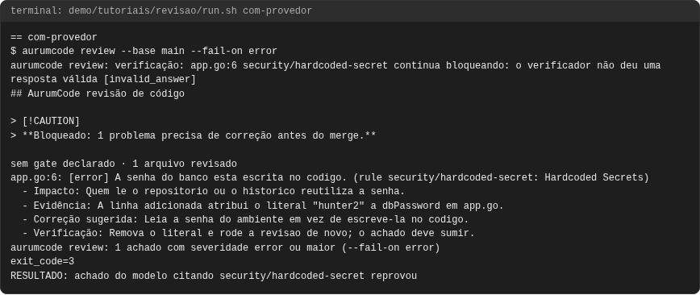


### falha-nao-revisado

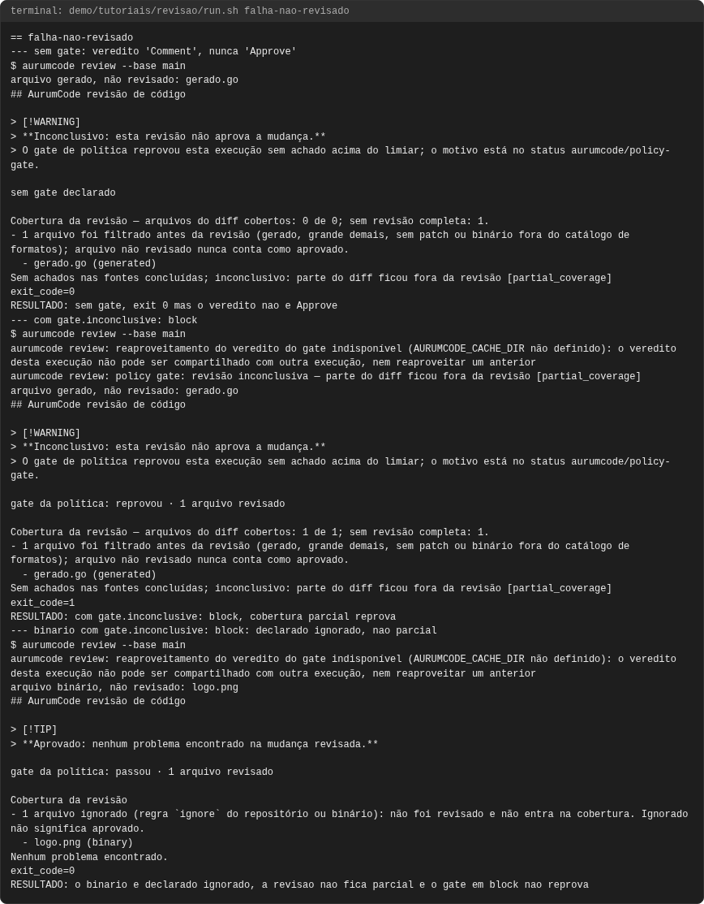

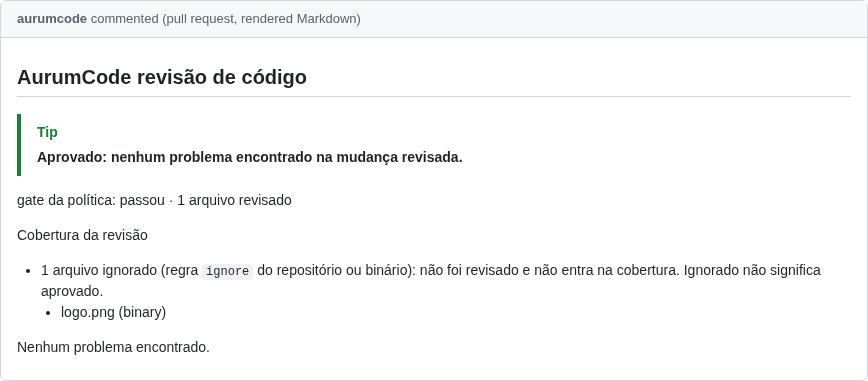

### fix

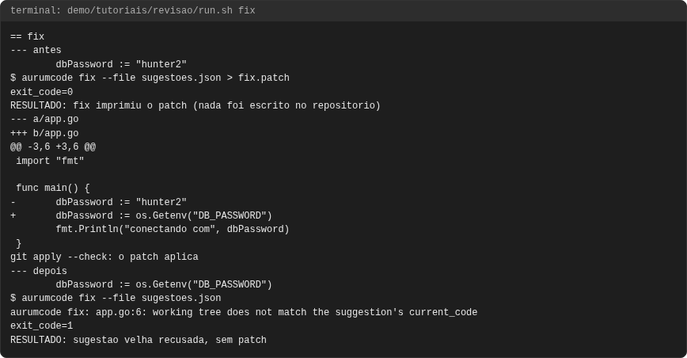

### modelo-pondera

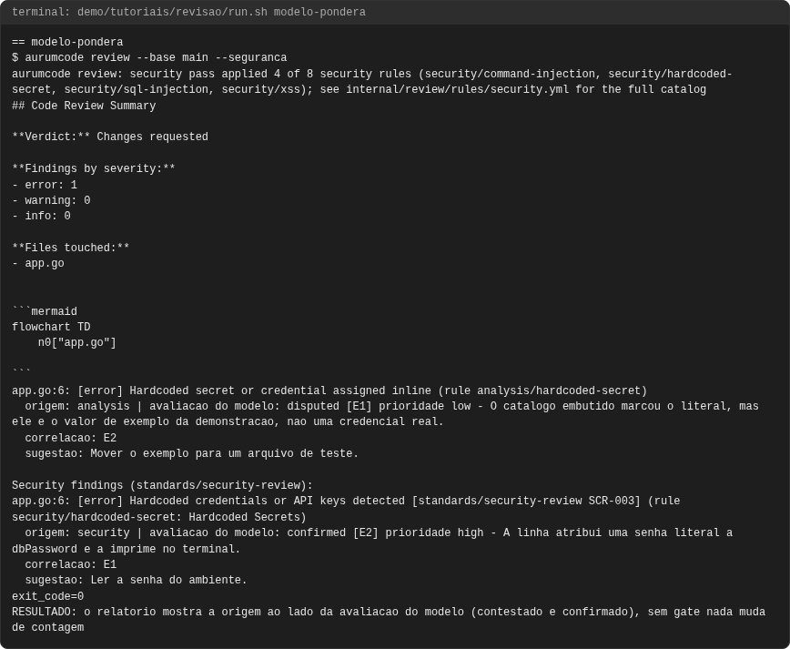


### pr-workflow

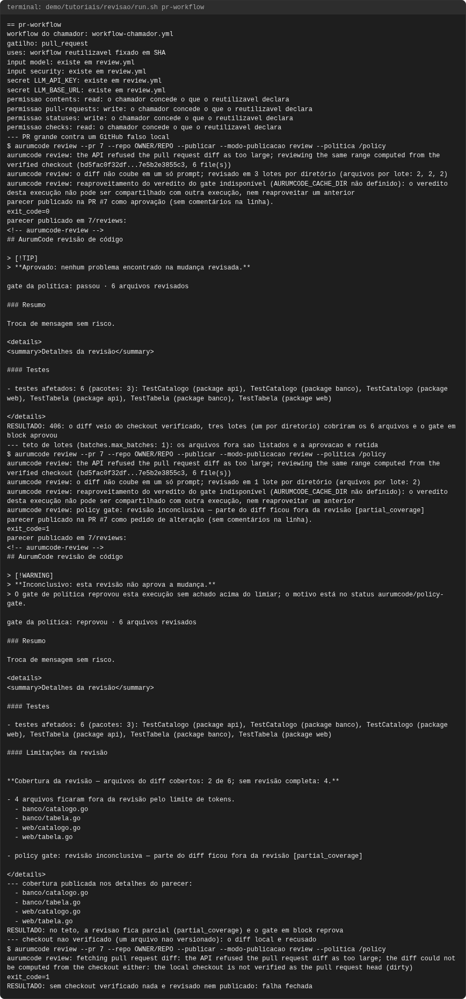

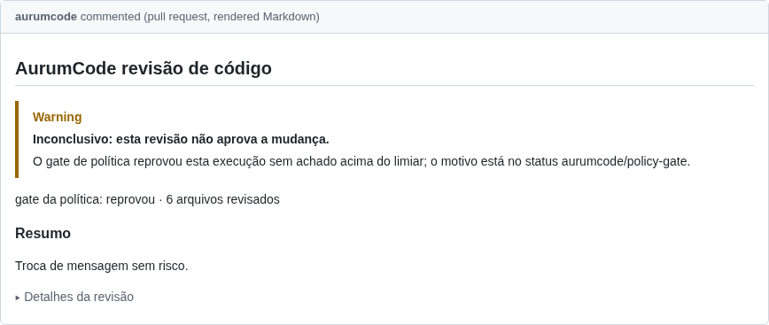

### primeira-revisao

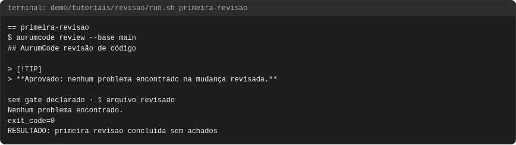

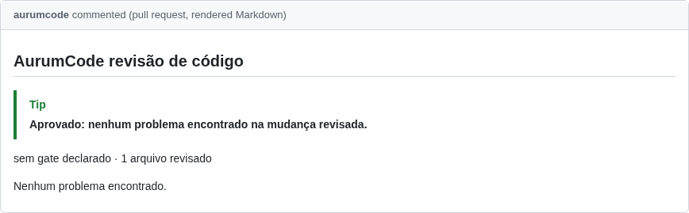

### sem-provedor

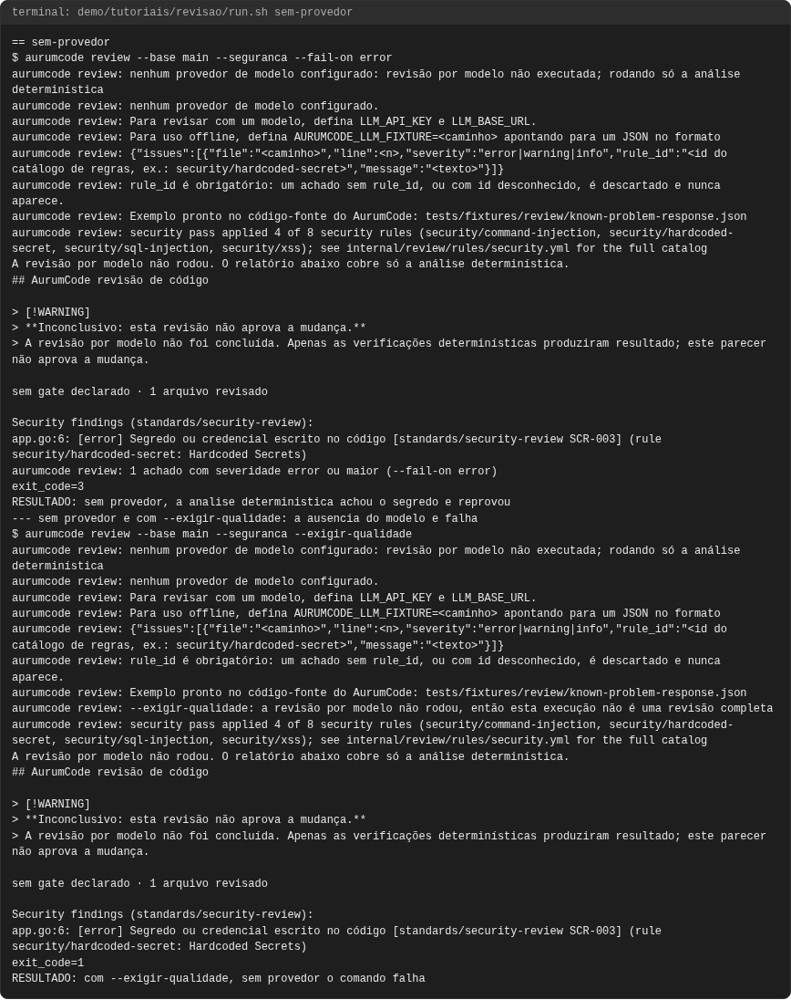

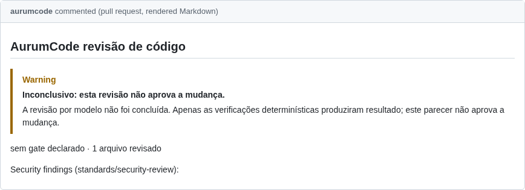

<!-- capturas:fim -->
