# Tutorial: SAST com Semgrep

## Objetivo

Ao final você terá rodado o SAST do AurumCode (`quality_gates.sast`, Semgrep)
em cinco situações: com uma regra local e sem rede, com um pacote do registry
(o que acontece sem rede), com `nosemgrep` e `.semgrepignore` sem e sob
política central, com a origem `sast` aparecendo no gate e na auditoria, e com
o Semgrep falhando. Depois, o mesmo mecanismo com um linter real: a engine
`govet` (categoria `lint`), declarada em `quality_gates.scanners`, achando um
defeito só na linha que o PR adicionou e sem receber os segredos do processo,
e falhando quando o `go` não existe. O ponto central: **um scanner que não
produziu relatório confiável nunca vale como "zero achados"**; vira
inconclusivo.

Cada comando e cada saída vêm de uma execução real, registrada em
`demo/tutoriais/sast/out/` e conferida por `run.sh --check`. Os blocos de
configuração **são os arquivos de `demo/tutoriais/sast/`**, byte a byte. O
guia corporativo (`demo/gate-corporativo`) mostra o SAST dentro do fluxo
completo; aqui ele aparece isolado.

## Pré-requisitos

- `git`, `docker` e `bash`. Nada mais roda no seu host.
- A imagem do produto, construída do `Dockerfile` da raiz; ela já traz o
  Semgrep na versão fixada em `.board/bootstrap/locks/scanners.yml`
  (o tutorial usa esse Semgrep, não baixa outra imagem):

```bash
docker build -t aurumcode:local /caminho/para/AurumCode
```

- Rede **não** é necessária: a demonstração roda com `--network none` e com o
  provedor de modelo falso (`AURUMCODE_LLM_FIXTURE`, arquivo
  `fixture-llm.json`, sem achados). O SAST não depende do modelo: o achado do
  Semgrep nasce de código, depois da chamada ao modelo.

```bash
bash demo/tutoriais/sast/run.sh all      # sete casos; grava out/
bash demo/tutoriais/sast/run.sh --check  # compara out/ com expected/, sem docker
```

Cada caso cria um repositório descartável em `demo/tutoriais/sast/.estado/`
(ignorado pelo git), com `main` e uma branch `feature`.

## Caso 1: regra local, offline

`quality_gates.sast` liga o Semgrep sobre a árvore inteira do repositório.
`rule_packs` aceita, além de nomes do registry (`p/...`), **caminhos de arquivo
de regra**: o valor vai literalmente para `semgrep --config`, relativo à raiz do
repositório. Sem rede é a forma recomendada para runners isolados.

<!-- arquivo: demo/tutoriais/sast/repo-exemplo/base/.aurumcode/config.yml -->
```yaml
quality_gates:
  sast:
    engine: semgrep
    enabled: true
    fail_on_severity: ERROR
    rule_packs: ["regras/sast.yml"]
```

<!-- arquivo: demo/tutoriais/sast/repo-exemplo/base/regras/sast.yml -->
```yaml
rules:
  - id: demo-sem-eval
    languages: [javascript]
    severity: ERROR
    message: "eval() executa texto como codigo; use uma tabela de operacoes"
    pattern: eval(...)
```

A mudança da branch `feature` acrescenta uma função que chama `eval`:

```bash
aurumcode review --base main
```

<!-- saida: regra-local -->
```text
$ aurumcode review --base main
calc.js:5: [error] eval() executa texto como codigo; use uma tabela de operacoes (rule semgrep:regras.demo-sem-eval)
exit_code=3
```

O que observar: o `rule_id` é `semgrep:` mais o `check_id` do Semgrep, que para
arquivo local leva o caminho do arquivo (`regras.demo-sem-eval`); arquivo e
linha vêm do relatório do Semgrep. Não há `gate:` declarado: o SAST decide
sozinho, e o achado em `ERROR` (o `fail_on_severity` padrão) dá saída 3. A
linha de gate também traz `origem repo`, porque a seção veio do repositório.

## Caso 2: pacote do registry, o que acontece sem rede

Com `rule_packs: [p/security-audit]` o Semgrep precisa baixar o pacote. **O
caminho de sucesso (pacote baixado, achados reais do registry) exige rede e não
foi executado aqui.** O que o tutorial executa é o que importa para a
confiança: sem rede, o resultado não é "limpo".

<!-- arquivo: demo/tutoriais/sast/repo-exemplo/registry/.aurumcode/config.yml -->
```yaml
quality_gates:
  sast:
    engine: semgrep
    enabled: true
    fail_on_severity: ERROR
    rule_packs: [p/security-audit]
gate:
  fail_on: [error]
  inconclusive: block
```

```bash
aurumcode review --base main
```

<!-- saida: registry-sem-rede -->
```text
$ aurumcode review --base main
aurumcode review: SAST (Semgrep) inconclusive: the scan did not produce a trustworthy result (sast_execution_error); no Semgrep finding was published for this run.
aurumcode review: policy gate: SAST (semgrep, origem sast, secao repo) inconclusivo (sast_execution_error)
exit_code=1
```

O que observar: o comando demora cerca de dois minutos (o limite de uma
varredura é 120 s) e termina com `sast_execution_error`. Com
`gate.inconclusive: block` isso reprova (saída 1). O parecer não traz
achado do SAST: leia a linha `SAST ... inconclusivo` antes de confiar nele.
(`RESULTADO` do script: o exit 1 é o esperado e prova que a falha de download
não foi lida como varredura limpa; o log não distingue timeout de recusa de
rede, então o tutorial não afirma qual das duas aconteceu.)

## Caso 3: `nosemgrep` e `.semgrepignore`, sem e sob política

O autor da mudança silencia um `eval` com `// nosemgrep: demo-sem-eval` e
esconde outro arquivo, `legado.js`, num `.semgrepignore`:

<!-- arquivo: demo/tutoriais/sast/repo-exemplo/nosem/.semgrepignore -->
```text
legado.js
```

Sem política central, esses mecanismos funcionam como o Semgrep os define. Sob
`--politica`, o AurumCode roda o Semgrep com `--disable-nosem` e
`--x-ignore-semgrepignore-files` (a segunda é uma flag interna do Semgrep, por
isso a versão fixada importa): quem escreve o código não consegue silenciar o
que a política manda varrer. A política deste tutorial:

<!-- arquivo: demo/tutoriais/sast/politica/.aurumcode/config.yml -->
```yaml
gate:
  fail_on: [error]
  inconclusive: block
  sources: [sast]
quality_gates:
  sast:
    engine: semgrep
    enabled: true
    fail_on_severity: ERROR
    rule_packs: ["/policy/regras/sast.yml"]
```

Observe que na política o pacote de regras é um caminho absoluto
(`/policy/regras/sast.yml`): o diretório da política não faz parte da árvore
varrida, e o caminho é resolvido a partir da raiz do repositório. O mesmo
repositório, sem e com política:

```bash
aurumcode review --base main
aurumcode review --base main --politica /policy
```

<!-- saida: nosemgrep-e-semgrepignore -->
```text
--- sem politica (config do proprio repositorio): nosemgrep e .semgrepignore valem
exit_code=0
--- sob politica central: o mesmo codigo, o autor nao consegue silenciar
calc.js:5: [error] eval() executa texto como codigo; use uma tabela de operacoes (rule semgrep:policy.regras.demo-sem-eval)
legado.js:2: [error] eval() executa texto como codigo; use uma tabela de operacoes (rule semgrep:policy.regras.demo-sem-eval)
exit_code=3
```

O que observar: sem política, exit 0 e nenhum achado; sob política, os dois
`eval` aparecem (`calc.js:5` apesar do `nosemgrep`, `legado.js:2` apesar do
`.semgrepignore`) e o gate reprova. O `check_id` agora é `policy.regras....`
porque o arquivo de regras mudou de lugar. (Conclusão do script: a diferença
de exit entre as duas execuções, 0 e 3, sobre o mesmo código.)

## Caso 4: a origem `sast` no gate e na auditoria

Quando a política declara `gate`, todo achado que passou pelo gate de evidência
conta pela severidade, qualquer que seja a origem (`skills`, `analysis`,
`sast`). A política acima usa `sources: [sast]`. O mesmo comando, agora com
`--auditoria`:

```bash
aurumcode review --base main --politica /policy --auditoria auditoria.json
```

<!-- saida: origem-sast -->
```text
$ aurumcode review --base main --politica /policy --auditoria auditoria.json
(severidade error, limiar error, origem sast, secao policy)
exit_code=3
auditoria blocking_findings: rule_id=semgrep:policy.regras.demo-sem-eval path=calc.js line=5 origin=sast
```

A linha `auditoria blocking_findings` foi impressa pelo script a partir de
`blocking_findings[]` do JSON da auditoria; o campo `origin` vale `sast`. Com
uma política que lista `sources: [skills, analysis]` (sem `sast`):

<!-- arquivo: demo/tutoriais/sast/politica-so-sast/.aurumcode/config.yml -->
```yaml
gate:
  fail_on: [error]
  inconclusive: warn
  sources: [skills, analysis]
quality_gates:
  sast:
    engine: semgrep
    enabled: true
    fail_on_severity: ERROR
    rule_packs: ["/policy/regras/sast.yml"]
```

<!-- saida: origem-sast -->
```text
--- gate.sources sem sast
exit_code=0
```

O que observar: o achado do Semgrep continua publicado no parecer, mas já não
reprova o gate (exit 0). Esta política só vale para o gate com `gate`
declarado; a seção `quality_gates.sast` do repositório, ao contrário, nunca é
afrouxável sob política.

## Caso 5: linter real, engine `govet`

`go vet` é uma engine registrada (`govet`, categoria `lint`, origem `govet`).
Ela só roda quando `quality_gates.scanners` a declara; sem a declaração, o
review é o de sempre e nada é instalado:

<!-- arquivo: demo/tutoriais/sast/repo-exemplo/lint-base/.aurumcode/config.yml -->
```yaml
quality_gates:
  scanners:
    - engine: govet             # categoria lint, origem govet
      fail_on: warning          # go vet reporta warning; o padrao ERROR so publicaria
gate:
  fail_on: [error]
```

A `main` já tem um `fmt.Printf` com verbo errado em `legado/legado.go`; a
branch `feature` adiciona outro em `calc/calc.go`, linha 9. A engine roda
`go vet -json ./...` e guarda só o achado que cai numa linha adicionada pelo
intervalo revisado (`git diff --relative <base>...<head>`): o de `legado.go` é histórico
do repositório, não do PR. A regra é o analisador do próprio go vet
(`go-vet/printf`), que qualquer um reexecuta.

A imagem do produto não traz o Go, então este caso põe na frente do `PATH` um
`go` falso que devolve exatamente o JSON que o `go vet -json` real (go1.27.1)
devolve para este repositório, e grava se os segredos do processo do
aurumcode chegaram a ele. O caso passa `LLM_API_KEY` e `GITHUB_TOKEN` ao
aurumcode; o processo da engine recebe só um ambiente explícito (`PATH`,
`HOME`, `TMPDIR`, locale, certificados, os caches do Go e
`GOTOOLCHAIN=local`/`GOPROXY=off`/`CGO_ENABLED=0`):

<!-- arquivo: demo/tutoriais/sast/fake-go/go -->
```sh
#!/bin/sh
# go falso, so para o tutorial: a imagem do produto nao traz o Go. Responde o
# que o `go vet -json ./...` real (go1.27.1) responde para este repositorio de
# exemplo, com os mesmos dois achados medidos: um numa linha que o PR
# adicionou, outro num arquivo que o PR nao tocou. Antes, grava em
# ambiente-do-go.txt se os segredos do processo do aurumcode chegaram aqui.
{
  for v in LLM_API_KEY GITHUB_TOKEN; do
    if printenv "$v" >/dev/null; then echo "$v no ambiente do go: PRESENTE"; else echo "$v no ambiente do go: ausente"; fi
  done
} > "$PWD/ambiente-do-go.txt"
case "$1" in
  env) echo go1.27.1-falso ;;
  vet)
    cat <<JSON
{"example.com/calc/calc": {"printf": [{"posn": "$PWD/calc/calc.go:9:35", "message": "fmt.Printf format %d has arg s of wrong type string"}]}}
{"example.com/calc/legado": {"printf": [{"posn": "$PWD/legado/legado.go:6:37", "message": "fmt.Printf format %d has arg s of wrong type string"}]}}
JSON
    ;;
  *) echo "go falso: comando nao simulado: $*" >&2; exit 2 ;;
esac
```

```bash
aurumcode review --base main
```

<!-- saida: govet-achado -->
```text
$ aurumcode review --base main
aurumcode review: policy gate: go-vet/printf - fmt.Printf format %d has arg s of wrong type string (rule go-vet/printf) (severidade warning, limiar warning, origem govet, secao repo)
calc/calc.go:9: [warning] fmt.Printf format %d has arg s of wrong type string (rule go-vet/printf)
exit_code=3
LLM_API_KEY no ambiente do go: ausente
GITHUB_TOKEN no ambiente do go: ausente
```

O que observar: um achado só, em `calc/calc.go:9`, com origem `govet`; o
`fail_on: warning` da entrada faz o warning do go vet reprovar (com o padrão
`ERROR` ele só seria publicado). Nenhum segredo chegou ao `go`. (Conclusão do
script: exit 3 e as duas linhas `ausente`.)

## Quando falha

Semgrep ausente do `PATH`, com erro de execução, ou com saída que não é um
relatório confiável (JSON inválido, sem `results`, ou com `errors`) é um
achado inconclusivo próprio, nunca "varredura limpa". O produto resolve
`semgrep` pelo `PATH` (não existe `--semgrep-bin`), então o tutorial coloca na
frente do `PATH` um Semgrep falso que sai com 2 e não imprime relatório:

<!-- arquivo: demo/tutoriais/sast/fake-semgrep/semgrep -->
```sh
#!/bin/sh
# Semgrep falso, so para o tutorial: sai com erro, sem relatorio. O aurumcode
# resolve "semgrep" pelo PATH (nao existe --semgrep-bin).
echo "semgrep falso: falhando de proposito" >&2
exit 2
```

O mesmo comando, com `gate.inconclusive: block` e depois `warn` (o script
acrescenta o bloco `gate:` ao `.aurumcode/config.yml` do caso):

```bash
aurumcode review --base main
```

<!-- saida: semgrep-falha -->
```text
--- gate.inconclusive: block
aurumcode review: policy gate: SAST (semgrep, origem sast, secao repo) inconclusivo (sast_execution_error)
exit_code=1
--- gate.inconclusive: warn
exit_code=0
```

O que observar: com `block`, exit 1; com `warn`, o alerta inconclusivo é
publicado e o comando sai 0, mas a revisão não é aprovação (o parecer não
traz achado do SAST, o que não quer dizer varredura limpa). Escolha `block` num
gate de conformidade. (Conclusão do script: os exits 1 e 0, a mesma falha com
dois modos.)

### Sem `go` no `PATH`

O mesmo repositório do Caso 5, agora com um `PATH` sem o Go (a imagem do
produto traz o Go pinado em `/usr/local/go/bin`; o caso o deixa de fora do
`PATH`). O aurumcode não instala nada: a engine fica inconclusiva
(`lint_unavailable`) e, com `gate.inconclusive` ausente (= `block`), o gate
reprova.

```bash
aurumcode review --base main
```

<!-- saida: govet-sem-go -->
```text
$ aurumcode review --base main
aurumcode review: LINT (Govet) inconclusive: the scan did not produce a trustworthy result (lint_unavailable); no Govet finding was published for this run.
aurumcode review: policy gate: LINT (govet, origem govet, secao repo) inconclusivo (lint_unavailable)
exit_code=1
```

O que observar: inconclusivo nunca é "zero achados"; o mesmo vale para um
pacote que não compila ou uma dependência fora do cache de módulos
(`lint_execution_error`). (Conclusão do script: exit 1.)

## Problemas comuns

- **Pacote `p/...` num runner sem rede**: demora até o limite de 120 s e fica
  inconclusivo (Caso 2). Use arquivos de regra locais, versionados na política.
- **Caminho do pacote sob política**: é relativo à raiz do repositório
  revisado; use caminho absoluto para o diretório da política.
- **`check_id` muda com o caminho do arquivo de regras**: se você referencia a
  regra em exceções ou comparações, use o `rule_id` exato da saída.
- **`nosemgrep` "não funciona"**: sob política é desligado de propósito.
- **Esperar `--semgrep-bin`**: não existe; use o `PATH` ou a imagem do produto.
- **Resultado sem achados com SAST inconclusivo**: leia as linhas
  `SAST ... inconclusivo`; o parecer não resume o estado do SAST.

<!-- capturas:inicio (gerado por scripts/docs/capturas.sh; nao editar a mao) -->
## Como fica

Capturas geradas por scripts/docs/capturas.sh a partir das saídas gravadas em demo/tutoriais/sast/out/: o terminal de cada caso e, quando o caso publica, o comentario do PR e os status checks. O manifesto docs/assets/capturas/capturas.json registra o digest de cada insumo.

### govet-achado

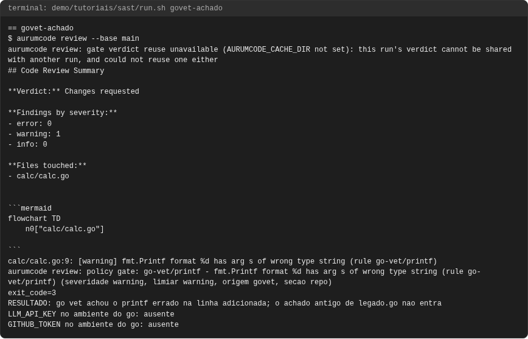


### govet-sem-go

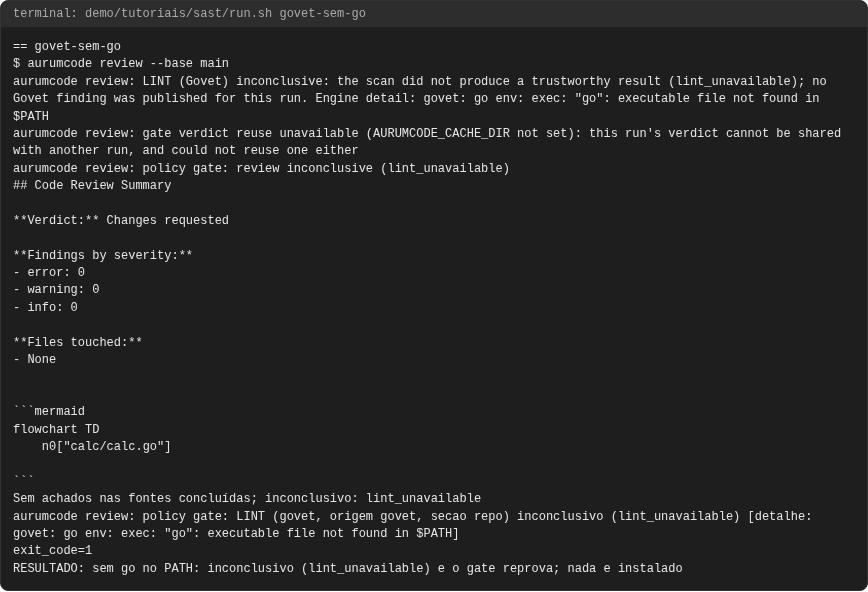

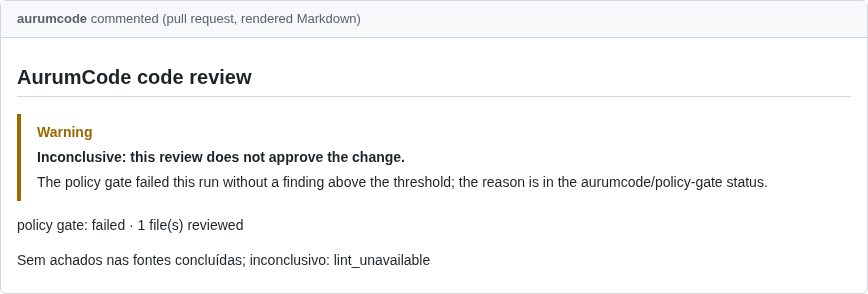

### nosemgrep-e-semgrepignore

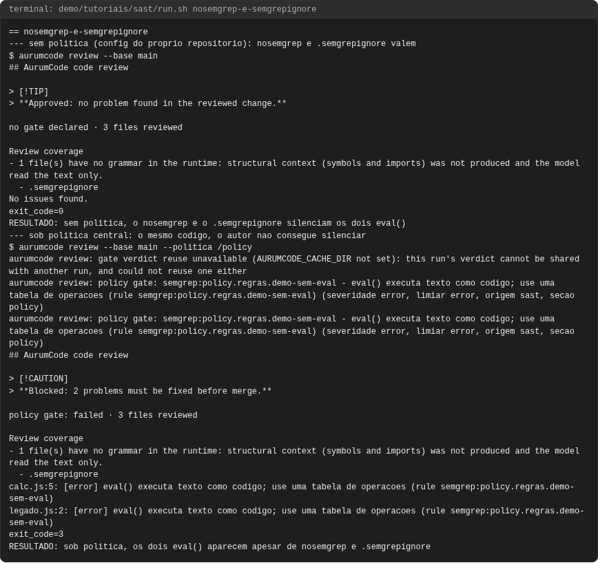

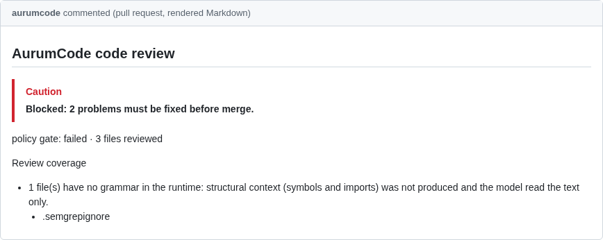

### origem-sast

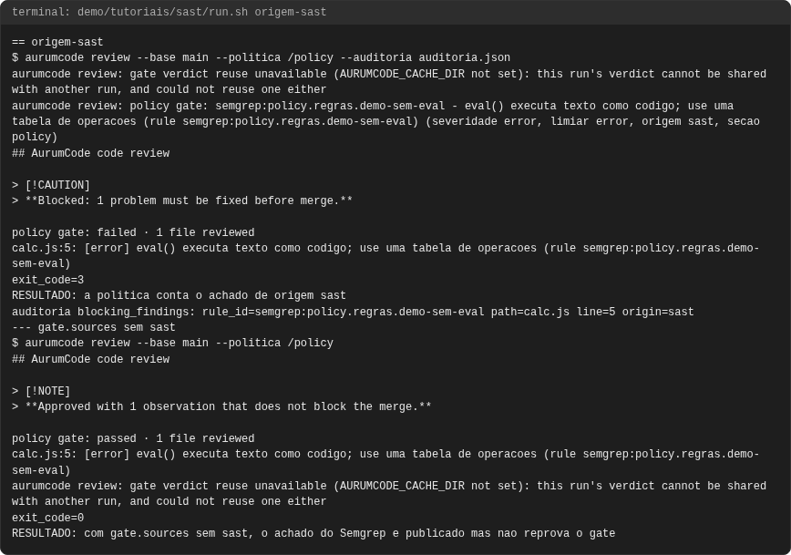

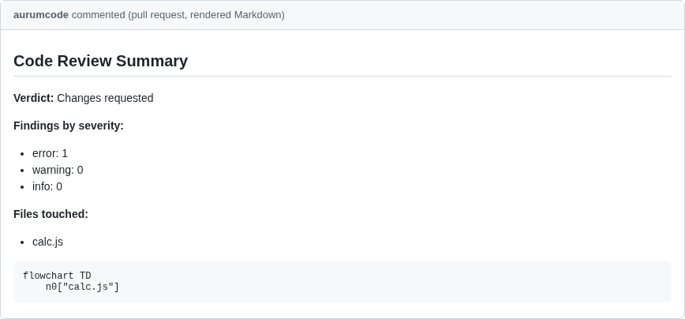

### registry-sem-rede

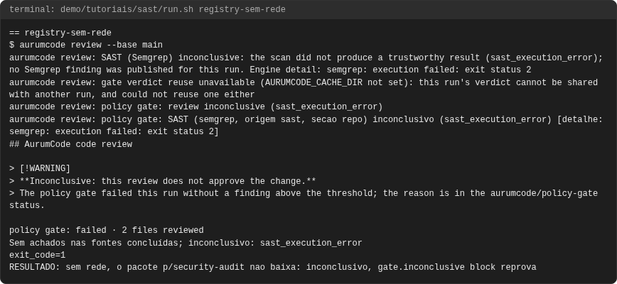

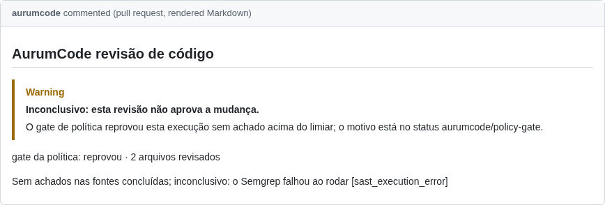

### regra-local

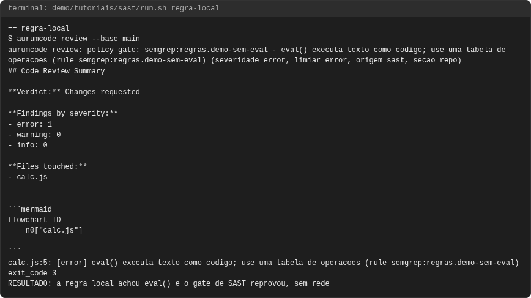


### semgrep-falha

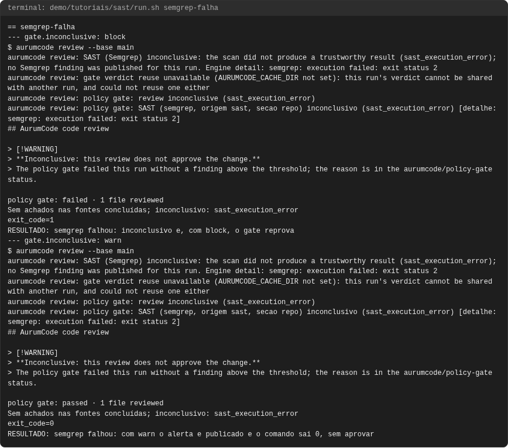

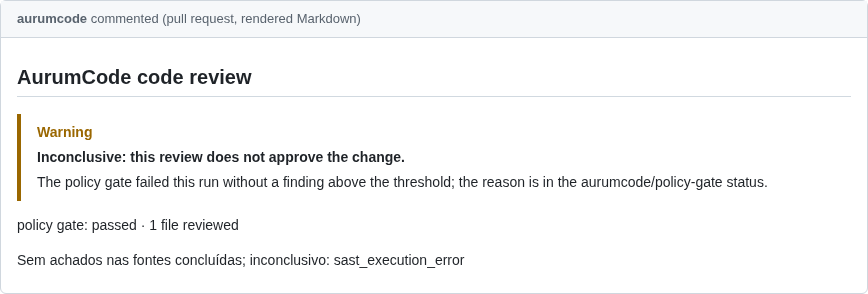

<!-- capturas:fim -->
