# Tutorial: SBOM e Dependency-Track

## Objetivo

Ao final você terá gerado um SBOM CycloneDX com `aurumcode sbom`, enviado esse
SBOM a um servidor OWASP Dependency-Track local pelo gate de revisão, visto as
métricas e as violações de política que o servidor devolve, e provado os casos
de borda: versão mínima do CycloneDX, formato recusado, limiares, violação de
política do servidor, secret ausente, timeout e a regra de um projeto por
microsserviço.

O guia corporativo ([gate-corporativo.md](../gate-corporativo.md)) mostra o
fluxo ponta a ponta; aqui cada capacidade aparece isolada. Cada comando e cada
saída vêm de uma execução real, registrada em
`demo/tutoriais/sbom-dependency-track/out/` e conferida por `run.sh --check`.
Os blocos de configuração **são os arquivos de
`demo/tutoriais/sbom-dependency-track/`**, byte a byte.

Linhas `RESULTADO:` são **conclusões do script** (`run.sh`), cada uma marcada
com a condição que ele testou; não são saída do produto.

## Pré-requisitos

- `git`, `docker` (com `docker compose`), `bash` e `python3`. Nada mais roda no
  host: o `aurumcode` roda na imagem do produto, o Trivy e o servidor, em
  imagens fixadas por digest.
- As imagens do Trivy, do Dependency-Track e do PostgreSQL são **as mesmas do
  guia corporativo**: o `run.sh` lê os digests de
  `demo/gate-corporativo/images.lock` (função `cad_lock` em
  `demo/tutoriais/_lib/cadeia.sh`) e os entrega ao compose por variável. Nenhum
  digest é copiado à mão para este tutorial; trocar um digest no AUR-554 troca aqui.
- A imagem do produto, construída do `Dockerfile` da raiz:

```bash
docker build -t aurumcode:local /caminho/para/AurumCode
```

- Provedor de modelo: **nenhuma credencial**. O `review` usa um arquivo JSON
  determinístico sem achados (`AURUMCODE_LLM_FIXTURE`); o que reprova ou aprova
  é o gate do Dependency-Track.
- Rede: o gate só aceita `https://` ou um **IP de loopback** (`127.0.0.1`,
  nunca o nome `localhost`) como `server_api_host`. Por isso os casos que falam
  com o servidor rodam o `aurumcode` com `--network host`; os casos de
  `sbom`, de secret ausente e de timeout rodam com `--network none`.

### Rodar a demonstração

```bash
bash demo/tutoriais/sbom-dependency-track/run.sh all      # up, sete casos e down
bash demo/tutoriais/sbom-dependency-track/run.sh --check  # compara out/ com expected/, sem docker
```

O primeiro caso (`up`) sobe o servidor e o último (`down`) o remove. A subida do
Dependency-Track leva alguns minutos.

## Preparar: o servidor local

O compose sobe Dependency-Track v5 e PostgreSQL. A porta só abre em loopback
(`127.0.0.1:8081`); as imagens vêm de variáveis, não de digests digitados aqui.

<!-- arquivo: demo/tutoriais/sbom-dependency-track/compose.yml -->
```yaml
# Dependency-Track v5 + PostgreSQL local para o tutorial. As imagens NAO sao
# digitadas aqui: o run.sh exporta DTRACK_IMAGE e POSTGRES_IMAGE a partir de
# demo/gate-corporativo/images.lock (digests do AUR-554), uma unica fonte de
# verdade. A porta so abre em loopback.
name: aurum-tut-dtrack
services:
  postgres:
    image: ${POSTGRES_IMAGE:?rode pelo run.sh}
    environment:
      POSTGRES_DB: dtrack
      POSTGRES_USER: dtrack
      POSTGRES_PASSWORD: demo-only-password
    healthcheck:
      test: ["CMD-SHELL", "pg_isready -U dtrack -d dtrack"]
      interval: 3s
      timeout: 3s
      retries: 40
  apiserver:
    image: ${DTRACK_IMAGE:?rode pelo run.sh}
    depends_on:
      postgres:
        condition: service_healthy
    environment:
      DT_DATASOURCE_URL: jdbc:postgresql://postgres:5432/dtrack
      DT_DATASOURCE_USERNAME: dtrack
      DT_DATASOURCE_PASSWORD: demo-only-password
    ports:
      - "127.0.0.1:8081:8080"
```

O caso `up` automatiza o que se faria na interface: troca a senha inicial do
administrador (um placeholder de demonstração), cria um time com as permissões
`BOM_UPLOAD`, `VIEW_PORTFOLIO` e `VIEW_POLICY_VIOLATION`, gera a chave de API
desse time (ela vive em `.estado/`, ignorado pelo git, e nunca é impressa),
cria os projetos `servico-exemplo`, `compartilhado`, `servico-a` e `servico-b` e
uma política de violação que reprova o componente `lodash` na versão `4.17.15`.
Nenhum aquecimento é necessário: o gate só lê as métricas depois que elas
assentaram (veja "Métrica lida cedo demais" em Problemas comuns).

<!-- saida: up -->
```text
imagem fixada por digest (images.lock do AUR-554): dtrack_apiserver ok
imagem fixada por digest (images.lock do AUR-554): postgres ok
servidor: Dependency-Track 5.1.1
admin: senha inicial trocada e login ok
projeto servico-exemplo criado
politica demo-componente-proibido: reprova lodash 4.17.15 (coordenadas)
RESULTADO: servidor, time, chave, quatro projetos e uma politica de violacao prontos
```

O que observar: o servidor é a versão 5.1.1, a que aceita CycloneDX 1.7 (a
versão mínima para o SBOM que o Trivy fixado emite).

Para chamar o programa à mão, dentro do repositório que você revisa:

```bash
alias aurumcode='docker run --rm --network host --user "$(id -u):$(id -g)" -e HOME=/tmp -e DTRACK_API_KEY -e DTRACK_PROJECT_ID -v "$PWD:/work" -w /work -v "$TUTORIAL_DIR:/fixtures:ro" -v "$TUTORIAL_DIR/.estado/bin:/demo/bin:ro" --entrypoint /app/aurumcode aurumcode:local'
```

`DTRACK_API_KEY` e `DTRACK_PROJECT_ID` são os **nomes** das variáveis que a
configuração cita (`api_key_secret`, `project_id_secret`); os valores vêm do
seu ambiente (em CI, de secrets), nunca da configuração.

O Trivy entra por `--trivy-bin`, um wrapper que executa o binário extraído da
imagem fixada (`demo/tutoriais/_lib/cadeia.sh`, função `cad_bins`):

<!-- arquivo: demo/tutoriais/sbom-dependency-track/wrappers/trivy-wrap.sh -->
```sh
#!/bin/sh
# Wrapper passado em --trivy-bin: executa o Trivy fixado por digest (binario
# extraido da imagem fixada em images.lock pela fase build). Somente SBOM:
# o scanner de licencas nao precisa de base de vulnerabilidades, e quem
# aponta vulnerabilidades neste fluxo e o servidor de inventario.
mode="$1"; shift
exec /demo/bin/trivy "$mode" --cache-dir /tmp/trivy-cache --scanners license --skip-version-check "$@"
```

## Caso 1: `aurumcode sbom` e a versão mínima do CycloneDX

`spec_version` na configuração é um **mínimo**, não um valor exato. O Trivy
fixado emite CycloneDX 1.7; um mínimo `"1.6"` aceita, porque a major é a mesma
e a minor é maior ou igual. Uma major diferente é recusada, mesmo que
numericamente maior. Um valor fora de `major.minor` ou um `format` diferente de
`cyclonedx` falha na carga da configuração, antes de chamar o Trivy.

Este é o gate completo, com o Dependency-Track (a seção `sbom_generator` é a
parte que `aurumcode sbom` lê):

<!-- arquivo: demo/tutoriais/sbom-dependency-track/config/gate/.aurumcode/config.yml -->
```yaml
gate:
  fail_on: [high]
  inconclusive: block
quality_gates:
  ssor_dtrack:
    enabled: true
    server_api_host: "http://127.0.0.1:8081"
    api_key_secret: DTRACK_API_KEY
    project_id_secret: DTRACK_PROJECT_ID
    thresholds: {max_critical: 0, max_high: 0, policy_violations: 0}
    timeout_seconds: 120
    poll_interval_seconds: 2
    sbom_generator:
      tool: trivy
      format: cyclonedx
      spec_version: "1.6"
      output_file: sbom_app_cyclonedx.json
```

```bash
aurumcode sbom --repo . --trivy-bin /fixtures/wrappers/trivy-wrap.sh
```

<!-- saida: sbom-versao-minima -->
```text
sbom: CycloneDX 1.7, componentes: semver@7.6.0
RESULTADO: SBOM CycloneDX 1.7 aceito contra o minimo 1.6 (mesma major)
aurumcode sbom: sbom: <temporario>: bomFormat="CycloneDX" specVersion="1.7", want bomFormat="CycloneDX" specVersion>="2.0" (mesma major)
RESULTADO: SBOM 1.7 recusado contra minimo 2.0 (major diferente)
RESULTADO: nenhum SBOM foi escrito
must be major.minor (e.g. "1.6"), got "1.6.0"
RESULTADO: "1.6.0" falha na carga da configuracao, antes do Trivy
only "cyclonedx" is supported, got "spdx"
RESULTADO: format: spdx falha na carga da configuracao, antes do Trivy
```

O que observar: o SBOM aceito é 1.7 contra o mínimo 1.6. A major diferente sai
com exit 1 (`sbom_generation_failure`; como não há `gate.inconclusive: warn`,
falha fechado) e nenhum arquivo aparece; as duas configurações inválidas saem
com exit 2, antes do Trivy. O nome do arquivo temporário (`.sbom-<número>.tmp`)
muda a cada execução e o `run.sh` o troca por `<temporario>` (filtro `TUT_SED`,
declarado no caso). O componente `package-lock.json` que o Trivy também lista
não tem versão e por isso não aparece no resumo.

## Caso 2: upload e métricas

Com `ssor_dtrack.enabled: true`, o `review` envia o SBOM já gerado, espera o
servidor terminar de processá-lo e compara as métricas do projeto com
`thresholds`. Primeiro o SBOM, depois a revisão:

```bash
aurumcode sbom --repo . --trivy-bin /fixtures/wrappers/trivy-wrap.sh
aurumcode review --base main --fail-on error
```

<!-- saida: upload-e-metricas -->
```text
aurumcode review: policy gate: ssor_dtrack: aprovado (critical=0, high=0, policy_violations=0)
RESULTADO: o gate enviou o SBOM, esperou o processamento e aprovou
dependency-track metricas: critical=0 high=0 policyViolationsTotal=0
dependency-track componentes (servico-exemplo): package-lock.json@None, semver@7.6.0
```

O que observar: a primeira linha é do produto; as duas linhas
`dependency-track ...` são o script lendo a API do servidor com a chave do time
(o produto não as imprime) e confirmam que o servidor recebeu os componentes
do SBOM. `package-lock.json@None` é o componente de arquivo que o Trivy
registra, sem versão.

## Caso 3: limiares

`thresholds` compara `critical`, `high` e `policyViolationsTotal` do projeto
com `max_critical`, `max_high` e `policy_violations`. Aqui o SBOM tem
`lodash@4.17.15`, que a política do servidor reprova. Com
`policy_violations: 0` o gate reprova (exit 3) e publica os números; com
`policy_violations: 1`, o mesmo SBOM está dentro do limiar:

<!-- arquivo: demo/tutoriais/sbom-dependency-track/config/limiar-1/.aurumcode/config.yml -->
```yaml
gate:
  fail_on: [high]
  inconclusive: block
quality_gates:
  ssor_dtrack:
    enabled: true
    server_api_host: "http://127.0.0.1:8081"
    api_key_secret: DTRACK_API_KEY
    project_id_secret: DTRACK_PROJECT_ID
    thresholds: {max_critical: 0, max_high: 0, policy_violations: 1}
    timeout_seconds: 120
    poll_interval_seconds: 2
    sbom_generator:
      tool: trivy
      format: cyclonedx
      spec_version: "1.6"
      output_file: sbom_app_cyclonedx.json
```

<!-- saida: limiares -->
```text
sbom: CycloneDX 1.7, componentes: lodash@4.17.15
aurumcode review: policy gate: ssor_dtrack: policy_violations 1 > policy_violations 0
RESULTADO: uma violacao de politica acima do limite 0 reprova o gate
dependency-track metricas: critical=0 high=0 policyViolationsTotal=1
aurumcode review: policy gate: ssor_dtrack: aprovado (critical=0, high=0, policy_violations=1)
RESULTADO: com limite 1, a mesma violacao esta dentro do limiar e o gate aprova
```

O que observar: a mensagem de reprovação traz o valor medido e o limite
(`policy_violations 1 > policy_violations 0`). **Não demonstrado aqui:**
`max_critical` e `max_high`. O Trivy roda com `--scanners license` e o servidor
da demonstração não tem fontes de vulnerabilidade, então `critical` e `high`
são sempre 0; só `policy_violations` é determinístico neste ambiente. A
comparação dos três campos é a mesma função e é coberta pelos testes Go do
produto (`internal/dtrack`).

## Caso 4: violação de política do servidor

A política `demo-componente-proibido` mora no servidor, não no repositório: quem
administra o Dependency-Track decide o que reprova. Depois da reprovação, o
script lê a violação pela API (componente, versão, estado `FAIL`), troca
`lodash` por `semver`, gera um novo SBOM e o envia ao **mesmo projeto**; o
servidor substitui o inventário e a violação some.

<!-- saida: violacao-de-politica -->
```text
aurumcode review: policy gate: ssor_dtrack: policy_violations 1 > policy_violations 0
RESULTADO: a politica do servidor reprova o componente
dependency-track violacao: politica=demo-componente-proibido componente=lodash versao=4.17.15 estado=FAIL
sbom: CycloneDX 1.7, componentes: semver@7.6.0
RESULTADO: sem o componente proibido, o gate aprova
dependency-track violacoes: nenhuma
```

O que observar: o gate só enxerga o **número** de violações; qual política e
qual componente aparecem na interface ou na API do servidor.

## Caso 5: um projeto por microsserviço

O servidor **sobrescreve** o SBOM anterior do mesmo projeto. Dois serviços
enviando para o mesmo projeto fazem o inventário do primeiro desaparecer. O
caso envia `servico-a` (`ms`) e depois `servico-b` (`semver`) ao projeto
`compartilhado`, e então cada um ao seu projeto:

<!-- saida: projeto-por-microservico -->
```text
dependency-track componentes (compartilhado): ms@2.1.3, package-lock.json@None
dependency-track componentes (compartilhado): package-lock.json@None, semver@7.6.0
RESULTADO: o segundo upload substituiu o primeiro: ms@2.1.3 (servico-a) sumiu do projeto compartilhado
dependency-track componentes (servico-a): ms@2.1.3, package-lock.json@None
dependency-track componentes (servico-b): package-lock.json@None, semver@7.6.0
RESULTADO: com um projeto por servico, os dois inventarios coexistem
```

O que observar: depois do segundo upload, `ms@2.1.3` não está mais em
`compartilhado`. Com projetos separados, cada inventário fica no seu. O
`project_id_secret` é o que escolhe o projeto: use um id por serviço.

## Quando falha

### Secret ausente

Sem `DTRACK_API_KEY` ou `DTRACK_PROJECT_ID` no ambiente, o gate fica
**inconclusivo** (`dtrack_secret_missing`), nunca aprovado. Com
`gate.inconclusive: block` o comando reprova (exit 1); com `warn`, o alerta é
publicado e o comando sai 0, mas o veredito continua `Comment`, não `Approve`.

<!-- saida: secret-ausente -->
```text
revisão inconclusiva (dtrack_secret_missing)
RESULTADO: secret ausente com block: o gate reprova (inconclusivo, nunca aprovado)
RESULTADO: com warn, o alerta inconclusivo e publicado e o comando sai 0
```

O que observar: nenhuma chamada de rede acontece (o caso roda com `--network none`).

### Timeout de processamento

O gate acompanha o token do upload até o servidor dizer que terminou. Se
`timeout_seconds` vence, o gate fica inconclusivo (`dtrack_timeout`). Para tornar
isso determinístico, o caso **não usa o Dependency-Track**: um servidor falso
(`servidor-lento.py`, abaixo) aceita o upload e responde `processing: true` para
sempre, e a configuração aponta para ele com um timeout de 2 segundos.

<!-- arquivo: demo/tutoriais/sbom-dependency-track/config/lento/.aurumcode/config.yml -->
```yaml
gate:
  fail_on: [high]
  inconclusive: block
quality_gates:
  ssor_dtrack:
    enabled: true
    server_api_host: "http://127.0.0.1:8099"
    api_key_secret: DTRACK_API_KEY
    project_id_secret: DTRACK_PROJECT_ID
    thresholds: {max_critical: 0, max_high: 0, policy_violations: 0}
    timeout_seconds: 2
    poll_interval_seconds: 1
    sbom_generator:
      tool: trivy
      format: cyclonedx
      spec_version: "1.6"
      output_file: sbom_app_cyclonedx.json
```

<!-- arquivo: demo/tutoriais/sbom-dependency-track/servidor-lento.py -->
```python
"""Servidor falso que NAO e o Dependency-Track: aceita o upload do BOM e responde
"processing": true para sempre, para provar o timeout do gate de forma
deterministica. Escuta so em 127.0.0.1:8099, dentro do container do caso."""
import json
from http.server import BaseHTTPRequestHandler, HTTPServer


class H(BaseHTTPRequestHandler):
    def _send(self, body):
        data = json.dumps(body).encode()
        self.send_response(200)
        self.send_header("Content-Type", "application/json")
        self.send_header("Content-Length", str(len(data)))
        self.end_headers()
        self.wfile.write(data)

    def do_POST(self):
        self.rfile.read(int(self.headers.get("Content-Length", 0)))
        self._send({"token": "00000000-0000-0000-0000-000000000001"})

    def do_GET(self):
        self._send({"processing": True})

    def log_message(self, *a):
        pass


HTTPServer(("127.0.0.1", 8099), H).serve_forever()
```

<!-- saida: timeout -->
```text
aurumcode review: policy gate: ssor_dtrack: revisão inconclusiva (dtrack_timeout)
RESULTADO: timeout_seconds: 2 vencido com block: inconclusivo e reprovado
```

O que observar: o motivo é estável (`dtrack_timeout`) e o exit é 1 com `block`.
Servidor inalcançável (`dtrack_unreachable`) e erro HTTP (`dtrack_http_error`)
seguem a mesma regra; **não foram executados aqui**.

## Limpar

<!-- saida: down -->
```text
recursos restantes do tutorial: 0
RESULTADO: nenhum container, rede ou volume do tutorial ficou vivo
```

O que observar: o `down` remove containers, rede e volumes do compose e as
imagens do servidor e do PostgreSQL que o `up` baixou só para o tutorial (as que
já existiam antes ficam).

## Problemas comuns

- **`server_api_host` com `localhost`**: recusado (`dtrack_invalid_host`); use
  `127.0.0.1` ou `https://`.
- **Servidor antigo**: o CycloneDX 1.7 do Trivy fixado exige Dependency-Track
  5.1.0 ou mais novo (4.14.4 na linha 4); um servidor mais antigo responde 4xx
  (`dtrack_http_error`).
- **Chave sem permissão**: sem `BOM_UPLOAD` o upload dá 403
  (`dtrack_http_error`). Para o script ler componentes e violações, o time
  precisa também de `VIEW_PORTFOLIO` e `VIEW_POLICY_VIOLATION`.
- **Dois serviços no mesmo projeto**: o último SBOM apaga o anterior (Caso 5).
- **`critical`/`high` sempre 0**: o servidor não tem fontes de vulnerabilidade
  (e o Trivy só gerou o SBOM); sem elas os limiares de severidade não têm o que
  medir.
- **Métrica lida cedo demais (corrigido no AUR-570)**: `processing: false` em
  `bom/token` só diz que o SBOM foi ingerido; a avaliação de política e o
  recálculo das métricas terminam depois. Medido nas execuções do AUR-563
  contra o Dependency-Track 5.1.1, o gate antigo leu `policy_violations=0` num
  servidor novo e **aprovou** o que a política reprova, e, em outra execução,
  leu a violação anterior. Este tutorial escapava disso com um aquecimento e uma
  espera dentro do `run.sh`; ambos foram removidos e os casos foram regravados
  contra o servidor real. Agora o gate chama
  `GET /api/v1/metrics/project/{id}/refresh` (a chave do tutorial não tem a
  permissão, o servidor responde 403 e o gate registra
  `dtrack_refresh_unavailable` e segue) e relê
  `metrics/project/{id}/current` até que duas leituras consecutivas de
  `critical`, `high` e `policyViolationsTotal` coincidam **e** o servidor prove
  que processou este upload: `lastOccurrence` das métricas posterior ao envio
  ou, quando as métricas não mudaram (o servidor então não mexe em
  `lastOccurrence`), `lastVulnerabilityAnalysis` do projeto posterior ao envio.
  Se isso não ocorrer em `timeout_seconds`, o resultado é inconclusivo com o
  motivo `dtrack_metrics_unsettled`: com `gate.inconclusive: block` reprova, com
  `warn` publica o aviso e nunca aprova. A linha `dtrack_refresh_unavailable`, nos
  `out/` gravados, é esse registro.
- **Sandbox sem `--network host`**: sem ele o `aurumcode` não alcança
  `127.0.0.1` do host (dentro do container, esse IP é outro).

<!-- capturas:inicio (gerado por scripts/docs/capturas.sh; nao editar a mao) -->
## Como fica

Capturas geradas por scripts/docs/capturas.sh a partir das saídas gravadas em demo/tutoriais/sbom-dependency-track/out/: o terminal de cada caso e, quando o caso publica, o comentario do PR e os status checks. O manifesto docs/assets/capturas/capturas.json registra o digest de cada insumo.

### down

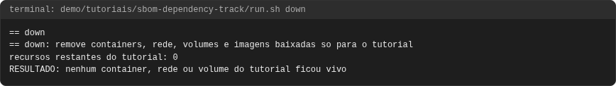

### limiares

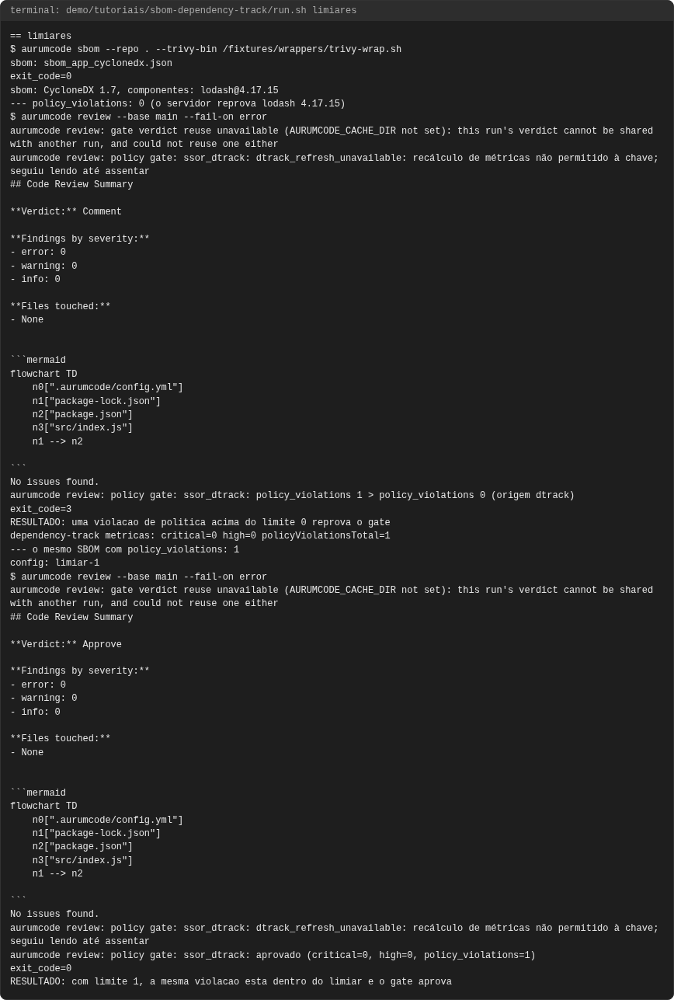

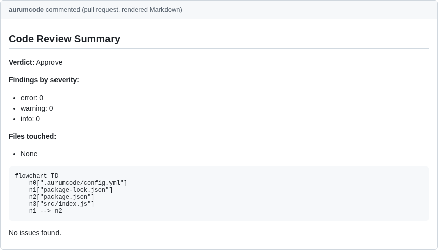

### projeto-por-microservico

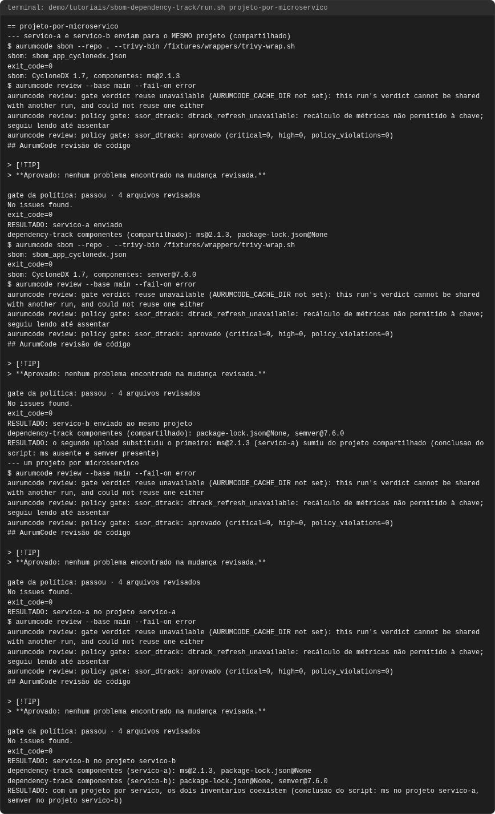


### sbom-versao-minima

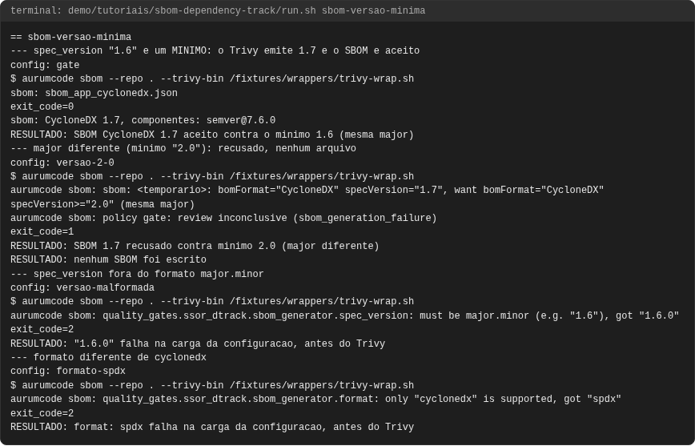

### secret-ausente

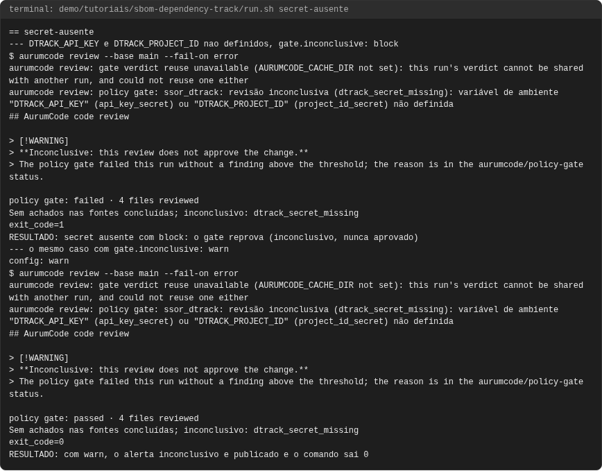

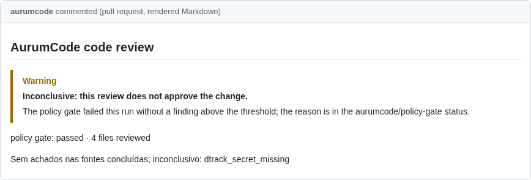

### timeout

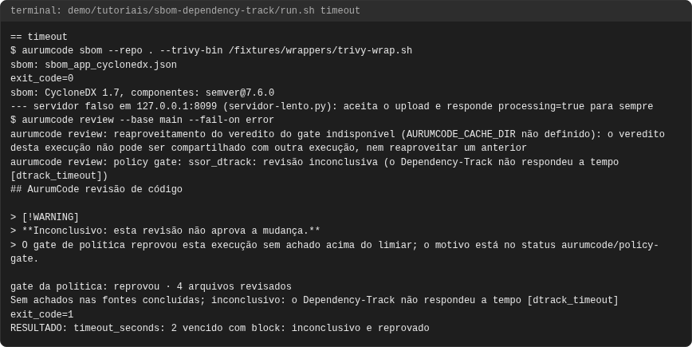

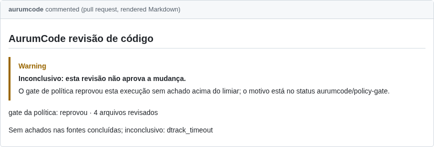

### up

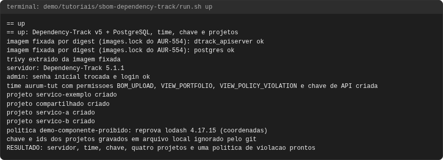

### upload-e-metricas

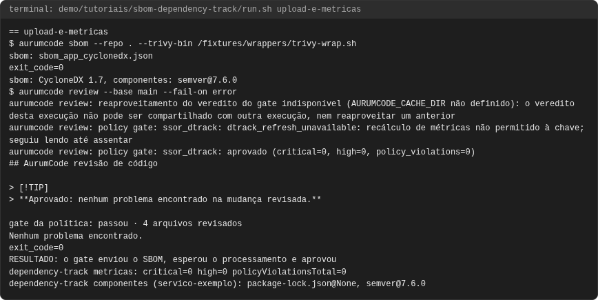


### violacao-de-politica

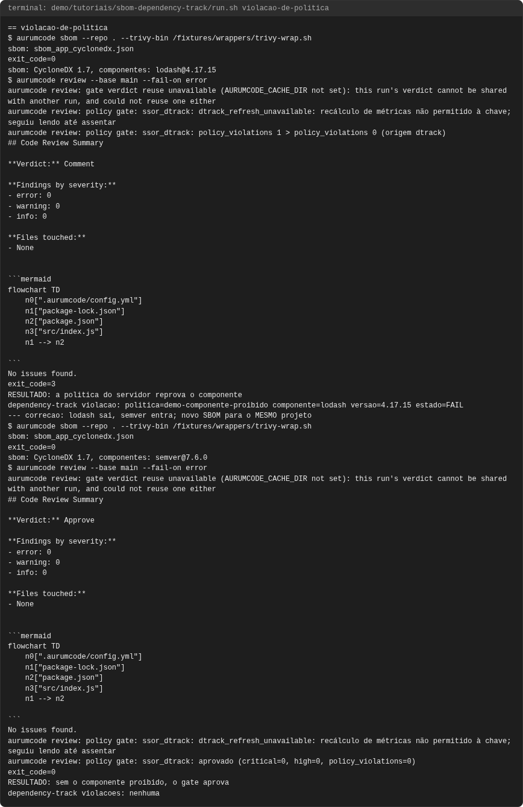


<!-- capturas:fim -->
