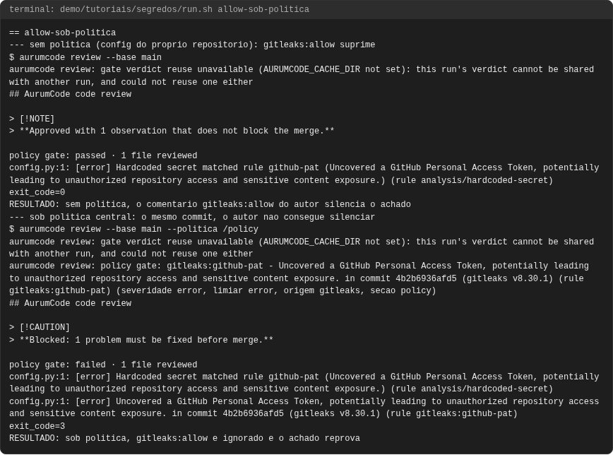
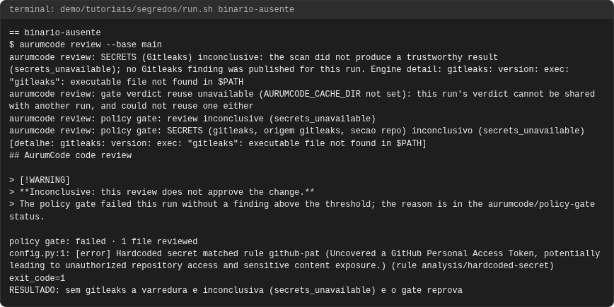
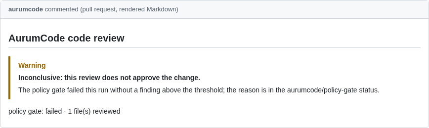
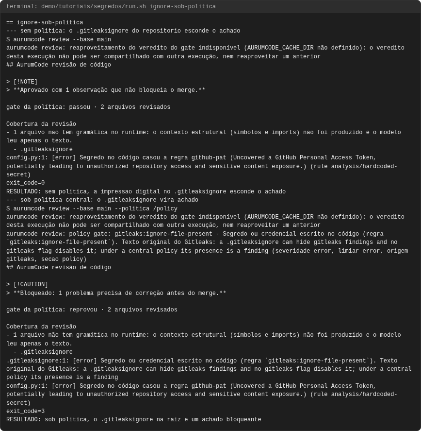
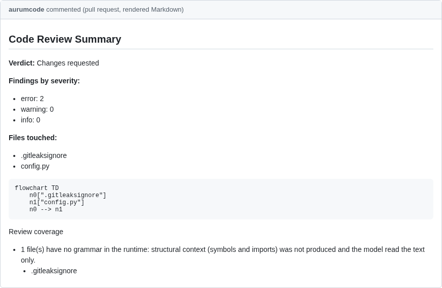
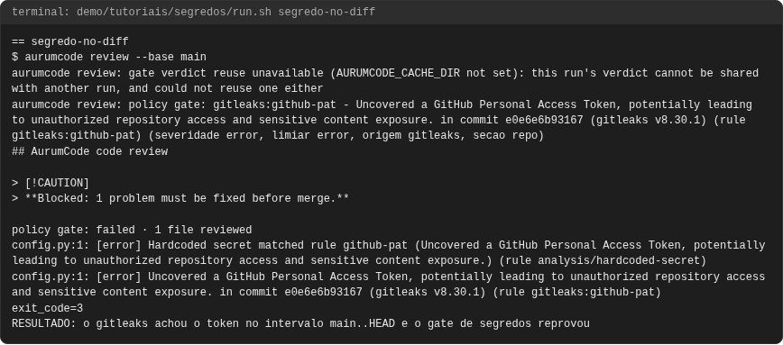
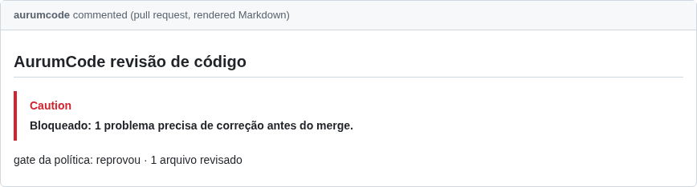
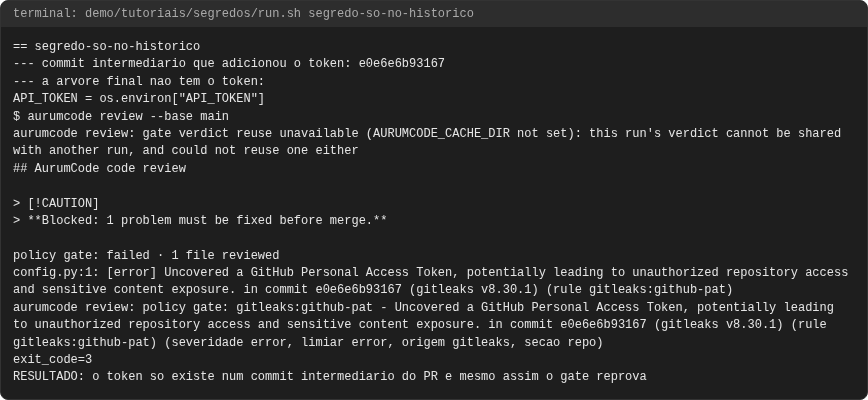

# Tutorial: segredos com gitleaks

## Objetivo

Ao final você terá visto o AurumCode barrar um segredo commitado num pull
request com o [gitleaks](https://github.com/gitleaks/gitleaks), a engine
`gitleaks` (categoria `secrets`) da lista de scanners. Quatro casos e uma
falha: o segredo no diff; o segredo **só no histórico** do PR (adicionado num
commit e removido no seguinte); `gitleaks:allow` respeitado no config do
repositório e ignorado sob política central; `.gitleaksignore` respeitado sem
política e transformado em achado bloqueante sob política; e o binário
ausente, que deixa a revisão inconclusiva.

O ponto central: **a engine varre o intervalo de commits revisado, não a
árvore final**. Um token que entrou num commit do PR e saiu no seguinte já
vazou, porque o merge publica o histórico. E o valor do segredo nunca aparece
em saída nenhuma: o achado leva regra, arquivo, linha e o commit que o
introduziu.

Cada comando e cada saída vêm de uma execução real, registrada em
`demo/tutoriais/segredos/out/` e conferida por `run.sh --check`. Os blocos de
configuração **são os arquivos de `demo/tutoriais/segredos/`**, byte a byte.

## Pré-requisitos

- `git`, `docker`, `bash` e `python3`. Nada mais roda no seu host.
- A imagem do produto, construída do `Dockerfile` da raiz. Ela já traz o
  gitleaks `v8.30.1`, copiado da imagem fixada por digest em
  `.board/bootstrap/locks/scanners.yml`; o build falha se o binário não
  reportar essa versão:

```bash
docker build -t aurumcode:local /caminho/para/AurumCode
```

- Rede **não** é necessária: a demonstração roda com `--network none` e com o
  provedor de modelo falso (`AURUMCODE_LLM_FIXTURE`).
- O token de exemplo tem a forma de um token do GitHub, mas é inventado e só
  existe em tempo de execução: o `run.sh` o monta por concatenação e o grava no
  repositório descartável de `.estado/`. Nenhum arquivo do repositório carrega
  um literal com forma de credencial.

```bash
bash demo/tutoriais/segredos/run.sh all      # cinco casos; grava out/
bash demo/tutoriais/segredos/run.sh --check  # compara out/ com expected/, sem docker
```

## A configuração

O repositório liga a engine e diz ao gate que só a origem `secrets` conta
(assim o achado da regra embutida `analysis/hardcoded-secret`, que também vê o
token quando ele está no diff, é publicado mas não decide o gate):

<!-- arquivo: demo/tutoriais/segredos/repo-exemplo/base/.aurumcode/config.yml -->
```yaml
review:
  language: pt-BR
quality_gates:
  scanners:
    - engine: gitleaks
gate:
  fail_on: [error]
  sources: [secrets]
```

A política central declara a mesma engine com `required: true`: o
repositório não consegue desligá-la, e ela roda endurecida contra as
supressões do autor (`--ignore-gitleaks-allow`; `.gitleaksignore` vira
achado):

<!-- arquivo: demo/tutoriais/segredos/politica/.aurumcode/config.yml -->
```yaml
quality_gates:
  scanners:
    - engine: gitleaks
      required: true
gate:
  fail_on: [error]
  sources: [secrets]
```

A engine roda `gitleaks git --log-opts=<base>..<head>` com os ids completos de
`--base` e `HEAD` (no `--pr`, a base e a cabeça do pull request), relatório
JSON explícito, `--exit-code 0`, `--redact` e a base de regras embutida do
binário. Detalhes em [Configuração](../configuration.md#segredos-com-gitleaks-engine-gitleaks).

## Caso 1: segredo no diff

O commit do PR adiciona `config.py` com um token. O gitleaks o acha no
intervalo `main..HEAD`; a linha do gate leva a regra, o commit e a origem
`gitleaks`.

```bash
aurumcode review --base main
```

<!-- saida: segredo-no-diff -->
```text
$ aurumcode review --base main
config.py:1: [error] Uncovered a GitHub Personal Access Token, potentially leading to unauthorized repository access and sensitive content exposure. in commit 37eb089803ee (gitleaks v8.30.1) (rule gitleaks:github-pat)
aurumcode review: policy gate: gitleaks:github-pat - Uncovered a GitHub Personal Access Token, potentially leading to unauthorized repository access and sensitive content exposure. in commit 37eb089803ee (gitleaks v8.30.1) (rule gitleaks:github-pat) (severidade error, limiar error, origem gitleaks, secao repo)
exit_code=3
RESULTADO: o gitleaks achou o token no intervalo main..HEAD e o gate de segredos reprovou
```

## Caso 2: segredo só no histórico do PR

O primeiro commit do PR adiciona o token; o segundo o troca por uma leitura do
ambiente. A árvore final está limpa — a regra embutida, que olha só o diff
final, não vê nada —, mas o gitleaks varre os commits do intervalo e acha o
token no commit intermediário, que o achado cita.

<!-- saida: segredo-so-no-historico -->
```text
--- commit intermediario que adicionou o token: 37eb089803ee
API_TOKEN = os.environ["API_TOKEN"]
config.py:1: [error] Uncovered a GitHub Personal Access Token, potentially leading to unauthorized repository access and sensitive content exposure. in commit 37eb089803ee (gitleaks v8.30.1) (rule gitleaks:github-pat)
aurumcode review: policy gate: gitleaks:github-pat - Uncovered a GitHub Personal Access Token, potentially leading to unauthorized repository access and sensitive content exposure. in commit 37eb089803ee (gitleaks v8.30.1) (rule gitleaks:github-pat) (severidade error, limiar error, origem gitleaks, secao repo)
exit_code=3
RESULTADO: o token so existe num commit intermediario do PR e mesmo assim o gate reprova
```

## Caso 3: `gitleaks:allow` sob política

Sem política, o comentário `gitleaks:allow` na linha do token é uma decisão do
próprio repositório e suprime o achado. Sob política central, o mesmo commit
reprova: o autor do PR não consegue silenciar a engine que a política exige.

```bash
aurumcode review --base main --politica /policy
```

<!-- saida: allow-sob-politica -->
```text
--- sem politica (config do proprio repositorio): gitleaks:allow suprime
exit_code=0
RESULTADO: sem politica, o comentario gitleaks:allow do autor silencia o achado
--- sob politica central: o mesmo commit, o autor nao consegue silenciar
$ aurumcode review --base main --politica /policy
aurumcode review: policy gate: gitleaks:github-pat - Uncovered a GitHub Personal Access Token, potentially leading to unauthorized repository access and sensitive content exposure. in commit 4b2b6936afd5 (gitleaks v8.30.1) (rule gitleaks:github-pat) (severidade error, limiar error, origem gitleaks, secao policy)
exit_code=3
RESULTADO: sob politica, gitleaks:allow e ignorado e o achado reprova
```

## Caso 4: `.gitleaksignore` sob política

O gitleaks sempre lê o `.gitleaksignore` da raiz do repositório varrido, e
nenhuma flag da versão fixada desliga isso (medido: `--gitleaks-ignore-path`
apontando para outro diretório não impede). Sem política, a impressão digital
listada no arquivo esconde o achado. Sob política, a presença do arquivo é ela
mesma o achado bloqueante `gitleaks:ignore-file-present`, que o dono da
política precisa resolver.

<!-- saida: ignore-sob-politica -->
```text
--- sem politica: o .gitleaksignore do repositorio esconde o achado
exit_code=0
RESULTADO: sem politica, a impressao digital no .gitleaksignore esconde o achado
--- sob politica central: o .gitleaksignore vira achado
.gitleaksignore:1: [error] a .gitleaksignore can hide gitleaks findings and no gitleaks flag disables it; under a central policy its presence is a finding (rule gitleaks:ignore-file-present)
aurumcode review: policy gate: gitleaks:ignore-file-present - a .gitleaksignore can hide gitleaks findings and no gitleaks flag disables it; under a central policy its presence is a finding (rule gitleaks:ignore-file-present) (severidade error, limiar error, origem gitleaks, secao policy)
exit_code=3
RESULTADO: sob politica, o .gitleaksignore na raiz e um achado bloqueante
```

## Falha: binário ausente

Sem o `gitleaks` no `PATH`, a varredura é inconclusiva
(`secrets_unavailable`), nunca "zero achados", e segue a regra única de
`gate.inconclusive` (ausente = `block` com scanner habilitado): o comando sai 1.
O mesmo vale para um intervalo que não se resolve, um clone raso, outra versão
do binário ou um erro registrado pelo gitleaks (`secrets_execution_error`).

<!-- saida: binario-ausente -->
```text
aurumcode review: SECRETS (Gitleaks) inconclusivo: a varredura não produziu resultado confiável (secrets_unavailable); nenhum achado determinístico do Gitleaks foi publicado nesta execução. Detalhe da engine: gitleaks: version: exec: "gitleaks": executable file not found in $PATH
aurumcode review: policy gate: SECRETS (gitleaks, origem gitleaks, secao repo) inconclusivo (secrets_unavailable) [detalhe: gitleaks: version: exec: "gitleaks": executable file not found in $PATH]
exit_code=1
RESULTADO: sem gitleaks a varredura e inconclusiva (secrets_unavailable) e o gate reprova
```

## O que conferir

- O valor do token não aparece em `demo/tutoriais/segredos/out/`: o adaptador
  descarta `Secret` e `Match` do relatório do gitleaks antes de qualquer coisa.
- No CI, o workflow reutilizável faz checkout do PR com histórico completo
  (`fetch-depth: 0`); um clone raso cortaria o intervalo e a engine o recusa
  como inconclusivo.

<!-- capturas:inicio (gerado por scripts/docs/capturas.sh; nao editar a mao) -->
## Como fica

Capturas geradas por scripts/docs/capturas.sh a partir das saídas gravadas em demo/tutoriais/segredos/out/: o terminal de cada caso e, quando o caso publica, o comentario do PR e os status checks. O manifesto docs/assets/capturas/capturas.json registra o digest de cada insumo.

### allow-sob-politica




### binario-ausente





### ignore-sob-politica





### segredo-no-diff





### segredo-so-no-historico




<!-- capturas:fim -->
