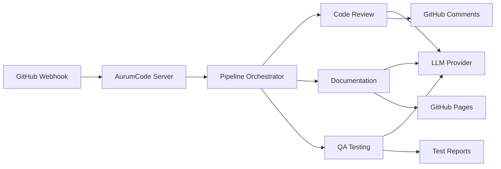

# AurumCode
{: .fs-9 }

Automated AI-Powered Code Quality Platform
{: .fs-6 .fw-300 }

[Get Started](#getting-started){: .btn .btn-primary .fs-5 .mb-4 .mb-md-0 .mr-2 }
[View on GitHub](https://github.com/Mpaape/AurumCode){: .btn .fs-5 .mb-4 .mb-md-0 }

---

## Features

### 🤖 Automated Code Review
AI-powered code analysis with ISO/IEC 25010 quality scoring. Runs automatically on every pull request.

### 📚 Documentation Generation
Automatically generates and updates documentation from code and commits. Searchable and always up-to-date.

### 🧪 QA Testing Automation
Automated test generation, execution, and coverage analysis across multiple languages.

### 🏢 Enterprise Scale
Deploy once, manage 100+ repositories. Centralized configuration with per-repo customization.

---

## Getting Started

### Quick Install

```bash
# Clone the repository
git clone https://github.com/Mpaape/AurumCode.git
cd AurumCode

# Build and run with Docker
docker-compose up -d

# Or build from source
make build
./bin/aurumcode-server
```

### Configuration

Create `.aurumcode/config.yml` in your repository:

```yaml
llm:
  provider: openai
  model: gpt-4

features:
  code_review: true
  documentation: true
  qa_testing: true

review:
  iso_scoring: true
  post_inline_comments: true
```

See [Configuration Guide](/guides/configuration) for all options.

---

## Documentation

<div class="code-example" markdown="1">

### For Users
{: .no_toc }

- [Quick Start Guide](/docs/quickstart)
- [Configuration](/guides/configuration)
- [Enterprise Deployment](/guides/enterprise)

### For Developers
{: .no_toc }

- [Architecture](/docs/architecture)
- [API Reference](/api/)
- [Development Guide](/docs/development)

### Use Cases
{: .no_toc }

- [Automated Code Review](/guides/code-review)
- [Documentation Pipeline](/guides/documentation)
- [QA Testing](/guides/qa-testing)

</div>

---

## Architecture



---

## Live Examples

### Code Review in Action

See AurumCode reviewing its own code:
- [Example PR with Review](https://github.com/Mpaape/AurumCode/pulls)
- [ISO Quality Scores](https://github.com/Mpaape/AurumCode/actions)

### Auto-Generated Documentation

You're looking at it! This site is automatically generated by AurumCode on every commit.

---

## Community

- [GitHub Discussions](https://github.com/Mpaape/AurumCode/discussions)
- [Report Issues](https://github.com/Mpaape/AurumCode/issues)
- [Contributing Guide](/docs/contributing)

---

## License

AurumCode is open source software. See [LICENSE](https://github.com/Mpaape/AurumCode/blob/main/LICENSE) for details.

---

{: .note }
> This documentation is automatically generated and deployed using AurumCode's own documentation pipeline.
> Last updated: {{ site.time | date: "%Y-%m-%d %H:%M" }}
